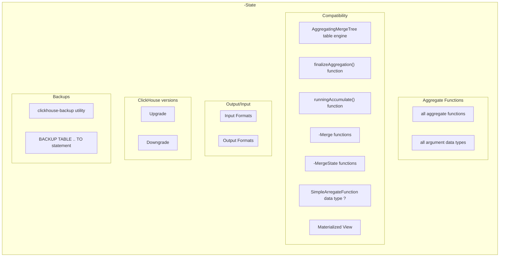

# SRS031 ClickHouse Aggregate Functions
# Software Requirements Specification

## Table of Contents

* 1 [Revision History](#revision-history)
* 2 [Introduction](#introduction)
* 3 [Requirements](#requirements)
  * 3.1 [Combinator Functions](#combinator-functions)
    * 3.1.1 [-State](#-state)
      * 3.1.1.1 [Test Feature Diagram](#test-feature-diagram)
      * 3.1.1.2 [RQ.SRS-031.ClickHouse.AggregateFunctions.Combinator.State](#rqsrs-031clickhouseaggregatefunctionscombinatorstate)
      * 3.1.1.3 [RQ.SRS-031.ClickHouse.AggregateFunctions.Combinator.State.With.AggregatingMergeTree](#rqsrs-031clickhouseaggregatefunctionscombinatorstatewithaggregatingmergetree)
      * 3.1.1.4 [RQ.SRS-031.ClickHouse.AggregateFunctions.Combinator.State.With.FinalizeAggregationFunction](#rqsrs-031clickhouseaggregatefunctionscombinatorstatewithfinalizeaggregationfunction)
      * 3.1.1.5 [RQ.SRS-031.ClickHouse.AggregateFunctions.Combinator.State.With.RunningAccumulateFunction](#rqsrs-031clickhouseaggregatefunctionscombinatorstatewithrunningaccumulatefunction)
      * 3.1.1.6 [RQ.SRS-031.ClickHouse.AggregateFunctions.Combinator.State.With.Merge](#rqsrs-031clickhouseaggregatefunctionscombinatorstatewithmerge)
      * 3.1.1.7 [RQ.SRS-031.ClickHouse.AggregateFunctions.Combinator.State.With.MergeState](#rqsrs-031clickhouseaggregatefunctionscombinatorstatewithmergestate)
      * 3.1.1.8 [RQ.SRS-031.ClickHouse.AggregateFunctions.Combinator.State.With.AggregateFunctionDataType](#rqsrs-031clickhouseaggregatefunctionscombinatorstatewithaggregatefunctiondatatype)
    * 3.1.2 [-SimpleState](#-simplestate)
      * 3.1.2.1 [RQ.SRS-031.ClickHouse.AggregateFunctions.Combinator.SimpleState](#rqsrs-031clickhouseaggregatefunctionscombinatorsimplestate)
      * 3.1.2.2 [RQ.SRS-031.ClickHouse.AggregateFunctions.Combinator.SimpleState.With.AggregatingMergeTree](#rqsrs-031clickhouseaggregatefunctionscombinatorsimplestatewithaggregatingmergetree)
  * 3.2 [SimpleAggregateFunction Data Type](#simpleaggregatefunction-data-type)
    * 3.2.1 [RQ.SRS-031.ClickHouse.SimpleAggregateFunction.DataType](#rqsrs-031clickhousesimpleaggregatefunctiondatatype)
  * 3.3 [AggregateFunction Data Type](#aggregatefunction-data-type)
    * 3.3.1 [RQ.SRS-031.ClickHouse.AggregateFunction.DataType](#rqsrs-031clickhouseaggregatefunctiondatatype)
    * 3.3.2 [Inserting Data](#inserting-data)
      * 3.3.2.1 [RQ.SRS-031.ClickHouse.AggregateFunction.DataType.Insert](#rqsrs-031clickhouseaggregatefunctiondatatypeinsert)
    * 3.3.3 [Selecting Data](#selecting-data)
      * 3.3.3.1 [RQ.SRS-031.ClickHouse.AggregateFunction.DataType.Select](#rqsrs-031clickhouseaggregatefunctiondatatypeselect)
* 4 [References](#references)

## Revision History

This document is stored in an electronic form using [Git] source control management software
hosted in a [GitHub Repository].
All the updates are tracked using the [Revision History].

## Introduction

This software requirements specification covers requirements for supporting [AggregateFunction] data type in [ClickHouse].

## Requirements

### Combinator Functions

#### -State

##### Test Feature Diagram



##### RQ.SRS-031.ClickHouse.AggregateFunctions.Combinator.State
version: 1.0

[ClickHouse] SHALL support [-State] combinator suffix for all [aggregate function]s which
SHALL return an intermediate state of the aggregation that user SHALL be able to use for
further processing or stored in a table to finish aggregation later.

##### RQ.SRS-031.ClickHouse.AggregateFunctions.Combinator.State.With.AggregatingMergeTree
version: 1.0

[ClickHouse]'s SHALL support using all [aggregate function]s with [-State] combinator
with [AggregatingMergeTree] table engine.

##### RQ.SRS-031.ClickHouse.AggregateFunctions.Combinator.State.With.FinalizeAggregationFunction
version: 1.0

[ClickHouse]'s SHALL support using all [aggregate function]s with [-State] combinator
with [finalizeAggregation] function.

##### RQ.SRS-031.ClickHouse.AggregateFunctions.Combinator.State.With.RunningAccumulateFunction
version: 1.0

[ClickHouse]'s SHALL support using all [aggregate function]s with [-State] combinator
with [runningAccumulate] function.

##### RQ.SRS-031.ClickHouse.AggregateFunctions.Combinator.State.With.Merge
version: 1.0

[ClickHouse]'s SHALL support using all [aggregate function]s with [-State] combinator
with the corresponding [-Merge] combinator function.

##### RQ.SRS-031.ClickHouse.AggregateFunctions.Combinator.State.With.MergeState
version: 1.0

[ClickHouse]'s SHALL support using all [aggregate function]s with [-State] combinator
with the corresponding [-MergeState] combinator function.

##### RQ.SRS-031.ClickHouse.AggregateFunctions.Combinator.State.With.AggregateFunctionDataType
version: 1.0

[ClickHouse]'s SHALL support using all [aggregate function]s with [-State] combinator
with [AggregateFunction] data type columns.

#### -SimpleState

##### RQ.SRS-031.ClickHouse.AggregateFunctions.Combinator.SimpleState
version: 1.0

[ClickHouse] SHALL support [-SimpleState] combinator suffix for all [aggregate function]s which
SHALL return the same result as the aggregate function but with a [SimpleAggregateFunction] data type.

##### RQ.SRS-031.ClickHouse.AggregateFunctions.Combinator.SimpleState.With.AggregatingMergeTree
version: 1.0

[ClickHouse]'s SHALL support using all [aggregate function]s with [-SimpleState] combinator
with [AggregatingMergeTree] table engine to store data in a column with [SimpleAggregateFunction] data type.

### SimpleAggregateFunction Data Type

#### RQ.SRS-031.ClickHouse.SimpleAggregateFunction.DataType
version: 1.0

[ClickHouse] SHALL support [SimpleAggregateFunction] data type which SHALL allow to store a
current value of the aggregate function. 

This function SHALL be used as optimization to [AggregateFunction] when the following property holds: 

> the result of applying a function f to a row set S1 UNION ALL S2 can be obtained by applying f to parts of the row set
> separately, and then again applying f to the results: f(S1 UNION ALL S2) = f(f(S1) UNION ALL f(S2)).
> This property guarantees that partial aggregation results are enough to compute the combined one,
> so we do not have to store and process any extra data.


### AggregateFunction Data Type

#### RQ.SRS-031.ClickHouse.AggregateFunction.DataType
version: 1.0

[ClickHouse] SHALL support [AggregateFunction] data type which SHALL allow to store as a table column
implementation-defined intermediate state of the specified [aggregate function].

The data type SHALL be defined using the following syntax:

```sql
AggregateFunction(name, types_of_arguments…).
```

where parameters

* `name` SHALL specify the aggregate function and if the function is parametric the parameters SHALL be specified as well
* `types_of_arguments` SHALL specify types of the aggregate function arguments.

For example,

```sql
CREATE TABLE t
(
    column1 AggregateFunction(uniq, UInt64),
    column2 AggregateFunction(anyIf, String, UInt8),
    column3 AggregateFunction(quantiles(0.5, 0.9), UInt64)
) ENGINE = ...
```

#### Inserting Data

##### RQ.SRS-031.ClickHouse.AggregateFunction.DataType.Insert

[ClickHouse] SHALL support inserting data into [AggregateFunction] data type column 
using a value returned by calling the [aggregate function] with the `-State` suffix in
`INSERT SELECT` statement.

For example,

```sql
INSERT INTO table SELECT uniqState(UserID), quantilesState(0.5, 0.9)(SendTiming)
```

#### Selecting Data

##### RQ.SRS-031.ClickHouse.AggregateFunction.DataType.Select

[ClickHouse] SHALL support selecting final result of aggregation from [AggregateFunction] data type column
by using the same [aggregate function] with the `-Merge` suffix.

For example,

```sql
SELECT uniqMerge(state) FROM (SELECT uniqState(UserID) AS state FROM table GROUP BY RegionID)
```

## References

* [ClickHouse]
* [GitHub Repository]
* [Revision History]
* [Git]

[-MergeState]: https://clickhouse.com/docs/en/sql-reference/aggregate-functions/combinators#-mergestate
[-Merge]: https://clickhouse.com/docs/en/sql-reference/aggregate-functions/combinators#-merge
[-SimpleState]: https://clickhouse.com/docs/en/sql-reference/aggregate-functions/combinators#-simplestate
[-State]: https://clickhouse.com/docs/en/sql-reference/aggregate-functions/combinators#-state
[runningAccumulate]: https://clickhouse.com/docs/en/sql-reference/functions/other-functions#function-finalizeaggregation
[finalizeAggregation]: https://clickhouse.com/docs/en/sql-reference/functions/other-functions#function-finalizeaggregation
[AggregatingMergeTree]: https://clickhouse.com/docs/en/engines/table-engines/mergetree-family/aggregatingmergetree
[aggregate function]: https://clickhouse.com/docs/en/sql-reference/aggregate-functions/reference/ 
[SimpleAggregateFunction]: https://clickhouse.com/docs/en/sql-reference/data-types/simpleaggregatefunction
[AggregateFunction]: https://clickhouse.com/docs/en/sql-reference/data-types/aggregatefunction
[ClickHouse]: https://clickhouse.com
[GitHub Repository]: https://github.com/Altinity/clickhouse-regression/blob/main/aggregate_functions/requirements/requirements.md
[Revision History]: https://github.com/Altinity/clickhouse-regression/commits/main/aggregate_functions/requirements/requirements.md
[Git]: https://git-scm.com/
[GitHub]: https://github.com
