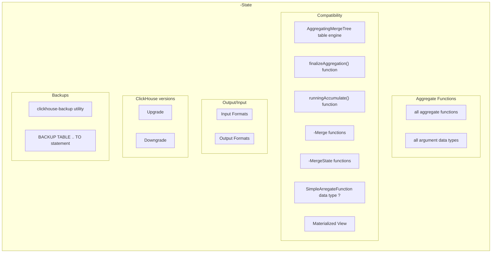

# SRS031 ClickHouse Aggregate Functions
# Software Requirements Specification

## Table of Contents

* 1 [Revision History](#revision-history)
* 2 [Introduction](#introduction)
* 3 [Requirements](#requirements)
  * 3.1 [Combinator Functions](#combinator-functions)
    * 3.1.1 [-If Suffix](#-if-suffix)
      * 3.1.1.1 [RQ.SRS-031.ClickHouse.AggregateFunctions.Combinator.If](#rqsrs-031clickhouseaggregatefunctionscombinatorif)
    * 3.1.2 [-Array Suffix](#-array-suffix)
      * 3.1.2.1 [RQ.SRS-031.ClickHouse.AggregateFunctions.Combinator.Array](#rqsrs-031clickhouseaggregatefunctionscombinatorarray)
    * 3.1.3 [-Map Suffix](#-map-suffix)
      * 3.1.3.1 [RQ.SRS-031.ClickHouse.AggregateFunctions.Combinator.Map](#rqsrs-031clickhouseaggregatefunctionscombinatormap)
    * 3.1.4 [-State Suffix](#-state-suffix)
      * 3.1.4.1 [Test Feature Diagram](#test-feature-diagram)
      * 3.1.4.2 [RQ.SRS-031.ClickHouse.AggregateFunctions.Combinator.State](#rqsrs-031clickhouseaggregatefunctionscombinatorstate)
      * 3.1.4.3 [RQ.SRS-031.ClickHouse.AggregateFunctions.Combinator.State.With.AggregatingMergeTree](#rqsrs-031clickhouseaggregatefunctionscombinatorstatewithaggregatingmergetree)
      * 3.1.4.4 [RQ.SRS-031.ClickHouse.AggregateFunctions.Combinator.State.With.FinalizeAggregationFunction](#rqsrs-031clickhouseaggregatefunctionscombinatorstatewithfinalizeaggregationfunction)
      * 3.1.4.5 [RQ.SRS-031.ClickHouse.AggregateFunctions.Combinator.State.With.RunningAccumulateFunction](#rqsrs-031clickhouseaggregatefunctionscombinatorstatewithrunningaccumulatefunction)
      * 3.1.4.6 [RQ.SRS-031.ClickHouse.AggregateFunctions.Combinator.State.With.Merge](#rqsrs-031clickhouseaggregatefunctionscombinatorstatewithmerge)
      * 3.1.4.7 [RQ.SRS-031.ClickHouse.AggregateFunctions.Combinator.State.With.MergeState](#rqsrs-031clickhouseaggregatefunctionscombinatorstatewithmergestate)
      * 3.1.4.8 [RQ.SRS-031.ClickHouse.AggregateFunctions.Combinator.State.With.AggregateFunctionDataType](#rqsrs-031clickhouseaggregatefunctionscombinatorstatewithaggregatefunctiondatatype)
      * 3.1.4.9 [RQ.SRS-031.ClickHouse.AggregateFunctions.Combinator.State.With.MaterializedView](#rqsrs-031clickhouseaggregatefunctionscombinatorstatewithmaterializedview)
    * 3.1.5 [-SimpleState Suffix](#-simplestate-suffix)
      * 3.1.5.1 [RQ.SRS-031.ClickHouse.AggregateFunctions.Combinator.SimpleState](#rqsrs-031clickhouseaggregatefunctionscombinatorsimplestate)
      * 3.1.5.2 [RQ.SRS-031.ClickHouse.AggregateFunctions.Combinator.SimpleState.With.AggregatingMergeTree](#rqsrs-031clickhouseaggregatefunctionscombinatorsimplestatewithaggregatingmergetree)
    * 3.1.6 [-Merge Suffix](#-merge-suffix)
      * 3.1.6.1 [RQ.SRS-031.ClickHouse.AggregateFunctions.Combinator.Merge](#rqsrs-031clickhouseaggregatefunctionscombinatormerge)
    * 3.1.7 [-MergeState Suffix](#-mergestate-suffix)
      * 3.1.7.1 [RQ.SRS-031.ClickHouse.AggregateFunctions.Combinator.MergeState](#rqsrs-031clickhouseaggregatefunctionscombinatormergestate)
    * 3.1.8 [-ForEach Suffix](#-foreach-suffix)
      * 3.1.8.1 [RQ.SRS-031.ClickHouse.AggregateFunctions.Combinator.ForEach](#rqsrs-031clickhouseaggregatefunctionscombinatorforeach)
    * 3.1.9 [-Distinct Suffix](#-distinct-suffix)
      * 3.1.9.1 [RQ.SRS-031.ClickHouse.AggregateFunctions.Combinator.Distinct](#rqsrs-031clickhouseaggregatefunctionscombinatordistinct)
    * 3.1.10 [-OrDefault Suffix](#-ordefault-suffix)
      * 3.1.10.1 [RQ.SRS-031.ClickHouse.AggregateFunctions.Combinator.OrDefault](#rqsrs-031clickhouseaggregatefunctionscombinatorordefault)
    * 3.1.11 [-OrNull Suffix](#-ornull-suffix)
      * 3.1.11.1 [RQ.SRS-031.ClickHouse.AggregateFunctions.Combinator.OrNull](#rqsrs-031clickhouseaggregatefunctionscombinatorornull)
    * 3.1.12 [-Resample Suffix](#-resample-suffix)
      * 3.1.12.1 [RQ.SRS-031.ClickHouse.AggregateFunctions.Combinator.Resample](#rqsrs-031clickhouseaggregatefunctionscombinatorresample)
  * 3.2 [Data Types](#data-types)
    * 3.2.1 [SimpleAggregateFunction](#simpleaggregatefunction)
      * 3.2.1.1 [RQ.SRS-031.ClickHouse.AggregateFunctions.DataType.SimpleAggregateFunction](#rqsrs-031clickhouseaggregatefunctionsdatatypesimpleaggregatefunction)
    * 3.2.2 [AggregateFunction](#aggregatefunction)
      * 3.2.2.1 [RQ.SRS-031.ClickHouse.AggregateFunctions.DataType.AggregateFunction](#rqsrs-031clickhouseaggregatefunctionsdatatypeaggregatefunction)
      * 3.2.2.2 [Inserting Data](#inserting-data)
        * 3.2.2.2.1 [RQ.SRS-031.ClickHouse.AggregateFunctions.DataType.AggregateFunction.Insert](#rqsrs-031clickhouseaggregatefunctionsdatatypeaggregatefunctioninsert)
      * 3.2.2.3 [Selecting Data](#selecting-data)
        * 3.2.2.3.1 [RQ.SRS-031.ClickHouse.AggregateFunctions.DataType.AggregateFunction.Select](#rqsrs-031clickhouseaggregatefunctionsdatatypeaggregatefunctionselect)
* 4 [References](#references)

## Revision History

This document is stored in an electronic form using [Git] source control management software
hosted in a [GitHub Repository].
All the updates are tracked using the [Revision History].

## Introduction

This software requirements specification covers requirements for supporting [AggregateFunction] data type in [ClickHouse].

## Requirements

### Combinator Functions

#### -If Suffix

##### RQ.SRS-031.ClickHouse.AggregateFunctions.Combinator.If
version: 1.0

[ClickHouse] SHALL support [-If] combinator suffix for all [aggregate function]s which
SHALL enable the aggregate function to accept an extra argument – a condition of `Uint8` type.
The aggregate function SHALL process only the rows that trigger the condition.
If the condition was not triggered even once, the function SHALL return a default value.

For example,

```sql
sumIf(column, cond)
countIf(cond)
avgIf(x, cond)
quantilesTimingIf(level1, level2)(x, cond)
argMinIf(arg, val, cond)
...
```

#### -Array Suffix

##### RQ.SRS-031.ClickHouse.AggregateFunctions.Combinator.Array
version: 1.0

[ClickHouse] SHALL support [-Array] combinator suffix for all [aggregate function]s which
SHALL enable the aggregate function ti take arguments of the `Array(T)` type (arrays)
instead of `T` type arguments.

If the aggregate function accepts multiple arguments, the arrays SHALL be of equal lengths.
When processing arrays, the aggregate function SHALL work like the original
aggregate function across all array elements.

For example,

```sql
sumArray(arr) -- sum all the elements of all ‘arr’ arrays
```

```sql
uniqArray(arr) -- count the number of unique elements in all ‘arr’ arrays
```

#### -Map Suffix

##### RQ.SRS-031.ClickHouse.AggregateFunctions.Combinator.Map
version: 1.0

[ClickHouse] SHALL support [-Map] combinator suffix for all [aggregate function]s which
SHALL cause the aggregate function to take `Map` type as an argument,
and SHALL aggregate values of each key of the map separately using the specified aggregate function.

The result SHALL also be of a `Map` type.

For example,

```sql
sumMap(map(1,1))
avgMap(map('a', 1))
```

#### -State Suffix

##### Test Feature Diagram



##### RQ.SRS-031.ClickHouse.AggregateFunctions.Combinator.State
version: 1.0

[ClickHouse] SHALL support [-State] combinator suffix for all [aggregate function]s which
SHALL return an intermediate state of the aggregation that user SHALL be able to use for
further processing or stored in a table to finish aggregation later.

##### RQ.SRS-031.ClickHouse.AggregateFunctions.Combinator.State.With.AggregatingMergeTree
version: 1.0

[ClickHouse]'s SHALL support using all [aggregate function]s with [-State] combinator
with [AggregatingMergeTree] table engine.

##### RQ.SRS-031.ClickHouse.AggregateFunctions.Combinator.State.With.FinalizeAggregationFunction
version: 1.0

[ClickHouse]'s SHALL support using all [aggregate function]s with [-State] combinator
with [finalizeAggregation] function.

##### RQ.SRS-031.ClickHouse.AggregateFunctions.Combinator.State.With.RunningAccumulateFunction
version: 1.0

[ClickHouse]'s SHALL support using all [aggregate function]s with [-State] combinator
with [runningAccumulate] function.

##### RQ.SRS-031.ClickHouse.AggregateFunctions.Combinator.State.With.Merge
version: 1.0

[ClickHouse]'s SHALL support using all [aggregate function]s with [-State] combinator
with the corresponding [-Merge] combinator function.

##### RQ.SRS-031.ClickHouse.AggregateFunctions.Combinator.State.With.MergeState
version: 1.0

[ClickHouse]'s SHALL support using all [aggregate function]s with [-State] combinator
with the corresponding [-MergeState] combinator function.

##### RQ.SRS-031.ClickHouse.AggregateFunctions.Combinator.State.With.AggregateFunctionDataType
version: 1.0

[ClickHouse]'s SHALL support using all [aggregate function]s with [-State] combinator
with [AggregateFunction] data type columns.

##### RQ.SRS-031.ClickHouse.AggregateFunctions.Combinator.State.With.MaterializedView
version: 1.0

[ClickHouse]'s SHALL support using all [aggregate function]s with [-State] combinator
with [Materialized View] table engine.

#### -SimpleState Suffix

##### RQ.SRS-031.ClickHouse.AggregateFunctions.Combinator.SimpleState
version: 1.0

[ClickHouse] SHALL support [-SimpleState] combinator suffix for all [aggregate function]s which
SHALL return the same result as the aggregate function but with a [SimpleAggregateFunction] data type.

For example,

```sql
WITH anySimpleState(number) AS c SELECT toTypeName(c), c FROM numbers(1)
```

##### RQ.SRS-031.ClickHouse.AggregateFunctions.Combinator.SimpleState.With.AggregatingMergeTree
version: 1.0

[ClickHouse]'s SHALL support using all [aggregate function]s with [-SimpleState] combinator
with [AggregatingMergeTree] table engine to store data in a column with [SimpleAggregateFunction] data type.

#### -Merge Suffix

##### RQ.SRS-031.ClickHouse.AggregateFunctions.Combinator.Merge
version: 1.0

[ClickHouse] SHALL support [-Merge] combinator suffix for all [aggregate function]s which
SHALL cause the aggregate function to take the intermediate aggregation state as an argument and
combine the states to finish aggregation and the function SHALL return the resulting value.

#### -MergeState Suffix

##### RQ.SRS-031.ClickHouse.AggregateFunctions.Combinator.MergeState
version: 1.0

[ClickHouse] SHALL support [-MergeState] combinator suffix for all [aggregate function]s which
SHALL cause the aggregate function to merge the intermediate aggregation states in the same way as the
[-Merge] combinator but SHALL return an intermediate aggregation state, similar to the [-State] combinator.

#### -ForEach Suffix

##### RQ.SRS-031.ClickHouse.AggregateFunctions.Combinator.ForEach
version: 1.0

[ClickHouse] SHALL support [-MergeState] combinator suffix for all [aggregate function]s which
SHALL convert aggregate function for tables into an aggregate function for arrays
that SHALL aggregate the corresponding array items and SHALL return an array of results.

For example,

> sumForEach for the arrays [1, 2], [3, 4, 5] and [6, 7] SHALL return the result [10, 13, 5]
> after adding together the corresponding array items

#### -Distinct Suffix

##### RQ.SRS-031.ClickHouse.AggregateFunctions.Combinator.Distinct
version: 1.0

[ClickHouse] SHALL support [-Distinct] combinator suffix for all [aggregate function]s which
SHALL cause the aggregate function for every unique combination of arguments to be aggregated only once.

Repeating values SHALL be ignored.

For example,

```sql
sum(DISTINCT x)
groupArray(DISTINCT x)
corrStableDistinct(DISTINCT x, y)
```

#### -OrDefault Suffix

##### RQ.SRS-031.ClickHouse.AggregateFunctions.Combinator.OrDefault
version: 1.0

[ClickHouse] SHALL support [-Distinct] combinator suffix for all [aggregate function]s which
SHALL change the behavior of an aggregate function.

If an aggregate function does not have input values, with this combinator it SHALL return
the default value for its return data type.

This combinator SHALL apply to the aggregate functions that can take empty input data.

The `-OrDefault` SHALL support to be used with other combinators which
SHALL enable to use aggregate function which do not accept the empty input.

Syntax:

```sql
[aggregate function]OrDefault(x)
```

where `x` are the aggregate function parameters.

The function SHALL return the default value of an aggregate function’s return type if there is nothing to aggregate
and the type SHALL depend on the aggregate function used.

For example, 

```sql
SELECT avg(number), avgOrDefault(number) FROM numbers(0)
```

SHALL produce the following output

```bash
┌─avg(number)─┬─avgOrDefault(number)─┐
│         nan │                    0 │
└─────────────┴──────────────────────┘
```

For example,

```sql
SELECT avgOrDefaultIf(x, x > 10)
FROM
(
    SELECT toDecimal32(1.23, 2) AS x
)
```

SHALL produce the following output

```bash
┌─avgOrDefaultIf(x, greater(x, 10))─┐
│                              0.00 │
└───────────────────────────────────┘
```

#### -OrNull Suffix

##### RQ.SRS-031.ClickHouse.AggregateFunctions.Combinator.OrNull
version: 1.0

[ClickHouse] SHALL support [-Distinct] combinator suffix for all [aggregate function]s which
SHALL change the behavior of an aggregate function.

The combinator SHALL convert a result of an aggregate function to the `Nullable` data type.
If the aggregate function does not have values to calculate it SHALL return `NULL`.

Syntax:

```sql
<aggregate function>OrNull(x)
```

where `x` is aggregate function parameters.

In addition, the [-OrNull] combinator SHALL support to be used with other combinators
which SHALL enable to use aggregate function which do not accept the empty input.

For example,

```sql
SELECT sumOrNull(number), toTypeName(sumOrNull(number)) FROM numbers(10) WHERE number > 10
```

SHALL produce the following output

```bash
┌─sumOrNull(number)─┬─toTypeName(sumOrNull(number))─┐
│              ᴺᵁᴸᴸ │ Nullable(UInt64)              │
└───────────────────┴───────────────────────────────┘
```

For example,

```sql
SELECT avgOrNullIf(x, x > 10)
FROM
(
    SELECT toDecimal32(1.23, 2) AS x
)
```

SHALL produce the following output

```bash
┌─avgOrNullIf(x, greater(x, 10))─┐
│                           ᴺᵁᴸᴸ │
└────────────────────────────────┘
```

#### -Resample Suffix

##### RQ.SRS-031.ClickHouse.AggregateFunctions.Combinator.Resample
version: 1.0

[ClickHouse] SHALL support [-Resample] combinator suffix for all [aggregate function]s which
SHALL cause the aggregate function to divide data into groups, and then it SHALL separately aggregate
the data in those groups. Groups SHALL be created by splitting the values from one column into intervals.

The function SHALL return an `Array` of aggregate function results for each sub-interval.

Syntax:

```sql
<aggregate function>Resample(start, end, step)(<aggFunction_params>, resampling_key)
```

where arguments SHALL be the following

* `start`  starting value of the whole required interval for resampling_key values
* `stop`  ending value of the whole required interval for resampling_key values
  The whole interval does not include the stop value [start, stop)
* `step` step for separating the whole interval into sub-intervals.
  The aggregate function is executed over each of those sub-intervals independently.
* `resampling_key` column whose values are used for separating data into intervals
* `aggFunction_params` aggregate function parameters

For example, 

with `people` table containing

```bash
┌─name───┬─age─┬─wage─┐
│ John   │  16 │   10 │
│ Alice  │  30 │   15 │
│ Mary   │  35 │    8 │
│ Evelyn │  48 │ 11.5 │
│ David  │  62 │  9.9 │
│ Brian  │  60 │   16 │
└────────┴─────┴──────┘
```

```sql
SELECT groupArrayResample(30, 75, 30)(name, age) FROM people
```

SHALL produce the following result

```bash
┌─groupArrayResample(30, 75, 30)(name, age)─────┐
│ [['Alice','Mary','Evelyn'],['David','Brian']] │
└───────────────────────────────────────────────┘
```

and

```sql
SELECT
    countResample(30, 75, 30)(name, age) AS amount,
    avgResample(30, 75, 30)(wage, age) AS avg_wage
FROM people
```

SHALL produce

```bash
┌─amount─┬─avg_wage──────────────────┐
│ [3,2]  │ [11.5,12.949999809265137] │
└────────┴───────────────────────────┘
```

### Data Types

#### SimpleAggregateFunction

##### RQ.SRS-031.ClickHouse.AggregateFunctions.DataType.SimpleAggregateFunction
version: 1.0

[ClickHouse] SHALL support [SimpleAggregateFunction] data type which SHALL allow to store a
current value of the aggregate function. 

This function SHALL be used as optimization to [AggregateFunction] when the following property holds: 

> the result of applying a function f to a row set S1 UNION ALL S2 can be obtained by applying f to parts of the row set
> separately, and then again applying f to the results: f(S1 UNION ALL S2) = f(f(S1) UNION ALL f(S2)).
> This property guarantees that partial aggregation results are enough to compute the combined one,
> so we do not have to store and process any extra data.

#### AggregateFunction

##### RQ.SRS-031.ClickHouse.AggregateFunctions.DataType.AggregateFunction
version: 1.0

[ClickHouse] SHALL support [AggregateFunction] data type which SHALL allow to store as a table column
implementation-defined intermediate state of the specified [aggregate function].

The data type SHALL be defined using the following syntax:

```sql
AggregateFunction(name, types_of_arguments…).
```

where parameters

* `name` SHALL specify the aggregate function and if the function is parametric the parameters SHALL be specified as well
* `types_of_arguments` SHALL specify types of the aggregate function arguments.

For example,

```sql
CREATE TABLE t
(
    column1 AggregateFunction(uniq, UInt64),
    column2 AggregateFunction(anyIf, String, UInt8),
    column3 AggregateFunction(quantiles(0.5, 0.9), UInt64)
) ENGINE = ...
```

##### Inserting Data

###### RQ.SRS-031.ClickHouse.AggregateFunctions.DataType.AggregateFunction.Insert

[ClickHouse] SHALL support inserting data into [AggregateFunction] data type column 
using a value returned by calling the [aggregate function] with the `-State` suffix in
`INSERT SELECT` statement.

For example,

```sql
INSERT INTO table SELECT uniqState(UserID), quantilesState(0.5, 0.9)(SendTiming)
```

##### Selecting Data

###### RQ.SRS-031.ClickHouse.AggregateFunctions.DataType.AggregateFunction.Select

[ClickHouse] SHALL support selecting final result of aggregation from [AggregateFunction] data type column
by using the same [aggregate function] with the `-Merge` suffix.

For example,

```sql
SELECT uniqMerge(state) FROM (SELECT uniqState(UserID) AS state FROM table GROUP BY RegionID)
```

## References

* [ClickHouse]
* [GitHub Repository]
* [Revision History]
* [Git]

[Materialized View]: https://clickhouse.com/docs/en/sql-reference/statements/create/view#materialized-view
[-MergeState]: https://clickhouse.com/docs/en/sql-reference/aggregate-functions/combinators#-mergestate
[-Merge]: https://clickhouse.com/docs/en/sql-reference/aggregate-functions/combinators#-merge
[-SimpleState]: https://clickhouse.com/docs/en/sql-reference/aggregate-functions/combinators#-simplestate
[-State]: https://clickhouse.com/docs/en/sql-reference/aggregate-functions/combinators#-state
[runningAccumulate]: https://clickhouse.com/docs/en/sql-reference/functions/other-functions#function-finalizeaggregation
[finalizeAggregation]: https://clickhouse.com/docs/en/sql-reference/functions/other-functions#function-finalizeaggregation
[AggregatingMergeTree]: https://clickhouse.com/docs/en/engines/table-engines/mergetree-family/aggregatingmergetree
[aggregate function]: https://clickhouse.com/docs/en/sql-reference/aggregate-functions/reference/ 
[SimpleAggregateFunction]: https://clickhouse.com/docs/en/sql-reference/data-types/simpleaggregatefunction
[AggregateFunction]: https://clickhouse.com/docs/en/sql-reference/data-types/aggregatefunction
[ClickHouse]: https://clickhouse.com
[GitHub Repository]: https://github.com/Altinity/clickhouse-regression/blob/main/aggregate_functions/requirements/requirements.md
[Revision History]: https://github.com/Altinity/clickhouse-regression/commits/main/aggregate_functions/requirements/requirements.md
[Git]: https://git-scm.com/
[GitHub]: https://github.com
