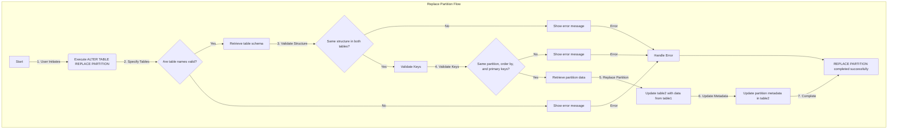

# SRS034 ClickHouse Alter Table Attach Partition

# Software Requirements Specification

## Table of Contents

## Revision History

This document is stored in an electronic form using [Git] source control management software
hosted in a [GitHub Repository].
All the updates are tracked using the [Revision History].

## Introduction

This software requirements specification covers requirements for `ALTER TABLE ATTACH PARTITION|PART` and `ALTER TABLE ATTACH PARTITION FROM` in [ClickHouse].

The documentation used:

- https://clickhouse.com/docs/en/sql-reference/statements/alter/partition#attach-partitionpart
- https://clickhouse.com/docs/en/sql-reference/statements/alter/partition#attach-partition-from

## Flowchart




## Replace Partition on the Table From Another Table

### RQ.SRS-032.ClickHouse.Alter.Table.ReplacePartition
version: 1.0

To facilitate efficient data management in [ClickHouse], features `ATTACH PARTITION|PART` and `ATTACH PARTITION FROM`  SHALL be supported.   
`ATTACH PARTITION|PART` allows users to add datat to the table from the `detached` directory using the `ATTACH PARTITION|PART` command. 

The following SQL command exemplifies this feature:

```sql
ALTER TABLE table_name [ON CLUSTER cluster] ATTACH PARTITION|PART partition_expr
```

`ATTACH PARTITION FROM` allows user to copy data partition from one table to another using the `ATTACH PARTITION FROM` command.

The following SQL command exemplifies this feature:
```sql
ALTER TABLE table2 [ON CLUSTER cluster] ATTACH PARTITION partition_expr FROM table1
```