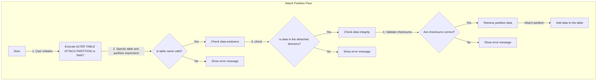

# SRS034 ClickHouse Alter Table Attach Partition|Part, Alter Table Attach Partition From

# Software Requirements Specification

## Table of Contents

## Revision History

This document is stored in an electronic form using [Git] source control management software
hosted in a [GitHub Repository].
All the updates are tracked using the [Revision History].

## Introduction

This software requirements specification covers requirements for `ALTER TABLE ATTACH PARTITION|PART` and `ALTER TABLE ATTACH PARTITION FROM` in [ClickHouse].

The documentation used:

- https://clickhouse.com/docs/en/sql-reference/statements/alter/partition#attach-partitionpart
- https://clickhouse.com/docs/en/sql-reference/statements/alter/partition#attach-partition-from


## Attach Partition|Part

### Flowchart



### RQ.SRS-034.ClickHouse.Alter.Table.AttachPartitionPart
version: 1.0

To facilitate efficient data management in [ClickHouse], the feature `ATTACH PARTITION|PART` SHALL be supported.  This feature allows users to add data to the table from the `detached` directory using the `ATTACH PARTITION|PART` command. 

The following SQL command exemplifies this feature:

```sql
ALTER TABLE table_name [ON CLUSTER cluster] ATTACH PARTITION|PART partition_expr
```

### Reflect Changes in Table Partitions Inside the System Table

#### RQ.SRS-034.ClickHouse.Alter.Table.AttachPartitionPart.System.Parts
version: 1.0

[ClickHouse] SHALL reflect the changes in `system.parts` table, when the `ATTACH PARTITION|PART` is executed on the table. 

For example,

```sql
SELECT partition, part_type
FROM system.parts
WHERE table = 'table_1'
```

### Table Engines on Which Attach Partition Can Be Performed

#### RQ.SRS-034.ClickHouse.Alter.Table.AttachPartitionPart.Supported.Engines
version: 1.0

[ClickHouse] SHALL limit the use of the `ATTACH PARTITION|PART` feature to table engines belonging to the MergeTree family. This requirement ensures compatibility and optimal performance. 

The table engines that support `ATTACH PARTITION|PART` include:

|       Supported Engines        |
|:------------------------------:|
|          `MergeTree`           |   |
|      `ReplacingMergeTree`      |
|     `AggregatingMergeTree`     |
|     `CollapsingMergeTree`      |
| `VersionedCollapsingMergeTree` |
|      `GraphiteMergeTree`       |
|      `SummingMergeTree`        |

### Table That Is Stored on S3

#### RQ.SRS-034.ClickHouse.Alter.Table.AttachPartitionPart.S3
version: 1.0

[ClickHouse] SHALL support using `ATTACH PARTITION|PART` to attach partitions on tables that are stored inside the S3 storage.

### Table That Is Stored on Tiered Storage

#### RQ.SRS-034.ClickHouse.Alter.Table.AttachPartitionPart.TieredStorage
version: 1.0

[ClickHouse] SHALL support using `ATTACH PARTITION|PART` to attach partitions on tables that are stored inside the tiered storage.

#### RQ.SRS-034.ClickHouse.Alter.Table.AttachPartitionPart.PartitionTypes
version: 1.0

| Partition Types                               |
|-----------------------------------------------|
| Partition with only compact parts             |
| Partition with only wide parts                |
| Partition with compact and wide parts (mixed) |
| Partition with no parts                       |
| Partition with empty parts                    |

The `ATTACH PARTITION` SHALL work for any partition type.

### Corrupted Parts on a Specific Partition

#### RQ.SRS-034.ClickHouse.Alter.Table.AttachPartitionPart.Corrupted
version: 1.0

[ClickHouse] SHALL output an error when trying to `ATTACH PARTITION` when parts of a specific partition are corrupted.

Possible partition types that can be corrupted are,

| Partition Types                               |
|-----------------------------------------------|
| Partition with compact parts                  |
| Partition with wide parts                     |
| Partition with compact and wide parts (mixed) |

### Conditions

### Role Based Access Control

#### RQ.SRS-034.ClickHouse.Alter.Table.AttachPartition.RBAC
version: 1.0

The `ATTACH PARTITION` SHALL only work when the user has the following privileges for table:

| Table priviliges     |
|----------------------|
| CREATE               |


## Attach Partition From

### Definitions

Source Table - The table from which a partition is taken.
Destination Table - The table in which a specific partition is going to be attached.

### RQ.SRS-034.ClickHouse.Alter.Table.AttachPartitionFrom
version: 1.0

To facilitate efficient data management in [ClickHouse], the features `ATTACH PARTITION FROM`  SHALL be supported. This feature allows user to copy data partition from one table to another using the `ATTACH PARTITION FROM` command.

The following SQL command exemplifies this feature:
```sql
ALTER TABLE table2 [ON CLUSTER cluster] ATTACH PARTITION partition_expr FROM table1
```

### Reflect Changes in Table Partitions Inside the System Table

#### RQ.SRS-034.ClickHouse.Alter.Table.AttachPartitionFrom.System.Parts
version: 1.0

[ClickHouse] SHALL reflect the changes in `system.parts` table, when the `ATTACH PARTITION FROM` is executed on the `destination table`. 

For example,

```sql
SELECT partition, part_type
FROM system.parts
WHERE table = 'table_1'

### Table Engines on Which Attach Partition From Can Be Performed

#### RQ.SRS-034.ClickHouse.Alter.Table.AttachPartitionFrom.Supported.Engines
version: 1.0

[ClickHouse] SHALL limit the use of the `ATTACH PARTITION FROM` feature to table engines belonging to the MergeTree family. This requirement ensures compatibility and optimal performance. 

The table engines that support `ATTACH PARTITION FROM` include:

|       Supported Engines        |
|:------------------------------:|
|          `MergeTree`           |   |
|      `ReplacingMergeTree`      |
|     `AggregatingMergeTree`     |
|     `CollapsingMergeTree`      |
| `VersionedCollapsingMergeTree` |
|      `GraphiteMergeTree`       |
|      `SummingMergeTree`        |


### Keeping Data on the Source Table After Attach Partition From

#### RQ.SRS-034.ClickHouse.Alter.Table.AttachPartitionFrom.KeepData
version: 1.0

[ClickHouse] SHALL keep the data of the table from which the partition is copied from.

### Table That Is Stored on S3

#### RQ.SRS-034.ClickHouse.Alter.Table.AttachPartitionFrom.S3
version: 1.0

[ClickHouse] SHALL support using `ATTACH PARTITION FROM` to attach partitions on tables that are stored inside the S3 storage.

### Table That Is Stored on Tiered Storage

#### RQ.SRS-034.ClickHouse.Alter.Table.AttachPartitionFrom.TieredStorage
version: 1.0

[ClickHouse] SHALL support using `ATTACH PARTITION FROM` to attach partitions on tables that are stored inside the tiered storage.

## Destination Table That Is on a Different Replica

### RQ.SRS-034.ClickHouse.Alter.Table.AttachPartitionFrom.Replicas
version: 1.0

[ClickHouse] SHALL support using `ATTACH PARTITION FROM` to attach partitions on a destination table that is on a different replica than the source table.

### Destination Table That Is on a Different Shard

### RQ.SRS-034.ClickHouse.Alter.Table.AttachPartitionFrom.Shards
version: 1.0

[ClickHouse] SHALL support using `ATTACH PARTITION FROM` to attach partitions on tables that are on different shards.

### Tables With Different Partition Types

#### RQ.SRS-034.ClickHouse.Alter.Table.AttachPartitionFrom.PartitionTypes
version: 1.0

| Partition Types                               |
|-----------------------------------------------|
| Partition with only compact parts             |
| Partition with only wide parts                |
| Partition with compact and wide parts (mixed) |
| Partition with no parts                       |
| Partition with empty parts                    |

The `ATTACH PARTITION` SHALL work for any partition type.


### Corrupted Parts on a Specific Partition

#### RQ.SRS-034.ClickHouse.Alter.Table.AttachPartitionPart.Corrupted
version: 1.0

[ClickHouse] SHALL output an error when trying to `ATTACH PARTITION` when parts of a specific partition are corrupted.

Possible partition types that can be corrupted are,

| Partition Types                               |
|-----------------------------------------------|
| Partition with compact parts                  |
| Partition with wide parts                     |
| Partition with compact and wide parts (mixed) |

### Conditions

### Role Based Access Control

#### RQ.SRS-034.ClickHouse.Alter.Table.AttachPartition.RBAC
version: 1.0

The `ATTACH PARTITION` SHALL only work when the user has the following privileges for table:

| Table priviliges     |
|----------------------|
| CREATE               |


[ClickHouse]: https://clickhouse.com
[GitHub]: https://github.com