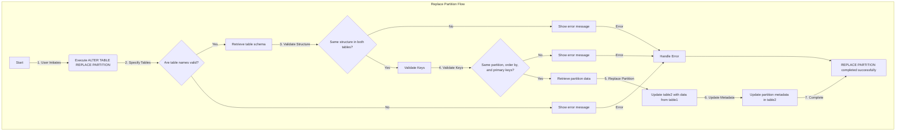
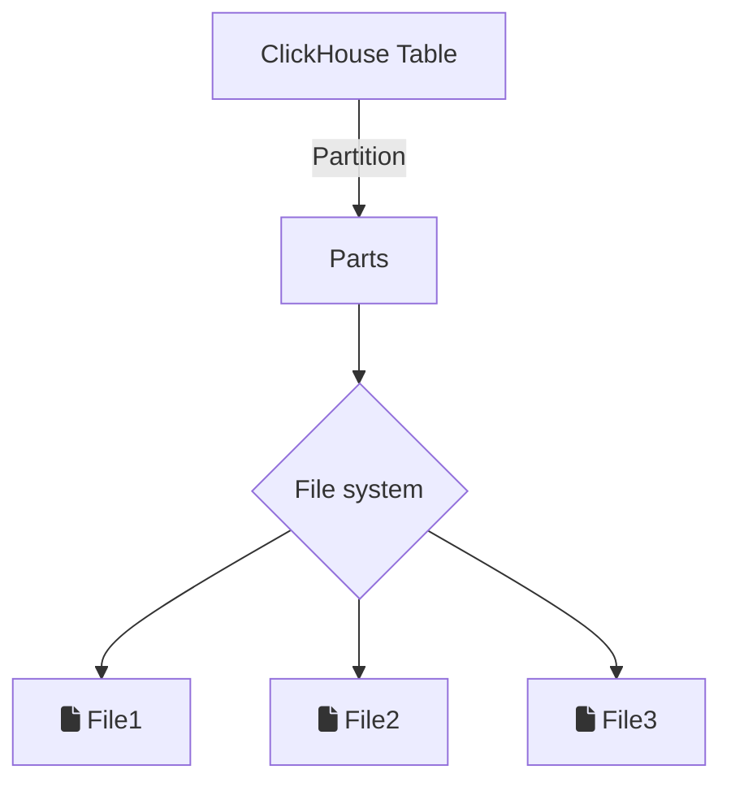
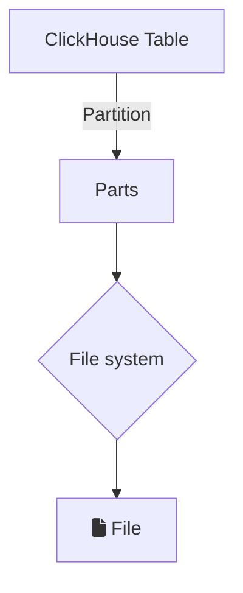

# SRS032 ClickHouse Alter Table Replace Partition

# Software Requirements Specification

## Table of Contents

* 1 [Revision History](#revision-history)
* 2 [Introduction](#introduction)
* 3 [Flowchart](#flowchart)
* 4 [Definitions](#definitions)
* 5 [User Actions](#user-actions)
* 6 [Replace Partition](#replace-partition)
    * 6.1 [RQ.SRS-032.ClickHouse.Alter.Table.ReplacePartition](#rqsrs-032clickhousealtertablereplacepartition)
    * 6.2 [Check Existing Partitions From The Parts Table](#check-existing-partitions-from-the-parts-table)
        * 6.2.1 [RQ.SRS-032.ClickHouse.Alter.Table.ReplacePartition.System.Parts](#rqsrs-032clickhousealtertablereplacepartitionsystemparts)
* 7 [Table Engines](#table-engines)
    * 7.1 [RQ.SRS-032.ClickHouse.Alter.Table.ReplacePartition.TableEngines](#rqsrs-032clickhousealtertablereplacepartitiontableengines)
* 8 [Keeping Data When Replacing Partitions](#keeping-data-when-replacing-partitions)
    * 8.1 [RQ.SRS-032.ClickHouse.Alter.Table.ReplacePartition.KeepData](#rqsrs-032clickhousealtertablereplacepartitionkeepdata)
* 9 [Keeping Data When Replacing Partition From Non-Existent Partition](#keeping-data-when-replacing-partition-from-non-existent-partition)
    * 9.1 [RQ.SRS-032.ClickHouse.Alter.Table.ReplacePartition.NonExistentPartition](#rqsrs-032clickhousealtertablereplacepartitionnonexistentpartition)
* 10 [Replacing Partitions From Temporary Table](#replacing-partitions-from-temporary-table)
    * 10.1 [RQ.SRS-032.ClickHouse.Alter.Table.ReplacePartition.FromTemporaryTable](#rqsrs-032clickhousealtertablereplacepartitionfromtemporarytable)
* 11 [Replacing Partitions Between Temporary Tables](#replacing-partitions-between-temporary-tables)
    * 11.1 [RQ.SRS-032.ClickHouse.Alter.Table.ReplacePartition.TemporaryTables](#rqsrs-032clickhousealtertablereplacepartitiontemporarytables)
* 12 [Using Into Outfile With Replace Partition](#using-into-outfile-with-replace-partition)
    * 12.1 [RQ.SRS-032.ClickHouse.Alter.Table.ReplacePartition.IntoOutfile](#rqsrs-032clickhousealtertablereplacepartitionintooutfile)
* 13 [Using Format With Replace Partition](#using-format-with-replace-partition)
    * 13.1 [RQ.SRS-032.ClickHouse.Alter.Table.ReplacePartition.Format](#rqsrs-032clickhousealtertablereplacepartitionformat)
* 14 [Using Settings With Replace Partition](#using-settings-with-replace-partition)
    * 14.1 [RQ.SRS-032.ClickHouse.Alter.Table.ReplacePartition.Settings](#rqsrs-032clickhousealtertablereplacepartitionsettings)
* 15 [Replacing Partitions From One Disk To Another In The Same Table](#replacing-partitions-from-one-disk-to-another-in-the-same-table)
    * 15.1 [RQ.SRS-032.ClickHouse.Alter.Table.ReplacePartition.Disks](#rqsrs-032clickhousealtertablereplacepartitiondisks)
* 16 [Replacing Partitions Between Tables On S3](#replacing-partitions-between-tables-on-s3)
    * 16.1 [RQ.SRS-032.ClickHouse.Alter.Table.ReplacePartition.S3](#rqsrs-032clickhousealtertablereplacepartitions3)
* 17 [Replacing Partitions Between Replicas](#replacing-partitions-between-replicas)
    * 17.1 [RQ.SRS-032.ClickHouse.Alter.Table.ReplacePartition.Replicas](#rqsrs-032clickhousealtertablereplacepartitionreplicas)
* 18 [Replacing Partitions Between Shards](#replacing-partitions-between-shards)
    * 18.1 [RQ.SRS-032.ClickHouse.Alter.Table.ReplacePartition.Shards](#rqsrs-032clickhousealtertablereplacepartitionshards)
* 19 [Replacing Partitions Between Different ClickHouse versions](#replacing-partitions-between-different-clickhouse-versions)
    * 19.1 [RQ.SRS-032.ClickHouse.Alter.Table.ReplacePartition.Versions](#rqsrs-032clickhousealtertablereplacepartitionversions)
* 20 [Replacing Partitions Between Different Encodings](#replacing-partitions-between-different-encodings)
    * 20.1 [RQ.SRS-032.ClickHouse.Alter.Table.ReplacePartition.Encodings](#rqsrs-032clickhousealtertablereplacepartitionencodings)
* 21 [Replacing Partitions Between Encrypted And Unencrypted Tables](#replacing-partitions-between-encrypted-and-unencrypted-tables)
    * 21.1 [RQ.SRS-032.ClickHouse.Alter.Table.ReplacePartition.Encryption](#rqsrs-032clickhousealtertablereplacepartitionencryption)
* 22 [Replacing Partitions To Deduplication Tables](#replacing-partitions-to-deduplication-tables)
    * 22.1 [RQ.SRS-032.ClickHouse.Alter.Table.ReplacePartition.Deduplication](#rqsrs-032clickhousealtertablereplacepartitiondeduplication)
* 23 [Compact and Wide Parts](#compact-and-wide-parts)
    * 23.1 [Replace Partition Between The Same Partition Types](#replace-partition-between-the-same-partition-types)
        * 23.1.1 [RQ.SRS-032.ClickHouse.Alter.Table.ReplacePartition.SameTypes](#rqsrs-032clickhousealtertablereplacepartitionsametypes)
    * 23.2 [Replace Partition Between Compact and Wide Parts](#replace-partition-between-compact-and-wide-parts)
        * 23.2.1 [RQ.SRS-032.ClickHouse.Alter.Table.ReplacePartition.WideAndCompact](#rqsrs-032clickhousealtertablereplacepartitionwideandcompact)
    * 23.3 [Replacing Partition After Updating The Partition Type](#replacing-partition-after-updating-the-partition-type)
        * 23.3.1 [RQ.SRS-032.ClickHouse.Alter.Table.ReplacePartition.WideAndCompact.Updated](#rqsrs-032clickhousealtertablereplacepartitionwideandcompactupdated)
    * 23.4 [Replacing Partition Between Tables With Corrupted Wide Parts](#replacing-partition-between-tables-with-corrupted-wide-parts)
        * 23.4.1 [RQ.SRS-032.ClickHouse.Alter.Table.ReplacePartition.Corrupted.Wide](#rqsrs-032clickhousealtertablereplacepartitioncorruptedwide)
    * 23.5 [Replacing Partition Between Tables With Corrupted Compact Parts](#replacing-partition-between-tables-with-corrupted-compact-parts)
        * 23.5.1 [RQ.SRS-032.ClickHouse.Alter.Table.ReplacePartition.Corrupted.Compact](#rqsrs-032clickhousealtertablereplacepartitioncorruptedcompact)
* 24 [Conditions](#conditions)
    * 24.1 [Rules For Replacing Partitions Between Tables](#rules-for-replacing-partitions-between-tables)
        * 24.1.1 [RQ.SRS-032.ClickHouse.Alter.Table.ReplacePartition.Conditions](#rqsrs-032clickhousealtertablereplacepartitionconditions)
    * 24.2 [Replacing Partitions Between Tables With Different Structure](#replacing-partitions-between-tables-with-different-structure)
        * 24.2.1 [RQ.SRS-032.ClickHouse.Alter.Table.ReplacePartition.Conditions.Different.Structure](#rqsrs-032clickhousealtertablereplacepartitionconditionsdifferentstructure)
    * 24.3 [Replacing Partitions Between Tables With Different Partition Key](#replacing-partitions-between-tables-with-different-partition-key)
        * 24.3.1 [RQ.SRS-032.ClickHouse.Alter.Table.ReplacePartition.Conditions.Different.Key](#rqsrs-032clickhousealtertablereplacepartitionconditionsdifferentkey)
    * 24.4 [Replacing Partitions Between Tables With Different Storage Policy](#replacing-partitions-between-tables-with-different-storage-policy)
        * 24.4.1 [RQ.SRS-032.ClickHouse.Alter.Table.ReplacePartition.Conditions.Different.StoragePolicy](#rqsrs-032clickhousealtertablereplacepartitionconditionsdifferentstoragepolicy)
* 25 [Prohibited Actions](#prohibited-actions)
    * 25.1 [Using Order By and Partition By When Replacing Partitions Between Tables](#using-order-by-and-partition-by-when-replacing-partitions-between-tables)
        * 25.1.1 [RQ.SRS-032.ClickHouse.Alter.Table.ReplacePartition.Prohibited.OrderAndPartition](#rqsrs-032clickhousealtertablereplacepartitionprohibitedorderandpartition)
    * 25.2 [Staring New Merges With Ongoing Replace Partition](#staring-new-merges-with-ongoing-replace-partition)
        * 25.2.1 [RQ.SRS-032.ClickHouse.Alter.Table.ReplacePartition.Prohibited.Merges](#rqsrs-032clickhousealtertablereplacepartitionprohibitedmerges)
    * 25.3 [Staring New Mutations With Ongoing Replace Partition](#staring-new-mutations-with-ongoing-replace-partition)
        * 25.3.1 [RQ.SRS-032.ClickHouse.Alter.Table.ReplacePartition.Prohibited.Mutations](#rqsrs-032clickhousealtertablereplacepartitionprohibitedmutations)
    * 25.4 [Replacing Partitions With Table Functions](#replacing-partitions-with-table-functions)
        * 25.4.1 [RQ.SRS-032.ClickHouse.Alter.Table.ReplacePartition.Prohibited.TableFunctions](#rqsrs-032clickhousealtertablereplacepartitionprohibitedtablefunctions)
    * 25.5 [Replacing Partitions With Subquery](#replacing-partitions-with-subquery)
        * 25.5.1 [RQ.SRS-032.ClickHouse.Alter.Table.ReplacePartition.Prohibited.Subquery](#rqsrs-032clickhousealtertablereplacepartitionprohibitedsubquery)
    * 25.6 [Replacing Partitions With Join Clause](#replacing-partitions-with-join-clause)
        * 25.6.1 [RQ.SRS-032.ClickHouse.Alter.Table.ReplacePartition.Prohibited.Join](#rqsrs-032clickhousealtertablereplacepartitionprohibitedjoin)
* 26 [Replacing Partitions During Ongoing Merges and Mutations](#replacing-partitions-during-ongoing-merges-and-mutations)
    * 26.1 [RQ.SRS-032.ClickHouse.Alter.Table.ReplacePartition.Concurrent](#rqsrs-032clickhousealtertablereplacepartitionconcurrent)
    * 26.2 [Insert Into Table](#insert-into-table)
        * 26.2.1 [RQ.SRS-032.ClickHouse.Alter.Table.ReplacePartition.Concurrent.Insert](#rqsrs-032clickhousealtertablereplacepartitionconcurrentinsert)
    * 26.3 [Delete Table](#delete-table)
        * 26.3.1 [RQ.SRS-032.ClickHouse.Alter.Table.ReplacePartition.Concurrent.Delete](#rqsrs-032clickhousealtertablereplacepartitionconcurrentdelete)
    * 26.4 [Attach Table](#attach-table)
        * 26.4.1 [RQ.SRS-032.ClickHouse.Alter.Table.ReplacePartition.Concurrent.Attach](#rqsrs-032clickhousealtertablereplacepartitionconcurrentattach)
    * 26.5 [Detach Table](#detach-table)
        * 26.5.1 [RQ.SRS-032.ClickHouse.Alter.Table.ReplacePartition.Concurrent.Detach](#rqsrs-032clickhousealtertablereplacepartitionconcurrentdetach)
    * 26.6 [Optimize Table](#optimize-table)
        * 26.6.1 [RQ.SRS-032.ClickHouse.Alter.Table.ReplacePartition.Concurrent.Optimize](#rqsrs-032clickhousealtertablereplacepartitionconcurrentoptimize)
    * 26.7 [Alter](#alter)
        * 26.7.1 [Add Column](#add-column)
            * 26.7.1.1 [RQ.SRS-032.ClickHouse.Alter.Table.ReplacePartition.Concurrent.Alter.Add](#rqsrs-032clickhousealtertablereplacepartitionconcurrentalteradd)
        * 26.7.2 [Drop Column](#drop-column)
            * 26.7.2.1 [RQ.SRS-032.ClickHouse.Alter.Table.ReplacePartition.Concurrent.Alter.Drop](#rqsrs-032clickhousealtertablereplacepartitionconcurrentalterdrop)
        * 26.7.3 [Clear Column](#clear-column)
            * 26.7.3.1 [RQ.SRS-032.ClickHouse.Alter.Table.ReplacePartition.Concurrent.Alter.Clear](#rqsrs-032clickhousealtertablereplacepartitionconcurrentalterclear)
        * 26.7.4 [Modify Column](#modify-column)
            * 26.7.4.1 [RQ.SRS-032.ClickHouse.Alter.Table.ReplacePartition.Concurrent.Alter.Modify](#rqsrs-032clickhousealtertablereplacepartitionconcurrentaltermodify)
        * 26.7.5 [Modify Column Remove](#modify-column-remove)
            * 26.7.5.1 [RQ.SRS-032.ClickHouse.Alter.Table.ReplacePartition.Concurrent.Alter.ModifyRemove](#rqsrs-032clickhousealtertablereplacepartitionconcurrentaltermodifyremove)
        * 26.7.6 [Materialize](#materialize)
            * 26.7.6.1 [RQ.SRS-032.ClickHouse.Alter.Table.ReplacePartition.Concurrent.Alter.Materialize](#rqsrs-032clickhousealtertablereplacepartitionconcurrentaltermaterialize)
    * 26.8 [Manipulating Partitions](#manipulating-partitions)
        * 26.8.1 [RQ.SRS-032.ClickHouse.Alter.Table.ReplacePartition.Concurrent.Manipulating.Partitions](#rqsrs-032clickhousealtertablereplacepartitionconcurrentmanipulatingpartitions)
        * 26.8.2 [Detach](#detach)
            * 26.8.2.1 [RQ.SRS-032.ClickHouse.Alter.Table.ReplacePartition.Concurrent.Manipulating.Partitions.Detach](#rqsrs-032clickhousealtertablereplacepartitionconcurrentmanipulatingpartitionsdetach)
        * 26.8.3 [Drop](#drop)
            * 26.8.3.1 [RQ.SRS-032.ClickHouse.Alter.Table.ReplacePartition.Concurrent.Manipulating.Partitions.Drop](#rqsrs-032clickhousealtertablereplacepartitionconcurrentmanipulatingpartitionsdrop)
        * 26.8.4 [Attach](#attach)
            * 26.8.4.1 [RQ.SRS-032.ClickHouse.Alter.Table.ReplacePartition.Concurrent.Manipulating.Partitions.Attach](#rqsrs-032clickhousealtertablereplacepartitionconcurrentmanipulatingpartitionsattach)
        * 26.8.5 [Attach From](#attach-from)
            * 26.8.5.1 [RQ.SRS-032.ClickHouse.Alter.Table.ReplacePartition.Concurrent.Manipulating.Partitions.AttachFrom](#rqsrs-032clickhousealtertablereplacepartitionconcurrentmanipulatingpartitionsattachfrom)
        * 26.8.6 [Replace](#replace)
            * 26.8.6.1 [RQ.SRS-032.ClickHouse.Alter.Table.ReplacePartition.Concurrent.Manipulating.Partitions.Replace](#rqsrs-032clickhousealtertablereplacepartitionconcurrentmanipulatingpartitionsreplace)
        * 26.8.7 [Move To Table](#move-to-table)
            * 26.8.7.1 [RQ.SRS-032.ClickHouse.Alter.Table.ReplacePartition.Concurrent.Manipulating.Partitions.MoveToTable](#rqsrs-032clickhousealtertablereplacepartitionconcurrentmanipulatingpartitionsmovetotable)
        * 26.8.8 [Clear Column In Partition](#clear-column-in-partition)
            * 26.8.8.1 [RQ.SRS-032.ClickHouse.Alter.Table.ReplacePartition.Concurrent.Manipulating.Partitions.ClearColumnInPartition](#rqsrs-032clickhousealtertablereplacepartitionconcurrentmanipulatingpartitionsclearcolumninpartition)
        * 26.8.9 [Freeze](#freeze)
            * 26.8.9.1 [RQ.SRS-032.ClickHouse.Alter.Table.ReplacePartition.Concurrent.Manipulating.Partitions.Freeze](#rqsrs-032clickhousealtertablereplacepartitionconcurrentmanipulatingpartitionsfreeze)
        * 26.8.10 [Unfreeze](#unfreeze)
            * 26.8.10.1 [RQ.SRS-032.ClickHouse.Alter.Table.ReplacePartition.Concurrent.Manipulating.Partitions.Unfreeze](#rqsrs-032clickhousealtertablereplacepartitionconcurrentmanipulatingpartitionsunfreeze)
        * 26.8.11 [Clear Index](#clear-index)
            * 26.8.11.1 [RQ.SRS-032.ClickHouse.Alter.Table.ReplacePartition.Concurrent.Manipulating.Partitions.ClearIndex](#rqsrs-032clickhousealtertablereplacepartitionconcurrentmanipulatingpartitionsclearindex)
        * 26.8.12 [Fetch](#fetch)
            * 26.8.12.1 [RQ.SRS-032.ClickHouse.Alter.Table.ReplacePartition.Concurrent.Manipulating.Partitions.Fetch](#rqsrs-032clickhousealtertablereplacepartitionconcurrentmanipulatingpartitionsfetch)
        * 26.8.13 [Move](#move)
            * 26.8.13.1 [RQ.SRS-032.ClickHouse.Alter.Table.ReplacePartition.Concurrent.Manipulating.Partitions.Move](#rqsrs-032clickhousealtertablereplacepartitionconcurrentmanipulatingpartitionsmove)
        * 26.8.14 [Update In](#update-in)
            * 26.8.14.1 [RQ.SRS-032.ClickHouse.Alter.Table.ReplacePartition.Concurrent.Manipulating.Partitions.UpdateInPartition](#rqsrs-032clickhousealtertablereplacepartitionconcurrentmanipulatingpartitionsupdateinpartition)
        * 26.8.15 [Delete In](#delete-in)
            * 26.8.15.1 [RQ.SRS-032.ClickHouse.Alter.Table.ReplacePartition.Concurrent.Manipulating.Partitions.DeleteInPartition](#rqsrs-032clickhousealtertablereplacepartitionconcurrentmanipulatingpartitionsdeleteinpartition)
* 27 [Role Based Access Control](#role-based-access-control)
    * 27.1 [Replacing Partition Without Alter Privileges On a Destination Table  ](#replacing-partition-without-alter-privileges-on-a-destination-table-)
        * 27.1.1 [RQ.SRS-032.ClickHouse.Alter.Table.ReplacePartition.RBAC.Alter.Destination](#rqsrs-032clickhousealtertablereplacepartitionrbacalterdestination)
    * 27.2 [Replacing Partition Without Alter Privileges On a Source Table](#replacing-partition-without-alter-privileges-on-a-source-table)
        * 27.2.1 [RQ.SRS-032.ClickHouse.Alter.Table.ReplacePartition.RBAC.Alter.Source](#rqsrs-032clickhousealtertablereplacepartitionrbacaltersource)
    * 27.3 [Replacing Partition Without Select Privileges On a Source Table](#replacing-partition-without-select-privileges-on-a-source-table)
        * 27.3.1 [RQ.SRS-032.ClickHouse.Alter.Table.ReplacePartition.RBAC.Select.Source](#rqsrs-032clickhousealtertablereplacepartitionrbacselectsource)
    * 27.4 [Replacing Partition Without Insert Privileges On a Destination Table](#replacing-partition-without-insert-privileges-on-a-destination-table)
        * 27.4.1 [RQ.SRS-032.ClickHouse.Alter.Table.ReplacePartition.RBAC.Insert.Destination](#rqsrs-032clickhousealtertablereplacepartitionrbacinsertdestination)

## Revision History

This document is stored in an electronic form using [Git] source control management software
hosted in a [GitHub Repository].
All the updates are tracked using the [Revision History].

## Introduction

This software requirements specification covers requirements for `ALTER TABLE REPLACE PARTITION` in [ClickHouse].

The documentation used:

- https://clickhouse.com/docs/en/sql-reference/statements/alter/partition#replace-partition

## Flowchart



## Definitions

Source Table - The table from which a partition is taken.
Destination Table - The table in which a specific partition is going to be replaced..


## User Actions

| **Action**                     | **Description**                                                                                                              |
|--------------------------------|------------------------------------------------------------------------------------------------------------------------------|
| `DETACH PARTITION/PART`        | `ALTER TABLE table_name [ON CLUSTER cluster] DETACH PARTITION/PART partition_expr`                                           |
| `DROP PARTITION/PART`          | `ALTER TABLE table_name [ON CLUSTER cluster] DROP PARTITION/PART partition_expr`                                             |                                          >
| `DROP DETACHED PARTITION/PART` | `ALTER TABLE table_name [ON CLUSTER cluster] DROP DETACHED PARTITION/PART partition_expr`                                    |
| `ATTACH PARTITION/PART`        | `ALTER TABLE table_name [ON CLUSTER cluster] ATTACH PARTITION/PART partition_expr`                                           |
| `ATTACH PARTITION FROM`        | `ALTER TABLE table2 [ON CLUSTER cluster] ATTACH PARTITION partition_expr FROM table1`                                        |
| `REPLACE PARTITION`            | `ALTER TABLE table2 [ON CLUSTER cluster] REPLACE PARTITION partition_expr FROM table1`                                       |
| `MOVE PARTITION TO TABLE`      | `ALTER TABLE table_source [ON CLUSTER cluster] MOVE PARTITION partition_expr TO TABLE table_dest`                            |
| `CLEAR COLUMN IN PARTITION`    | `ALTER TABLE table_name [ON CLUSTER cluster] CLEAR COLUMN column_name IN PARTITION partition_expr`                           |
| `FREEZE PARTITION`             | `ALTER TABLE table_name [ON CLUSTER cluster] FREEZE [PARTITION partition_expr] [WITH NAME 'backup_name']`                    |
| `UNFREEZE PARTITION`           | `ALTER TABLE table_name [ON CLUSTER cluster] UNFREEZE [PARTITION 'part_expr'] WITH NAME 'backup_name'`                       |
| `CLEAR INDEX IN PARTITION`     | `ALTER TABLE table_name [ON CLUSTER cluster] CLEAR INDEX index_name IN PARTITION partition_expr`                             |
| `FETCH PARTITION/PART`         | `ALTER TABLE table_name [ON CLUSTER cluster] FETCH PARTITION/PART partition_expr FROM 'path-in-zookeeper'`                   |
| `MOVE PARTITION/PART`          | `ALTER TABLE table_name [ON CLUSTER cluster] MOVE PARTITION/PART partition_expr TO DISK/VOLUME 'disk_name'`                  |
| `UPDATE IN PARTITION`          | `ALTER TABLE [db.]table [ON CLUSTER cluster] UPDATE column1 = expr1 [, ...] [IN PARTITION partition_expr] WHERE filter_expr` |
| `DELETE IN PARTITION`          | `ALTER TABLE [db.]table [ON CLUSTER cluster] DELETE [IN PARTITION partition_expr] WHERE filter_expr`                         |
| `ADD COLUMN`                   | `ALTER TABLE alter_test ADD COLUMN Added1 UInt32 FIRST;`                                                                     |
| `DROP COLUMN`                  | `ALTER TABLE visits DROP COLUMN browser`                                                                                     |
| `CLEAR COLUMN`                 | `ALTER TABLE visits CLEAR COLUMN browser IN PARTITION tuple()`                                                               |
| `MODIFY COLUMN`                | `ALTER COLUMN [IF EXISTS] name TYPE [type] [default_expr] [codec] [TTL] [AFTER name_after]`                                  |
| `MODIFY COLUMN REMOVE`         | `ALTER TABLE table_name MODIFY COLUMN column_name REMOVE property;`                                                          |
| `MATERIALIZE COLUMN`           | `ALTER TABLE [db.]table [ON CLUSTER cluster] MATERIALIZE COLUMN col [IN PARTITION partition];`                               |
| `INSERT INTO TABLE`            | `INSERT INTO [TABLE] [db.]table [(c1, c2, c3)] VALUES (v11, v12, v13), (v21, v22, v23), ...`                                 |
| `DELETE FROM`                  | `DELETE FROM [db.]table [ON CLUSTER cluster] WHERE expr`                                                                     |
| `ATTACH TABLE`                 | `ATTACH TABLE [IF NOT EXISTS] [db.]name [ON CLUSTER cluster] ...`                                                            |
| `DETACH TABLE`                 | `DETACH TABLE [IF EXISTS] [db.]name [ON CLUSTER cluster] [PERMANENTLY] [SYNC]`                                               |
| `DROP TABLE`                   | `DROP [TEMPORARY] TABLE [IF EXISTS] [IF EMPTY] [db.]name [ON CLUSTER cluster] [SYNC]`                                        |
| `KILL QUERY`                   | `KILL QUERY WHERE user='username' SYNC`                                                                                      |
| `RENAME COLUMN`                | `RENAME COLUMN [IF EXISTS] name to new_name`                                                                                 |
| `OPTIMIZE`                     | `OPTIMIZE TABLE [db.]name [ON CLUSTER cluster] [PARTITION partition] [FINAL] [DEDUPLICATE [BY expression]]`                  |

## Replace Partition

### RQ.SRS-032.ClickHouse.Alter.Table.ReplacePartition
version: 1.0

[ClickHouse] SHALL support the usage of the `REPLACE PARTITION`.

For example,

This query copies the data partition from the `table1` to `table2` and replaces existing partition in the `table2`.

```sql
ALTER TABLE table2 [ON CLUSTER cluster] REPLACE PARTITION partition_expr FROM table1
```

### Check Existing Partitions From The Parts Table

#### RQ.SRS-032.ClickHouse.Alter.Table.ReplacePartition.System.Parts
version: 1.0

[ClickHouse] SHALL support checking the partition values from the `system.parts` table.

For example,

```sql
SELECT partition, formatReadableSize(sum(bytes))
FROM system.parts
WHERE table = 'table_1'
GROUP BY partition
```

## Table Engines

### RQ.SRS-032.ClickHouse.Alter.Table.ReplacePartition.TableEngines
version: 1.0

[ClickHouse] SHALL support the usage of `REPLACE PARTITION` for the following table engines,

|            Engines             |
|:------------------------------:|
|          `MergeTree`           |
|     `ReplicatedMergeTree`      |
|      `ReplacingMergeTree`      |
|     `AggregatingMergeTree`     |
|     `CollapsingMergeTree`      |
| `VersionedCollapsingMergeTree` |
|      `GraphiteMergeTree`       |
|       `DistributedTable`       |
|       `MaterializedView`       |


## Keeping Data When Replacing Partitions

### RQ.SRS-032.ClickHouse.Alter.Table.ReplacePartition.KeepData
version: 1.0

[ClickHouse] SHALL keep the data of the table from which the partition is copied from.

## Keeping Data When Replacing Partition From Non-Existent Partition

### RQ.SRS-032.ClickHouse.Alter.Table.ReplacePartition.NonExistentPartition
version: 1.0

[ClickHouse] SHALL keep the data of the destination partition when replacing partition form the non-existent partition.

For example,

If we try to copy the data partition from the `table1` to `table2` and replace existing partition in the `table2` on partition number `21` but this partition does not exist on `table1`.

```sql
ALTER TABLE table2 REPLACE PARTITION 21 FROM table1
```

The data on `table2` should not be deleted and an exception should be raised.

## Replacing Partitions From Temporary Table

### RQ.SRS-032.ClickHouse.Alter.Table.ReplacePartition.FromTemporaryTable
version: 1.0

[ClickHouse] SHALL support copying the data partition from the temporary table.

> A table that disappears when the session ends, including if the connection is lost, is considered a temporary table.

For example,

Let's say we have a MergeTree table named `destination`. If we create a temporary table and insert some values into it.

```sql
CREATE TEMPORARY TABLE temporary_table (p UInt64, k String, d UInt64) ENGINE = MergeTree PARTITION BY p ORDER BY k;

INSERT INTO temporary_table VALUES (0, '0', 1);
INSERT INTO temporary_table VALUES (1, '0', 1);
INSERT INTO temporary_table VALUES (1, '1', 1);
INSERT INTO temporary_table VALUES (2, '0', 1);
INSERT INTO temporary_table VALUES (3, '0', 1);
INSERT INTO temporary_table VALUES (3, '1', 1);
```

We can use `REPLACE PARTITION` on the `destinaton` table from `temporary_table`,

```sql
ALTER TABLE destinaton REPLACE PARTITION 1 FROM temporary_table;
```

## Replacing Partitions Between Temporary Tables

### RQ.SRS-032.ClickHouse.Alter.Table.ReplacePartition.TemporaryTables
version: 1.0

[ClickHouse] SHALL support copying the data partition from the temporary table into another temporary table.

## Using Into Outfile With Replace Partition

### RQ.SRS-032.ClickHouse.Alter.Table.ReplacePartition.IntoOutfile
version: 1.0

[ClickHouse] SHALL support the usage of the `INTO OUTFILE` with `REPLACE PARTITION` and SHALL not output any errors.

## Using Format With Replace Partition

### RQ.SRS-032.ClickHouse.Alter.Table.ReplacePartition.Format
version: 1.0

[ClickHouse] SHALL support the usage of the `FORMAT` with `REPLACE PARTITION` and SHALL not output any errors.

## Using Settings With Replace Partition

### RQ.SRS-032.ClickHouse.Alter.Table.ReplacePartition.Settings
version: 1.0

[ClickHouse] SHALL support the usage of the `SETTINGS` with `REPLACE PARTITION` and SHALL not output any errors.

## Replacing Partitions From One Disk To Another In The Same Table

### RQ.SRS-032.ClickHouse.Alter.Table.ReplacePartition.Disks
version: 1.0

[ClickHouse] SHALL support Replacing partitions from one disk to another in the same table when tired storage is used.

> When we have one table stored on different disks, and we want to replace partitions between partitions that are on different disks with `REPLACE PARTITION`.  

## Replacing Partitions Between Tables On S3

### RQ.SRS-032.ClickHouse.Alter.Table.ReplacePartition.S3
version: 1.0

[ClickHouse] SHALL support using `REPLACE PARTITION` to replace partitions between tables that are placed inside the S3 storage.

## Replacing Partitions Between Replicas

### RQ.SRS-032.ClickHouse.Alter.Table.ReplacePartition.Replicas
version: 1.0

[ClickHouse] SHALL support using `REPLACE PARTITION` to replace partitions between replicas for tables with `ReplicatedMergeTree` engine.

## Replacing Partitions Between Shards

### RQ.SRS-032.ClickHouse.Alter.Table.ReplacePartition.Shards
version: 1.0

[ClickHouse] SHALL support using `REPLACE PARTITION` to replace partitions between shards for tables with `DistributedTable` engine.

## Replacing Partitions Between Different ClickHouse versions

### RQ.SRS-032.ClickHouse.Alter.Table.ReplacePartition.Versions
version: 1.0

[ClickHouse] SHALL support using `REPLACE PARTITION` to replace partitions between different ClickHouse versions.

> Users can create a new database with the target version and use `REPLACE PARTITION` to transfer data from the 
> old database to the new one, ensuring compatibility and benefits from new features.

## Replacing Partitions Between Different Encodings

### RQ.SRS-032.ClickHouse.Alter.Table.ReplacePartition.Encodings
version: 1.0

[ClickHouse] SHALL support using `REPLACE PARTITION` to replace partitions between tables with different encodings.

## Replacing Partitions Between Encrypted And Unencrypted Tables

### RQ.SRS-032.ClickHouse.Alter.Table.ReplacePartition.Encryption
version: 1.0

[ClickHouse] SHALL support using `REPLACE PARTITION` to replace partitions between encrypted and not encrypted tables.

## Replacing Partitions To Deduplication Tables

### RQ.SRS-032.ClickHouse.Alter.Table.ReplacePartition.Deduplication
version: 1.0

[ClickHouse] SHALL support using `REPLACE PARTITION` to replace data to a deduplication table, where duplicates are identified and eliminated.

## Compact and Wide Parts

In ClickHouse, a physical file on a disk that stores a portion of the table’s data is called a “part”. There are two types of parts
* `Wide Parts` - Each column is stored in a separate file in a filesystem.



* `Compact Parts` - All columns are stored in one file in a filesystem.



Data storing format is controlled by the `min_bytes_for_wide_part` and `min_rows_for_wide_part` settings of the `MergeTree` table.

> When a specific part is less than the values of `min_bytes_for_wide_part` or `min_rows_for_wide_part`, then it's considered a compact part.

### Replace Partition Between The Same Partition Types

#### RQ.SRS-032.ClickHouse.Alter.Table.ReplacePartition.SameTypes
version: 1.0

[ClickHouse] SHALL support the usage of `REPLACE PARTITION` between tables that have the same partition types.

For example,

If we have two tables, `table_1` and `table_2` and the partition we are replacing is the `wide` partition on both tables,
the partition on the destination table should be replaced after the usage of,
```sql
ALTER TABLE table_1 REPLACE PARTITION partition_expr FROM table_2;
```

### Replace Partition Between Compact and Wide Parts

#### RQ.SRS-032.ClickHouse.Alter.Table.ReplacePartition.WideAndCompact
version: 1.0

[ClickHouse] SHALL output an error when using `REPLACE PARTITION` between tables with `wide` partition and `compact` partition.

### Replacing Partition After Updating The Partition Type

#### RQ.SRS-032.ClickHouse.Alter.Table.ReplacePartition.WideAndCompact.Updated
version: 1.0

[ClickHouse] SHALL support the usage of `REPLACE PARTITION` between `wide` partition and `compact` partition type tables, if the partition type is changed for one of them to correspond to the other.

For example,

If we have two tables with different partitions. `table1` is partitioned with type `wide` and `table2` with `compact`. 
If we update the partition type for `table2` to be `wide` instead of `compact`, then the usage of `REPLACE PARTITION` 
SHALL be possible between these two tables.  

### Replacing Partition Between Tables With Corrupted Wide Parts

#### RQ.SRS-032.ClickHouse.Alter.Table.ReplacePartition.Corrupted.Wide
version: 1.0

[ClickHouse] SHALL output an error when trying to `REPLACE PARTITION` when wide parts are corrupted for a destination table or a source table.

### Replacing Partition Between Tables With Corrupted Compact Parts

#### RQ.SRS-032.ClickHouse.Alter.Table.ReplacePartition.Corrupted.Compact
version: 1.0

[ClickHouse] SHALL output an error when trying to `REPLACE PARTITION` when compact parts are corrupted for a destination table or a source table.


## Conditions

### Rules For Replacing Partitions Between Tables

#### RQ.SRS-032.ClickHouse.Alter.Table.ReplacePartition.Conditions
version: 1.0

[ClickHouse] SHALL support the usage of `REPLACE PARTITION` between two tables only when,

* Both tables have the same structure.
* Both tables have the same partition key, the same `ORDER BY` key, and the same primary key.
* Both tables have the same storage policy.

### Replacing Partitions Between Tables With Different Structure

#### RQ.SRS-032.ClickHouse.Alter.Table.ReplacePartition.Conditions.Different.Structure
version: 1.0

[ClickHouse] SHALL not support the usage of `REPLACE PARTITION` between two tables when tables have different structure.

### Replacing Partitions Between Tables With Different Partition Key

#### RQ.SRS-032.ClickHouse.Alter.Table.ReplacePartition.Conditions.Different.Key
version: 1.0

[ClickHouse] SHALL not support the usage of `REPLACE PARTITION` between two tables when tables have different partition
key, `ORDER BY` key and primary key.

### Replacing Partitions Between Tables With Different Storage Policy

#### RQ.SRS-032.ClickHouse.Alter.Table.ReplacePartition.Conditions.Different.StoragePolicy
version: 1.0

[ClickHouse] SHALL not support the usage of `REPLACE PARTITION` between two tables when tables have different storage
policy.

## Prohibited Actions

### Using Order By and Partition By When Replacing Partitions Between Tables

#### RQ.SRS-032.ClickHouse.Alter.Table.ReplacePartition.Prohibited.OrderAndPartition
version: 1.0

[ClickHouse] SHALL output an error when executing `ORDER BY` or `PARTITION BY` with the `REPLACE PARTITION` clause.

### Staring New Merges With Ongoing Replace Partition

#### RQ.SRS-032.ClickHouse.Alter.Table.ReplacePartition.Prohibited.Merges
version: 1.0

[ClickHouse] SHALL output an error when trying to run any merges before the executed `REPLACE PARTITION` is finished.

### Staring New Mutations With Ongoing Replace Partition

#### RQ.SRS-032.ClickHouse.Alter.Table.ReplacePartition.Prohibited.Mutations
version: 1.0

[ClickHouse] SHALL output an error when trying to run any mutations before the executed `REPLACE PARTITION` is finished.

### Replacing Partitions With Table Functions

#### RQ.SRS-032.ClickHouse.Alter.Table.ReplacePartition.Prohibited.TableFunctions
version: 1.0

[ClickHouse] SHALL output an error when trying to use table functions after the `FROM` clause to replace partition of a table.

For Example,

```sql
ALTER TABLE table_1 REPLACE PARTITION 2 FROM file(table_2.parquet)
```

The list of possible table functions,

| Table Engines             |
|---------------------------|
| `azureBlobStorage`        |
| `cluster`                 |
| `deltaLake`               |
| `dictionary`              |
| `executable`              |
| `azureBlobStorageCluster` |
| `file`                    |
| `format`                  |
| `gcs`                     |
| `generateRandom`          |
| `hdfs`                    |
| `hdfsCluster`             |
| `hudi`                    |
| `iceberg`                 |
| `input`                   |
| `jdbc`                    |
| `merge`                   |
| `mongodb`                 |
| `mysql`                   |
| `null function`           |
| `numbers`                 |
| `odbc`                    |
| `postgresql`              |
| `redis`                   |
| `remote`                  |
| `s3`                      |
| `s3Cluster`               |
| `sqlite`                  |
| `url`                     |
| `urlCluster`              |
| `view`                    |


### Replacing Partitions With Subquery

#### RQ.SRS-032.ClickHouse.Alter.Table.ReplacePartition.Prohibited.Subquery
version: 1.0

[ClickHouse] SHALL output an error when trying to use subquery after the `FROM` clause to replace partition of a table.

### Replacing Partitions With Join Clause

#### RQ.SRS-032.ClickHouse.Alter.Table.ReplacePartition.Prohibited.Join
version: 1.0

[ClickHouse] SHALL output an error when trying to use the `JOIN` clause after the `FROM` clause to replace partition of a table.

## Replacing Partitions During Ongoing Merges and Mutations

### RQ.SRS-032.ClickHouse.Alter.Table.ReplacePartition.Concurrent
version: 1.0

[ClickHouse] SHALL make `REPLACE PARTITION` to wait for the ongoing mutations and partitions if they are running on the same partition as executed `REPLACE PARTITION`.

For example,

If we have two tables `table_1` and `table_2` and we populate them with columns `p` and `i`.

```sql
CREATE TABLE table_1
(
    `p` UInt8,
    `i` UInt64
)
ENGINE = MergeTree
PARTITION BY p
ORDER BY tuple();
```

Run the `INESRT` that will result in two partitions.

```sql
INSERT INTO table_1 VALUES (1, 1), (2, 2);
```

If a lot of merges or mutations happen on partition number one and in the meantime we do `REPLACE PARTITION` on partition number two.

> In this case partition number one is values (1, 1) and number two (2, 2) inside the `table_1`.

```sql
INSERT INTO table_1 (p, i) SELECT 1, number FROM numbers(100);
ALTER TABLE table_1 ADD COLUMN make_merge_slower UInt8 DEFAULT sleepEachRow(0.03);

ALTER TABLE table_1 REPLACE PARTITION id '2' FROM t2;
```

`REPLACE PARTITION` SHALL complete right away since there are no merges happening on this partition at the moment.

### Insert Into Table

#### RQ.SRS-032.ClickHouse.Alter.Table.ReplacePartition.Concurrent.Insert
version: 1.0

[ClickHouse] SHALL stop background merges, that are still in progress, for the partition `INSERT INTO TABLE` is used on, when `REPLACE PARTITION` is executed on this partition.

### Delete Table

#### RQ.SRS-032.ClickHouse.Alter.Table.ReplacePartition.Concurrent.Delete
version: 1.0

[ClickHouse] SHALL stop background mutations, that are still in progress, for the partition `DELETE FROM` is used on, when `REPLACE PARTITION` is executed on this partition.

### Attach Table

#### RQ.SRS-032.ClickHouse.Alter.Table.ReplacePartition.Concurrent.Attach
version: 1.0

[ClickHouse] SHALL stop background merges, that are still in progress, for the partition `ATTACH TABLE` is used on, when `REPLACE PARTITION` is executed on this partition.

### Detach Table

#### RQ.SRS-032.ClickHouse.Alter.Table.ReplacePartition.Concurrent.Detach
version: 1.0

[ClickHouse] SHALL stop background merges, that are still in progress, for the partition `DETACH TABLE` is used on, when `REPLACE PARTITION` is executed on this partition.

### Optimize Table

#### RQ.SRS-032.ClickHouse.Alter.Table.ReplacePartition.Concurrent.Optimize
version: 1.0

[ClickHouse] SHALL stop background merges, that are still in progress, for the partition `OPTIMIZE TABLE` is used on, when `REPLACE PARTITION` is executed on this partition.

### Alter

#### Add Column

##### RQ.SRS-032.ClickHouse.Alter.Table.ReplacePartition.Concurrent.Alter.Add
version: 1.0

[ClickHouse] SHALL stop background mutations, that are still in progress, for the partition `ADD COLUMN` is used on, when `REPLACE PARTITION` is executed on this partition.

#### Drop Column

##### RQ.SRS-032.ClickHouse.Alter.Table.ReplacePartition.Concurrent.Alter.Drop
version: 1.0

[ClickHouse] SHALL stop background mutations, that are still in progress, for the partition `DROP COLUMN` is used on, when `REPLACE PARTITION` is executed on this partition.

#### Clear Column

##### RQ.SRS-032.ClickHouse.Alter.Table.ReplacePartition.Concurrent.Alter.Clear
version: 1.0

[ClickHouse] SHALL stop background mutations, that are still in progress, for the partition `DROP COLUMN` is used on, when `REPLACE PARTITION` is executed on this partition.

#### Modify Column

##### RQ.SRS-032.ClickHouse.Alter.Table.ReplacePartition.Concurrent.Alter.Modify
version: 1.0

[ClickHouse] SHALL stop background mutations, that are still in progress, for the partition `MODIFY COLUMN` is used on, when `REPLACE PARTITION` is executed on this partition.

#### Modify Column Remove

##### RQ.SRS-032.ClickHouse.Alter.Table.ReplacePartition.Concurrent.Alter.ModifyRemove
version: 1.0

[ClickHouse] SHALL stop background mutations, that are still in progress, for the partition `MODIFY COLUMN REMOVE` is used on, when `REPLACE PARTITION` is executed on this partition.

#### Materialize

##### RQ.SRS-032.ClickHouse.Alter.Table.ReplacePartition.Concurrent.Alter.Materialize
version: 1.0

[ClickHouse] SHALL stop background mutations, that are still in progress, for the partition `MATERIALIZE REMOVE` is used on, when `REPLACE PARTITION` is executed on this partition.

### Manipulating Partitions

#### RQ.SRS-032.ClickHouse.Alter.Table.ReplacePartition.Concurrent.Manipulating.Partitions
version: 1.0

[ClickHouse] SHALL wait for `REPLACE PARTITION` to finish when another operation related to partition manipulation is being executed.

#### Detach

##### RQ.SRS-032.ClickHouse.Alter.Table.ReplacePartition.Concurrent.Manipulating.Partitions.Detach
version: 1.0

[ClickHouse] SHALL wait for `REPLACE PARTITION` to finish before executing `DETACH PARTITION` on the same partition.

#### Drop

##### RQ.SRS-032.ClickHouse.Alter.Table.ReplacePartition.Concurrent.Manipulating.Partitions.Drop
version: 1.0

[ClickHouse] SHALL wait for `REPLACE PARTITION` to finish before executing `DROP PARTITION` on the same partition.

#### Attach

##### RQ.SRS-032.ClickHouse.Alter.Table.ReplacePartition.Concurrent.Manipulating.Partitions.Attach
version: 1.0

[ClickHouse] SHALL wait for `REPLACE PARTITION` to finish before executing `ATTACH PARTITION` on the same partition.

#### Attach From

##### RQ.SRS-032.ClickHouse.Alter.Table.ReplacePartition.Concurrent.Manipulating.Partitions.AttachFrom
version: 1.0

[ClickHouse] SHALL wait for `REPLACE PARTITION` to finish before executing `ATTACH PARTITION FROM` on the same partition.

#### Replace

##### RQ.SRS-032.ClickHouse.Alter.Table.ReplacePartition.Concurrent.Manipulating.Partitions.Replace
version: 1.0

[ClickHouse] SHALL wait for `REPLACE PARTITION` to finish before executing another `REPLACE PARTITION` on the same partition.

For example,

> If we run `REPLACE PARTITION` to replace the data partition from the `table1` to `table2` and replaces existing partition in the `table2`, 
> but at the same time try to replace partition of another table from `table2`, the first process should finish and only after that the second `REPLACE PARTITION` SHALL be executed.

#### Move To Table

##### RQ.SRS-032.ClickHouse.Alter.Table.ReplacePartition.Concurrent.Manipulating.Partitions.MoveToTable
version: 1.0

[ClickHouse] SHALL wait for `REPLACE PARTITION` to finish before executing `MOVE PARTITION TO TABLE` on the same partition.

#### Clear Column In Partition

##### RQ.SRS-032.ClickHouse.Alter.Table.ReplacePartition.Concurrent.Manipulating.Partitions.ClearColumnInPartition
version: 1.0

[ClickHouse] SHALL wait for `REPLACE PARTITION` to finish before executing `CLEAR COLUMN IN PARTITION` on the same partition.

#### Freeze

##### RQ.SRS-032.ClickHouse.Alter.Table.ReplacePartition.Concurrent.Manipulating.Partitions.Freeze
version: 1.0

[ClickHouse] SHALL wait for `REPLACE PARTITION` to finish before executing `FREEZE PARTITION` on the same partition.

#### Unfreeze

##### RQ.SRS-032.ClickHouse.Alter.Table.ReplacePartition.Concurrent.Manipulating.Partitions.Unfreeze
version: 1.0

[ClickHouse] SHALL wait for `REPLACE PARTITION` to finish before executing `UNFREEZE PARTITION` on the same partition.

#### Clear Index

##### RQ.SRS-032.ClickHouse.Alter.Table.ReplacePartition.Concurrent.Manipulating.Partitions.ClearIndex
version: 1.0

[ClickHouse] SHALL wait for `REPLACE PARTITION` to finish before executing `CLEAR INDEX IN PARTITION` on the same partition.

#### Fetch

##### RQ.SRS-032.ClickHouse.Alter.Table.ReplacePartition.Concurrent.Manipulating.Partitions.Fetch
version: 1.0

[ClickHouse] SHALL wait for `REPLACE PARTITION` to finish before executing `FETCH PARTITION` on the same partition.

#### Move

##### RQ.SRS-032.ClickHouse.Alter.Table.ReplacePartition.Concurrent.Manipulating.Partitions.Move
version: 1.0

[ClickHouse] SHALL wait for `REPLACE PARTITION` to finish before executing `MOVE PARTITION` on the same partition.

#### Update In

##### RQ.SRS-032.ClickHouse.Alter.Table.ReplacePartition.Concurrent.Manipulating.Partitions.UpdateInPartition
version: 1.0

[ClickHouse] SHALL wait for `REPLACE PARTITION` to finish before executing `UPDATE IN PARTITION` on the same partition.

#### Delete In

##### RQ.SRS-032.ClickHouse.Alter.Table.ReplacePartition.Concurrent.Manipulating.Partitions.DeleteInPartition
version: 1.0

[ClickHouse] SHALL wait for `REPLACE PARTITION` to finish before executing `DELETE IN PARTITION` on the same partition.


## Role Based Access Control

### Replacing Partition Without Alter Privileges On a Destination Table  

#### RQ.SRS-032.ClickHouse.Alter.Table.ReplacePartition.RBAC.Alter.Destination
version: 1.0

[ClickHouse] SHALL output an error when a specific user without `ALTER TABLE` privileges on a destination table tries to execute query with `REPLACE PARTITION`.

### Replacing Partition Without Alter Privileges On a Source Table

#### RQ.SRS-032.ClickHouse.Alter.Table.ReplacePartition.RBAC.Alter.Source
version: 1.0

[ClickHouse] SHALL output an error when a specific user without `ALTER TABLE` privileges on a source table tries to execute query with `REPLACE PARTITION`.

### Replacing Partition Without Select Privileges On a Source Table

#### RQ.SRS-032.ClickHouse.Alter.Table.ReplacePartition.RBAC.Select.Source
version: 1.0

[ClickHouse] SHALL output an error when a specific user executes `REPLACE PARTITION` and does not have select privileges to read data from a source table. 

### Replacing Partition Without Insert Privileges On a Destination Table

#### RQ.SRS-032.ClickHouse.Alter.Table.ReplacePartition.RBAC.Insert.Destination
version: 1.0

[ClickHouse] SHALL output an error when a specific user executes `REPLACE PARTITION` and does not have insert privileges to insert data into a destination table. 


[ClickHouse]: https://clickhouse.com

[GitHub Repository]: https://github.com/Altinity/clickhouse-regression/blob/main/alter/requirements/requirements.md

[Revision History]: https://github.com/Altinity/clickhouse-regression/commits/main/alter/requirements/requirements.md

[Git]: https://git-scm.com/

[GitHub]: https://github.com
