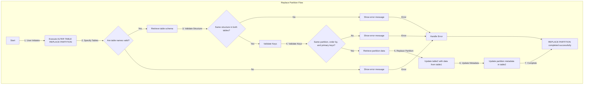

# SRS032 ClickHouse Alter Table Replace Partition

# Software Requirements Specification

## Table of Contents

* 1 [Revision History](#revision-history)
* 2 [Introduction](#introduction)
* 3 [Flowchart](#flowchart)
* 4 [User Actions](#user-actions)
  * 4.1 [RQ.SRS-032.ClickHouse.Alter.Table.ReplacePartition](#rqsrs-032clickhousealtertablereplacepartition)
      * 4.1.0.1 [RQ.SRS-032.ClickHouse.Alter.Table.ReplacePartition.KeepData](#rqsrs-032clickhousealtertablereplacepartitionkeepdata)
      * 4.1.0.2 [RQ.SRS-032.ClickHouse.Alter.Table.ReplacePartition.TemporaryTable](#rqsrs-032clickhousealtertablereplacepartitiontemporarytable)
      * 4.1.0.3 [RQ.SRS-032.ClickHouse.Alter.Table.ReplacePartition.Conditions](#rqsrs-032clickhousealtertablereplacepartitionconditions)
        * 4.1.0.3.1 [RQ.SRS-032.ClickHouse.Alter.Table.ReplacePartition.Conditions.Different.Structure](#rqsrs-032clickhousealtertablereplacepartitionconditionsdifferentstructure)
        * 4.1.0.3.2 [RQ.SRS-032.ClickHouse.Alter.Table.ReplacePartition.Conditions.Different.Key](#rqsrs-032clickhousealtertablereplacepartitionconditionsdifferentkey)
        * 4.1.0.3.3 [RQ.SRS-032.ClickHouse.Alter.Table.ReplacePartition.Conditions.Different.StoragePolicy](#rqsrs-032clickhousealtertablereplacepartitionconditionsdifferentstoragepolicy)
  * 4.2 [Table Engines](#table-engines)
    * 4.2.1 [MergeTree](#mergetree)
      * 4.2.1.1 [RQ.SRS-032.ClickHouse.Alter.Table.ReplacePartition.ZooKeeper.TableEngines.MergeTree](#rqsrs-032clickhousealtertablereplacepartitionzookeepertableenginesmergetree)
      * 4.2.1.2 [RQ.SRS-032.ClickHouse.Alter.Table.ReplacePartition.ZooKeeper.TableEngines.ReplicatedMergeTree](#rqsrs-032clickhousealtertablereplacepartitionzookeepertableenginesreplicatedmergetree)
      * 4.2.1.3 [RQ.SRS-032.ClickHouse.Alter.Table.ReplacePartition.ZooKeeper.TableEngines.ReplacingMergeTree](#rqsrs-032clickhousealtertablereplacepartitionzookeepertableenginesreplacingmergetree)
      * 4.2.1.4 [RQ.SRS-032.ClickHouse.Alter.Table.ReplacePartition.ZooKeeper.TableEngines.AggregatingMergeTree](#rqsrs-032clickhousealtertablereplacepartitionzookeepertableenginesaggregatingmergetree)
      * 4.2.1.5 [RQ.SRS-032.ClickHouse.Alter.Table.ReplacePartition.ZooKeeper.TableEngines.CollapsingMergeTree](#rqsrs-032clickhousealtertablereplacepartitionzookeepertableenginescollapsingmergetree)
      * 4.2.1.6 [RQ.SRS-032.ClickHouse.Alter.Table.ReplacePartition.ZooKeeper.TableEngines.VersionedCollapsingMergeTree](#rqsrs-032clickhousealtertablereplacepartitionzookeepertableenginesversionedcollapsingmergetree)
      * 4.2.1.7 [RQ.SRS-032.ClickHouse.Alter.Table.ReplacePartition.ZooKeeper.TableEngines.GraphiteMergeTree](#rqsrs-032clickhousealtertablereplacepartitionzookeepertableenginesgraphitemergetree)
    * 4.2.2 [DistributedTable](#distributedtable)
      * 4.2.2.1 [RQ.SRS-032.ClickHouse.Alter.Table.ReplacePartition.ZooKeeper.TableEngines.DistributedTable](#rqsrs-032clickhousealtertablereplacepartitionzookeepertableenginesdistributedtable)
    * 4.2.3 [MaterializedView](#materializedview)
      * 4.2.3.1 [RQ.SRS-032.ClickHouse.Alter.Table.ReplacePartition.ZooKeeper.TableEngines.MaterializedView](#rqsrs-032clickhousealtertablereplacepartitionzookeepertableenginesmaterializedview)
  * 4.3 [Concurrent Actions](#concurrent-actions)
    * 4.3.1 [RQ.SRS-032.ClickHouse.Alter.Table.ReplacePartition.Concurrent](#rqsrs-032clickhousealtertablereplacepartitionconcurrent)
    * 4.3.2 [RQ.SRS-032.ClickHouse.Alter.Table.ReplacePartition.MergesAndMutations](#rqsrs-032clickhousealtertablereplacepartitionmergesandmutations)

## Revision History

This document is stored in an electronic form using [Git] source control management software
hosted in a [GitHub Repository].
All the updates are tracked using the [Revision History].

## Introduction

This software requirements specification covers requirements for `ALTER TABLE` statement in [ClickHouse].

The documentation used:

- https://clickhouse.com/docs/en/sql-reference/statements/alter/partition#replace-partition

## Flowchart



## User Actions


| **Action**                     | **Description**                                                                                                              |
|--------------------------------|------------------------------------------------------------------------------------------------------------------------------|
| `DETACH PARTITION/PART`        | `ALTER TABLE table_name [ON CLUSTER cluster] DETACH PARTITION/PART partition_expr`                                           |
| `DROP PARTITION/PART`          | `ALTER TABLE table_name [ON CLUSTER cluster] DROP PARTITION/PART partition_expr`                                             |                                          >
| `DROP DETACHED PARTITION/PART` | `ALTER TABLE table_name [ON CLUSTER cluster] DROP DETACHED PARTITION/PART partition_expr`                                    |
| `ATTACH PARTITION/PART`        | `ALTER TABLE table_name [ON CLUSTER cluster] ATTACH PARTITION/PART partition_expr`                                           |
| `ATTACH PARTITION FROM`        | `ALTER TABLE table2 [ON CLUSTER cluster] ATTACH PARTITION partition_expr FROM table1`                                        |
| `REPLACE PARTITION`            | `ALTER TABLE table2 [ON CLUSTER cluster] REPLACE PARTITION partition_expr FROM table1`                                       |
| `MOVE PARTITION TO TABLE`      | `ALTER TABLE table_source [ON CLUSTER cluster] MOVE PARTITION partition_expr TO TABLE table_dest`                            |
| `CLEAR COLUMN IN PARTITION`    | `ALTER TABLE table_name [ON CLUSTER cluster] CLEAR COLUMN column_name IN PARTITION partition_expr`                           |
| `FREEZE PARTITION`             | `ALTER TABLE table_name [ON CLUSTER cluster] FREEZE [PARTITION partition_expr] [WITH NAME 'backup_name']`                    |
| `UNFREEZE PARTITION`           | `ALTER TABLE table_name [ON CLUSTER cluster] UNFREEZE [PARTITION 'part_expr'] WITH NAME 'backup_name'`                       |
| `CLEAR INDEX IN PARTITION`     | `ALTER TABLE table_name [ON CLUSTER cluster] CLEAR INDEX index_name IN PARTITION partition_expr`                             |
| `FETCH PARTITION/PART`         | `ALTER TABLE table_name [ON CLUSTER cluster] FETCH PARTITION/PART partition_expr FROM 'path-in-zookeeper'`                   |
| `MOVE PARTITION/PART`          | `ALTER TABLE table_name [ON CLUSTER cluster] MOVE PARTITION/PART partition_expr TO DISK/VOLUME 'disk_name'`                  |
| `UPDATE IN PARTITION`          | `ALTER TABLE [db.]table [ON CLUSTER cluster] UPDATE column1 = expr1 [, ...] [IN PARTITION partition_expr] WHERE filter_expr` |
| `DELETE IN PARTITION`          | `ALTER TABLE [db.]table [ON CLUSTER cluster] DELETE [IN PARTITION partition_expr] WHERE filter_expr`                         |
| `INSERT INTO TABLE`            | ``                                                                                                                           |
| `DELETE FROM`                  | ``                                                                                                                           |
| `ATTACH TABLE`                 | ``                                                                                                                           |
| `DETACH TABLE`                 | ``                                                                                                                           |
| `DROP TABLE`                   | ``                                                                                                                           |
| `KILL QUERY`                   | ``                                                                                                                           |
| `ADD COLUMN`                   | ``                                                                                                                           |
| `DROP COLUMN`                  | ``                                                                                                                           |
| `RENAME COLUMN`                | ``                                                                                                                           |
| `CLEAR COLUMN`                 | ``                                                                                                                           |
| `MODIFY COLUMN`                | ``                                                                                                                           |
| `MODIFY COLUMN REMOVE`         | ``                                                                                                                           |
| `MATERIALIZE COLUMN`           | ``                                                                                                                           |
| `OPTIMIZE PARTITION`           | ``                                                                                                                           |
| `OPTIMIZE FINAL`               | ``                                                                                                                           |
| `OPTIMIZE DEDUPLICATE`         | ``                                                                                                                           |

### RQ.SRS-032.ClickHouse.Alter.Table.ReplacePartition
version: 1.0

[ClickHouse] SHALL support the usage of the `REPLACE PARTITION`.

For example,

This query copies the data partition from the `table1` to `table2` and replaces existing partition in the `table2`.

```sql
ALTER TABLE table2 [ON CLUSTER cluster] REPLACE PARTITION partition_expr FROM table1
```

##### RQ.SRS-032.ClickHouse.Alter.Table.ReplacePartition.KeepData
version: 1.0

[ClickHouse] SHALL keep the data of the table from which the partition is copied from.

##### RQ.SRS-032.ClickHouse.Alter.Table.ReplacePartition.TemporaryTable
version: 1.0

[ClickHouse] SHALL support copying the data partition from the temporary table.

For example,

A table that disappears when the session ends, including if the connection is lost, is considered a temporary table. To create such a table the following query can be run.

```sql
CREATE TEMPORARY TABLE [IF NOT EXISTS] table_name
(
    name1 [type1] [DEFAULT|MATERIALIZED|ALIAS expr1],
    name2 [type2] [DEFAULT|MATERIALIZED|ALIAS expr2],
    ...
) [ENGINE = engine]
```

##### RQ.SRS-032.ClickHouse.Alter.Table.ReplacePartition.Conditions
version: 1.0

[ClickHouse] SHALL support the usage of `REPLACE PARTITION` between two tables only when,

* Both tables have the same structure.
* Both tables have the same partition key, the same `ORDER BY` key, and the same primary key.
* Both tables have the same storage policy.

###### RQ.SRS-032.ClickHouse.Alter.Table.ReplacePartition.Conditions.Different.Structure
version: 1.0

[ClickHouse] SHALL not support the usage of `REPLACE PARTITION` between two tables when tables have different structure.

###### RQ.SRS-032.ClickHouse.Alter.Table.ReplacePartition.Conditions.Different.Key
version: 1.0

[ClickHouse] SHALL not support the usage of `REPLACE PARTITION` between two tables when tables have different partition
key, `ORDER BY` key and primary key.

###### RQ.SRS-032.ClickHouse.Alter.Table.ReplacePartition.Conditions.Different.StoragePolicy
version: 1.0

[ClickHouse] SHALL not support the usage of `REPLACE PARTITION` between two tables when tables have different storage
policy.

### Table Engines

#### MergeTree

##### RQ.SRS-032.ClickHouse.Alter.Table.ReplacePartition.ZooKeeper.TableEngines.MergeTree
version: 1.0

[ClickHouse] SHALL support the usage of the `REPLACE PARTITION` on the table with `MergeTree` engine.

##### RQ.SRS-032.ClickHouse.Alter.Table.ReplacePartition.ZooKeeper.TableEngines.ReplicatedMergeTree
version: 1.0

[ClickHouse] SHALL support the usage of the `REPLACE PARTITION` on the table with `ReplicatedMergeTree` engine.

##### RQ.SRS-032.ClickHouse.Alter.Table.ReplacePartition.ZooKeeper.TableEngines.ReplacingMergeTree
version: 1.0

[ClickHouse] SHALL support the usage of the `REPLACE PARTITION` on the table with `ReplacingMergeTree` engine.

##### RQ.SRS-032.ClickHouse.Alter.Table.ReplacePartition.ZooKeeper.TableEngines.AggregatingMergeTree
version: 1.0

[ClickHouse] SHALL support the usage of the `REPLACE PARTITION` on the table with `AggregatingMergeTree` engine.

##### RQ.SRS-032.ClickHouse.Alter.Table.ReplacePartition.ZooKeeper.TableEngines.CollapsingMergeTree
version: 1.0

[ClickHouse] SHALL support the usage of the `REPLACE PARTITION` on the table with `CollapsingMergeTree` engine.

##### RQ.SRS-032.ClickHouse.Alter.Table.ReplacePartition.ZooKeeper.TableEngines.VersionedCollapsingMergeTree
version: 1.0

[ClickHouse] SHALL support the usage of the `REPLACE PARTITION` on the table with `VersionedCollapsingMergeTree` engine.

##### RQ.SRS-032.ClickHouse.Alter.Table.ReplacePartition.ZooKeeper.TableEngines.GraphiteMergeTree
version: 1.0

[ClickHouse] SHALL support the usage of the `REPLACE PARTITION` on the table with `GraphiteMergeTree` engine.

#### DistributedTable

##### RQ.SRS-032.ClickHouse.Alter.Table.ReplacePartition.ZooKeeper.TableEngines.DistributedTable
version: 1.0

[ClickHouse] SHALL support the usage of the `REPLACE PARTITION` on the table with `DistributedTable` engine.

#### MaterializedView

##### RQ.SRS-032.ClickHouse.Alter.Table.ReplacePartition.ZooKeeper.TableEngines.MaterializedView
version: 1.0

[ClickHouse] SHALL support the usage of the `REPLACE PARTITION` on the table with `MaterializedView` engine.

### Concurrent Actions

#### RQ.SRS-032.ClickHouse.Alter.Table.ReplacePartition.Concurrent
version: 1.0

[ClickHouse] SHALL support concurrent merges/mutations that happen on the same partition at the same time.


#### RQ.SRS-032.ClickHouse.Alter.Table.ReplacePartition.MergesAndMutations
version: 1.0

[ClickHouse] SHALL cancel only for mutations/merges that are scheduled/already operating on target partition. 
And wait ONLY for those cancelled merges/mutations (on target partition) to wrap up.


[ClickHouse]: https://clickhouse.com

[GitHub Repository]: https://github.com/Altinity/clickhouse-regression/blob/main/alter/requirements/requirements.md

[Revision History]: https://github.com/Altinity/clickhouse-regression/commits/main/alter/requirements/requirements.md

[Git]: https://git-scm.com/

[GitHub]: https://github.com
