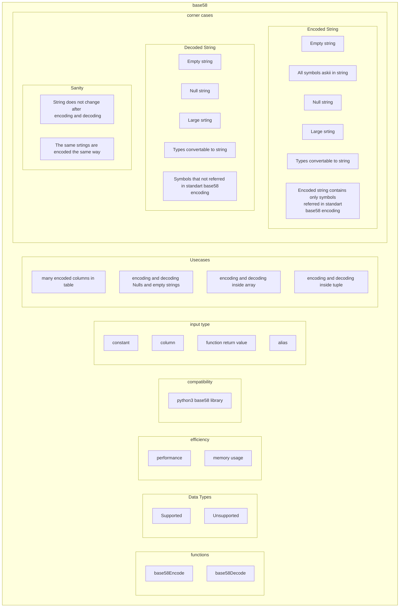

# ClickHouse Base58 Encoding and Decoding
# Software Requirements Specification

## Table of Contents

* 1 [Introduction](#introduction)
* 2 [Test Feature Diagram](#test-feature-diagram)
* 3 [Requirements](#requirements)
  * 3.1 [Encode](#encode)
    * 3.1.1 [RQ.ClickHouse.Base58.Encode](#rqclickhousebase58encode)
    * 3.1.2 [RQ.ClickHouse.Base58.Encode.SupportedDataTypes](#rqclickhousebase58encodesupporteddatatypes)
    * 3.1.3 [RQ.ClickHouse.Base58.Encode.UnsupportedDataTypes](#rqclickhousebase58encodeunsupporteddatatypes)
  * 3.2 [Decode](#decode)
    * 3.2.1 [RQ.ClickHouse.Base58.Decode](#rqclickhousebase58decode)
    * 3.2.2 [RQ.ClickHouse.Base58.Decode.SupportedDataTypes](#rqclickhousebase58decodesupporteddatatypes)
    * 3.2.3 [RQ.ClickHouse.Base58.Decode.UnsupportedDataTypes](#rqclickhousebase58decodeunsupporteddatatypes)
  * 3.3 [Consistency](#consistency)
    * 3.3.1 [RQ.ClickHouse.Base58.Consistency.EncodeDecode](#rqclickhousebase58consistencyencodedecode)
  * 3.4 [Compatibility](#compatibility)
    * 3.4.1 [RQ.ClickHouse.Base58.Compatibility](#rqclickhousebase58compatibility)
  * 3.5 [Performance](#performance)
    * 3.5.1 [RQ.ClickHouse.Base58.Performance.Base58vsBase64](#rqclickhousebase58performancebase58vsbase64)
  * 3.6 [Memory usage](#memory-usage)
    * 3.6.1 [RQ.ClickHouse.Base58.MemoryUsage.Base58vsBase64](#rqclickhousebase58memoryusagebase58vsbase64)

## Introduction

This software requirements specification covers requirements related to [ClickHouse].
[Base58] encoding and decoding functionality using `base58Encode` and `base58Decode` functions.

## Test Feature Diagram




## Requirements

### Encode

#### RQ.ClickHouse.Base58.Encode
version: 1.0

[ClickHouse] SHALL support `base58Encode` function that SHALL have the following syntax:


```sql
base58Encode(<column_name>|<constant>|<function_return_value>|<alias>)
```

For example, 

> Insert into the table encoded strings from another table

```sql
INSERT INTO table_base58 SELECT base58Encode(x) FROM table;
```

The function SHALL return an encoded `String` that SHALL contain only symbols referred in standard `Base58` encoding.

[Base58] alphabet contains only symbols: `123456789ABCDEFGHJKLMNPQRSTUVWXYZabcdefghijkmnopqrstuvwxyz`

#### RQ.ClickHouse.Base58.Encode.SupportedDataTypes
version: 1.0

[ClickHouse] SHALL support using `base58Encode` function for the following data types that SHALL either
be provided as a constant or using a table column:

* `String`
* `FixedString`
* `Nullable(String)`


#### RQ.ClickHouse.Base58.Encode.UnsupportedDataTypes
version: 1.0

[ClickHouse]'s `base58Encode` function SHALL return an error if input data type is not supported.

### Decode

#### RQ.ClickHouse.Base58.Decode
version: 1.0

[ClickHouse] SHALL support `base58Decode` function that SHALL have the following syntax:

```sql
base58Decode(<column_name>|<constant>|<function_return_value>|<alias>)
```

For example:

> Select from table with encoded column

```sql
SELECT base58Decode(x) FROM table_base58
```

The function SHALL return a decoded `String` if valid `Base58` encoded input is provided.

#### RQ.ClickHouse.Base58.Decode.SupportedDataTypes
version: 1.0

[ClickHouse] SHALL support using `base58Decode` function with valid Base58 encoded input having the following data types that SHALL either
be provided as a constant or using a table column:

* `String`
* `FixedString`
* `Nullable(String)`

#### RQ.ClickHouse.Base58.Decode.UnsupportedDataTypes
version: 1.0

[ClickHouse]'s `base58Decode` function SHALL return an error if input data type is not supported.

### Consistency

#### RQ.ClickHouse.Base58.Consistency.EncodeDecode
version: 1.0

[ClickHouse] SHALL return the same string after being encoded with `base58Encode` function and
decoded with `base58Decode` function.

### Compatibility

#### RQ.ClickHouse.Base58.Compatibility
version: 1.0

[ClickHouse]'s Base58 functions SHALL be compatible with other implementations, such as:

* Python3 base58 library

### Performance

#### RQ.ClickHouse.Base58.Performance.Base58vsBase64
version: 1.0

[ClickHouse] SHALL have similar performance between functions:

* `base58Encode` and `base64Encode` 
* `base58Decode` and `base64Decode`

### Memory usage

#### RQ.ClickHouse.Base58.MemoryUsage.Base58vsBase64
version: 1.0

[ClickHouse] SHALL have similar memory usage between functions:

* `base58Encode` and `base64Encode`
* `base58Decode` and `base64Decode`


[Base58]: https://en.bitcoinwiki.org/wiki/Base58
[ClickHouse]: https://clickhouse.tech
