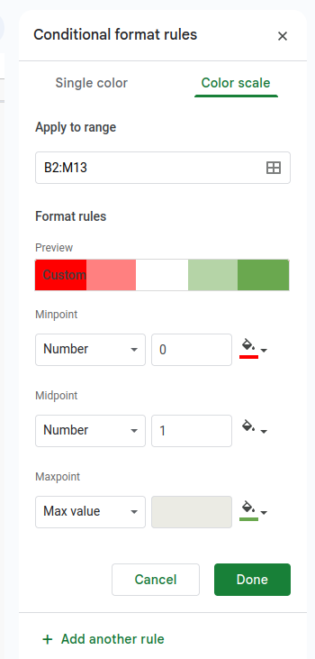
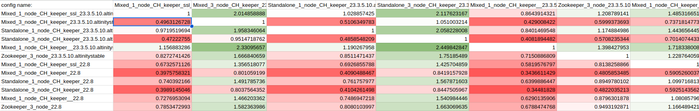

## ClickHouse Keeper/Zookeeper Performance Test Program

Performance tests can be launched with `./perfomance.py` command. It will start performance tests of all [available coordination cluster]
configurations for local ClickHouse binary (path to ClickHouse binary, default: /usr/bin/clickhouse). 

The performance test scenario is based on inserting into a `bad` table (every row generates coordination cluster
transaction). It collects insert times and returns the `min` value. After that, it provides a `bench_*.csv` file
with ratio values of all `min` values for all coordination cluster configurations.

Table schema:

```commandline
CREATE TABLE IF NOT EXISTS {table_name} on CLUSTER {cluster_name} (p UInt64, x UInt64)
ENGINE = ReplicatedSummingMergeTree('/clickhouse/tables/replicated/{shard}/{table_name}', '{replica}')
ORDER BY tuple() 
PARTITION BY p 
SETTINGS 
 in_memory_parts_enable_wal=0,
 min_bytes_for_wide_part=104857600, 
 min_bytes_for_wide_part=104857600, 
 parts_to_delay_insert=1000000, 
 parts_to_throw_insert=1000000, 
 max_parts_in_total=1000000;
```

Insert query:

```commandline
INSERT INTO {table_name} SELECT rand(1)%100, rand(2) FROM numbers({number_of_inserts}) 
SETTINGS max_block_size=100, min_insert_block_size_bytes=1, min_insert_block_size_rows=1, 
insert_deduplicate=0, max_threads=128,max_insert_threads=128;
```

The program is based on [TestFlows](https://testflows.com/) framework. So `perfomance.py` can use all its
[possibilities](https://testflows.com/handbook/) (except `--clickhouse-binary-path`)

Most usefully are:

* `--test-to-end` to force the test program to continue running if any of the tests fail
* `-o classic` to hide additional logs information
* `--only "/coordination cluster/performance keeper/{available_coordination_cluster_configurations}/*"` to test only one of 
[available coordination cluster] configurations


Special `perfomance.py` settings are:

* `--clickhouse-binary-list` to test some special ClickHouse versions
* `--repeats` number of insert test repeats for `mean` value calculation (default: 5)
* `--inserts` number of inserts into table on one repeat (default: 10000)


As output, you will receive a `bench_*.csv` file with a unique name for every run where numeric cell values are ratios 
between the min values of insert times for column and row coordination cluster configurations.

The result file can be imported to `Google Sheets`, where `Format-->Conditional formatting-->Color scale` can be applied 
to all numeric cells to receive more readable output.

Color scale setting example:



Final output example:



### Examples

1) The `--clickhouse-binary-list` setting can be applied to test some special ClickHouse versions, as in the example below.

Example to test all [available coordination cluster] with `23.3.5.10.altinitytest` ClickHouse version:
```commandline
./perfomance.py --clickhouse-binary-list=docker://altinity/clickhouse-server:23.3.5.10.altinitytest --test-to-end -o classic
```

To test more than one version of ClickHouse just add new `--clickhouse-binary-list`:

Example to test all [available coordination cluster] with `23.3.5.10.altinitytest` and vanilla `22.8` ClickHouse versions:

```commandline
./perfomance.py --clickhouse-binary-list=docker://altinity/clickhouse-server:23.3.5.10.altinitytest --clickhouse-binary-list=docker://clickhouse/clickhouse-server:22.8 --test-to-end -o classic
```

2) To test the only one coordination cluster configuration you can add `--only` setting

Example to test Clickhouse Keeper `mixed one node` coordination cluster configuration for vanilla `22.8` ClickHouse version:

```commandline
./perfomance.py --only "/coordination cluster/performance keeper/mixed one node/*" --clickhouse-binary-list=docker://clickhouse/clickhouse-server:22.8 --test-to-end -o classic
```

Available options for `--only`:

* `"/coordination cluster/performance keeper/mixed one node/*"`
* `"/coordination cluster/performance keeper/mixed three node/*"`
* `"/coordination cluster/performance keeper/standalone one node/*"`
* `"/coordination cluster/performance keeper/standalone three node/*"`
* `"/coordination cluster//performance zookeeper/one node/*"`
* `"/coordination cluster//performance zookeeper/three node/*"`


# Available Coordination Clusters

Available coordination cluster configurations:

* ClickHouse Keeper
  * mixed one node (ssl/ non-ssl)
  * mixed three node (ssl/ non-ssl)
  * standalone one node (ssl/ non-ssl)
  * standalone three node (ssl/ non-ssl)
* ZooKeeper
  * one node (non-ssl)
  * three node (non-ssl)

[available coordination cluster]: #available-coordination-clusters