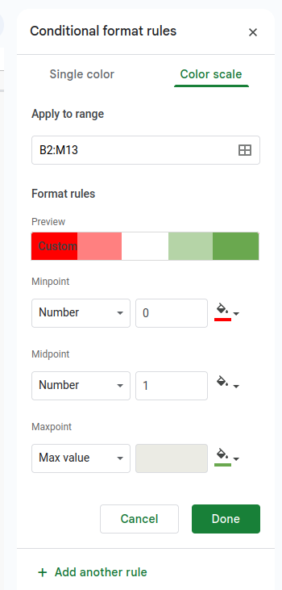
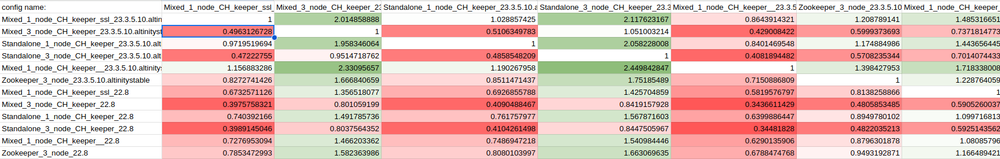

## ClickhHouse Keeper/Zookeeper performance test program

Bench tests can be launched with `./perfomance.py` command. After that performance of all available control cluster 
configurations will be tested for local ClickHouse binary. 

The bench test scenario is based on inserting into a `bad` table (every row generates ZK transaction). It collects 
insert times and calculates the `mean` value. After that, it provides a `bench_*.csv` file with ratio values of all 
`mean` values for all control cluster configurations.

Table schema:

```commandline
CREATE TABLE IF NOT EXISTS {table_name} on CLUSTER {cluster_name} (p UInt64, x UInt64)
ENGINE = ReplicatedSummingMergeTree('/clickhouse/tables/replicated/{shard}/zookeeper_bench', '{replica}')
ORDER BY tuple() 
PARTITION BY p 
SETTINGS 
 in_memory_parts_enable_wal=0,
 min_bytes_for_wide_part=104857600, 
 min_bytes_for_wide_part=104857600, 
 parts_to_delay_insert=1000000, 
 parts_to_throw_insert=1000000, 
 max_parts_in_total=1000000;
```

Insert query:

```commandline
INSERT INTO zookeeper_bench SELECT rand(1)%100, rand(2) FROM numbers({number_of_inserts}) 
SETTINGS max_block_size=100, min_insert_block_size_bytes=1, min_insert_block_size_rows=1, 
insert_deduplicate=0, max_threads=128,max_insert_threads=128;
```

Available control cluster configurations:

* mixed 1 node (ssl/ non-ssl)
* mixed 3 node (ssl/ non-ssl)
* standalone 1 node (ssl/ non-ssl)
* standalone 3 node (ssl/ non-ssl)
* zookeeper 3 node (non-ssl)


The `--clickhouse-binary-list` setting can be applied to test some special ClickHouse versions, as in the example below.

Example:
```commandline
./perfomance.py --clickhouse-binary-list=docker://altinity/clickhouse-server:23.3.5.10.altinitytest --clickhouse-binary-list=docker://clickhouse/clickhouse-server:22.8 --test-to-end -o classic
```

The program is based on [TestFlows](https://testflows.com/) framework. So `perfomance.py` can use all its
[possibilities](https://testflows.com/handbook/) (except `--clickhouse-binary-path`)

Most usefully are:

* `--test-to-end` to force the test program to continue running if any of the tests fail
* `-o classic` to hide additional logs information
* `--only "/benchmark clickhouse keeper/bench/{available_control_cluster_configurations}/*"` to test only one of available control cluster configurations

Example:

```commandline
./perfomance.py --only "/benchmark clickhouse keeper/bench/standalone 1 node/*" --clickhouse-binary-list=docker://clickhouse/clickhouse-server:22.8 --test-to-end -o classic

```

Special `perfomance.py` settings are:

* `--clickhouse-binary-list` to test some special ClickHouse versions
* `--repeats` number of insert test repeats for `mean` value calculation (default: 5)
* `--inserts` number of inserts into table on one repeat (default: 10000)


As output, you will receive a `bench_*.csv` file with a unique name for every run where numeric cell values are ratios 
between the mean values of insert times for column and row control cluster configurations.

The result file can be imported to Google Docks, where `Format-->Conditional formatting-->Color scale` can be applied 
to all numeric cells to receive more readable output.

Color scale setting example:



Final output example:



