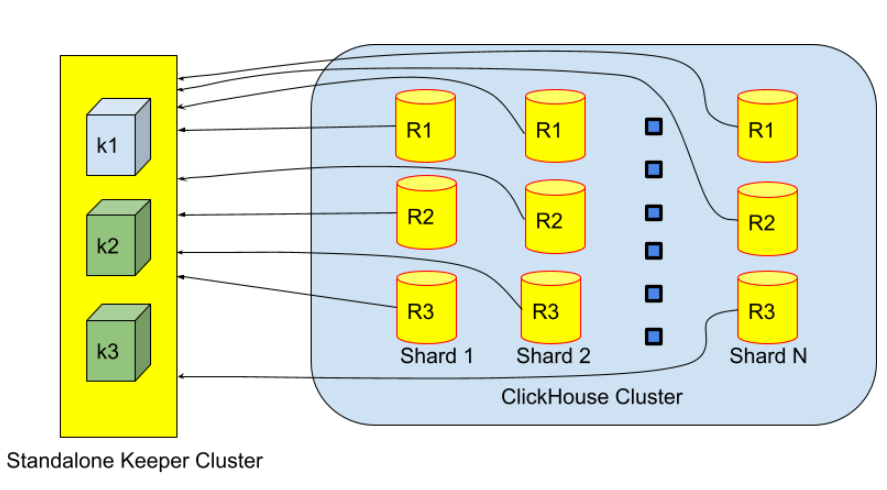
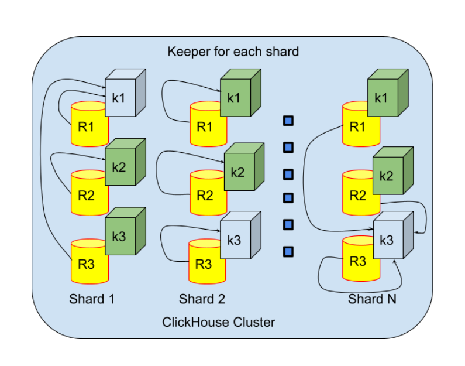
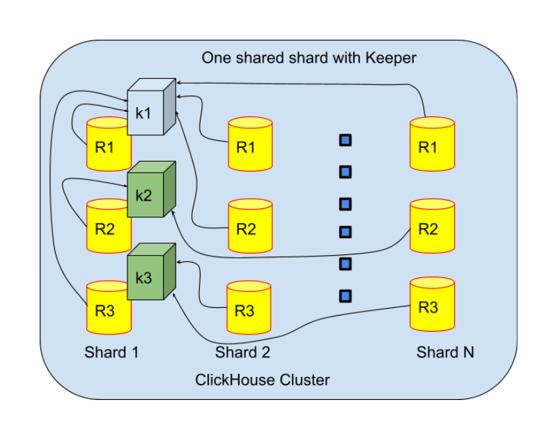
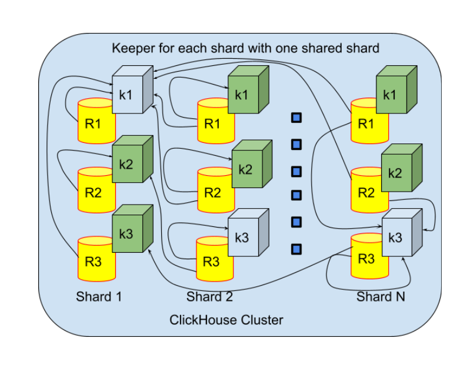
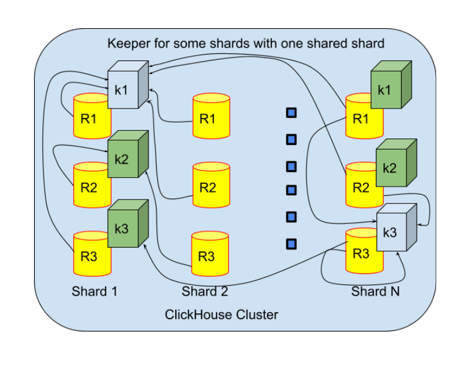

# SRS024 ClickHouse Keeper
# Software Requirements Specification

## Table of Contents

* 1 [Introduction](#introduction)
* 2 [Terminology](#terminology)
  * 2.1 [Snapshot](#snapshot)
  * 2.2 [Cluster](#cluster)
  * 2.3 [Replica Node](#replica-node)
  * 2.4 [Shard Node](#shard-node)
  * 2.5 [Distributed DDL Queries](#distributed-ddl-queries)
  * 2.6 [Non-Distributed DDL Queries](#non-distributed-ddl-queries)
  * 2.7 [Synchronization](#synchronization)
  * 2.8 [Replication](#replication)
  * 2.9 [Quorum](#quorum)
  * 2.10 [All-Or-Nothing Execution](#all-or-nothing-execution)
  * 2.11 [Expected Execution Of Operation](#expected-execution-of-operation)
  * 2.12 [Replicated Table](#replicated-table)
* 3 [Requirements](#requirements)
  * 3.1 [General](#general)
    * 3.1.1 [RQ.SRS-024.ClickHouse.Keeper](#rqsrs-024clickhousekeeper)
  * 3.2 [Configurations](#configurations)
    * 3.2.1 [RQ.SRS-024.ClickHouse.Keeper.Configurations](#rqsrs-024clickhousekeeperconfigurations)
      * 3.2.1.1 [Standalone Keeper Cluster](#standalone-keeper-cluster)
        * 3.2.1.1.1 [RQ.SRS-024.ClickHouse.Keeper.Configurations.StandaloneKeeperCluster](#rqsrs-024clickhousekeeperconfigurationsstandalonekeepercluster)
      * 3.2.1.2 [DifferentKeeperClustersForEachShard](#differentkeeperclustersforeachshard)
        * 3.2.1.2.1 [RQ.SRS-024.ClickHouse.Keeper.Configurations.DifferentKeeperClustersForEachShard](#rqsrs-024clickhousekeeperconfigurationsdifferentkeeperclustersforeachshard)
      * 3.2.1.3 [Keeper On One Shared Shard](#keeper-on-one-shared-shard)
        * 3.2.1.3.1 [RQ.SRS-024.ClickHouse.Keeper.Configurations.KeeperOnOneSharedShard](#rqsrs-024clickhousekeeperconfigurationskeeperononesharedshard)
      * 3.2.1.4 [Different Keeper Clusters For Each Shard With One Shared](#different-keeper-clusters-for-each-shard-with-one-shared)
        * 3.2.1.4.1 [RQ.SRS-024.ClickHouse.Keeper.Configurations.DifferentKeeperClustersForEachShardsWithOneShared](#rqsrs-024clickhousekeeperconfigurationsdifferentkeeperclustersforeachshardswithoneshared)
      * 3.2.1.5 [Different Keeper Clusters For Some Shards With One Shared](#different-keeper-clusters-for-some-shards-with-one-shared)
        * 3.2.1.5.1 [RQ.SRS-024.ClickHouse.Keeper.Configurations.DifferentKeeperClustersForsomeShardsWithOneShared](#rqsrs-024clickhousekeeperconfigurationsdifferentkeeperclustersforsomeshardswithoneshared)
  * 3.3 [Invalid Keeper Cluster Configuration](#invalid-keeper-cluster-configuration)
    * 3.3.1 [RQ.SRS-024.ClickHouse.Keeper.InvalidKeeperClusterConfigurations](#rqsrs-024clickhousekeeperinvalidkeeperclusterconfigurations)
  * 3.4 [Invalid ClickHouse Cluster Configuration](#invalid-clickhouse-cluster-configuration)
    * 3.4.1 [RQ.SRS-024.ClickHouse.Keeper.InvalidClickHouseClusterConfigurations](#rqsrs-024clickhousekeeperinvalidclickhouseclusterconfigurations)
  * 3.5 [Invalid ClickHouse Cluster Configuration with Shared Keeper](#invalid-clickhouse-cluster-configuration-with-shared-keeper)
    * 3.5.1 [RQ.SRS-024.ClickHouse.Keeper.InvalidClickHouseClusterConfigurationWithSharedKeeper](#rqsrs-024clickhousekeeperinvalidclickhouseclusterconfigurationwithsharedkeeper)
  * 3.6 [ClickHouse Cluster Config File Parameters](#clickhouse-cluster-config-file-parameters)
    * 3.6.1 [RQ.SRS-024.ClickHouse.Keeper.ClickHouseClusterConfigFileParameters](#rqsrs-024clickhousekeeperclickhouseclusterconfigfileparameters)
    * 3.6.2 [internal_replication](#internal_replication)
      * 3.6.2.1 [RQ.SRS-024.ClickHouse.Keeper.ClickHouseClusterConfigFileParameters.InternalReplication](#rqsrs-024clickhousekeeperclickhouseclusterconfigfileparametersinternalreplication)
    * 3.6.3 [weight](#weight)
      * 3.6.3.1 [RQ.SRS-024.ClickHouse.Keeper.ClickHouseClusterConfigFileParameters.Weight](#rqsrs-024clickhousekeeperclickhouseclusterconfigfileparametersweight)
    * 3.6.4 [replica priority](#replica-priority)
      * 3.6.4.1 [RQ.SRS-024.ClickHouse.Keeper.ClickHouseClusterConfigFileParameters.Priority](#rqsrs-024clickhousekeeperclickhouseclusterconfigfileparameterspriority)
  * 3.7 [Replicated And DDL System Settings](#replicated-and-ddl-system-settings)
    * 3.7.1 [DDL System Settings](#ddl-system-settings)
      * 3.7.1.1 [RQ.SRS-024.ClickHouse.Keeper.DDLSystemSettings](#rqsrs-024clickhousekeeperddlsystemsettings)
    * 3.7.2 [Replication System Settings](#replication-system-settings)
      * 3.7.2.1 [RQ.SRS-024.ClickHouse.Keeper.ReplicationSystemSettings](#rqsrs-024clickhousekeeperreplicationsystemsettings)
  * 3.8 [Performance](#performance)
    * 3.8.1 [Insert Queries](#insert-queries)
    * 3.8.2 [RQ.SRS-024.ClickHouse.Keeper.Performance.Insert](#rqsrs-024clickhousekeeperperformanceinsert)
  * 3.9 [Data Replication](#data-replication)
    * 3.9.1 [RQ.SRS-024.ClickHouse.Keeper.Replication](#rqsrs-024clickhousekeeperreplication)
    * 3.9.2 [RQ.SRS-024.ClickHouse.Keeper.Replication.IndependentOnEachShard](#rqsrs-024clickhousekeeperreplicationindependentoneachshard)
  * 3.10 [Mixed Tables](#mixed-tables)
    * 3.10.1 [RQ.SRS-024.ClickHouse.Keeper.ReplicatedAndNonReplicated](#rqsrs-024clickhousekeeperreplicatedandnonreplicated)
  * 3.11 [Replica's Meta Information](#replicas-meta-information)
    * 3.11.1 [RQ.SRS-024.ClickHouse.Keeper.ReplicasMetaInformation](#rqsrs-024clickhousekeeperreplicasmetainformation)
  * 3.12 [Replica's Meta Information In The Auxiliary Keeper Cluster](#replicas-meta-information-in-the-auxiliary-keeper-cluster)
    * 3.12.1 [RQ.SRS-024.ClickHouse.Keeper.ReplicasMetaInformationAuxiliaryCluster](#rqsrs-024clickhousekeeperreplicasmetainformationauxiliarycluster)
  * 3.13 [Mixed Keeper Clusters](#mixed-keeper-clusters)
    * 3.13.1 [RQ.SRS-024.ClickHouse.Keeper.ClusterForZookeeperAndKeeper](#rqsrs-024clickhousekeeperclusterforzookeeperandkeeper)
  * 3.14 [Different Keeper Clusters](#different-keeper-clusters)
    * 3.14.1 [RQ.SRS-024.ClickHouse.Keeper.DifferentKeeperClusters](#rqsrs-024clickhousekeeperdifferentkeeperclusters)
  * 3.15 [Multiple Auxiliary Keeper Clusters](#multiple-auxiliary-keeper-clusters)
    * 3.15.1 [RQ.SRS-024.ClickHouse.Keeper.MultipleAuxiliaryKeeperClusters](#rqsrs-024clickhousekeepermultipleauxiliarykeeperclusters)
  * 3.16 [Clickhouse Keeper Not Present](#clickhouse-keeper-not-present)
    * 3.16.1 [Read-Only Mode](#read-only-mode)
      * 3.16.1.1 [RQ.SRS-024.ClickHouse.Keeper.NotPresent.ReadOnly](#rqsrs-024clickhousekeepernotpresentreadonly)
    * 3.16.2 [Write-Only Mode](#write-only-mode)
      * 3.16.2.1 [RQ.SRS-024.ClickHouse.Keeper.NotPresent.WriteOnly](#rqsrs-024clickhousekeepernotpresentwriteonly)
    * 3.16.3 [Create Replicated Table With No Keeper Present](#create-replicated-table-with-no-keeper-present)
      * 3.16.3.1 [RQ.SRS-024.ClickHouse.Keeper.NotPresent.CreateTableWithNoKeeper](#rqsrs-024clickhousekeepernotpresentcreatetablewithnokeeper)
    * 3.16.4 [Background Options](#background-options)
      * 3.16.4.1 [RQ.SRS-024.ClickHouse.Keeper.BackgroundOptions](#rqsrs-024clickhousekeeperbackgroundoptions)
    * 3.16.5 [Quantity Of Replicas](#quantity-of-replicas)
      * 3.16.5.1 [RQ.SRS-024.ClickHouse.Keeper.ClickHouseOperation.QuantityOfReplicas](#rqsrs-024clickhousekeeperclickhouseoperationquantityofreplicas)
  * 3.17 [Different Clickhouse Keeper Clusters](#different-clickhouse-keeper-clusters)
    * 3.17.1 [RQ.SRS-024.ClickHouse.Keeper.DifferentClusters](#rqsrs-024clickhousekeeperdifferentclusters)
    * 3.17.2 [New Parts](#new-parts)
      * 3.17.2.1 [RQ.SRS-024.ClickHouse.Keeper.Replication.NewParts](#rqsrs-024clickhousekeeperreplicationnewparts)
    * 3.17.3 [Attached Parts](#attached-parts)
      * 3.17.3.1 [RQ.SRS-024.ClickHouse.Keeper.Replication.AttachedParts](#rqsrs-024clickhousekeeperreplicationattachedparts)
    * 3.17.4 [Merged Parts](#merged-parts)
      * 3.17.4.1 [RQ.SRS-024.ClickHouse.Keeper.Replication.MergedParts](#rqsrs-024clickhousekeeperreplicationmergedparts)
    * 3.17.5 [Altered Parts](#altered-parts)
      * 3.17.5.1 [RQ.SRS-024.ClickHouse.Keeper.Replication.AlteredParts](#rqsrs-024clickhousekeeperreplicationalteredparts)
  * 3.18 [Read Availability](#read-availability)
    * 3.18.1 [RQ.SRS-024.ClickHouse.Keeper.ReadAvailability](#rqsrs-024clickhousekeeperreadavailability)
    * 3.18.2 [RQ.SRS-024.ClickHouse.Keeper.ReadAvailability.WithoutKeeper](#rqsrs-024clickhousekeeperreadavailabilitywithoutkeeper)
  * 3.19 [Write Availability](#write-availability)
    * 3.19.1 [RQ.SRS-024.ClickHouse.Keeper.WriteAvailability](#rqsrs-024clickhousekeeperwriteavailability)
  * 3.20 [ClickHouse Keeper Errors](#clickhouse-keeper-errors)
    * 3.20.1 [Abrupt Loss Of Connection](#abrupt-loss-of-connection)
      * 3.20.1.1 [RQ.SRS-024.ClickHouse.Keeper.KeeperErrors.AbruptLoss](#rqsrs-024clickhousekeeperkeepererrorsabruptloss)
    * 3.20.2 [Unstable Network To Keeper Node](#unstable-network-to-keeper-node)
      * 3.20.2.1 [RQ.SRS-024.ClickHouse.Keeper.KeeperErrors.UnstableConnection](#rqsrs-024clickhousekeeperkeepererrorsunstableconnection)
    * 3.20.3 [No Free Disk Space On Keeper Node](#no-free-disk-space-on-keeper-node)
      * 3.20.3.1 [RQ.SRS-024.ClickHouse.Keeper.KeeperErrors.NoFreeDiskSpaceOnNode](#rqsrs-024clickhousekeeperkeepererrorsnofreediskspaceonnode)
    * 3.20.4 [Misconfiguration After Update](#misconfiguration-after-update)
      * 3.20.4.1 [RQ.SRS-024.ClickHouse.Keeper.KeeperErrors.MisconfigurationAfterUpdate](#rqsrs-024clickhousekeeperkeepererrorsmisconfigurationafterupdate)
    * 3.20.5 [Misconfiguration On Startup](#misconfiguration-on-startup)
      * 3.20.5.1 [RQ.SRS-024.ClickHouse.Keeper.KeeperErrors.MisconfigurationOnStartup](#rqsrs-024clickhousekeeperkeepererrorsmisconfigurationonstartup)
    * 3.20.6 [Corrupted Log File](#corrupted-log-file)
      * 3.20.6.1 [RQ.SRS-024.ClickHouse.Keeper.KeeperErrors.CorruptedLogFile](#rqsrs-024clickhousekeeperkeepererrorscorruptedlogfile)
    * 3.20.7 [Corrupted Snapshot File](#corrupted-snapshot-file)
      * 3.20.7.1 [RQ.SRS-024.ClickHouse.Keeper.KeeperErrors.CorruptedSnapshotFile](#rqsrs-024clickhousekeeperkeepererrorscorruptedsnapshotfile)
    * 3.20.8 [Loss Of Write Or Read Access](#loss-of-write-or-read-access)
      * 3.20.8.1 [RQ.SRS-024.ClickHouse.Keeper.KeeperErrors.LossOfWriteOrReadAccess](#rqsrs-024clickhousekeeperkeepererrorslossofwriteorreadaccess)
  * 3.21 [Recovery After Failures](#recovery-after-failures)
    * 3.21.1 [Keeper Is Unavailable When A Server Starts](#keeper-is-unavailable-when-a-server-starts)
      * 3.21.1.1 [RQ.SRS-024.ClickHouse.Keeper.RecoveryAfterFailures.KeeperIsUnavailableWhenAServerStarts](#rqsrs-024clickhousekeeperrecoveryafterfailureskeeperisunavailablewhenaserverstarts)
    * 3.21.2 [Periodically Attempts To Connect](#periodically-attempts-to-connect)
      * 3.21.2.1 [RQ.SRS-024.ClickHouse.Keeper.RecoveryAfterFailures.PeriodicallyAttemptsToConnect](#rqsrs-024clickhousekeeperrecoveryafterfailuresperiodicallyattemptstoconnect)
    * 3.21.3 [Check Of A Data Set](#check-of-a-data-set)
      * 3.21.3.1 [RQ.SRS-024.ClickHouse.Keeper.RecoveryAfterFailures.CheckOfADataSet](#rqsrs-024clickhousekeeperrecoveryafterfailurescheckofadataset)
    * 3.21.4 [Auto Synch](#auto-synch)
      * 3.21.4.1 [RQ.SRS-024.ClickHouse.Keeper.RecoveryAfterFailures.AutoSynch](#rqsrs-024clickhousekeeperrecoveryafterfailuresautosynch)
    * 3.21.5 [Broken Data Parts](#broken-data-parts)
      * 3.21.5.1 [RQ.SRS-024.ClickHouse.Keeper.RecoveryAfterFailures.BrokenDataParts](#rqsrs-024clickhousekeeperrecoveryafterfailuresbrokendataparts)
    * 3.21.6 [Unrecognized Data Parts](#unrecognized-data-parts)
      * 3.21.6.1 [RQ.SRS-024.ClickHouse.Keeper.RecoveryAfterFailures.UnrecognizedDataParts](#rqsrs-024clickhousekeeperrecoveryafterfailuresunrecognizeddataparts)
    * 3.21.7 [Missing Parts](#missing-parts)
      * 3.21.7.1 [RQ.SRS-024.ClickHouse.Keeper.RecoveryAfterFailures.MissingParts](#rqsrs-024clickhousekeeperrecoveryafterfailuresmissingparts)
    * 3.21.8 [Non Matching Checksum](#non-matching-checksum)
      * 3.21.8.1 [RQ.SRS-024.ClickHouse.Keeper.RecoveryAfterFailures.NonMatchingChecksum](#rqsrs-024clickhousekeeperrecoveryafterfailuresnonmatchingchecksum)
    * 3.21.9 [Too Much Differs In Data](#too-much-differs-in-data)
      * 3.21.9.1 [RQ.SRS-024.ClickHouse.Keeper.RecoveryAfterFailures.TooMuchDiffersInData](#rqsrs-024clickhousekeeperrecoveryafterfailurestoomuchdiffersindata)
    * 3.21.10 [Recovery Procedure](#recovery-procedure)
      * 3.21.10.1 [RQ.SRS-024.ClickHouse.Keeper.RecoveryAfterFailures.RecoveryProcedure](#rqsrs-024clickhousekeeperrecoveryafterfailuresrecoveryprocedure)
    * 3.21.11 [Recovery Procedure After Complete Data Loss ](#recovery-procedure-after-complete-data-loss-)
      * 3.21.11.1 [RQ.SRS-024.ClickHouse.Keeper.RecoveryAfterFailures.RecoveryProcedureAfterCompleteDataLoss](#rqsrs-024clickhousekeeperrecoveryafterfailuresrecoveryprocedureaftercompletedataloss)
    * 3.21.12 [Converting from MergeTree to ReplicatedMergeTree ](#converting-from-mergetree-to-replicatedmergetree-)
      * 3.21.12.1 [RQ.SRS-024.ClickHouse.Keeper.RecoveryAfterFailures.ConvertingfromMergeTreetoReplicatedMergeTree](#rqsrs-024clickhousekeeperrecoveryafterfailuresconvertingfrommergetreetoreplicatedmergetree)
    * 3.21.13 [Converting from ReplicatedMergeTree to MergeTree ](#converting-from-replicatedmergetree-to-mergetree-)
      * 3.21.13.1 [RQ.SRS-024.ClickHouse.Keeper.RecoveryAfterFailures.ConvertingfromReplicatedMergeTreetoMergeTree](#rqsrs-024clickhousekeeperrecoveryafterfailuresconvertingfromreplicatedmergetreetomergetree)
    * 3.21.14 [Monitor Data Synchronicity](#monitor-data-synchronicity)
      * 3.21.14.1 [RQ.SRS-024.ClickHouse.Keeper.RecoveryAfterFailures.MonitorDataSynchronicity](#rqsrs-024clickhousekeeperrecoveryafterfailuresmonitordatasynchronicity)
    * 3.21.15 [Recovery When Metadata in the Keeper Cluster Is Lost or Damaged](#recovery-when-metadata-in-the-keeper-cluster-is-lost-or-damaged)
      * 3.21.15.1 [RQ.SRS-024.ClickHouse.Keeper.RecoveryAfterFailures.MetadataInClusterIsLostOrDamaged](#rqsrs-024clickhousekeeperrecoveryafterfailuresmetadatainclusterislostordamaged)
  * 3.22 [Sequential Consistency](#sequential-consistency)
    * 3.22.1 [RQ.SRS-024.ClickHouse.Keeper.SequentialConsistency](#rqsrs-024clickhousekeepersequentialconsistency)
  * 3.23 [Timeliness](#timeliness)
    * 3.23.1 [RQ.SRS-024.ClickHouse.Keeper.Timeliness](#rqsrs-024clickhousekeepertimeliness)
  * 3.24 [Durability](#durability)
    * 3.24.1 [RQ.SRS-024.ClickHouse.Keeper.Durability](#rqsrs-024clickhousekeeperdurability)
  * 3.25 [Cancelebility](#cancelebility)
    * 3.25.1 [RQ.SRS-024.ClickHouse.Keeper.Cancelebility](#rqsrs-024clickhousekeepercancelebility)
  * 3.26 [Cluster Configurations](#cluster-configurations)
    * 3.26.1 [Shared Nodes](#shared-nodes)
      * 3.26.1.1 [RQ.SRS-024.ClickHouse.Keeper.ClusterConfigurations.OnlySharedNodes](#rqsrs-024clickhousekeeperclusterconfigurationsonlysharednodes)
    * 3.26.2 [Dedicated Nodes](#dedicated-nodes)
      * 3.26.2.1 [RQ.SRS-024.ClickHouse.Keeper.ClusterConfigurations.OnlyDedicatedNodes](#rqsrs-024clickhousekeeperclusterconfigurationsonlydedicatednodes)
    * 3.26.3 [Mixed](#mixed)
      * 3.26.3.1 [RQ.SRS-024.ClickHouse.Keeper.ClusterConfigurations.Mixed](#rqsrs-024clickhousekeeperclusterconfigurationsmixed)
  * 3.27 [ClickHouse Operation](#clickhouse-operation)
    * 3.27.1 [Insert And Alter Queries](#insert-and-alter-queries)
      * 3.27.1.1 [RQ.SRS-024.ClickHouse.Keeper.ClickHouseOperation.Insert](#rqsrs-024clickhousekeeperclickhouseoperationinsert)
    * 3.27.2 [Insert Confirmation](#insert-confirmation)
      * 3.27.2.1 [RQ.SRS-024.ClickHouse.Keeper.ClickHouseOperation.InsertConfirmation](#rqsrs-024clickhousekeeperclickhouseoperationinsertconfirmation)
    * 3.27.3 [Insert Confirmation From Multiple Replicas](#insert-confirmation-from-multiple-replicas)
      * 3.27.3.1 [RQ.SRS-024.ClickHouse.Keeper.ClickHouseOperation.InsertConfirmationFromMultipleReplicas](#rqsrs-024clickhousekeeperclickhouseoperationinsertconfirmationfrommultiplereplicas)
    * 3.27.4 [Insert Blocks](#insert-blocks)
      * 3.27.4.1 [RQ.SRS-024.ClickHouse.Keeper.ClickHouseOperation.InsertBlocks](#rqsrs-024clickhousekeeperclickhouseoperationinsertblocks)
    * 3.27.5 [Insert Blocks Deduplicate](#insert-blocks-deduplicate)
      * 3.27.5.1 [RQ.SRS-024.ClickHouse.Keeper.ClickHouseOperation.InsertBlocksDeduplicate](#rqsrs-024clickhousekeeperclickhouseoperationinsertblocksdeduplicate)
    * 3.27.6 [Only The Source Data To Insert](#only-the-source-data-to-insert)
      * 3.27.6.1 [RQ.SRS-024.ClickHouse.Keeper.ClickHouseOperation.OnlyTheSourceDataToInsert](#rqsrs-024clickhousekeeperclickhouseoperationonlythesourcedatatoinsert)
    * 3.27.7 [Data Transformation](#data-transformation)
      * 3.27.7.1 [RQ.SRS-024.ClickHouse.Keeper.ClickHouseOperation.DataTransformation](#rqsrs-024clickhousekeeperclickhouseoperationdatatransformation)
      * 3.27.7.2 [RQ.SRS-024.ClickHouse.Keeper.ClickHouseOperation.Alter](#rqsrs-024clickhousekeeperclickhouseoperationalter)
    * 3.27.8 [Normal Disconnect And Reconnect of Replicas](#normal-disconnect-and-reconnect-of-replicas)
      * 3.27.8.1 [RQ.SRS-024.ClickHouse.Keeper.ClickHouseOperation.NormalDisconnectAndReconnectOfReplicas](#rqsrs-024clickhousekeeperclickhouseoperationnormaldisconnectandreconnectofreplicas)
    * 3.27.9 [Part of Replicas Are Not Available](#part-of-replicas-are-not-available)
      * 3.27.9.1 [RQ.SRS-024.ClickHouse.Keeper.ClickHouseOperation.ReplicasAreNotAvailable](#rqsrs-024clickhousekeeperclickhouseoperationreplicasarenotavailable)
    * 3.27.10 [Abrupt Disconnect of Replicas During Replication Process](#abrupt-disconnect-of-replicas-during-replication-process)
      * 3.27.10.1 [RQ.SRS-024.ClickHouse.Keeper.ClickHouseOperation.AbruptDisconnectOfReplicasDuringReplicationProcess](#rqsrs-024clickhousekeeperclickhouseoperationabruptdisconnectofreplicasduringreplicationprocess)
    * 3.27.11 [Support Adding New Clean Replica](#support-adding-new-clean-replica)
      * 3.27.11.1 [RQ.SRS-024.ClickHouse.Keeper.OperationalErrors.NewCleanReplica](#rqsrs-024clickhousekeeperoperationalerrorsnewcleanreplica)
    * 3.27.12 [Support Adding Replica With Stale Data](#support-adding-replica-with-stale-data)
      * 3.27.12.1 [RQ.SRS-024.ClickHouse.Keeper.OperationalErrors.SupportStaleDataReplica](#rqsrs-024clickhousekeeperoperationalerrorssupportstaledatareplica)
    * 3.27.13 [Support Combination of Normal Disconnect and Adding New Node With No Data](#support-combination-of-normal-disconnect-and-adding-new-node-with-no-data)
      * 3.27.13.1 [RQ.SRS-024.ClickHouse.Keeper.OperationalErrors.SupportNdisconnectAndNewNode](#rqsrs-024clickhousekeeperoperationalerrorssupportndisconnectandnewnode)
    * 3.27.14 [Support Combination of Abrupt Disconnect and Adding New Node With No Data](#support-combination-of-abrupt-disconnect-and-adding-new-node-with-no-data)
      * 3.27.14.1 [RQ.SRS-024.ClickHouse.Keeper.OperationalErrors.SupportAdisconnectAndNewNode](#rqsrs-024clickhousekeeperoperationalerrorssupportadisconnectandnewnode)
    * 3.27.15 [Support Combination of Normal Disconnect and Adding Replica With Stale Data ](#support-combination-of-normal-disconnect-and-adding-replica-with-stale-data-)
      * 3.27.15.1 [RQ.SRS-024.ClickHouse.Keeper.OperationalErrors.SupportNdisconnectAndStaleNode](#rqsrs-024clickhousekeeperoperationalerrorssupportndisconnectandstalenode)
    * 3.27.16 [Support Combination of Abrupt Disconnect and Adding Replica With Stale Data](#support-combination-of-abrupt-disconnect-and-adding-replica-with-stale-data)
      * 3.27.16.1 [RQ.SRS-024.ClickHouse.Keeper.OperationalErrors.SupportAbruptDisconnectAndStaleNode](#rqsrs-024clickhousekeeperoperationalerrorssupportabruptdisconnectandstalenode)
    * 3.27.17 [No Free Disk Space On ClickHouse Node](#no-free-disk-space-on-clickhouse-node)
      * 3.27.17.1 [RQ.SRS-024.ClickHouse.Keeper.OperationalErrors.NoFreeDiskSpaceOnNode](#rqsrs-024clickhousekeeperoperationalerrorsnofreediskspaceonnode)
    * 3.27.18 [Corrupted Data Parts](#corrupted-data-parts)
      * 3.27.18.1 [RQ.SRS-024.ClickHouse.Keeper.OperationalErrors.CorruptedDataPartsOntheDisk](#rqsrs-024clickhousekeeperoperationalerrorscorrupteddatapartsonthedisk)
    * 3.27.19 [Slow Node](#slow-node)
      * 3.27.19.1 [RQ.SRS-024.ClickHouse.Keeper.OperationalErrors.SlowNode](#rqsrs-024clickhousekeeperoperationalerrorsslownode)
    * 3.27.20 [Unstable Network To ClickHouse Node](#unstable-network-to-clickhouse-node)
      * 3.27.20.1 [RQ.SRS-024.ClickHouse.Keeper.OperationalErrors.UnstableNetwork](#rqsrs-024clickhousekeeperoperationalerrorsunstablenetwork)
  * 3.28 [Creating Replicated Tables](#creating-replicated-tables)
    * 3.28.1 [Replicated MergeTree Parameters](#replicated-mergetree-parameters)
      * 3.28.1.1 [RQ.SRS-024.ClickHouse.Keeper.CreatingReplicatedTables.ReplicatedMergeTreeParameters](#rqsrs-024clickhousekeepercreatingreplicatedtablesreplicatedmergetreeparameters)
    * 3.28.2 [Path To The Table In Keeper](#path-to-the-table-in-keeper)
      * 3.28.2.1 [RQ.SRS-024.ClickHouse.Keeper.CreatingReplicatedTables.PathToTheTableInKeeper](#rqsrs-024clickhousekeepercreatingreplicatedtablespathtothetableinkeeper)
    * 3.28.3 [Rename Query And Keeper](#rename-query-and-keeper)
      * 3.28.3.1 [RQ.SRS-024.ClickHouse.Keeper.CreatingReplicatedTables.RenameQueryAndKeeper](#rqsrs-024clickhousekeepercreatingreplicatedtablesrenamequeryandkeeper)
    * 3.28.4 [Unique Replica Names](#unique-replica-names)
      * 3.28.4.1 [RQ.SRS-024.ClickHouse.Keeper.CreatingReplicatedTables.UniqueReplicaNames](#rqsrs-024clickhousekeepercreatingreplicatedtablesuniquereplicanames)
    * 3.28.5 [Explicit Parameters](#explicit-parameters)
      * 3.28.5.1 [RQ.SRS-024.ClickHouse.Keeper.CreatingReplicatedTables.ExplicitParameters](#rqsrs-024clickhousekeepercreatingreplicatedtablesexplicitparameters)
    * 3.28.6 [Default Arguments](#default-arguments)
      * 3.28.6.1 [RQ.SRS-024.ClickHouse.Keeper.CreatingReplicatedTables.DefaultArguments](#rqsrs-024clickhousekeepercreatingreplicatedtablesdefaultarguments)
  * 3.29 [Replicated Database](#replicated-database)
      * 3.29.6.1 [RQ.SRS-024.ClickHouse.Keeper.ReplicatedDatabase](#rqsrs-024clickhousekeeperreplicateddatabase)
    * 3.29.7 [Multiple Replicated Database](#multiple-replicated-database)
      * 3.29.7.1 [RQ.SRS-024.ClickHouse.Keeper.ReplicatedDatabase.Multiple](#rqsrs-024clickhousekeeperreplicateddatabasemultiple)
    * 3.29.8 [Replicated Database Parameters](#replicated-database-parameters)
      * 3.29.8.1 [RQ.SRS-024.ClickHouse.Keeper.ReplicatedDatabase.Parameters](#rqsrs-024clickhousekeeperreplicateddatabaseparameters)
    * 3.29.9 [Unique Replica Names In Shard](#unique-replica-names-in-shard)
      * 3.29.9.1 [RQ.SRS-024.ClickHouse.Keeper.ReplicatedDatabase.UniqueReplicaNamesInShard](#rqsrs-024clickhousekeeperreplicateddatabaseuniquereplicanamesinshard)
    * 3.29.10 [DDL Queries With Replicated Database](#ddl-queries-with-replicated-database)
      * 3.29.10.1 [RQ.SRS-024.ClickHouse.Keeper.ReplicatedDatabase.DDLQueries](#rqsrs-024clickhousekeeperreplicateddatabaseddlqueries)
  * 3.30 [Substitutions](#substitutions)
    * 3.30.1 [RQ.SRS-024.ClickHouse.Keeper.Substitutions](#rqsrs-024clickhousekeepersubstitutions)
  * 3.31 [Non-distributed DDL Query ](#non-distributed-ddl-query-)
    * 3.31.1 [CREATE Replicated Table](#create-replicated-table)
      * 3.31.1.1 [RQ.SRS-024.ClickHouse.Keeper.NonDistributedDDLQuery.CreateReplicatedTable](#rqsrs-024clickhousekeepernondistributedddlquerycreatereplicatedtable)
    * 3.31.2 [DROP Replicated Table](#drop-replicated-table)
      * 3.31.2.1 [RQ.SRS-024.ClickHouse.Keeper.NonDistributedDDLQuery.DropReplicatedTable](#rqsrs-024clickhousekeepernondistributedddlquerydropreplicatedtable)
    * 3.31.3 [RENAME Replicated Table](#rename-replicated-table)
      * 3.31.3.1 [RQ.SRS-024.ClickHouse.Keeper.NonDistributedDDLQuery.RenameReplicatedTable](#rqsrs-024clickhousekeepernondistributedddlqueryrenamereplicatedtable)
    * 3.31.4 [TRUNCATE Replicated Table](#truncate-replicated-table)
      * 3.31.4.1 [RQ.SRS-024.ClickHouse.Keeper.NonDistributedDDLQuery.TruncateReplicatedTable](#rqsrs-024clickhousekeepernondistributedddlquerytruncatereplicatedtable)
  * 3.32 [Distributed DDL Query](#distributed-ddl-query)
    * 3.32.1 [Correctly Run](#correctly-run)
      * 3.32.1.1 [RQ.SRS-024.ClickHouse.Keeper.DistributedDDLQuery.CorrectlyRun](#rqsrs-024clickhousekeeperdistributedddlquerycorrectlyrun)
    * 3.32.2 [Create Queries](#create-queries)
      * 3.32.2.1 [RQ.SRS-024.ClickHouse.Keeper.DistributedDDLQuery.CreateQueries](#rqsrs-024clickhousekeeperdistributedddlquerycreatequeries)
    * 3.32.3 [Alter Queries](#alter-queries)
      * 3.32.3.1 [RQ.SRS-024.ClickHouse.Keeper.DistributedDDLQuery.AlterQueries](#rqsrs-024clickhousekeeperdistributedddlqueryalterqueries)
    * 3.32.4 [Partitions And Parts](#partitions-and-parts)
      * 3.32.4.1 [RQ.SRS-024.ClickHouse.Keeper.DistributedDDLQuery.PartitionsAndParts](#rqsrs-024clickhousekeeperdistributedddlquerypartitionsandparts)
    * 3.32.5 [SYSTEM Queries](#system-queries)
      * 3.32.5.1 [RQ.SRS-024.ClickHouse.Keeper.DistributedDDLQuery.SYSTEM](#rqsrs-024clickhousekeeperdistributedddlquerysystem)
    * 3.32.6 [GRANT Queries](#grant-queries)
      * 3.32.6.1 [RQ.SRS-024.ClickHouse.Keeper.DistributedDDLQuery.GRANT](#rqsrs-024clickhousekeeperdistributedddlquerygrant)
    * 3.32.7 [REVOKE Queries](#revoke-queries)
      * 3.32.7.1 [RQ.SRS-024.ClickHouse.Keeper.DistributedDDLQuery.REVOKE](#rqsrs-024clickhousekeeperdistributedddlqueryrevoke)
    * 3.32.8 [ATTACH Queries](#attach-queries)
      * 3.32.8.1 [RQ.SRS-024.ClickHouse.Keeper.DistributedDDLQuery.ATTACH](#rqsrs-024clickhousekeeperdistributedddlqueryattach)
    * 3.32.9 [DETACH Queries](#detach-queries)
      * 3.32.9.1 [RQ.SRS-024.ClickHouse.Keeper.DistributedDDLQuery.DETACH](#rqsrs-024clickhousekeeperdistributedddlquerydetach)
    * 3.32.10 [DROP Queries](#drop-queries)
      * 3.32.10.1 [RQ.SRS-024.ClickHouse.Keeper.DistributedDDLQuery.DROP](#rqsrs-024clickhousekeeperdistributedddlquerydrop)
    * 3.32.11 [KILL Queries](#kill-queries)
      * 3.32.11.1 [RQ.SRS-024.ClickHouse.Keeper.DistributedDDLQuery.KILL](#rqsrs-024clickhousekeeperdistributedddlquerykill)
    * 3.32.12 [OPTIMIZE Queries](#optimize-queries)
      * 3.32.12.1 [RQ.SRS-024.ClickHouse.Keeper.DistributedDDLQuery.OPTIMIZE](#rqsrs-024clickhousekeeperdistributedddlqueryoptimize)
    * 3.32.13 [RENAME Queries](#rename-queries)
      * 3.32.13.1 [RQ.SRS-024.ClickHouse.Keeper.DistributedDDLQuery.RENAME](#rqsrs-024clickhousekeeperdistributedddlqueryrename)
    * 3.32.14 [TRUNCATE Queries](#truncate-queries)
      * 3.32.14.1 [RQ.SRS-024.ClickHouse.Keeper.DistributedDDLQuery.TRUNCATE](#rqsrs-024clickhousekeeperdistributedddlquerytruncate)
    * 3.32.15 [Concurrent Requests](#concurrent-requests)
      * 3.32.15.1 [RQ.SRS-024.ClickHouse.Keeper.DistributedDDLQuery.ConcurrentRequests](#rqsrs-024clickhousekeeperdistributedddlqueryconcurrentrequests)
  * 3.33 [Command Line Options For `clickhouse-keeper`](#command-line-options-for-clickhouse-keeper)
    * 3.33.1 [Help](#help)
      * 3.33.1.1 [RQ.SRS-024.ClickHouse.Keeper.CommandLineOptions.Help](#rqsrs-024clickhousekeepercommandlineoptionshelp)
    * 3.33.2 [Version](#version)
      * 3.33.2.1 [RQ.SRS-024.ClickHouse.Keeper.CommandLineOptions.Version](#rqsrs-024clickhousekeepercommandlineoptionsversion)
    * 3.33.3 [Config File](#config-file)
      * 3.33.3.1 [RQ.SRS-024.ClickHouse.Keeper.CommandLineOptions.ConfigFile](#rqsrs-024clickhousekeepercommandlineoptionsconfigfile)
    * 3.33.4 [Log File](#log-file)
      * 3.33.4.1 [RQ.SRS-024.ClickHouse.Keeper.CommandLineOptions.LogFile](#rqsrs-024clickhousekeepercommandlineoptionslogfile)
    * 3.33.5 [Error Log File](#error-log-file)
      * 3.33.5.1 [RQ.SRS-024.ClickHouse.Keeper.CommandLineOptions.ErrorLogFile](#rqsrs-024clickhousekeepercommandlineoptionserrorlogfile)
    * 3.33.6 [Read of Pid File](#read-of-pid-file)
      * 3.33.6.1 [RQ.SRS-024.ClickHouse.Keeper.CommandLineOptions.PidFileRead](#rqsrs-024clickhousekeepercommandlineoptionspidfileread)
    * 3.33.7 [Daemon](#daemon)
      * 3.33.7.1 [RQ.SRS-024.ClickHouse.Keeper.CommandLineOptions.Daemon](#rqsrs-024clickhousekeepercommandlineoptionsdaemon)
    * 3.33.8 [No Daemon](#no-daemon)
      * 3.33.8.1 [RQ.SRS-024.ClickHouse.Keeper.CommandLineOptions.NoDaemon](#rqsrs-024clickhousekeepercommandlineoptionsnodaemon)
    * 3.33.9 [Umask](#umask)
      * 3.33.9.1 [RQ.SRS-024.ClickHouse.Keeper.CommandLineOptions.Umask](#rqsrs-024clickhousekeepercommandlineoptionsumask)
    * 3.33.10 [Write of Pid File](#write-of-pid-file)
      * 3.33.10.1 [RQ.SRS-024.ClickHouse.Keeper.CommandLineOptions.PidFileWrite](#rqsrs-024clickhousekeepercommandlineoptionspidfilewrite)
    * 3.33.11 [Additional Positional Arguments](#additional-positional-arguments)
      * 3.33.11.1 [RQ.SRS-024.ClickHouse.Keeper.CommandLineOptions.AdditionalPositionalArguments](#rqsrs-024clickhousekeepercommandlineoptionsadditionalpositionalarguments)
  * 3.34 [Configuration](#configuration)
    * 3.34.1 [RQ.SRS-024.ClickHouse.Keeper.Config](#rqsrs-024clickhousekeeperconfig)
    * 3.34.2 [TCP Port](#tcp-port)
      * 3.34.2.1 [RQ.SRS-024.ClickHouse.Keeper.Config.TCPPort](#rqsrs-024clickhousekeeperconfigtcpport)
      * 3.34.2.2 [RQ.SRS-024.ClickHouse.Keeper.Config.WrongTCPPort](#rqsrs-024clickhousekeeperconfigwrongtcpport)
    * 3.34.3 [TCP Secure Port](#tcp-secure-port)
      * 3.34.3.1 [RQ.SRS-024.ClickHouse.Keeper.Config.TCPPortSecure](#rqsrs-024clickhousekeeperconfigtcpportsecure)
      * 3.34.3.2 [TCP Secure Port Configuration](#tcp-secure-port-configuration)
        * 3.34.3.2.1 [RQ.SRS-024.ClickHouse.Keeper.Config.TCPPortSecure.Configuration](#rqsrs-024clickhousekeeperconfigtcpportsecureconfiguration)
        * 3.34.3.2.2 [RQ.SRS-024.ClickHouse.Keeper.Config.TCPPortSecure.UnsecureServer](#rqsrs-024clickhousekeeperconfigtcpportsecureunsecureserver)
        * 3.34.3.2.3 [RQ.SRS-024.ClickHouse.Keeper.Config.TCPPortSecure.UnsecureKeeper](#rqsrs-024clickhousekeeperconfigtcpportsecureunsecurekeeper)
    * 3.34.4 [Server ID](#server-id)
      * 3.34.4.1 [RQ.SRS-024.ClickHouse.Keeper.Config.ServerID](#rqsrs-024clickhousekeeperconfigserverid)
    * 3.34.5 [Logs Path](#logs-path)
      * 3.34.5.1 [RQ.SRS-024.ClickHouse.Keeper.Config.LogStoragePath](#rqsrs-024clickhousekeeperconfiglogstoragepath)
    * 3.34.6 [Snapshots Path](#snapshots-path)
      * 3.34.6.1 [RQ.SRS-024.ClickHouse.Keeper.Config.SnapshotStoragePath](#rqsrs-024clickhousekeeperconfigsnapshotstoragepath)
    * 3.34.7 [Coordination Settings](#coordination-settings)
      * 3.34.7.1 [operation_timeout_ms](#operation_timeout_ms)
        * 3.34.7.1.1 [RQ.SRS-024.ClickHouse.Keeper.Config.CoordinationSettings.OperationTimeoutMS](#rqsrs-024clickhousekeeperconfigcoordinationsettingsoperationtimeoutms)
      * 3.34.7.2 [session_timeout_ms](#session_timeout_ms)
        * 3.34.7.2.1 [RQ.SRS-024.ClickHouse.Keeper.Config.CoordinationSettings.SessionTimeoutMS](#rqsrs-024clickhousekeeperconfigcoordinationsettingssessiontimeoutms)
      * 3.34.7.3 [dead_session_check_period_ms](#dead_session_check_period_ms)
        * 3.34.7.3.1 [RQ.SRS-024.ClickHouse.Keeper.Config.CoordinationSettings.DeadSessionCheckPeriodMS](#rqsrs-024clickhousekeeperconfigcoordinationsettingsdeadsessioncheckperiodms)
      * 3.34.7.4 [heart_beat_interval_ms](#heart_beat_interval_ms)
        * 3.34.7.4.1 [RQ.SRS-024.ClickHouse.Keeper.Config.CoordinationSettings.HeartBeatIntervalsMS](#rqsrs-024clickhousekeeperconfigcoordinationsettingsheartbeatintervalsms)
      * 3.34.7.5 [election_timeout_lower_bound_ms](#election_timeout_lower_bound_ms)
        * 3.34.7.5.1 [RQ.SRS-024.ClickHouse.Keeper.Config.CoordinationSettings.ElectionTimeoutLowerBoundMS](#rqsrs-024clickhousekeeperconfigcoordinationsettingselectiontimeoutlowerboundms)
      * 3.34.7.6 [election_timeout_upper_bound_ms](#election_timeout_upper_bound_ms)
        * 3.34.7.6.1 [RQ.SRS-024.ClickHouse.Keeper.Config.CoordinationSettings.ElectionTimeoutUpperBoundMS](#rqsrs-024clickhousekeeperconfigcoordinationsettingselectiontimeoutupperboundms)
      * 3.34.7.7 [rotate_log_storage_interval](#rotate_log_storage_interval)
        * 3.34.7.7.1 [RQ.SRS-024.ClickHouse.Keeper.Config.CoordinationSettings.RotateLogStorageInterval](#rqsrs-024clickhousekeeperconfigcoordinationsettingsrotatelogstorageinterval)
      * 3.34.7.8 [reserved_log_items](#reserved_log_items)
        * 3.34.7.8.1 [RQ.SRS-024.ClickHouse.Keeper.Config.CoordinationSettings.ReservedLogItems](#rqsrs-024clickhousekeeperconfigcoordinationsettingsreservedlogitems)
      * 3.34.7.9 [snapshot_distance](#snapshot_distance)
        * 3.34.7.9.1 [RQ.SRS-024.ClickHouse.Keeper.Config.CoordinationSettings.SnapshotDistance](#rqsrs-024clickhousekeeperconfigcoordinationsettingssnapshotdistance)
      * 3.34.7.10 [snapshots_to_keep](#snapshots_to_keep)
        * 3.34.7.10.1 [RQ.SRS-024.ClickHouse.Keeper.Config.CoordinationSettings.SnapshotsToKeep](#rqsrs-024clickhousekeeperconfigcoordinationsettingssnapshotstokeep)
      * 3.34.7.11 [stale_log_gap](#stale_log_gap)
        * 3.34.7.11.1 [RQ.SRS-024.ClickHouse.Keeper.Config.CoordinationSettings.StaleLogGap](#rqsrs-024clickhousekeeperconfigcoordinationsettingsstaleloggap)
      * 3.34.7.12 [fresh_log_gap](#fresh_log_gap)
        * 3.34.7.12.1 [RQ.SRS-024.ClickHouse.Keeper.Config.CoordinationSettings.FreshLogGap](#rqsrs-024clickhousekeeperconfigcoordinationsettingsfreshloggap)
      * 3.34.7.13 [max_requests_batch_size](#max_requests_batch_size)
        * 3.34.7.13.1 [RQ.SRS-024.ClickHouse.Keeper.Config.CoordinationSettings.MaxRequestsBatchSize](#rqsrs-024clickhousekeeperconfigcoordinationsettingsmaxrequestsbatchsize)
      * 3.34.7.14 [force_sync](#force_sync)
        * 3.34.7.14.1 [RQ.SRS-024.ClickHouse.Keeper.Config.CoordinationSettings.ForseSync](#rqsrs-024clickhousekeeperconfigcoordinationsettingsforsesync)
      * 3.34.7.15 [quorum_reads](#quorum_reads)
        * 3.34.7.15.1 [RQ.SRS-024.ClickHouse.Keeper.Config.CoordinationSettings.QuorumReads](#rqsrs-024clickhousekeeperconfigcoordinationsettingsquorumreads)
      * 3.34.7.16 [raft_logs_level](#raft_logs_level)
        * 3.34.7.16.1 [RQ.SRS-024.ClickHouse.Keeper.Config.CoordinationSettings.RaftLogsLevel](#rqsrs-024clickhousekeeperconfigcoordinationsettingsraftlogslevel)
      * 3.34.7.17 [auto_forwarding](#auto_forwarding)
        * 3.34.7.17.1 [RQ.SRS-024.ClickHouse.Keeper.Config.CoordinationSettings.AutoForwarding](#rqsrs-024clickhousekeeperconfigcoordinationsettingsautoforwarding)
      * 3.34.7.18 [shutdown_timeout](#shutdown_timeout)
        * 3.34.7.18.1 [RQ.SRS-024.ClickHouse.Keeper.Config.CoordinationSettings.ShutdownTimeout](#rqsrs-024clickhousekeeperconfigcoordinationsettingsshutdowntimeout)
      * 3.34.7.19 [startup_timeout](#startup_timeout)
        * 3.34.7.19.1 [RQ.SRS-024.ClickHouse.Keeper.Config.CoordinationSettings.StartupTimeout](#rqsrs-024clickhousekeeperconfigcoordinationsettingsstartuptimeout)
    * 3.34.8 [RAFT Configuration](#raft-configuration)
      * 3.34.8.1 [RQ.SRS-024.ClickHouse.Keeper.Config.RaftConfiguration](#rqsrs-024clickhousekeeperconfigraftconfiguration)
      * 3.34.8.2 [RAFT id](#raft-id)
        * 3.34.8.2.1 [RQ.SRS-024.ClickHouse.Keeper.Config.RaftConfiguration.Id](#rqsrs-024clickhousekeeperconfigraftconfigurationid)
      * 3.34.8.3 [RAFT hostname](#raft-hostname)
        * 3.34.8.3.1 [RQ.SRS-024.ClickHouse.Keeper.Config.RaftConfiguration.Hostname](#rqsrs-024clickhousekeeperconfigraftconfigurationhostname)
      * 3.34.8.4 [RAFT port](#raft-port)
        * 3.34.8.4.1 [RQ.SRS-024.ClickHouse.Keeper.Config.RaftConfiguration.Port](#rqsrs-024clickhousekeeperconfigraftconfigurationport)
      * 3.34.8.5 [RAFT secure port](#raft-secure-port)
        * 3.34.8.5.1 [RQ.SRS-024.ClickHouse.Keeper.Config.RaftConfiguration.SecurePort](#rqsrs-024clickhousekeeperconfigraftconfigurationsecureport)
        * 3.34.8.5.2 [RAFT secure port Configuration](#raft-secure-port-configuration)
          * 3.34.8.5.2.1 [RQ.SRS-024.ClickHouse.Keeper.Config.RaftConfiguration.SecurePortConfiguration](#rqsrs-024clickhousekeeperconfigraftconfigurationsecureportconfiguration)
      * 3.34.8.6 [can_become_leader](#can_become_leader)
        * 3.34.8.6.1 [RQ.SRS-024.ClickHouse.Keeper.Config.RaftConfiguration.CanBecomeLeader](#rqsrs-024clickhousekeeperconfigraftconfigurationcanbecomeleader)
      * 3.34.8.7 [priority](#priority)
        * 3.34.8.7.1 [RQ.SRS-024.ClickHouse.Keeper.Config.RaftConfiguration.Priority](#rqsrs-024clickhousekeeperconfigraftconfigurationpriority)
  * 3.35 [Configuration Changes](#configuration-changes)
    * 3.35.1 [Update Procedure](#update-procedure)
      * 3.35.1.1 [RQ.SRS-024.ClickHouse.Keeper.ConfigurationChanges.Update](#rqsrs-024clickhousekeeperconfigurationchangesupdate)
    * 3.35.2 [Updates On Multiple Nodes](#updates-on-multiple-nodes)
      * 3.35.2.1 [RQ.SRS-024.ClickHouse.Keeper.ConfigurationChanges.MultipleNodesInCluster](#rqsrs-024clickhousekeeperconfigurationchangesmultiplenodesincluster)
    * 3.35.3 [Conflicting Parameter Values](#conflicting-parameter-values)
      * 3.35.3.1 [RQ.SRS-024.ClickHouse.Keeper.ConfigurationChanges.ConflictingParameterValues](#rqsrs-024clickhousekeeperconfigurationchangesconflictingparametervalues)
  * 3.36 [The `clickhouse-keeper-converter` Utility](#the-clickhouse-keeper-converter-utility)
    * 3.36.1 [RQ.SRS-024.ClickHouse.Keeper.Converter](#rqsrs-024clickhousekeeperconverter)
    * 3.36.2 [Supported Zookeeper Versions](#supported-zookeeper-versions)
      * 3.36.2.1 [RQ.SRS-024.ClickHouse.Keeper.Converter.SupportedZooKeeperVersions](#rqsrs-024clickhousekeeperconvertersupportedzookeeperversions)
    * 3.36.3 [Zookeeper Migration To Keeper](#zookeeper-migration-to-keeper)
      * 3.36.3.1 [RQ.SRS-024.ClickHouse.Keeper.Converter.ZookeeperMigrationToKeeper.StopZooKeeperNodes](#rqsrs-024clickhousekeeperconverterzookeepermigrationtokeeperstopzookeepernodes)
      * 3.36.3.2 [RQ.SRS-024.ClickHouse.Keeper.Converter.ZookeeperMigrationToKeeper.RestartOfZooKeeperLeaderNode](#rqsrs-024clickhousekeeperconverterzookeepermigrationtokeeperrestartofzookeeperleadernode)
      * 3.36.3.3 [RQ.SRS-024.ClickHouse.Keeper.Converter.ZookeeperMigrationToKeeper.LaunchCommand](#rqsrs-024clickhousekeeperconverterzookeepermigrationtokeeperlaunchcommand)
      * 3.36.3.4 [RQ.SRS-024.ClickHouse.Keeper.Converter.ZookeeperMigrationToKeeper.ValidSnapshots](#rqsrs-024clickhousekeeperconverterzookeepermigrationtokeepervalidsnapshots)
      * 3.36.3.5 [RQ.SRS-024.ClickHouse.Keeper.Converter.ZookeeperMigrationToKeeper.Procedure](#rqsrs-024clickhousekeeperconverterzookeepermigrationtokeeperprocedure)
        * 3.36.3.5.1 [RQ.SRS-024.ClickHouse.Keeper.Converter.ZookeeperMigrationToKeeper.Procedure.Standalone](#rqsrs-024clickhousekeeperconverterzookeepermigrationtokeeperprocedurestandalone)
        * 3.36.3.5.2 [RQ.SRS-024.ClickHouse.Keeper.Converter.ZookeeperMigrationToKeeper.Procedure.PartOfServer](#rqsrs-024clickhousekeeperconverterzookeepermigrationtokeeperprocedurepartofserver)
  * 3.37 [Command Line Options For `clickhouse-keeper-converter`](#command-line-options-for-clickhouse-keeper-converter)
    * 3.37.1 [Converter Help](#converter-help)
      * 3.37.1.1 [RQ.SRS-024.ClickHouse.Keeper.Converter.CommandLineOptions.Help](#rqsrs-024clickhousekeeperconvertercommandlineoptionshelp)
    * 3.37.2 [Zookeeper Logs Directory](#zookeeper-logs-directory)
      * 3.37.2.1 [RQ.SRS-024.ClickHouse.Keeper.Converter.CommandLineOptions.ZookeeperLogsDir](#rqsrs-024clickhousekeeperconvertercommandlineoptionszookeeperlogsdir)
    * 3.37.3 [Zookeeper Snapshots Directory](#zookeeper-snapshots-directory)
      * 3.37.3.1 [RQ.SRS-024.ClickHouse.Keeper.Converter.CommandLineOptions.ZookeeperSnapshotsDir](#rqsrs-024clickhousekeeperconvertercommandlineoptionszookeepersnapshotsdir)
    * 3.37.4 [Keeper Output Directory](#keeper-output-directory)
      * 3.37.4.1 [RQ.SRS-024.ClickHouse.Keeper.Converter.CommandLineOptions.OutputDir](#rqsrs-024clickhousekeeperconvertercommandlineoptionsoutputdir)
    * 3.37.5 [Missing Argument Values](#missing-argument-values)
      * 3.37.5.1 [RQ.SRS-024.ClickHouse.Keeper.Converter.CommandLineOptions.MissingArgumentValues](#rqsrs-024clickhousekeeperconvertercommandlineoptionsmissingargumentvalues)
  * 3.38 [Four Letter Word Commands](#four-letter-word-commands)
    * 3.38.1 [RQ.SRS-024.ClickHouse.Keeper.4lwCommands](#rqsrs-024clickhousekeeper4lwcommands)


## Introduction

[ClickHouse] depends on [ZooKeeper] which is a synchronization service that is widely used in distributed
systems. Specifically, in [ClickHouse] it is used for data replication supported by 
[replicated tables] 
in the MergeTree family and [distributed DDL(Data Definition Language) queries](https://clickhouse.tech/docs/en/engines/database-engines/materialized-mysql/#ddl-queries) execution.

The requirements covered in this specification relate only to the behavior of 
`clickhouse-keeper` as a service used by the [ClickHouse] cluster and not as a standalone coordination service.

## Terminology

### Snapshot

A file that represents the current state of the node at some specific point in time.

### Cluster

A cluster is a group of virtual or physical machines that work together and can be viewed as a single system.

### Replica Node

A virtual or physical machine that stores a copy of a replicated table.

### Shard Node

A virtual or physical machine that contains a chunk of data for a table.

### Distributed DDL Queries

[DDL queries] that support `ON CLUSTER` clause.

### Non-Distributed DDL Queries

[DDL queries] without `ON CLUSTER` clause.

### Synchronization

Synchronization is a process that guarantees that [replication] and [distributed DDL queries] are being executed on all nodes of 
the cluster at some point in the future and the order of operations is preserved.

### Replication

Replication is a process of keeping the table's data and structure (eventually) consistent between replicas.
This process is asynchronous and multi-master.

### Quorum

Quorum is the minimum number of `clickhouse-keeper` server nodes that must be present for [ClickHouse] to accept
any new [distributed DDL queries] or [INSERT] queries that create new data parts and must be replicated to all replica nodes.
The minimum number of nodes is defined as `Q = 2N+1`, where `N` is the number of nodes that are allowed to fail.

For example, 

* when `N = 0` quorum is achieved when only 1 `clickhouse-keeper` node is active and it always acts as a leader
  given that it is the only node in the `clickhouse-keeper` cluster

* when `N = 1` quorum is only achieved when at least 3 nodes are active in the `clickhouse-keeper` cluster
  and any one of the nodes can be acting as a leader

### All-Or-Nothing Execution

All-or-nothing execution is either a successful execution of [replication] and [distributed DDL queries] on all [ClickHouse] cluster nodes
or no execution of the operation on any of the [ClickHouse] cluster nodes.

### Expected Execution Of Operation

Expected execution of operation is either completing [synchronization] even if one of the `clickhouse-keeper` nodes
has an error but several servers in the `clickhouse-keeper` cluster still maintain a [quorum]
or guarantee [all-or-nothing execution] if several servers in the `clickhouse-keeper` cluster
fall below the [quorum].

### Replicated Table

* ReplicatedMergeTree
* ReplicatedSummingMergeTree
* ReplicatedReplacingMergeTree
* ReplicatedAggregatingMergeTree
* ReplicatedCollapsingMergeTree
* ReplicatedVersionedCollapsingMergeTree
* ReplicatedGraphiteMergeTree

## Requirements

### General

#### RQ.SRS-024.ClickHouse.Keeper
version: 1.0

[ClickHouse] SHALL support an alternative coordination system compatible with [ZooKeeper] named `clickhouse-keeper`.

### Configurations

#### RQ.SRS-024.ClickHouse.Keeper.Configurations
version: 1.0

[ClickHouse] SHALL support different combinations of configurations of [ClickHouse] and  `clickhouse-keeper` clusters.

##### Standalone Keeper Cluster

###### RQ.SRS-024.ClickHouse.Keeper.Configurations.StandaloneKeeperCluster
version: 1.0

[ClickHouse] SHALL support the combination of [ClickHouse] cluster and standalone `clickhouse-keeper` cluster. This combination can be used to replace the [ZooKeeper] cluster with the `clickhouse-keeper` cluster on the same nodes.

Configuration №1:



##### DifferentKeeperClustersForEachShard

###### RQ.SRS-024.ClickHouse.Keeper.Configurations.DifferentKeeperClustersForEachShard
version: 1.0

[ClickHouse] SHALL support the combination of the `clickhouse-keeper` cluster for each shard of [ClickHouse] cluster separately. In this configuration, every shard will use its `clickhouse-keeper` cluster. [ClickHouse] SHALL not use [distributed DDL queries] for this combination.

Configuration №2:



##### Keeper On One Shared Shard

###### RQ.SRS-024.ClickHouse.Keeper.Configurations.KeeperOnOneSharedShard
version: 1.0

[ClickHouse] SHALL support configuration where the `clickhouse-keeper` cluster is located on the same server as one of the shard. This combination SHALL support replicated merge tree tables and [distributed DDL queries].

Configuration №3:



##### Different Keeper Clusters For Each Shard With One Shared

###### RQ.SRS-024.ClickHouse.Keeper.Configurations.DifferentKeeperClustersForEachShardsWithOneShared
version: 1.0

[ClickHouse] SHALL support configuration where each shard has its own `clickhouse-keeper` cluster on the same servers for replication and one of these `clickhouse-keeper` clusters is used by all the shards for [distributed DDL queries]. This combination SHALL support replicated merge tree tables and [distributed DDL queries]. 

Configuration №4:



##### Different Keeper Clusters For Some Shards With One Shared

###### RQ.SRS-024.ClickHouse.Keeper.Configurations.DifferentKeeperClustersForsomeShardsWithOneShared
version: 1.0

[ClickHouse] SHALL support configuration where only some shard has its own `clickhouse-keeper` cluster on the same servers for replication and one of these `clickhouse-keeper` clusters is used by all the shards for [distributed DDL queries]. This combination SHALL support replicated merge tree tables and [distributed DDL queries].

Configuration №5:



### Invalid Keeper Cluster Configuration

#### RQ.SRS-024.ClickHouse.Keeper.InvalidKeeperClusterConfigurations
version: 1.0

[ClickHouse] SHALL show an error if the `clickhouse-keeper` cluster has an invalid cluster configuration.

### Invalid ClickHouse Cluster Configuration

#### RQ.SRS-024.ClickHouse.Keeper.InvalidClickHouseClusterConfigurations
version: 1.0

[ClickHouse] SHALL show an error if the [ClickHouse] cluster has an invalid cluster configuration when `clickhouse-keeper` is used.


### Invalid ClickHouse Cluster Configuration with Shared Keeper

#### RQ.SRS-024.ClickHouse.Keeper.InvalidClickHouseClusterConfigurationWithSharedKeeper
version: 1.0

[ClickHouse] SHALL show an error if  `clickhouse-keeper` is used on some shards and has an invalid configuration.

### ClickHouse Cluster Config File Parameters

#### RQ.SRS-024.ClickHouse.Keeper.ClickHouseClusterConfigFileParameters
version: 1.0

[ClickHouse] SHALL support the same cluster config settings in the `<remote_servers>` section of the `config.xml`
when `clickhouse-keeper` is used.

For example:

```xml
<remote_servers>
    <cluster_name>
        <shard>
            <weight>1</weight>
            <internal_replication>false</internal_replication>
            <replica>
                <priority>1</priority>
                <host>example01-01-1</host>
                <port>9000</port>
            </replica>
            <replica>
                <host>example01-01-2</host>
                <port>9000</port>
            </replica>
        </shard>
        <shard>
            <weight>2</weight>
            <internal_replication>false</internal_replication>
            <replica>
                <host>example01-02-1</host>
                <port>9000</port>
            </replica>
            <replica>
                <host>example01-02-2</host>
                <secure>1</secure>
                <port>9440</port>
            </replica>
        </shard>
    </cluster_name>
</remote_servers>
```

#### internal_replication

##### RQ.SRS-024.ClickHouse.Keeper.ClickHouseClusterConfigFileParameters.InternalReplication
version: 1.0

[ClickHouse] SHALL support `<internal_replication>` optional setting which allows writing data to the first healthy replica.
In this case, the other replicas SHALL fetch updates using the information from `clickhouse-keeper` as soon as it is possible.
By default setting SHALL have value of `false`.

For example:

```xml
<remote_servers>
    <cluster_name>
        <shard>
             <internal_replication>false</internal_replication>
        ...
```

#### weight

##### RQ.SRS-024.ClickHouse.Keeper.ClickHouseClusterConfigFileParameters.Weight
version: 1.0

[ClickHouse] SHALL support `<weight>` optional setting which defines [shard weight](https://clickhouse.tech/docs/en/engines/table-engines/special/distributed/#:~:text=To%20select%20the,range%20%5B9%2C%2019) during data write 
when `clickhouse-keeper` is used. By default setting SHALL have value of `1`. 

For example:

```xml
<remote_servers>
    <cluster_name>
        <shard>
            <weight>1</weight>
        ...
```

#### replica priority

##### RQ.SRS-024.ClickHouse.Keeper.ClickHouseClusterConfigFileParameters.Priority
version: 1.0

[ClickHouse] SHALL support `<priority>` optional setting which allows to configure the algorithm for [load balancing](https://clickhouse.tech/docs/en/operations/settings/settings/#settings-load_balancing) when `clickhouse-keeper` is used.
By default setting SHALL have value of `1`.

For example:

```xml
<remote_servers>
    <cluster_name>
        <shard>
            <replica>
                <priority>1</priority>
        ...
```

### Replicated And DDL System Settings

#### DDL System Settings

##### RQ.SRS-024.ClickHouse.Keeper.DDLSystemSettings
version: 1.0

[ClickHouse] SHALL support the same behavior of system settings that affect replicated tables or [DDL queries] when `clickhouse-keeper` is used.

* database_replicated_ddl_output
* [distributed_ddl_output_mode](https://clickhouse.tech/docs/en/operations/settings/settings/#distributed_ddl_output_mode)
* distributed_ddl_entry_format_version
* [distributed_ddl_task_timeout](https://clickhouse.tech/docs/en/operations/settings/settings/#distributed_ddl_task_timeout)
* allow_distributed_ddl

#### Replication System Settings

##### RQ.SRS-024.ClickHouse.Keeper.ReplicationSystemSettings
version: 1.0

[ClickHouse] SHALL support the same behavior of system settings that affect replicated tables or [DDL queries] when `clickhouse-keeper` is used.

* [max_replicated_fetches_network_bandwidth_for_server](https://clickhouse.tech/docs/en/operations/settings/settings/#max_replicated_fetches_network_bandwidth_for_server)
* [max_replicated_sends_network_bandwidth_for_server](https://clickhouse.tech/docs/en/operations/settings/settings/#max_replicated_sends_network_bandwidth_for_server)
* [replication_alter_partitions_sync](https://clickhouse.tech/docs/en/operations/settings/settings/#replication-alter-partitions-sync)
* [replication_wait_for_inactive_replica_timeout](https://clickhouse.tech/docs/en/operations/settings/settings/#replication-wait-for-inactive-replica-timeout)
* replication_alter_columns_timeout
* [max_parallel_replicas](https://clickhouse.tech/docs/en/operations/settings/settings/#settings-max_parallel_replicas)
* parallel_replicas_count
* parallel_replica_offset
* [max_replica_delay_for_distributed_queries](https://clickhouse.tech/docs/en/operations/settings/settings/#settings-max_replica_delay_for_distributed_queries)
* [fallback_to_stale_replicas_for_distributed_queries](https://clickhouse.tech/docs/en/operations/settings/settings/#settings-fallback_to_stale_replicas_for_distributed_queries)
* [prefer_localhost_replica](https://clickhouse.tech/docs/en/operations/settings/settings/#settings-prefer-localhost-replica)
* [distributed_replica_error_half_life](https://clickhouse.tech/docs/en/operations/settings/settings/#settings-distributed_replica_error_half_life)
* [distributed_replica_error_cap](https://clickhouse.tech/docs/en/operations/settings/settings/#settings-distributed_replica_error_cap)
* [distributed_replica_max_ignored_errors](https://clickhouse.tech/docs/en/operations/settings/settings/#settings-distributed_replica_max_ignored_errors)
* [allow_experimental_database_replicated](https://clickhouse.tech/docs/en/operations/settings/settings/#allow_experimental_database_replicated)
* [database_replicated_initial_query_timeout_sec](https://clickhouse.tech/docs/en/operations/settings/settings/#database_replicated_initial_query_timeout_sec)
* database_replicated_always_detach_permanently

### Performance

#### Insert Queries

#### RQ.SRS-024.ClickHouse.Keeper.Performance.Insert
version: 1.0

[ClickHouse] SHALL have the same performance for [INSERT] queries when `clickhouse-keeper` is used as compared to when using [ZooKeeper].

### Data Replication

#### RQ.SRS-024.ClickHouse.Keeper.Replication
version: 1.0

[ClickHouse] SHALL support the [replication] between cluster replica nodes for all the [replicated tables] such as:
when using `clickhouse-keeper` as a distributed coordination service.

#### RQ.SRS-024.ClickHouse.Keeper.Replication.IndependentOnEachShard
version: 1.0

[ClickHouse] SHALL support shards that each has its independent replication when `clickhouse-keeper` is used.

### Mixed Tables

#### RQ.SRS-024.ClickHouse.Keeper.ReplicatedAndNonReplicated
version: 1.0

[ClickHouse] SHALL support both [replicated tables] and non-replicated tables at the same time when `clickhouse-keeper` is used.

### Replica's Meta Information

#### RQ.SRS-024.ClickHouse.Keeper.ReplicasMetaInformation
version: 1.0

[ClickHouse] SHALL use `clickhouse-keeper` for storing replica's meta information.

### Replica's Meta Information In The Auxiliary Keeper Cluster

#### RQ.SRS-024.ClickHouse.Keeper.ReplicasMetaInformationAuxiliaryCluster
version: 1.0

[ClickHouse] SHALL support storing replica's meta information in an auxiliary `clickhouse-keeper` cluster. 

### Mixed Keeper Clusters

#### RQ.SRS-024.ClickHouse.Keeper.ClusterForZookeeperAndKeeper
version: 1.0

[ClickHouse] SHALL support using [replicated tables] where some use [ZooKeeper] and others use `clickhouse-keeper` cluster
at the same time.

### Different Keeper Clusters

#### RQ.SRS-024.ClickHouse.Keeper.DifferentKeeperClusters
version: 1.0

[ClickHouse] SHALL support different `clickhouse-keeper` clusters for different [replicated tables] and shards.

### Multiple Auxiliary Keeper Clusters

#### RQ.SRS-024.ClickHouse.Keeper.MultipleAuxiliaryKeeperClusters
version: 1.0

[ClickHouse] SHALL support multiple auxiliary `clickhouse-keeper` clusters.

### Clickhouse Keeper Not Present

#### Read-Only Mode

##### RQ.SRS-024.ClickHouse.Keeper.NotPresent.ReadOnly
version: 1.0

[ClickHouse] SHALL work with any existing [replicated tables] in read-only mode if the metadata that is stored
in `clickhouse-keeper` but `clickhouse-keeper` is not present.

#### Write-Only Mode

##### RQ.SRS-024.ClickHouse.Keeper.NotPresent.WriteOnly
version: 1.0

[ClickHouse] SHALL show an error if `clickhouse-keeper` becomes unavailable during an INSERT.

#### Create Replicated Table With No Keeper Present

##### RQ.SRS-024.ClickHouse.Keeper.NotPresent.CreateTableWithNoKeeper
version: 1.0

[ClickHouse] SHALL return an error if a user tries to create a [replicated table]
but `clickhouse-keeper` is not present.

#### Background Options

##### RQ.SRS-024.ClickHouse.Keeper.BackgroundOptions
version: 1.0

[ClickHouse] SHALL support [background_schedule_pool_size](https://clickhouse.tech/docs/en/operations/settings/settings/#background_schedule_pool_sizes) and [background_fetches_pool_size](https://clickhouse.tech/docs/en/operations/settings/settings/#background_fetches_pool_sizes) for configuration of background tasks and these options SHALL work when `clickhouse-keeper` is used.

#### Quantity Of Replicas

##### RQ.SRS-024.ClickHouse.Keeper.ClickHouseOperation.QuantityOfReplicas
version: 1.0

[ClickHouse] SHALL support any number of replicas of the same data when `clickhouse-keeper` is used.

### Different Clickhouse Keeper Clusters

#### RQ.SRS-024.ClickHouse.Keeper.DifferentClusters
version: 1.0

[ClickHouse] SHALL be able to use different `clickhouse-keeper` clusters for different shards in very large clusters.

#### New Parts

##### RQ.SRS-024.ClickHouse.Keeper.Replication.NewParts
version: 1.0

[ClickHouse] SHALL support [replication] of new data parts created using
[INSERT] for all the [replicated tables] when using `clickhouse-keeper` as a distributed coordination service.

#### Attached Parts

##### RQ.SRS-024.ClickHouse.Keeper.Replication.AttachedParts
version: 1.0

[ClickHouse] SHALL support [replication] of new data parts created using
[ALTER](https://clickhouse.tech/docs/en/sql-reference/statements/alter/partition/#alter_attach-partition) 
statement that attaches a part or entire partition to any of the [replicated tables]
when using `clickhouse-keeper` as a distributed coordination service.

#### Merged Parts

##### RQ.SRS-024.ClickHouse.Keeper.Replication.MergedParts
version: 1.0

[ClickHouse] SHALL support the [replication] of merged data parts
for all the [replicated tables] when using `clickhouse-keeper` as a distributed coordination service.

#### Altered Parts

##### RQ.SRS-024.ClickHouse.Keeper.Replication.AlteredParts
version: 1.0

[ClickHouse] SHALL support the [replication] of altered data parts
for all the [replicated tables] when using `clickhouse-keeper` as a distributed coordination service.

### Read Availability

#### RQ.SRS-024.ClickHouse.Keeper.ReadAvailability
version: 1.0

[ClickHouse] SHALL be available for processing [SELECT] queries, which acts as a reading operation
when at least one [replica node] is available.

#### RQ.SRS-024.ClickHouse.Keeper.ReadAvailability.WithoutKeeper
version: 1.0

[ClickHouse] SHALL support execution of [SELECT] queries 
for [replicated tables] even if [clickhouse-keeper] cluster is not available as long as
at least one replica is present.

### Write Availability

#### RQ.SRS-024.ClickHouse.Keeper.WriteAvailability
version: 1.0

[ClickHouse] SHALL be available for [INSERT] and [distributed DDL queries] if and only if the `clickhouse-keeper` cluster
has a [quorum] (`Q = 2N + 1`).

### ClickHouse Keeper Errors

#### Abrupt Loss Of Connection

##### RQ.SRS-024.ClickHouse.Keeper.KeeperErrors.AbruptLoss
version: 1.0

[ClickHouse] SHALL guarantee the [expected execution of operation] when there is an abrupt
loss of connection to one of the `clickhouse-keeper` nodes including a leader node.

#### Unstable Network To Keeper Node

##### RQ.SRS-024.ClickHouse.Keeper.KeeperErrors.UnstableConnection
version: 1.0

[ClickHouse] SHALL guarantee the [expected execution of operation] when 
there is an unstable network connection to one of the `clickhouse-keeper`
nodes including a leader node.

#### No Free Disk Space On Keeper Node

##### RQ.SRS-024.ClickHouse.Keeper.KeeperErrors.NoFreeDiskSpaceOnNode
version: 1.0

[ClickHouse] SHALL guarantee the [expected execution of operation] when one of the
`clickhouse-keeper` nodes runs out of disk space including a leader node.

#### Misconfiguration After Update

##### RQ.SRS-024.ClickHouse.Keeper.KeeperErrors.MisconfigurationAfterUpdate
version: 1.0

[ClickHouse] SHALL guarantee the [expected execution of operation] when one of the
`clickhouse-keeper` node's configurations is changed and became invalid
including a leader node.

#### Misconfiguration On Startup

##### RQ.SRS-024.ClickHouse.Keeper.KeeperErrors.MisconfigurationOnStartup
version: 1.0

[ClickHouse] SHALL guarantee the [expected execution of operation] when a new
`clickhouse-keeper` node is added to the cluster with an invalid configuration
including a leader node.

#### Corrupted Log File

##### RQ.SRS-024.ClickHouse.Keeper.KeeperErrors.CorruptedLogFile
version: 1.0

[ClickHouse] SHALL guarantee the [expected execution of operation] when a new
`clickhouse-keeper` node is added to the cluster with a corrupted log file
which SHALL be detected including a leader node.

#### Corrupted Snapshot File

##### RQ.SRS-024.ClickHouse.Keeper.KeeperErrors.CorruptedSnapshotFile
version: 1.0

[ClickHouse] SHALL guarantee the [expected execution of operation] when a new
`clickhouse-keeper` node is added to the cluster with a corrupted snapshot
file which SHALL be detected including on a leader node.

#### Loss Of Write Or Read Access

##### RQ.SRS-024.ClickHouse.Keeper.KeeperErrors.LossOfWriteOrReadAccess
version: 1.0

[ClickHouse] SHALL guarantee the [expected execution of operation]
when one of the `clickhouse-keeper` nodes loses read or
write access to either transaction log files or snapshot files or the folder
where these files are stored including on a leader node.

### Recovery After Failures

#### Keeper Is Unavailable When A Server Starts

##### RQ.SRS-024.ClickHouse.Keeper.RecoveryAfterFailures.KeeperIsUnavailableWhenAServerStarts
version: 1.0

[ClickHouse] SHALL switch [replicated tables] to read-only mode if `clickhouse-keeper` is unavailable when a server starts.

#### Periodically Attempts To Connect

##### RQ.SRS-024.ClickHouse.Keeper.RecoveryAfterFailures.PeriodicallyAttemptsToConnect
version: 1.0

[ClickHouse] SHALL periodically attempts to connect to `clickhouse-keeper` that are not available.

#### Check Of A Data Set

##### RQ.SRS-024.ClickHouse.Keeper.RecoveryAfterFailures.CheckOfADataSet
version: 1.0

[ClickHouse] SHALL compare the set of data in the local file system and the expected set of data. [ClickHouse]'s `clickhouse-keeper` SHALL store this information.

#### Auto Synch

##### RQ.SRS-024.ClickHouse.Keeper.RecoveryAfterFailures.AutoSynch
version: 1.0

[ClickHouse] SHALL synchronize data with the replicas if there are minor inconsistencies when `clickhouse-keeper` is used.

#### Broken Data Parts

##### RQ.SRS-024.ClickHouse.Keeper.RecoveryAfterFailures.BrokenDataParts
version: 1.0

[ClickHouse] SHALL move broken data parts (with the wrong size of files) to the detached subdirectory when `clickhouse-keeper` is used.

#### Unrecognized Data Parts

##### RQ.SRS-024.ClickHouse.Keeper.RecoveryAfterFailures.UnrecognizedDataParts
version: 1.0

[ClickHouse] SHALL move unrecognized parts (parts written to the file system but not recorded in `clickhouse-keeper`) 
to the detached subdirectory when `clickhouse-keeper` is used.

#### Missing Parts

##### RQ.SRS-024.ClickHouse.Keeper.RecoveryAfterFailures.MissingParts
version: 1.0

[ClickHouse] SHALL copy missing parts from the replicas when `clickhouse-keeper` is used.

#### Non Matching Checksum

##### RQ.SRS-024.ClickHouse.Keeper.RecoveryAfterFailures.NonMatchingChecksum
version: 1.0

[ClickHouse] SHALL throw an exception about a non-matching checksum or size of a compressed block when attempting to read the data for a `SELECT` query. [ClickHouse] SHALL add data parts to the verification queue and SHALL copy them from the replicas when `clickhouse-keeper` is used.

####  Too Much Differs In Data

##### RQ.SRS-024.ClickHouse.Keeper.RecoveryAfterFailures.TooMuchDiffersInData
version: 1.0

[ClickHouse] SHALL refuse to launch and SHALL enter this in the log when the local set of data differs too much from the expected one. 
If this situation occurs during normal failure recovery [ClickHouse] SHALL restore semi-automatically when `clickhouse-keeper` is used.

#### Recovery Procedure

##### RQ.SRS-024.ClickHouse.Keeper.RecoveryAfterFailures.RecoveryProcedure
version: 1.0

[ClickHouse]'s `clickhouse-keeper` utility SHALL have a recovery procedure as in [ZooKeeper].

#### Recovery Procedure After Complete Data Loss 

##### RQ.SRS-024.ClickHouse.Keeper.RecoveryAfterFailures.RecoveryProcedureAfterCompleteDataLoss
version: 1.0

[ClickHouse]'s `clickhouse-keeper` utility SHALL have a recovery procedure if all data and metadata disappeared from one of the servers as in [ZooKeeper].

#### Converting from MergeTree to ReplicatedMergeTree 

##### RQ.SRS-024.ClickHouse.Keeper.RecoveryAfterFailures.ConvertingfromMergeTreetoReplicatedMergeTree
version: 1.0

[ClickHouse] SHALL support the conversion of the MergeTree table that was manually replicated 
to a replicated table when `clickhouse-keeper` is used.

#### Converting from ReplicatedMergeTree to MergeTree 

##### RQ.SRS-024.ClickHouse.Keeper.RecoveryAfterFailures.ConvertingfromReplicatedMergeTreetoMergeTree
version: 1.0

[ClickHouse] SHALL support conversion from ReplicatedMergeTree table to MergeTree table when `clickhouse-keeper` is used.

#### Monitor Data Synchronicity

##### RQ.SRS-024.ClickHouse.Keeper.RecoveryAfterFailures.MonitorDataSynchronicity
version: 1.0

[ClickHouse] SHALL monitor data synchronicity on replicas and SHALL be able to recover after a failure when `clickhouse-keeper` is used.

* automatic for small differences in data
* semi-automatic for big data differs

#### Recovery When Metadata in the Keeper Cluster Is Lost or Damaged

##### RQ.SRS-024.ClickHouse.Keeper.RecoveryAfterFailures.MetadataInClusterIsLostOrDamaged
version: 1.0

[ClickHouse] SHALL be able to save data by moving it to an unreplicated table
if the data in `clickhouse-keeper` was lost or damaged.

### Sequential Consistency

#### RQ.SRS-024.ClickHouse.Keeper.SequentialConsistency
version: 1.0

[ClickHouse] SHALL ensure that the applied order of executions for
[INSERT] and [distributed DDL queries] is preserved based on the order they are received
by the `clickhouse-keeper` leader node.

### Timeliness

#### RQ.SRS-024.ClickHouse.Keeper.Timeliness
version: 1.0

[ClickHouse] SHALL complete [replication] and [distributed DDL queries] as soon as
possible but without any fixed time-bound (eventually) when `clickhouse-keeper` is used.

### Durability

#### RQ.SRS-024.ClickHouse.Keeper.Durability
version: 1.0

[ClickHouse] SHALL complete [replication] of new data parts created
using [INSERT] query and [distributed DDL queries] if the query has been accepted
by any of the cluster nodes.

### Cancelebility

#### RQ.SRS-024.ClickHouse.Keeper.Cancelebility
version: 1.0

[ClickHouse] MAY not support canceling [INSERT] or [distributed DDL queries]
once they are accepted by one of the cluster nodes.

### Cluster Configurations

#### Shared Nodes

##### RQ.SRS-024.ClickHouse.Keeper.ClusterConfigurations.OnlySharedNodes
version: 1.0

[ClickHouse] SHALL support cluster configuration where all cluster nodes act as both database 
server and `clickhouse-keeper` nodes.

#### Dedicated Nodes

##### RQ.SRS-024.ClickHouse.Keeper.ClusterConfigurations.OnlyDedicatedNodes
version: 1.0

[ClickHouse] SHALL support cluster configuration where all cluster nodes act as either database 
server or `clickhouse-keeper` nodes but not both.

#### Mixed

##### RQ.SRS-024.ClickHouse.Keeper.ClusterConfigurations.Mixed
version: 1.0

[ClickHouse] SHALL support cluster configuration where some of the cluster nodes act as either database 
server or `clickhouse-keeper` nodes but not both and others act as both database server and
`clickhouse-keeper` nodes.

### ClickHouse Operation

#### Insert And Alter Queries

##### RQ.SRS-024.ClickHouse.Keeper.ClickHouseOperation.Insert
version: 1.0

[ClickHouse] SHALL support sending [INSERT] queries for [replicated tables] to any available replica when `clickhouse-keeper` is used
and other replicas SHALL eventually fetch new parts when they become available.

#### Insert Confirmation

##### RQ.SRS-024.ClickHouse.Keeper.ClickHouseOperation.InsertConfirmation
version: 1.0

ClickHouse SHALL support waiting for confirmation of data being written to only one replica for an INSERT query when `clickhouse-keeper` is used.

#### Insert Confirmation From Multiple Replicas

##### RQ.SRS-024.ClickHouse.Keeper.ClickHouseOperation.InsertConfirmationFromMultipleReplicas
version: 1.0

[ClickHouse] SHALL support the insert_quorum option to enable getting confirmation of data writes from multiple replicas when `clickhouse-keeper` is used.

#### Insert Blocks

##### RQ.SRS-024.ClickHouse.Keeper.ClickHouseOperation.InsertBlocks
version: 1.0

[ClickHouse] SHALL support atomically writing of data blocks ([max_insert_block_size](https://clickhouse.tech/docs/en/operations/settings/settings/#settings-max_insert_block_size) = 1048576) when `clickhouse-keeper` is used.

#### Insert Blocks Deduplicate

##### RQ.SRS-024.ClickHouse.Keeper.ClickHouseOperation.InsertBlocksDeduplicate
version: 1.0

[ClickHouse] SHALL apply deduplication for multiple writes of the same data block when `clickhouse-keeper` is used.
The same data blocks are blocks of the same size containing the same rows in the same order. Duplicated blocks SHALL be written only once.

#### Only The Source Data To Insert

##### RQ.SRS-024.ClickHouse.Keeper.ClickHouseOperation.OnlyTheSourceDataToInsert
version: 1.0

[ClickHouse] SHALL use only the source data to [INSERT] during replication is transferred over the network when `clickhouse-keeper` is used.

#### Data Transformation

##### RQ.SRS-024.ClickHouse.Keeper.ClickHouseOperation.DataTransformation
version: 1.0

[ClickHouse] SHALL coordinate and perform data transformation (merging) on all the replicas in the same way when `clickhouse-keeper` is used.

##### RQ.SRS-024.ClickHouse.Keeper.ClickHouseOperation.Alter
version: 1.0

[ClickHouse] SHALL support sending [ALTER] queries for [replicated tables]
to any available replica when `clickhouse-keeper` is used and other replicas SHALL eventually reach the same structure and data state.

#### Normal Disconnect And Reconnect of Replicas

##### RQ.SRS-024.ClickHouse.Keeper.ClickHouseOperation.NormalDisconnectAndReconnectOfReplicas
version: 1.0

[ClickHouse] SHALL support the normal disconnect of one or more replicas when
`clickhouse-keeper` is used for [synchronization] and replica SHALL synchronize
itself based on the state stored in the `clickhouse-keeper` when it becomes available.

#### Part of Replicas Are Not Available

##### RQ.SRS-024.ClickHouse.Keeper.ClickHouseOperation.ReplicasAreNotAvailable
version: 1.0

[ClickHouse] SHALL write the data when replica becomes available if part of the replicas is not available.

#### Abrupt Disconnect of Replicas During Replication Process

##### RQ.SRS-024.ClickHouse.Keeper.ClickHouseOperation.AbruptDisconnectOfReplicasDuringReplicationProcess
version: 1.0

[ClickHouse] SHALL support abrupt disconnect of replicas during the [replication] process
when `clickhouse-keeper` is used for [synchronization].

#### Support Adding New Clean Replica

##### RQ.SRS-024.ClickHouse.Keeper.OperationalErrors.NewCleanReplica
version: 1.0

[ClickHouse] SHALL support adding a new clean (no data) replica when
`clickhouse-keeper` is used for [synchronization].

#### Support Adding Replica With Stale Data

##### RQ.SRS-024.ClickHouse.Keeper.OperationalErrors.SupportStaleDataReplica
version: 1.0

[ClickHouse] SHALL support adding replicas with stale data when
`clickhouse-keeper` is used for [synchronization].

#### Support Combination of Normal Disconnect and Adding New Node With No Data

##### RQ.SRS-024.ClickHouse.Keeper.OperationalErrors.SupportNdisconnectAndNewNode
version: 1.0

[ClickHouse] SHALL support the combination of normal disconnect and adding a new node
with no data when `clickhouse-keeper` is used for [synchronization].

#### Support Combination of Abrupt Disconnect and Adding New Node With No Data

##### RQ.SRS-024.ClickHouse.Keeper.OperationalErrors.SupportAdisconnectAndNewNode
version: 1.0

[ClickHouse] SHALL support the combination of abrupt disconnect and adding a new node
with no data when `clickhouse-keeper` is used for [synchronization].

#### Support Combination of Normal Disconnect and Adding Replica With Stale Data 

##### RQ.SRS-024.ClickHouse.Keeper.OperationalErrors.SupportNdisconnectAndStaleNode
version: 1.0

[ClickHouse] SHALL support the combination of normal disconnect and adding replica with stale
data when `clickhouse-keeper` is used for [synchronization].

#### Support Combination of Abrupt Disconnect and Adding Replica With Stale Data

##### RQ.SRS-024.ClickHouse.Keeper.OperationalErrors.SupportAbruptDisconnectAndStaleNode
version: 1.0

[ClickHouse] SHALL support the combination of abrupt disconnect and adding replica with stale
data when `clickhouse-keeper` is used for [synchronization].

#### No Free Disk Space On ClickHouse Node

##### RQ.SRS-024.ClickHouse.Keeper.OperationalErrors.NoFreeDiskSpaceOnNode
version: 1.0

[ClickHouse] SHALL produce an error message if there is no free disk space on one or more
replicas while completing [replication] operation when `clickhouse-keeper` is used for [synchronization].

#### Corrupted Data Parts

##### RQ.SRS-024.ClickHouse.Keeper.OperationalErrors.CorruptedDataPartsOntheDisk
version: 1.0

[ClickHouse] SHALL produce an error message if data parts on disk are critically
corrupted on one or more replicas when `clickhouse-keeper` is used for [synchronization].

#### Slow Node

##### RQ.SRS-024.ClickHouse.Keeper.OperationalErrors.SlowNode
version: 1.0

[ClickHouse] SHALL ensure execution of [INSERT] and [distributed DDL queries] in proper order
on each [ClickHouse] cluster node when one or more nodes are slow either
due to slow network connection or slow execution of the operations on the node 
when `clickhouse-keeper` is used for [synchronization].

#### Unstable Network To ClickHouse Node

##### RQ.SRS-024.ClickHouse.Keeper.OperationalErrors.UnstableNetwork
version: 1.0

[ClickHouse] SHALL ensure execution of [INSERT] and [distributed DDL queries] in proper order
on each [ClickHouse] cluster node when one or more nodes have an unstable network connection
when `clickhouse-keeper` is used for [synchronization].

### Creating Replicated Tables

#### Replicated MergeTree Parameters

##### RQ.SRS-024.ClickHouse.Keeper.CreatingReplicatedTables.ReplicatedMergeTreeParameters
version: 1.0

[ClickHouse] SHALL support specifying the same replicated MergeTree parameters
such as 

* keeper_path - the unique path for the table in `clickhouse-keeper`
* replica_name — the replica name in `clickhouse-keeper`
* other_parameters — parameters of an engine such as the replicated version in ReplacingMergeTree

when `clickhouse-keeper` is used. 

For example,
```
CREATE TABLE table_name
(
    EventDate DateTime,
    CounterID UInt32,
    UserID UInt32,
    ver UInt16
) ENGINE = ReplicatedReplacingMergeTree('/clickhouse/tables/{layer}-{shard}/table_name', '{replica}', ver)
PARTITION BY toYYYYMM(EventDate)
ORDER BY (CounterID, EventDate, intHash32(UserID))
SAMPLE BY intHash32(UserID);
```

#### Path To The Table In Keeper

##### RQ.SRS-024.ClickHouse.Keeper.CreatingReplicatedTables.PathToTheTableInKeeper
version: 1.0

[ClickHouse] SHALL support [replication] across all replicas of the table if and only if
the path to the table in `clickhouse-keeper` is unique for each [replicated table] and
if table is sharded then the path SHALL be unique for each shard.

Example,

```
/clickhouse/tables/ - the common prefix

{layer}-{shard} - the shard identifier

table_name - the name of the node for the table in `clickhouse-keeper`. Attention: does not change after a RENAME query.
Also {database} and {table} sections can be used.

/clickhouse/tables/{layer}-{shard}/{database}/{table} - the `clickhouse-keeper` path 
```

#### Rename Query And Keeper

##### RQ.SRS-024.ClickHouse.Keeper.CreatingReplicatedTables.RenameQueryAndKeeper
version: 1.0

[ClickHouse] SHALL go into a read-only mode when the table is renamed when `clickhouse-keeper` is used.

#### Unique Replica Names

##### RQ.SRS-024.ClickHouse.Keeper.CreatingReplicatedTables.UniqueReplicaNames
version: 1.0

[ClickHouse] SHALL use different replica names for different replicas of the same table within each shard when `clickhouse-keeper` is used.

#### Explicit Parameters

##### RQ.SRS-024.ClickHouse.Keeper.CreatingReplicatedTables.ExplicitParameters
version: 1.0

[ClickHouse] SHALL support explicit parameters in a path to the table in `clickhouse-keeper`. 
In this case, [distributed DDL queries] SHALL not work. Using substitutions SHALL reduce 
the probability of error when working with a large cluster.

#### Default Arguments

##### RQ.SRS-024.ClickHouse.Keeper.CreatingReplicatedTables.DefaultArguments
version: 1.0

[ClickHouse] SHALL support default arguments for replicated table engine in the server configuration file 
when `clickhouse-keeper` is used for [synchronization].

For example,
```
<default_replica_path>/clickhouse/tables/{shard}/{database}/{table}</default_replica_path>
<default_replica_name>{replica}</default_replica_name>
```

This will change `ReplicatedMergeTree('/clickhouse/tables/{shard}/{database}/table_name', '{replica}')` on `ReplicatedMergeTree`.


### Replicated Database

##### RQ.SRS-024.ClickHouse.Keeper.ReplicatedDatabase
version: 1.0

[ClickHouse] SHALL support [replicated database engine]
which SHALL support [replication] of all tables inside the database across all of the replicas when `clickhouse-keeper` is used.

#### Multiple Replicated Database

##### RQ.SRS-024.ClickHouse.Keeper.ReplicatedDatabase.Multiple
version: 1.0

[ClickHouse] SHALL support multiple [replicated database engine] databases running and updating at the same time.
[ClickHouse] SHALL not support multiple replicas of the same replicated database on the same replica server.

#### Replicated Database Parameters

##### RQ.SRS-024.ClickHouse.Keeper.ReplicatedDatabase.Parameters
version: 1.0

[ClickHouse] SHALL support specifying the same [replicated database engine] parameters
such as

* keeper_path - the path to the database in `clickhouse-keeper` (the same `clickhouse-keeper` path corresponds to the same database)
* shard_name —  the shard name in `clickhouse-keeper` (shards are groups of replicas in database)
* replica_name — the replica name in `clickhouse-keeper` 

when `clickhouse-keeper` is used.

For example,
```
   CREATE DATABASE testdb ENGINE = Replicated('keeper_path', 'shard_name', 'replica_name') [SETTINGS ...]
```

#### Unique Replica Names In Shard

##### RQ.SRS-024.ClickHouse.Keeper.ReplicatedDatabase.UniqueReplicaNamesInShard
version: 1.0

[ClickHouse] SHALL use different replica names for different replicas of the same replicated database
within each shard when `clickhouse-keeper` is used.

#### DDL Queries With Replicated Database

##### RQ.SRS-024.ClickHouse.Keeper.ReplicatedDatabase.DDLQueries
version: 1.0

[ClickHouse] SHALL support [DDL queries] in [replicated database engine]
but with [restrictions](https://clickhouse.tech/docs/en/engines/database-engines/replicated/#:~:text=First%2C%20the%20DDL,only%20for%20metadata) when `clickhouse-keeper` is used.

### Substitutions

#### RQ.SRS-024.ClickHouse.Keeper.Substitutions
version: 1.0

[ClickHouse] SHALL support substitutions using values wrapped inside curly brackets in table or database engine parameters.
The substitutions SHALL use values defined by the [macros](https://clickhouse.tech/docs/en/operations/server-configuration-parameters/settings/#macros) section in the `config.xml`.

```
<yandex>
  <macros>
    <layer>01</layer>
    <shard>01</shard>
    <replica>example.alt.com</replica>
  </macros>
</yandex>
```

For example when creating [replicated table] parameter values for `{shard}` and `{replica}`
can be defined using macros as follows.

```sql
CREATE TABLE test_local on CLUSTER 'ShardedAndReplicated'
(
 id Int64,
 partition Int16
) ENGINE = ReplicatedMergeTree('/clickhouse/tables/replicated/{shard}', '{replica}')
ORDER BY id
PARTITION BY partition;
```

### Non-distributed DDL Query 

#### CREATE Replicated Table

##### RQ.SRS-024.ClickHouse.Keeper.NonDistributedDDLQuery.CreateReplicatedTable
version: 1.0

[ClickHouse] SHALL support [non-distributed query] [CREATE TABLE](https://clickhouse.tech/docs/en/sql-reference/statements/create/table/).
If it uses one of the [replicated table engines] SHALL create a new replicated table on the server where the query is run. 
If this table already exists on other servers, it SHALL add a new replica.

#### DROP Replicated Table

##### RQ.SRS-024.ClickHouse.Keeper.NonDistributedDDLQuery.DropReplicatedTable
version: 1.0

[ClickHouse] SHALL support [non-distributed query] [DROP TABLE](https://clickhouse.tech/docs/en/sql-reference/statements/drop/#drop-table)
that SHALL delete the table only on the replica located on the server where the query is run.

#### RENAME Replicated Table

##### RQ.SRS-024.ClickHouse.Keeper.NonDistributedDDLQuery.RenameReplicatedTable
version: 1.0

[ClickHouse] SHALL support [non-distributed query] [RENAME TABLE](https://clickhouse.tech/docs/en/sql-reference/statements/rename/#misc_operations-rename_table) that SHALL only rename the table on the replica where a query is executed and
[replicated tables] SHALL support having different names on different replicas.

#### TRUNCATE Replicated Table

##### RQ.SRS-024.ClickHouse.Keeper.NonDistributedDDLQuery.TruncateReplicatedTable
version: 1.0

[ClickHouse] SHALL support [non-distributed query] [TRUNCATE TABLE](https://clickhouse.com/docs/en/sql-reference/statements/truncate/) that SHALL delete data from the table only on one shard where a query is executed.

### Distributed DDL Query

#### Correctly Run

##### RQ.SRS-024.ClickHouse.Keeper.DistributedDDLQuery.CorrectlyRun
version: 1.0

[ClickHouse] SHALL have the same cluster definition for each host 
and SHALL have a connection to the `clickhouse-keeper` servers  to run [distributed DDL queries] correctly.

* if some hosts are currently not available, the query will eventually be executed on each host in the cluster for the local version of the query

#### Create Queries

##### RQ.SRS-024.ClickHouse.Keeper.DistributedDDLQuery.CreateQueries
version: 1.0

[ClickHouse] SHALL support the execution of [CREATE](https://clickhouse.tech/docs/en/sql-reference/statements/create/)
queries on all nodes of the cluster when `clickhouse-keeper` is used for [synchronization].

* [DATABASE](https://clickhouse.tech/docs/en/sql-reference/statements/create/database/)
* [VIEW](https://clickhouse.tech/docs/en/sql-reference/statements/create/view/)
* [TABLE](https://clickhouse.tech/docs/en/sql-reference/statements/create/table/)
* [DICTIONARY](https://clickhouse.tech/docs/en/sql-reference/statements/create/dictionary/)
* [USER](https://clickhouse.tech/docs/en/sql-reference/statements/create/user/)
* [ROW POLICY](https://clickhouse.tech/docs/en/sql-reference/statements/create/row-policy/)
* [QUOTA](https://clickhouse.tech/docs/en/sql-reference/statements/create/quota/)
* [SETTINGS PROFILE](https://clickhouse.tech/docs/en/sql-reference/statements/create/settings-profile/)

#### Alter Queries

##### RQ.SRS-024.ClickHouse.Keeper.DistributedDDLQuery.AlterQueries
version: 1.0

[ClickHouse] SHALL support the execution of [ALTER] queries on all nodes of the cluster when `clickhouse-keeper` is used for [synchronization].

* [COLUMN](https://clickhouse.tech/docs/en/sql-reference/statements/alter/column/)
* [PARTITION](https://clickhouse.tech/docs/en/sql-reference/statements/alter/partition/)
* [SETTINGS](https://clickhouse.tech/docs/en/sql-reference/statements/alter/setting/)
* [DELETE](https://clickhouse.tech/docs/en/sql-reference/statements/alter/delete/)
* [ORDER BY](https://clickhouse.tech/docs/en/sql-reference/statements/alter/order-by/)
* [UPDATE](https://clickhouse.tech/docs/en/sql-reference/statements/alter/update/) (mutations)
* [SAMPLE BY](https://clickhouse.tech/docs/en/sql-reference/statements/alter/sample-by/)
* [INDEX](https://clickhouse.tech/docs/en/sql-reference/statements/alter/index/) (auto)
* [CONSTRAINT](https://clickhouse.tech/docs/en/sql-reference/statements/alter/constraint/)
* [TTL](https://clickhouse.tech/docs/en/sql-reference/statements/alter/ttl/)
* [USER](https://clickhouse.tech/docs/en/sql-reference/statements/alter/user/)
* [QUOTA](https://clickhouse.tech/docs/en/sql-reference/statements/alter/quota/)
* [ROLE](https://clickhouse.tech/docs/en/sql-reference/statements/alter/role/)
* [ROW POLICE](https://clickhouse.tech/docs/en/sql-reference/statements/alter/row-policy/)
* [SETTINGS PROFILE](https://clickhouse.tech/docs/en/sql-reference/statements/alter/settings-profile/)
* [PROJECTION](https://clickhouse.tech/docs/en/sql-reference/statements/alter/projection/)

#### Partitions And Parts

##### RQ.SRS-024.ClickHouse.Keeper.DistributedDDLQuery.PartitionsAndParts
version: 1.0

[ClickHouse] SHALL support the execution of all operations with parts and 
partitions on all nodes of the cluster when `clickhouse-keeper` is used for [synchronization].

* [DETACH PARTITION](https://clickhouse.tech/docs/en/sql-reference/statements/alter/partition/#alter_detach-partition) 
* [DROP PARTITION](https://clickhouse.tech/docs/en/sql-reference/statements/alter/partition/#alter_drop-partition) 
* [ATTACH PART|PARTITION](https://clickhouse.tech/docs/en/sql-reference/statements/alter/partition/#alter_attach-partition)
* [ATTACH PARTITION FROM](https://clickhouse.tech/docs/en/sql-reference/statements/alter/partition/#alter_attach-partition-from)
* [REPLACE PARTITION](https://clickhouse.tech/docs/en/sql-reference/statements/alter/partition/#alter_replace-partition)
* [MOVE PARTITION TO TABLE](https://clickhouse.tech/docs/en/sql-reference/statements/alter/partition/#alter_move_to_table-partition)
* [CLEAR COLUMN IN PARTITION](https://clickhouse.tech/docs/en/sql-reference/statements/alter/partition/#alter_clear-column-partition)
* [CLEAR INDEX IN PARTITION](https://clickhouse.tech/docs/en/sql-reference/statements/alter/partition/#alter_clear-index-partition)
* [FREEZE PARTITION](https://clickhouse.tech/docs/en/sql-reference/statements/alter/partition/#alter_freeze-partition)
* [UNFREEZE PARTITION](https://clickhouse.tech/docs/en/sql-reference/statements/alter/partition/#alter_unfreeze-partition)
* [FETCH PARTITION|PART](https://clickhouse.tech/docs/en/sql-reference/statements/alter/partition/#alter_fetch-partition) 
* [MOVE PARTITION|PART](https://clickhouse.tech/docs/en/sql-reference/statements/alter/partition/#alter_move-partition)
* [UPDATE IN PARTITION](https://clickhouse.tech/docs/en/sql-reference/statements/alter/partition/#update-in-partition)
* [DELETE IN PARTITION](https://clickhouse.tech/docs/en/sql-reference/statements/alter/partition/#delete-in-partition)

#### SYSTEM Queries

##### RQ.SRS-024.ClickHouse.Keeper.DistributedDDLQuery.SYSTEM
version: 1.0

[ClickHouse] SHALL support the execution of all operations for [SYSTEM](https://clickhouse.tech/docs/en/sql-reference/statements/system/) queries on all nodes of the cluster when `clickhouse-keeper` is used for [synchronization].

* [STOP REPLICATION QUEUES](https://clickhouse.tech/docs/en/sql-reference/statements/system/#query_language-system-stop-replication-queues)
* [START REPLICATION QUEUES](https://clickhouse.tech/docs/en/sql-reference/statements/system/#query_language-system-start-replication-queues)
* [RESTORE REPLICA](https://clickhouse.tech/docs/en/sql-reference/statements/system/#query_language-system-restore-replica)
* [RESTART REPLICAS](https://clickhouse.tech/docs/en/sql-reference/statements/system/#query_language-system-restart-replicas)

#### GRANT Queries

##### RQ.SRS-024.ClickHouse.Keeper.DistributedDDLQuery.GRANT
version: 1.0

[ClickHouse] SHALL support the execution of all operations for
[GRANT](https://clickhouse.tech/docs/en/sql-reference/statements/grant/) queries
on all nodes of the cluster when `clickhouse-keeper` is used for [synchronization].

#### REVOKE Queries

##### RQ.SRS-024.ClickHouse.Keeper.DistributedDDLQuery.REVOKE
version: 1.0

[ClickHouse] SHALL support the execution of all operations for
[REVOKE](https://clickhouse.tech/docs/en/sql-reference/statements/revoke/) queries on
all nodes of the cluster when `clickhouse-keeper` is used for [synchronization].

#### ATTACH Queries

##### RQ.SRS-024.ClickHouse.Keeper.DistributedDDLQuery.ATTACH
version: 1.0

[ClickHouse] SHALL support the execution of all operations for
[ATTACH](https://clickhouse.tech/docs/en/sql-reference/statements/attach/) queries
on all nodes of the cluster when `clickhouse-keeper` is used for [synchronization].

#### DETACH Queries

##### RQ.SRS-024.ClickHouse.Keeper.DistributedDDLQuery.DETACH
version: 1.0

[ClickHouse] SHALL support the execution of all operations for
[DETACH](https://clickhouse.tech/docs/en/sql-reference/statements/detach/) queries
on all nodes of the cluster when `clickhouse-keeper` is used for [synchronization].

#### DROP Queries

##### RQ.SRS-024.ClickHouse.Keeper.DistributedDDLQuery.DROP
version: 1.0

[ClickHouse] SHALL support the execution of all operations for 
[DROP](https://clickhouse.tech/docs/en/sql-reference/statements/drop/) queries
on all nodes of the cluster when `clickhouse-keeper` is used for [synchronization].

#### KILL Queries

##### RQ.SRS-024.ClickHouse.Keeper.DistributedDDLQuery.KILL
version: 1.0

[ClickHouse] SHALL support the execution of all operations for [KILL](https://clickhouse.tech/docs/en/sql-reference/statements/kill/)
queries on all nodes of the cluster when `clickhouse-keeper` is used for [synchronization].

#### OPTIMIZE Queries

##### RQ.SRS-024.ClickHouse.Keeper.DistributedDDLQuery.OPTIMIZE
version: 1.0

[ClickHouse] SHALL support the execution of all operations for [OPTIMIZE](https://clickhouse.tech/docs/en/sql-reference/statements/optimize/) queries on all nodes of the cluster when `clickhouse-keeper` is used for [synchronization].

#### RENAME Queries

##### RQ.SRS-024.ClickHouse.Keeper.DistributedDDLQuery.RENAME
version: 1.0

[ClickHouse] SHALL support the execution of all operations for [RENAME](https://clickhouse.tech/docs/en/sql-reference/statements/rename/) queries on all nodes of the cluster when `clickhouse-keeper` is used for [synchronization].

#### TRUNCATE Queries

##### RQ.SRS-024.ClickHouse.Keeper.DistributedDDLQuery.TRUNCATE
version: 1.0

[ClickHouse] SHALL support the execution of all operations for [TRUNCATE](https://clickhouse.tech/docs/en/sql-reference/statements/truncate/) queries on all nodes of the cluster when `clickhouse-keeper` is used for [synchronization].

#### Concurrent Requests

##### RQ.SRS-024.ClickHouse.Keeper.DistributedDDLQuery.ConcurrentRequests
version: 1.0

[ClickHouse] SHALL correctly handle concurrent [distributed DDL queries]
on multiple nodes of the cluster when `clickhouse-keeper` is used for [synchronization].

### Command Line Options For `clickhouse-keeper`

#### Help

##### RQ.SRS-024.ClickHouse.Keeper.CommandLineOptions.Help
version: 1.0

[ClickHouse]'s `clickhouse-keeper` utility SHALL support 
`-h, --help` option that SHALL cause the utility to print the following message
to the stdout and exit.

```
usage: 
clickhouse-keeper [OPTION] [-- [ARG]...]
positional arguments can be used to rewrite config.xml properties, for 
example, --tcp_port=8010

-h, --help                        show help and exit
-V, --version                     show version and exit
-C<file>, --config-file=<file>    load configuration from a given file
-L<file>, --log-file=<file>       use given log file
-E<file>, --errorlog-file=<file>  use given log file for errors only
-P<file>, --pid-file=<file>       use given pidfile
--daemon                          Run application as a daemon.
--umask=mask                      Set the daemon's umask (octal, e.g. 027).
--pidfile=path                    Write the process ID of the application to 
                                  given file.
```

#### Version

##### RQ.SRS-024.ClickHouse.Keeper.CommandLineOptions.Version
version: 1.0

[ClickHouse]'s `clickhouse-keeper` utility SHALL support `-V, --version` option
that SHALL cause the utility to print the version of `clickhouse-keeper` to stdout and exit.

```
ClickHouse keeper version 21.8.2.19 (official build).

```

#### Config File

##### RQ.SRS-024.ClickHouse.Keeper.CommandLineOptions.ConfigFile
version: 1.0

[ClickHouse]'s `clickhouse-keeper` utility SHALL support `-C, --config-file` option 
that SHALL be optional and if specified SHALL load configuration from a given file.

An error SHALL be returned if the user specifies a non-existent or empty path.
An error SHALL be returned if the user specifies a valid path but no read access.

#### Log File

##### RQ.SRS-024.ClickHouse.Keeper.CommandLineOptions.LogFile
version: 1.0

[ClickHouse]'s `clickhouse-keeper` utility SHALL support `-L, --log-file` option 
that SHALL be optional and if specified SHALL use given log file.

An error SHALL be returned if the user specifies a non-existent or empty path.
An error SHALL be returned if the user specifies a valid path but no write access.

#### Error Log File

##### RQ.SRS-024.ClickHouse.Keeper.CommandLineOptions.ErrorLogFile
version: 1.0

[ClickHouse]'s `clickhouse-keeper` utility SHALL support `-E, --errorlog-file=` option 
that SHALL be optional and if specified SHALL write errors to the specified log file.

An error SHALL be returned if the user specifies a non-existent or empty path.
An error SHALL be returned if the user specifies a valid path but has no write access.

#### Read of Pid File

##### RQ.SRS-024.ClickHouse.Keeper.CommandLineOptions.PidFileRead
version: 1.0

[ClickHouse]'s `clickhouse-keeper` utility SHALL support `-P, --pid-file=` option 
that SHALL be optional and if specified SHALL use given pidfile.

An error SHALL be returned if the user specifies a non-existent or empty path.
An error SHALL be returned if the user specifies a valid path but has no write access.

#### Daemon

##### RQ.SRS-024.ClickHouse.Keeper.CommandLineOptions.Daemon
version: 1.0

[ClickHouse]'s `clickhouse-keeper` utility SHALL support `--daemon` option 
that SHALL be optional and if specified SHALL cause the application to run as a daemon (background process).

#### No Daemon

##### RQ.SRS-024.ClickHouse.Keeper.CommandLineOptions.NoDaemon
version: 1.0

[ClickHouse]'s `clickhouse-keeper` utility SHALL support no daemon operating mode.

#### Umask

##### RQ.SRS-024.ClickHouse.Keeper.CommandLineOptions.Umask
version: 1.0

[ClickHouse]'s `clickhouse-keeper` utility SHALL support `--umask=` option 
that SHALL be optional and if specified SHALL set the daemon's umask that SHALL indicate 
a set of permissions that the process cannot set on the created files.

#### Write of Pid File

##### RQ.SRS-024.ClickHouse.Keeper.CommandLineOptions.PidFileWrite
version: 1.0

[ClickHouse]'s `clickhouse-keeper` utility SHALL support `--pidfile=` option 
that SHALL be optional and if specified SHALL write the PID (process identification (number))
for the launched process into the specified file.

#### Additional Positional Arguments

##### RQ.SRS-024.ClickHouse.Keeper.CommandLineOptions.AdditionalPositionalArguments
version: 1.0

[ClickHouse]'s `clickhouse-keeper` utility SHALL support additional positional arguments option 
that SHALL be optional and if specified SHALL be used to rewrite any of the main configuration properties.

For example,

```bash
  --tcp_port=8010
```

### Configuration

#### RQ.SRS-024.ClickHouse.Keeper.Config
version: 1.0

[ClickHouse]'s `clickhouse-keeper` utility SHALL use .xml (or .yml) config file to configure its behavior.

#### TCP Port

##### RQ.SRS-024.ClickHouse.Keeper.Config.TCPPort
version: 1.0

[ClickHouse]'s `clickhouse-keeper` utility SHALL support `<tcp_port>` parameter
inside the `<yandex><keeper_server>` section of the configuration file
that SHALL specify the port number to be used for client connection.  

For example,

```xml
<yandex>
    <keeper_server>
        <tcp_port>9181</tcp_port>
        ...
```

##### RQ.SRS-024.ClickHouse.Keeper.Config.WrongTCPPort
version: 1.0

[ClickHouse]'s `clickhouse-keeper` utility SHALL not support connection with wrong 
`<tcp_port>` parameter.

#### TCP Secure Port

##### RQ.SRS-024.ClickHouse.Keeper.Config.TCPPortSecure
version: 1.0

[ClickHouse]'s `clickhouse-keeper` utility SHALL support `<tcp_port_secure>` parameter
inside the `<yandex><keeper_server>` section of the configuration file
that SHALL specify the secure port number to be used for client connection.  

For example,

```xml
<yandex>
    <keeper_server>
        <tcp_port_secure>9181</tcp_port_secure>
        ...
```

##### TCP Secure Port Configuration

###### RQ.SRS-024.ClickHouse.Keeper.Config.TCPPortSecure.Configuration
version: 1.0

[ClickHouse]'s `clickhouse-keeper` utility SHALL support `<tcp_port_secure>` configuration settings.

###### RQ.SRS-024.ClickHouse.Keeper.Config.TCPPortSecure.UnsecureServer
version: 1.0

[ClickHouse]'s `clickhouse-keeper` utility SHALL not support queries when [ClickHouse]'s server with
unsecure port connects to `clickhouse-keeper` tcp_port_secure.

###### RQ.SRS-024.ClickHouse.Keeper.Config.TCPPortSecure.UnsecureKeeper
version: 1.0

[ClickHouse]'s `clickhouse-keeper` utility SHALL not support queries when [ClickHouse]'s server with
secure port connects to `clickhouse-keeper` unsecure tcp_port.

#### Server ID

##### RQ.SRS-024.ClickHouse.Keeper.Config.ServerID
version: 1.0

[ClickHouse]'s `clickhouse-keeper` utility SHALL support `<server_id>` parameter
inside the `<yandex><keeper_server>` section of the configuration file
that SHALL specify the unique server id number

Argument to <server_id> SHALL be a unique number for each participant of the `clickhouse-keeper` cluster.
 
 For example,

```xml
<yandex>
    <keeper_server>
        <server_id>1</server_id>
        ...
```

#### Logs Path

##### RQ.SRS-024.ClickHouse.Keeper.Config.LogStoragePath
version: 1.0

[ClickHouse]'s `clickhouse-keeper` utility SHALL support `<log_storage_path>` parameter
inside the `<yandex><keeper_server>` section of the configuration file
that SHALL specify the path where `clickhouse-keeper` stores its transactional logs

It is recommended to keep `clickhouse-keeper` logs on a non-busy device.
 
 For example,

```xml
<yandex>
    <keeper_server>
        <log_storage_path>./keeper_log</log_storage_path>
        ...
```
#### Snapshots Path

##### RQ.SRS-024.ClickHouse.Keeper.Config.SnapshotStoragePath
version: 1.0

[ClickHouse]'s `clickhouse-keeper` utility SHALL support `<snapshot_storage_path>` parameter
inside the `<yandex><keeper_server>` section of the configuration file
that SHALL specify the path where `clickhouse-keeper` stores [snapshot]s.
 
 For example,

```xml
<yandex>
    <keeper_server>
        <snapshot_storage_path>./keeper_snapshot</snapshot_storage_path>
        ...
```

#### Coordination Settings

##### operation_timeout_ms

###### RQ.SRS-024.ClickHouse.Keeper.Config.CoordinationSettings.OperationTimeoutMS
version: 1.0

[ClickHouse]'s `clickhouse-keeper` utility SHALL support `<operation_timeout_ms>` parameter
in the `<yandex><keeper_server><coordination_settings>` section that SHALL 
specify the timeout for a single client operation in milliseconds. 

The default value of the parameter SHALL be `10000` and SHALL be used 
if the parameter is not specified or its value is empty.

 For example,

```xml
<yandex>
    <keeper_server>   
       <coordination_settings>
         <operation_timeout_ms>10000</operation_timeout_ms>
        ...
```

##### session_timeout_ms

###### RQ.SRS-024.ClickHouse.Keeper.Config.CoordinationSettings.SessionTimeoutMS
version: 1.0

[ClickHouse]'s `clickhouse-keeper` utility SHALL support `<session_timeout_ms>` parameter
in the `<yandex><keeper_server><coordination_settings>` section that SHALL 
specify the timeout for client session in milliseconds. 

The default value of the parameter SHALL be `30000` and SHALL be used 
if the parameter is not specified or its value is empty.

 For example,

```xml
<yandex>
    <keeper_server>   
       <coordination_settings>
         <session_timeout_ms>30000</session_timeout_ms>
        ...
```

##### dead_session_check_period_ms

###### RQ.SRS-024.ClickHouse.Keeper.Config.CoordinationSettings.DeadSessionCheckPeriodMS
version: 1.0

[ClickHouse]'s `clickhouse-keeper` utility SHALL support `<dead_session_check_period_ms>` parameter
in the `<yandex><keeper_server><coordination_settings>` section that SHALL 
specify in milliseconds how often `clickhouse-keeper` checks for dead sessions and removes them. 

The default value of the parameter SHALL be `500` and SHALL be used 
if the parameter is not specified or its value is empty.

 For example,

```xml
<yandex>
    <keeper_server>   
       <coordination_settings>
         <dead_session_check_period_ms>500</dead_session_check_period_ms>
        ...
```

##### heart_beat_interval_ms

###### RQ.SRS-024.ClickHouse.Keeper.Config.CoordinationSettings.HeartBeatIntervalsMS
version: 1.0

[ClickHouse]'s `clickhouse-keeper` utility SHALL support `<heart_beat_interval_ms>` parameter
in the `<yandex><keeper_server><coordination_settings>` section that SHALL 
specify in milliseconds how often `clickhouse-keeper` leader will send heartbeats to followers. 

The default value of the parameter SHALL be `500` and SHALL be used 
if the parameter is not specified or its value is empty.

 For example,

```xml
<yandex>
    <keeper_server>   
       <coordination_settings>
         <heart_beat_interval_ms>500</heart_beat_interval_ms>
        ...
```

##### election_timeout_lower_bound_ms

###### RQ.SRS-024.ClickHouse.Keeper.Config.CoordinationSettings.ElectionTimeoutLowerBoundMS
version: 1.0

[ClickHouse]'s `clickhouse-keeper` utility SHALL support `<election_timeout_lower_bound_ms>` parameter
in the `<yandex><keeper_server><coordination_settings>` section that SHALL 
specify interval in milliseconds in which if follower didn't receive heartbeats from the leader,
then it can initiate leader election. 

The default value of the parameter SHALL be `1000` and SHALL be used 
if the parameter is not specified or its value is empty.

 For example,

```xml
<yandex>
    <keeper_server>   
       <coordination_settings>
         <election_timeout_lower_bound_ms>1000</election_timeout_lower_bound_ms>
        ...
```

##### election_timeout_upper_bound_ms

###### RQ.SRS-024.ClickHouse.Keeper.Config.CoordinationSettings.ElectionTimeoutUpperBoundMS
version: 1.0

[ClickHouse]'s `clickhouse-keeper` utility SHALL support `<election_timeout_upper_bound_m>` parameter
in the `<yandex><keeper_server><coordination_settings>` section that SHALL 
specify the upper bound of timeout in milliseconds in which if follower didn't receive heartbeats
from the leader, then it must initiate leader election. 

The default value of the parameter SHALL be `2000` and SHALL be used 
if the parameter is not specified or its value is empty.

 For example,

```xml
<yandex>
    <keeper_server>   
       <coordination_settings>
         <election_timeout_upper_bound_m>2000</election_timeout_upper_bound_m>
        ...
```

##### rotate_log_storage_interval

###### RQ.SRS-024.ClickHouse.Keeper.Config.CoordinationSettings.RotateLogStorageInterval
version: 1.0

[ClickHouse]'s `clickhouse-keeper` utility SHALL support `<rotate_log_storage_interval>` parameter
in the `<yandex><keeper_server><coordination_settings>` section that SHALL 
specify how many log records to store in a single file. 

The default value of the parameter SHALL be `100000` and SHALL be used 
if the parameter is not specified or its value is empty.

 For example,

```xml
<yandex>
    <keeper_server>   
       <coordination_settings>
         <rotate_log_storage_interval>100000</rotate_log_storage_interval>
        ...
```

##### reserved_log_items

###### RQ.SRS-024.ClickHouse.Keeper.Config.CoordinationSettings.ReservedLogItems
version: 1.0

[ClickHouse]'s `clickhouse-keeper` utility SHALL support `<reserved_log_items>` parameter
in the `<yandex><keeper_server><coordination_settings>` section that SHALL 
specify how many coordination log records to store before compaction. 

The default value of the parameter SHALL be `100000` and SHALL be used 
if the parameter is not specified or its value is empty.

 For example,

```xml
<yandex>
    <keeper_server>   
       <coordination_settings>
         <reserved_log_items>100000</reserved_log_items>
        ...
```

##### snapshot_distance

###### RQ.SRS-024.ClickHouse.Keeper.Config.CoordinationSettings.SnapshotDistance
version: 1.0

[ClickHouse]'s `clickhouse-keeper` utility SHALL support `<snapshot_distance>` parameter
in the `<yandex><keeper_server><coordination_settings>` section that SHALL 
specify how often `clickhouse-keeper` will create new snapshots based
on the number of records in logs.

The default value of the parameter SHALL be `100000` and SHALL be used 
if the parameter is not specified or its value is empty.

 For example,

```xml
<yandex>
    <keeper_server>   
       <coordination_settings>
         <snapshot_distance>100000</snapshot_distance>
        ...
```

##### snapshots_to_keep

###### RQ.SRS-024.ClickHouse.Keeper.Config.CoordinationSettings.SnapshotsToKeep
version: 1.0

[ClickHouse]'s `clickhouse-keeper` utility SHALL support `<snapshots_to_keep>` parameter
in the `<yandex><keeper_server><coordination_settings>` section that SHALL 
specify how many snapshots to keep. 

The default value of the parameter SHALL be `3` and SHALL be used 
if the parameter is not specified or its value is empty.

 For example,

```xml
<yandex>
    <keeper_server>   
       <coordination_settings>
         <snapshots_to_keep>3</snapshots_to_keep>
        ...
```

##### stale_log_gap

###### RQ.SRS-024.ClickHouse.Keeper.Config.CoordinationSettings.StaleLogGap
version: 1.0

[ClickHouse]'s `clickhouse-keeper` utility SHALL support `<stale_log_gap>` parameter
in the `<yandex><keeper_server><coordination_settings>` section that SHALL 
specify the threshold when leader consider follower as stale and sends a 
snapshot to it instead of logs. 

The default value of the parameter SHALL be `10000` and SHALL be used 
if the parameter is not specified or its value is empty.

 For example,

```xml
<yandex>
    <keeper_server>   
       <coordination_settings>
         <stale_log_gap>10000</stale_log_gap>
        ...
```

##### fresh_log_gap

###### RQ.SRS-024.ClickHouse.Keeper.Config.CoordinationSettings.FreshLogGap
version: 1.0

[ClickHouse]'s `clickhouse-keeper` utility SHALL support `<fresh_log_gap>` parameter
in the `<yandex><keeper_server><coordination_settings>` section that SHALL 
specify when node became fresh. 

The default value of the parameter SHALL be `200` and SHALL be used 
if the parameter is not specified or its value is empty.

 For example,

```xml
<yandex>
    <keeper_server>   
       <coordination_settings>
         <fresh_log_gap>200</fresh_log_gap>
        ...
```

##### max_requests_batch_size

###### RQ.SRS-024.ClickHouse.Keeper.Config.CoordinationSettings.MaxRequestsBatchSize
version: 1.0

[ClickHouse]'s `clickhouse-keeper` utility SHALL support `<max_requests_batch_size>` parameter
in the `<yandex><keeper_server><coordination_settings>` section that SHALL 
specify max size of batch in requests count before it will be sent to [RAFT]. 

The default value of the parameter SHALL be `100` and SHALL be used 
if the parameter is not specified or its value is empty.

 For example,

```xml
<yandex>
    <keeper_server>   
       <coordination_settings>
         <max_requests_batch_size>100</max_requests_batch_size>
        ...
```

##### force_sync

###### RQ.SRS-024.ClickHouse.Keeper.Config.CoordinationSettings.ForseSync
version: 1.0

[ClickHouse]'s `clickhouse-keeper` utility SHALL support `<force_sync>` parameter
in the `<yandex><keeper_server><coordination_settings>` section that SHALL 
force [fsync](https://pubs.opengroup.org/onlinepubs/9699919799/functions/fsync.html) 
on each write to coordination log. 

The default value of the parameter SHALL be `true` and SHALL be used 
if the parameter is not specified or its value is empty.

 For example,

```xml
<yandex>
    <keeper_server>   
       <coordination_settings>
         <force_sync>true</force_sync>
        ...
```

##### quorum_reads

###### RQ.SRS-024.ClickHouse.Keeper.Config.CoordinationSettings.QuorumReads
version: 1.0

[ClickHouse]'s `clickhouse-keeper` utility SHALL support `<quorum_reads>` parameter
in the `<yandex><keeper_server><coordination_settings>` section that SHALL 
execute read requests as writes through whole [RAFT] consesus with similar speed. 

The default value of the parameter SHALL be `false` and SHALL be used 
if the parameter is not specified or its value is empty.

 For example,

```xml
<yandex>
    <keeper_server>   
       <coordination_settings>
         <quorum_reads>false</quorum_reads>
        ...
```

##### raft_logs_level

###### RQ.SRS-024.ClickHouse.Keeper.Config.CoordinationSettings.RaftLogsLevel
version: 1.0

[ClickHouse]'s `clickhouse-keeper` utility SHALL support `<raft_logs_level>` parameter
in the `<yandex><keeper_server><coordination_settings>` section that SHALL 
set logging level for coordination (trace, debug, and so on). 

The default value of the parameter SHALL be `system default` and SHALL be used 
if the parameter is not specified or its value is empty.

 For example,

```xml
<yandex>
    <keeper_server>   
       <coordination_settings>
         <raft_logs_level>system default</raft_logs_level>
        ...
```

##### auto_forwarding

###### RQ.SRS-024.ClickHouse.Keeper.Config.CoordinationSettings.AutoForwarding
version: 1.0

[ClickHouse]'s `clickhouse-keeper` utility SHALL support `<auto_forwarding>` parameter
in the `<yandex><keeper_server><coordination_settings>` section that SHALL 
allow to forward write requests from followers to leader. 

The default value of the parameter SHALL be `true` and SHALL be used 
if the parameter is not specified or its value is empty.

 For example,

```xml
<yandex>
    <keeper_server>   
       <coordination_settings>
         <auto_forwarding>true</auto_forwarding>
        ...
```

##### shutdown_timeout

###### RQ.SRS-024.ClickHouse.Keeper.Config.CoordinationSettings.ShutdownTimeout
version: 1.0

[ClickHouse]'s `clickhouse-keeper` utility SHALL support `<shutdown_timeout>` parameter
in the `<yandex><keeper_server><coordination_settings>` section that SHALL 
specify wait time to close internal connections and shutdown in milliseconds. 

The default value of the parameter SHALL be `5000` and SHALL be used 
if the parameter is not specified or its value is empty.

 For example,

```xml
<yandex>
    <keeper_server>   
       <coordination_settings>
         <shutdown_timeout>5000</shutdown_timeout>
        ...
```

##### startup_timeout

###### RQ.SRS-024.ClickHouse.Keeper.Config.CoordinationSettings.StartupTimeout
version: 1.0

[ClickHouse]'s `clickhouse-keeper` utility SHALL support `<startup_timeout>` parameter
in the `<yandex><keeper_server><coordination_settings>` section that SHALL 
terminate the server if it doesn't connect to other quorum participants
in the specified timeout in milliseconds. 

The default value of the parameter SHALL be `30000` and SHALL be used 
if the parameter is not specified or its value is empty.

 For example,

```xml
<yandex>
    <keeper_server>   
       <coordination_settings>
         <startup_timeout>30000</startup_timeout>
        ...
```

#### RAFT Configuration

##### RQ.SRS-024.ClickHouse.Keeper.Config.RaftConfiguration
version: 1.0

[ClickHouse]'s `clickhouse-keeper` utility SHALL support `<raft_configuration>` section
in the `<yandex><keeper_server>` section that SHALL contain server's [RAFT] protocol configuration.

##### RAFT id

###### RQ.SRS-024.ClickHouse.Keeper.Config.RaftConfiguration.Id
version: 1.0

[ClickHouse]'s `clickhouse-keeper` utility SHALL support `<id>` parameter
in the `<yandex><keeper_server><raft_configuration><server>` section that SHALL
determine server `id` in quorum.

 For example,

```xml
<yandex>
    <keeper_server>   
       <raft_configuration>
         <server>
           <id>1</id>
        ...
``` 

##### RAFT hostname

###### RQ.SRS-024.ClickHouse.Keeper.Config.RaftConfiguration.Hostname
version: 1.0

[ClickHouse]'s `clickhouse-keeper` utility SHALL support `<hostname>` parameter
in the `<yandex><keeper_server><raft_configuration><server>` section that SHALL determine
hostname of the server.

 For example,

```xml
<yandex>
    <keeper_server>   
       <raft_configuration>
         <server>
           <hostname>zoo1</hostname>
        ...
``` 

##### RAFT port

###### RQ.SRS-024.ClickHouse.Keeper.Config.RaftConfiguration.Port
version: 1.0

[ClickHouse]'s `clickhouse-keeper` utility SHALL support `<port>` parameter
in the `<yandex><keeper_server><raft_configuration><server>` section that SHALL determine 
the port where this server will listen for connections.

 For example,

```xml
<yandex>
    <keeper_server>   
       <raft_configuration>
         <server>
            <port>9444</port>
        ...
``` 

##### RAFT secure port

###### RQ.SRS-024.ClickHouse.Keeper.Config.RaftConfiguration.SecurePort
version: 1.0

[ClickHouse]'s `clickhouse-keeper` utility SHALL support `<secure_port>` parameter
in the `<yandex><keeper_server><raft_configuration><server>` section that SHALL determine 
the secure port where this server will listen for connections.

 For example,

```xml
<yandex>
    <keeper_server>   
       <raft_configuration>
         <server>
            <secure_port>9444</secure_port>
      
```
###### RAFT secure port Configuration

####### RQ.SRS-024.ClickHouse.Keeper.Config.RaftConfiguration.SecurePortConfiguration
version: 1.0

[ClickHouse]'s `clickhouse-keeper` utility SHALL support `<port_secure>` configuration settings.

##### can_become_leader

###### RQ.SRS-024.ClickHouse.Keeper.Config.RaftConfiguration.CanBecomeLeader
version: 1.0

[ClickHouse]'s `clickhouse-keeper` utility SHALL support `<can_become_leader>` parameter
in the `<yandex><keeper_server><raft_configuration><server>` section that SHALL make the server an observer.

##### priority

###### RQ.SRS-024.ClickHouse.Keeper.Config.RaftConfiguration.Priority
version: 1.0

[ClickHouse]'s `clickhouse-keeper` utility SHALL support `<priority>` parameter
in the `<yandex><keeper_server><raft_configuration><server>` section that SHALL make the server 
become leader more often according to priority.

### Configuration Changes

#### Update Procedure

##### RQ.SRS-024.ClickHouse.Keeper.ConfigurationChanges.Update
version: 1.0

[ClickHouse]'s `clickhouse-keeper` SHALL support updating configuration parameters on the server
only by restarting `clickhouse-keeper`.

#### Updates On Multiple Nodes

##### RQ.SRS-024.ClickHouse.Keeper.ConfigurationChanges.MultipleNodesInCluster
version: 1.0

[ClickHouse] SHALL support updating configuration parameters on
multiple `clickhouse-keeper` servers inside the cluster without losing write access as long as the [quorum] is maintained.

#### Conflicting Parameter Values

##### RQ.SRS-024.ClickHouse.Keeper.ConfigurationChanges.ConflictingParameterValues
version: 1.0

[ClickHouse]'s `clickhouse-keeper` SHALL not start and return an error if the configuration parameter
values lead to an invalid configuration.

### The `clickhouse-keeper-converter` Utility

#### RQ.SRS-024.ClickHouse.Keeper.Converter
version: 1.0

[ClickHouse] SHALL provide `clickhouse-keeper-converter` utility that SHALL allow converting [ZooKeeper]
logs and snapshots to `clickhouse-keeper` snapshot(s).

#### Supported Zookeeper Versions

##### RQ.SRS-024.ClickHouse.Keeper.Converter.SupportedZooKeeperVersions
version: 1.0

[ClickHouse]'s `clickhouse-keeper-converter` utility SHALL support converting logs and snapshots
only for [ZooKeeper] versions:

* \>=3.4

####  Zookeeper Migration To Keeper

##### RQ.SRS-024.ClickHouse.Keeper.Converter.ZookeeperMigrationToKeeper.StopZooKeeperNodes
version: 1.0

[ClickHouse]'s `clickhouse-keeper-converter` SHALL support converting logs and snapshots **only** when all
[ZooKeeper] nodes in the cluster have been stopped and the utility SHALL return an error
if [ZooKeeper] service is active.

##### RQ.SRS-024.ClickHouse.Keeper.Converter.ZookeeperMigrationToKeeper.RestartOfZooKeeperLeaderNode
version: 1.0

[ClickHouse]'s `clickhouse-keeper-converter` SHALL require that when all [ZooKeeper] nodes have been stopped
the leader node is started and stopped again to force [ZooKeeper] to create consistent snapshots.

##### RQ.SRS-024.ClickHouse.Keeper.Converter.ZookeeperMigrationToKeeper.LaunchCommand
version: 1.0

[ClickHouse]'s `clickhouse-keeper-converter` utility SHALL only support being
executed on the [ZooKeeper] cluster leader node.

For example,

```bash
clickhouse-keeper-converter --zookeeper-logs-dir /var/lib/zookeeper/version-2 --zookeeper-snapshots-dir /var/lib/zookeeper/version-2 --output-dir /path/to/clickhouse/keeper/snapshots
```

##### RQ.SRS-024.ClickHouse.Keeper.Converter.ZookeeperMigrationToKeeper.ValidSnapshots
version: 1.0

[ClickHouse]'s `clickhouse-keeper-converter` utility SHALL produce snapshots that are
properly recognized by the `clickhouse-keeper` when generated snapshots
are placed in the folder specified by the `<snapshot_storage_path>` parameter
of the `clickhouse-keeper` configuration.

##### RQ.SRS-024.ClickHouse.Keeper.Converter.ZookeeperMigrationToKeeper.Procedure
version: 1.0

[ClickHouse] SHALL support following procedure 
to migrate cluster that used [ZooKeeper] to `clickhouse-keeper`:

1) Stop all [ZooKeeper] nodes.
2) Find leader for migration.
3) Start [ZooKeeper] on leader node and stop again.
4) Run `clickhouse-keeper-converter`:
    ```
    clickhouse-keeper-converter 
      --zookeeper-logs-dir /var/lib/zookeeper/version-2 
      --zookeeper-snapshots-dir /var/lib/zookeeper/version-2 
      --output-dir /path/to/clickhouse/keeper/snapshots
    ```
5) Copy resulted snapshots to all `clickhouse-keeper` nodes.

* checked only for [ZooKeeper] versions: \>=3.4

###### RQ.SRS-024.ClickHouse.Keeper.Converter.ZookeeperMigrationToKeeper.Procedure.Standalone
version: 1.0

[ClickHouse] SHALL support following procedure 
to migrate cluster that used [ZooKeeper] to standalone `clickhouse-keeper` cluster.

###### RQ.SRS-024.ClickHouse.Keeper.Converter.ZookeeperMigrationToKeeper.Procedure.PartOfServer
version: 1.0

[ClickHouse] SHALL support following procedure 
to migrate cluster that used [ZooKeeper] to `clickhouse-keeper` as part of [ClickHouse] server cluster .

### Command Line Options For `clickhouse-keeper-converter`

#### Converter Help

##### RQ.SRS-024.ClickHouse.Keeper.Converter.CommandLineOptions.Help
version: 1.0

[ClickHouse]'s `clickhouse-keeper-converter` utility SHALL support `-h/--help`  option that SHALL cause the utility to print the following message to stdout and exit.

  ```bash
	Usage: clickhouse-keeper-converter --zookeeper-logs-dir /var/lib/zookeeper/data/version-2 --zookeeper-snapshots-dir /var/lib/zookeeper/data/version-2 --output-dir /var/lib/clickhouse/coordination/snapshots
	Allowed options:
	-h [ --help ]                 produce help message
	--zookeeper-logs-dir arg      Path to directory with ZooKeeper logs
	--zookeeper-snapshots-dir arg Path to directory with ZooKeeper snapshots
	--output-dir arg              Directory to place output clickhouse-keeper snapshot
  ```

#### Zookeeper Logs Directory

##### RQ.SRS-024.ClickHouse.Keeper.Converter.CommandLineOptions.ZookeeperLogsDir
version: 1.0

[ClickHouse]'s `clickhouse-keeper-converter` utility SHALL support `--zookeeper-logs-dir`
option that SHALL be mandatory and SHALL specify the path to the directory with [ZooKeeper] logs.

An error SHALL be returned if the user specifies a non-existent or empty path.

#### Zookeeper Snapshots Directory

##### RQ.SRS-024.ClickHouse.Keeper.Converter.CommandLineOptions.ZookeeperSnapshotsDir
version: 1.0

[ClickHouse]'s `clickhouse-keeper-converter` utility SHALL support `--zookeeper-snapshots-dir`
option that SHALL be mandatory and SHALL specify the path to the directory with [ZooKeeper] snapshots.

An error SHALL be returned if the user specifies a non-existent or empty path.

#### Keeper Output Directory

##### RQ.SRS-024.ClickHouse.Keeper.Converter.CommandLineOptions.OutputDir
version: 1.0

[ClickHouse]'s `clickhouse-keeper-converter` utility SHALL support `--output-dir`
option that SHALL be mandatory and SHALL specify the path to the directory to place output `clickhouse-keeper` snapshot.

An error SHALL be returned if the value of the argument specifies a non-existent or empty path or
the path is valid but the user has no read or write access.

#### Missing Argument Values

##### RQ.SRS-024.ClickHouse.Keeper.Converter.CommandLineOptions.MissingArgumentValues
version: 1.0

[ClickHouse]'s `clickhouse-keeper-converter` utility SHALL return an error
when any of the required arguments are missing.

### Four Letter Word Commands

#### RQ.SRS-024.ClickHouse.Keeper.4lwCommands
version: 1.0

[ClickHouse] SHALL support 4lw commands same way as [Zookeeper] does.

The 4lw commands has a white list configuration `four_letter_word_white_list` which has default value 
`conf,cons,crst,envi,ruok,srst,srvr,stat,wchc,wchs,dirs,mntr,isro`


[expected execution of operation]: #expected-execution-of-operation
[all-or-nothing exectution]: #all-or-nothing-execution
[snapshot]: #snapshot
[replication]: #replication
[synchronization]: #synchronization
[quorum]: #quorum
[cluster]: #cluster
[replica node]: #replica-node
[shard node]: #shard-node
[data parts]: https://clickhouse.tech/docs/en/engines/table-engines/mergetree-family/mergetree/#mergetree-data-storage
[replicated table engines]: https://clickhouse.tech/docs/en/engines/table-engines/mergetree-family/replication/#table_engines-replication
[replicated table]: https://clickhouse.tech/docs/en/engines/table-engines/mergetree-family/replication/#table_engines-replication
[replicated tables]: https://clickhouse.tech/docs/en/engines/table-engines/mergetree-family/replication/#table_engines-replication
[replicated database engine]: https://clickhouse.tech/docs/en/engines/database-engines/replicated/
[SELECT]: https://clickhouse.tech/docs/en/sql-reference/statements/select/
[ALTER]: https://clickhouse.tech/docs/en/sql-reference/statements/alter/#query_language_queries_alter
[INSERT]: https://clickhouse.tech/docs/en/sql-reference/statements/insert-into/
[DDL queries]: https://en.wikipedia.org/wiki/Data_definition_language
[non-distributed DDL query]: #non-distributed-ddl-queries
[distributed DDL queries]: https://clickhouse.tech/docs/en/sql-reference/distributed-ddl/
[RAFT]: https://en.wikipedia.org/wiki/Raft_(algorithm)
[ClickHouse Keeper]: https://clickhouse.tech/docs/en/operations/clickhouse-keeper/
[ZooKeeper]: https://zookeeper.apache.org/
[SRS]: #srs
[ClickHouse]: https://clickhouse.com
