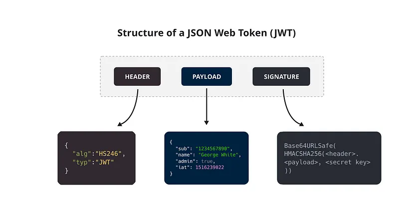

# SRS-042 JWT Authentication in ClickHouse

# Software Requirements Specification

## Table of Contents

## Revision History

This document is stored in an electronic form using [Git] source control management software
hosted in a [GitHub Repository].
All the updates are tracked using the [Revision History].

## Introduction

This Software Requirements Specification (SRS) defines the requirements for JWT (JSON Web Token) authentication in ClickHouse.

JSON Web Token, commonly referred to as JWT, is an open standard ([RFC 7519](https://datatracker.ietf.org/doc/html/rfc7519)) for securely transmitting information between parties as a JSON object. The token is digitally signed, ensuring its authenticity and integrity. JWTs are primarily used to authenticate users, authorize access to certain resources, and exchange information securely.

By allowing authentication through JWT, ClickHouse can integrate with external identity providers and authorization systems, enhancing security and flexibility for user management.

JWT tokens carry user identity and access information in a compact, URL-safe format. When configured in ClickHouse, JWTs can be validated based on signatures (using symmetric or asymmetric encryption keys) and by the presence of required claims within the payload. This setup allows for flexible verification of user credentials through **static keys**, **static JWKS (JSON Web Key Sets)**, or **dynamic key sets** retrieved from **JWKS servers**.

This document outlines the configuration requirements for enabling JWT authentication, details the validation methods available, and provides guidelines for integrating JWT-based authentication with ClickHouse users defined in `users.xml`.

## Structure of a JSON Web Token



A JWT consists of three parts separated by periods (.), which are base64url-encoded strings:

1. Header: The header typically consists of two parts — the token type (JWT) and the signing algorithm being used, such as HMAC SHA256 or RSA.

2. Payload: The payload contains the claims, which are statements about the user or other data.

3. Signature: To create the signature part, you need to take the encoded header, encoded payload, a secret, and the algorithm specified in the header, then sign that with the secret. The signature is used to verify that the sender of the JWT is who it says it is and to ensure that the message wasn’t changed along the way.

## Requirements

### RQ.SRS-042.JWT.Authentication
version: 1.0  

[Clickhouse] SHALL support JWT authentication for existing and properly configured ClickHouse users.

### RQ.SRS-042.JWT.Config.EnableValidators
Version: 1.0  

To enable JWT authentication, [ClickHouse] SHALL support configuring one or more JWT validators in the `jwt_validators` section in `config.xml`. Each validator must specify:

- unique identifier
- validation method (e.g., static key, static JWKS, or JWKS server)

**Example for enabling validators:**

```xml
<clickhouse>
    <jwt_validators>
        <validator_id>
            <algo>RS256</algo>
            <static_key>my_static_secret</static_key>
        </validator_id>
    </jwt_validators>
</clickhouse>
```

### RQ.SRS-042.JWT.SubClaimValidation
version: 1.0  

[ClickHouse] accept JWT token if and ronly if the name of the ClickHouse user is indicated under `"sub"` claim, otherwise token will be rejected.

Payload example for user with name `my_user`:

```json
{
  "sub": "my_user",
  "resource_access": {
    "account": {
      "roles": ["view-profile"]
    }
  }
}
```

### RQ.SRS-042.JWT.AdditionalVerification
version: 1.0  

[ClickHouse] SHALL allow for JWT to be additionally verified by checking the JWT payload.
In this case, the occurrence of specified claims from the user settings in the JWT payload is checked.

Parameters:

- `claims` - An optional string containing a json object that should be contained in the token payload.

Example (goes into `users.xml`):

```xml
<clickhouse>
    <!- ... -->
    <my_user>
        <!- ... -->
        <jwt>
            <claims>{"resource_access":{"account": {"roles": ["view-profile"]}}}</claims>
        </jwt>
    </my_user>
</clickhouse>
```

Here, the JWT payload must contain `["view-profile"]` on path `resource_access.account.roles`, otherwise authentication will not succeed even with a valid JWT.

Payload example for user with name `my_user`:

```json
{
...
  "sub": "my_user",
  "resource_access": {
    "account": {
      "roles": ["view-profile"]
    }
  },
...
}
```

### RQ.SRS-042.JWT.NoOtherAuthenticationMethods
Version: 1.0

[ClickHouse] SHALL prevent the use of any additional authentication method (e.g., password) when JWT authentication is enabled for a user. If password or any other section is present alongside jwt, ClickHouse will terminate.

### RQ.SRS-042.JWT.TokenSources
Version: 1.0

[ClickHouse] SHALL support receiving JWT tokens from clients through the following methods, in order of priority:

1. `X-ClickHouse-JWT-Token` header.
2. `Authorization` header.
3. `token` request parameter. In this case, the "Bearer" prefix should not exist.

### RQ.SRS-042.JWT.SessionSettings
Version: 1.0  

[ClickHouse] SHALL allow specific JWT claims to be used as session settings for authenticated users. If settings_key is defined in the `jwt_validators` configuration and the JWT payload contains matching key-value pairs, ClickHouse SHALL parse and apply these as session settings. If parsing fails, the session settings from the JWT payload will be ignored.

### Static Public Key

#### RQ.SRS-042.JWT.StaticKey.SignatureValidation
Version: 1.0  

[ClickHouse] SHALL support validating JWT signatures for authentication using **static public key**.

#### RQ.SRS-042.JWT.StaticKey.ValidatorInConfig
Version: 1.0  

[ClickHouse] SHALL allow configuring static key validator in `jwt_validators` section in `config.xml`.

**Example**

```xml
<clickhouse>
    <!- ... -->
    <jwt_validators>
        <my_static_key_validator>
          <algo>HS256</algo>
          <static_key>my_static_secret</static_key>
        </my_static_key_validator>
    </jwt_validators>
</clickhouse>
```

### RQ.SRS-042.JWT.StaticKey.Parameters
version: 1.0

[ClickHouse] SHALL support the following parameters for static key JWT validation:

### RQ.SRS-042.JWT.StaticKey.ValidatorParameters
Version: 1.0  

[ClickHouse] SHALL support the following parameters in each JWT validator configuration in `config.xml` to ensure proper signature validation:

- `algo`: Algorithm used to validate the JWT signature. Supported values include:

  | HMAC  |
  | ----- |
  | HS256 |
  | HS384 |
  | HS512 |

  Support for `None` is also available.

- `static_key`: The secret key for symmetric algorithms, required for algorithms in the `HS*` family.

- `static_key_in_base64`: Optional, specifies whether the `static_key` is base64-encoded. Default: `False`.

### Static JWKS (JSON Web Key Set)

#### RQ.SRS-042.JWT.StaticJWKS.SignatureValidation
Version: 1.0  

[ClickHouse] SHALL support validating JWT signatures for authentication using **static JWKS (JSON Web Key Set)**.

#### RQ.SRS-042.JWT.StaticJWKS.ValidatorInConfig
Version: 1.0  

[ClickHouse] SHALL allow configuring static JWKS validator in `jwt_validators` section in `config.xml`.

**Example**

```xml
<clickhouse>
    <!- ... -->
    <jwt_validators>
        <my_static_key_validator>
          <algo>HS256</algo>
          <static_key>my_static_secret</static_key>
        </my_static_key_validator>
    </jwt_validators>
</clickhouse>
```
### RQ.SRS-042.JWT.StaticJWKS.ValidatorParameters
Version: 1.0  

[ClickHouse] SHALL support the following parameters in each JWT validator configuration in `config.xml` to ensure proper signature validation:

- `algo`: Algorithm used to validate the JWT signature. Supported values include:

  | RSA   | ECDSA  | PSS   | EdDSA   |
  | ----- | ------ | ----- | ------- |
  | RS256 | ES256  | PS256 | Ed25519 |
  | RS384 | ES384  | PS384 | Ed448   |
  | RS512 | ES512  | PS512 |         |
  |       | ES256K |       |         |

  Support for `None` is also available.

- `public_key`: The public key for asymmetric algorithms, mandatory for all algorithms except the `HS*` family and `None`.

- `private_key`: Optional, private key for asymmetric algorithms.

- `public_key_password`: Optional, password for the public key.

- `private_key_password`: Optional, password for the private key.


### Dynamic JWKS retrieved from a remote server

#### RQ.SRS-042.JWT.DynamicJWKS.SignatureValidation

Version: 1.0

[ClickHouse] SHALL support validating JWT signatures for authentication using **dynamic JWKS** retrieved from a remote server.

#### RQ.SRS-042.JWT.DynamicJWKS.ValidatorInConfig
Version: 1.0  

[ClickHouse] SHALL allow configuring dynamic JWKS validator in `jwt_validators` section in `config.xml`.

**Example**

```xml
<clickhouse>
    <!- ... -->
    <jwt_validators>
        <my_static_key_validator>
          <algo>HS256</algo>
          <static_key>my_static_secret</static_key>
        </my_static_key_validator>
    </jwt_validators>
</clickhouse>
```

### RQ.SRS-042.JWT.DynamicJWKS.ValidatorParameters
Version: 1.0  

[ClickHouse] SHALL support the following parameters in each JWT validator configuration in `config.xml` to ensure proper signature validation:

- `algo`: Algorithm used to validate the JWT signature. Supported values include:

  | RSA   | ECDSA  | PSS   | EdDSA   |
  | ----- | ------ | ----- | ------- |
  | RS256 | ES256  | PS256 | Ed25519 |
  | RS384 | ES384  | PS384 | Ed448   |
  | RS512 | ES512  | PS512 |         |
  |       | ES256K |       |         |

  Support for `None` is also available.

- `public_key`: The public key for asymmetric algorithms, mandatory for all algorithms except the `HS*` family and `None`.

- `private_key`: Optional, private key for asymmetric algorithms.

- `public_key_password`: Optional, password for the public key.

- `private_key_password`: Optional, password for the private key.

## References

[ClickHouse]: https://clickhouse.com
