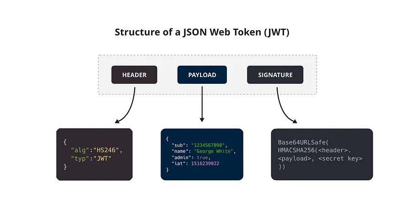

# SRS-042 JWT Authentication in ClickHouse

# Software Requirements Specification

## Table of Contents

* 1 [Introduction](#introduction)
    * 1.1 [Structure of a JSON Web Token](#structure-of-a-json-web-token)
* 2 [How JWT Authentication Works in ClickHouse in General](#how-jwt-authentication-works-in-clickhouse-in-general)
* 3 [Types of JWT Validators in ClickHouse](#types-of-jwt-validators-in-clickhouse)
* 4 [How to Configure JWT Validators in ClickHouse](#how-to-configure-jwt-validators-in-clickhouse)
    * 4.1 [RQ.SRS-042.JWT.ValidatorsConfiguration](#rqsrs-042jwtvalidatorsconfiguration)
* 5 [How to Create a User with JWT Authentication in ClickHouse](#how-to-create-a-user-with-jwt-authentication-in-clickhouse)
    * 5.1 [RQ.SRS-042.JWT.UserCreation](#rqsrs-042jwtusercreation)
    * 5.2 [RQ.SRS-042.JWT.UserCreationSQL](#rqsrs-042jwtusercreationsql)
* 6 [How to Authenticate Users with JWT in ClickHouse](#how-to-authenticate-users-with-jwt-in-clickhouse)
    * 6.1 [RQ.SRS-042.JWT.SubClaimValidation](#rqsrs-042jwtsubclaimvalidation)
    * 6.2 [RQ.SRS-042.JWT.UserAuthentication.ConsoleClient](#rqsrs-042jwtuserauthenticationconsoleclient)
    * 6.3 [RQ.SRS-042.JWT.UserAuthentication.HTTPRequests](#rqsrs-042jwtuserauthenticationhttprequests)
* 7 [How to Set Additional Validation for JWT Authentication](#how-to-set-additional-validation-for-jwt-authentication)
    * 7.1 [RQ.SRS-042.JWT.AdditionalValidation](#rqsrs-042jwtadditionalvalidation)
* 8 [JWT with Other Authentication Methods](#jwt-with-other-authentication-methods)
    * 8.1 [RQ.SRS-042.JWT.NoOtherAuthenticationMethods](#rqsrs-042jwtnootherauthenticationmethods)
* 9 [How to Handle Token Expiration and Revocation ](#how-to-handle-token-expiration-and-revocation-)
    * 9.1 [RQ.SRS-042.JWT.Expiration](#rqsrs-042jwtexpiration)
    * 9.2 [RQ.SRS-042.JWT.Revocation](#rqsrs-042jwtrevocation)
    * 9.3 [RQ.SRS-042.JWT.TokenBlacklisting](#rqsrs-042jwttokenblacklisting)
    * 9.4 [How to Use Static Public Keys for JWT Signature Validation](#how-to-use-static-public-keys-for-jwt-signature-validation)


## Introduction

This Software Requirements Specification (SRS) defines the requirements for JWT (JSON Web Token) authentication in ClickHouse.

JSON Web Token, commonly referred to as JWT, is an open standard ([RFC 7519](https://datatracker.ietf.org/doc/html/rfc7519)) for securely transmitting information between parties as a JSON object. The token is digitally signed, ensuring its authenticity and integrity. JWTs are primarily used to authenticate users, authorize access to certain resources, and exchange information securely.

Allowing JWT authentication enables ClickHouse to integrate with external identity providers, improving security and flexibility in user management.

JWT tokens carry user identity and access information in a compact, URL-safe format. When configured in ClickHouse, JWTs can be validated based on signatures (using symmetric or asymmetric encryption keys) and by the presence of required claims within the payload.   

This setup allows for flexible verification of user credentials through **static keys**, **static JWKS (JSON Web Key Sets)**, or **dynamic key sets** retrieved from **JWKS servers**.

This document provides the configuration requirements for enabling JWT authentication in Clickhouse.

### Structure of a JSON Web Token



A JWT consists of three parts separated by periods (.), which are base64url-encoded strings:

1. Header: The header typically consists of two parts — the token type (JWT) and the signing algorithm being used, such as HMAC SHA256 or RSA.

2. Payload: The payload contains the claims, which are statements about the user or other data.

3. Signature: To create the signature part, you need to take the encoded header, encoded payload, a secret, and the algorithm specified in the header, then sign that with the secret. The signature is used to verify that the sender of the JWT is who it says it is and to ensure that the message wasn’t changed along the way.

## How JWT Authentication Works in ClickHouse in General
To use JWT authentication in ClickHouse, one should first determine and configure JWT Validators. A JWT Validator in ClickHouse is a mechanism to validate JWTs against specific requirements before granting access to resources. Validators check for:

- The Token’s Authenticity: it verifies the JWT’s signature to ensure it was created by a trusted source and hasn’t been altered.
- Required Information (Claims): it checks that the token contains specific information (called "claims") needed for access, such as the user’s name, roles, and permissions.

These validators are set up in the `jwt_validators` section of the `config.xml` file. This setup allows ClickHouse to securely confirm user identity and access rights based on the contents of the JWT.

## Types of JWT Validators in ClickHouse
ClickHouse supports three main types of JWT validators:

1. **Static Key Validator**:

Uses a symmetric static secret key to verify JWT signatures.
Supported algorithms: HMAC (HS256, HS384, HS512).  
Example:
```xml
<clickhouse>
    <jwt_validators>
        <validator_id>
            <algo>HS256</algo>
            <static_key>my_static_secret</static_key>
        </validator_id>
    </jwt_validators>
</clickhouse>
```

2. **Static JWKS Validator**:

Uses a JSON Web Key Set (JWKS) containing public keys to verify JWTs signed with asymmetric algorithms.
Supported algorithms: RSA, ECDSA, EdDSA.  
Example:
```xml
TODO
```

3. **Dynamic JWKS Validator**:

Retrieves public keys dynamically from a remote JWKS endpoint.
Ideal for integration with identity providers where key rotation is managed externally.
Supported algorithms: RSA, ECDSA, EdDSA.  
Example:
```xml
TODO
```

## How to Configure JWT Validators in ClickHouse

To enable JWT authentication in ClickHouse:
- Add `jwt_validators` section to `config.xml`
- Add validator(s) with a unique identifier and specify the validation method (e.g., static key, static JWKS, or JWKS server) and other required parameters for each validator.

Example:
```xml
<clickhouse>
    <jwt_validators>
        <validator_id>
            <algo>RS256</algo>
            <static_key>my_static_secret</static_key>
        </validator_id>
    </jwt_validators>
</clickhouse>
```

### RQ.SRS-042.JWT.ValidatorsConfiguration
Version: 1.0  

[ClickHouse] SHALL support configuring one or more JWT validators in the `jwt_validators` section in `config.xml` to enable JWT authentication. Each validator SHALL specify:

- unique identifier
- validation method (e.g., static key, static JWKS, or JWKS server)

**Example for enabling validators:**

```xml
<clickhouse>
    <jwt_validators>
        <validator_1>
            <algo>HS384</algo>
            <static_key>my_static_secret</static_key>
        </validator_1>
        <validator_2>
            <algo>HS512</algo>
            <static_key>my_static_secret</static_key>
        </validator_2>
    </jwt_validators>
</clickhouse>
```

## How to Create a User with JWT Authentication in ClickHouse

To create a user in ClickHouse with JWT authentication enabled, add the `jwt` section to the user definition in `users.xml`.  
Example:  
```xml
<clickhouse>
    <!- ... -->
    <my_user>
        <!- ... -->
        <jwt>
        </jwt>
    </my_user>
```
Users identified by JWT authentication can also be created using SQL statements.
```sql
CREATE USER my_user IDENTIFIED WITH jwt
```
Or with additional JWT payload checks:
```sql
CREATE USER my_user IDENTIFIED WITH jwt CLAIMS '{"resource_access":{"account": {"roles": ["view-profile"]}}}'
```

### RQ.SRS-042.JWT.UserCreation
version: 1.0  

[ClickHouse] SHALL support creating users with JWT authentication enabled by adding the `jwt` section to the user definition in `users.xml`.

### RQ.SRS-042.JWT.UserCreationSQL
version: 1.0  

[ClickHouse] SHALL support creating users with JWT authentication enabled using SQL statements.


## How to Authenticate Users with JWT in ClickHouse

User can authenticate using JWT if the `"sub"` claim in the JWT payload matches the name of the ClickHouse user. Users can provide the JWT token via the console client or HTTP requests.

Examples:  
Console client

```
clickhouse-client -jwt <token>
```

- HTTP requests

```
curl 'http://localhost:8080/?' \
 -H 'Authorization: Bearer <TOKEN>' \
 -H 'Content type: text/plain;charset=UTF-8' \
 --data-raw 'SELECT current_user()'
```

### RQ.SRS-042.JWT.SubClaimValidation
version: 1.0  

[ClickHouse] SHALL accept JWT token if and only if the name of the ClickHouse user is indicated under `"sub"` claim, otherwise token will be rejected.

Payload example for user with name `my_user`:

```json
{
  "sub": "my_user",
  "resource_access": {
    "account": {
      "roles": ["view-profile"]
    }
  }
}
```

### RQ.SRS-042.JWT.UserAuthentication.ConsoleClient
version: 1.0  

[ClickHouse] SHALL allow users to authenticate using JWT by providing a token via the console client.


### RQ.SRS-042.JWT.UserAuthentication.HTTPRequests
version: 1.0  
[ClickHouse] SHALL allow users to authenticate using JWT by providing a token via HTTP requests.


## How to Set Additional Validation for JWT Authentication

### RQ.SRS-042.JWT.AdditionalValidation
version: 1.0  

[ClickHouse] SHALL allow for JWT to be additionally verified by checking the JWT payload.
In this case, the occurrence of specified claims from the user settings in the JWT payload is checked.

Parameters:

- `claims` - An optional string containing a json object that should be contained in the token payload.

Example (goes into `users.xml`):

```xml
<clickhouse>
    <!- ... -->
    <my_user>
        <!- ... -->
        <jwt>
            <claims>{"resource_access":{"account": {"roles": ["view-profile"]}}}</claims>
        </jwt>
    </my_user>
</clickhouse>
```

Here, the JWT payload must contain `["view-profile"]` on path `resource_access.account.roles`, otherwise authentication will not succeed even with a valid JWT.

Payload example for user with name `my_user`:

```
{
...
  "sub": "my_user",
  "resource_access": {
    "account": {
      "roles": ["view-profile"]
    }
  },
...
}
```

## JWT with Other Authentication Methods

### RQ.SRS-042.JWT.NoOtherAuthenticationMethods
Version: 1.0

[ClickHouse] SHALL prevent the use of any additional authentication method (e.g., password) when JWT authentication is enabled for a user. If password or any other section is present alongside jwt, ClickHouse will terminate. This is correct for ClickHouse versions < 24.9.
From ClickHouse version 24.9, [ClickHouse] SHALL allow to use multiple authentication methods for a user including JWT authentication.

## How to Handle Token Expiration and Revocation 

To ensure the security of JWT authentication, ClickHouse should support token expiration settings, token revocation, and token blacklisting for invalidating tokens that are no longer needed or have been compromised.

### RQ.SRS-042.JWT.Expiration
Version: 1.0  

[ClickHouse] SHALL support token expiration settings to ensure that JWTs are invalidated promptly after they are no longer needed or if they become compromised.


### RQ.SRS-042.JWT.Revocation
Version: 1.0  

[ClickHouse] SHALL support token revocation to invalidate JWTs that are no longer needed or have been compromised.


### RQ.SRS-042.JWT.TokenBlacklisting
Version: 1.0  

[ClickHouse] SHALL support a token blacklist to ensure that tokens are rendered unusable if a user logs out or if a token becomes compromised before expiration.


### How to Use Static Public Keys for JWT Signature Validation

ToDo

[ClickHouse]: https://clickhouse.com
