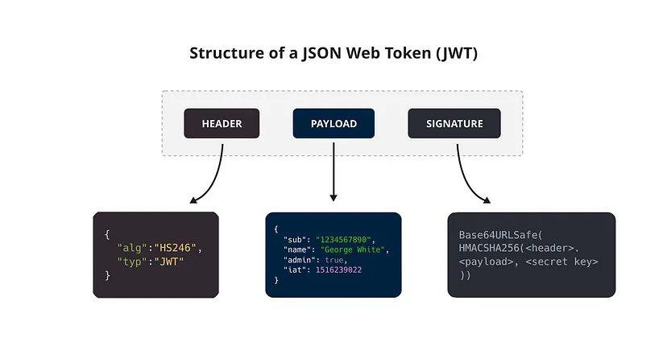

# SRS-042 JWT Authentication in ClickHouse
# Software Requirements Specification

## Table of Contents

* 1 [Introduction](#introduction)
    * 1.1 [Structure of a JSON Web Token](#structure-of-a-json-web-token)
* 2 [Overview of the Functionality](#overview-of-the-functionality)
* 3 [Types of JWT Validators](#types-of-jwt-validators)
* 4 [Configuration of JWT Validators](#configuration-of-jwt-validators)
    * 4.1 [RQ.SRS-042.JWT.ValidatorsConfiguration](#rqsrs-042jwtvalidatorsconfiguration)
* 5 [Creation of a User with JWT Authentication](#creation-of-a-user-with-jwt-authentication)
    * 5.1 [RQ.SRS-042.JWT.UserCreation.Config](#rqsrs-042jwtusercreationconfig)
    * 5.2 [RQ.SRS-042.JWT.UserCreation.RBAC](#rqsrs-042jwtusercreationrbac)
* 6 [Authentication with JWT ](#authentication-with-jwt-)
    * 6.1 [Sub-Claim Validation](#sub-claim-validation)
        * 6.1.1 [RQ.SRS-042.JWT.SubClaimValidation](#rqsrs-042jwtsubclaimvalidation)
    * 6.2 [Clickhouse Client](#clickhouse-client)
        * 6.2.1 [RQ.SRS-042.JWT.UserAuthentication.ClickhouseClient](#rqsrs-042jwtuserauthenticationclickhouseclient)
    * 6.3 [HTTP(S) Client](#https-client)
        * 6.3.1 [RQ.SRS-042.JWT.UserAuthentication.HTTPClient](#rqsrs-042jwtuserauthenticationhttpclient)
* 7 [Additional Validation for JWT Authentication](#additional-validation-for-jwt-authentication)
    * 7.1 [RQ.SRS-042.JWT.AdditionalValidation](#rqsrs-042jwtadditionalvalidation)
* 8 [JWT with Other Authentication Methods](#jwt-with-other-authentication-methods)
    * 8.1 [Supported and Non-supported Versions](#supported-and-non-supported-versions)
        * 8.1.1 [RQ.SRS-042.JWT.OtherAuthenticationMethods.SupportedVersions](#rqsrs-042jwtotherauthenticationmethodssupportedversions)
* 9 [Using Static Public Keys for Signature Validation](#using-static-public-keys-for-signature-validation)
    * 9.1 [Configuring Static Key Validation](#configuring-static-key-validation)
        * 9.1.1 [RQ.SRS-042.JWT.StaticKey](#rqsrs-042jwtstatickey)
    * 9.2 [Supported Algorithms for Static Key Validation](#supported-algorithms-for-static-key-validation)
        * 9.2.1 [RQ.SRS-042.JWT.StaticKey.SupportedAlgorithms](#rqsrs-042jwtstatickeysupportedalgorithms)
    * 9.3 [Support for None Algorithm](#support-for-none-algorithm)
        * 9.3.1 [RQ.SRS-042.JWT.StaticKey.NoneAlgorithm](#rqsrs-042jwtstatickeynonealgorithm)
    * 9.4 [Specifying Static Key Using Base64 Encoding](#specifying-static-key-using-base64-encoding)
        * 9.4.1 [RQ.SRS-042.JWT.StaticKey.StaticKeyInBase64](#rqsrs-042jwtstatickeystatickeyinbase64)
    * 9.5 [Using Public Key for Static Key Validation](#using-public-key-for-static-key-validation)
        * 9.5.1 [RQ.SRS-042.JWT.StaticKey.Parameters.PublicKey](#rqsrs-042jwtstatickeyparameterspublickey)
    * 9.6 [Using PrivateKey for Static Key Validation](#using-privatekey-for-static-key-validation)
        * 9.6.1 [RQ.SRS-042.JWT.StaticKey.Parameters.PrivateKey](#rqsrs-042jwtstatickeyparametersprivatekey)
* 10 [Using Static JWKS for Signature Validation](#using-static-jwks-for-signature-validation)
    * 10.1 [RQ.SRS-042.JWT.StaticJWKS](#rqsrs-042jwtstaticjwks)
    * 10.2 [Specifying Static JWKS Inline](#specifying-static-jwks-inline)
        * 10.2.1 [RQ.SRS-042.JWT.StaticJWKS.Inline](#rqsrs-042jwtstaticjwksinline)
    * 10.3 [Specifying JWKS Using File Path](#specifying-jwks-using-file-path)
        * 10.3.1 [RQ.SRS-042.JWT.StaticJWKS.PathToJWKSFile](#rqsrs-042jwtstaticjwkspathtojwksfile)
    * 10.4 [Specifying Either JWKS Inline or Using File Path (Mutually Exclusive)](#specifying-either-jwks-inline-or-using-file-path-mutually-exclusive)
        * 10.4.1 [RQ.SRS-042.JWT.StaticJWKS.OneSourceOfJWKS](#rqsrs-042jwtstaticjwksonesourceofjwks)
    * 10.5 [Supported Algorithms for Static JWKS Validation](#supported-algorithms-for-static-jwks-validation)
        * 10.5.1 [RQ.SRS-042.JWT.StaticJWKS.SupportedAlgorithms](#rqsrs-042jwtstaticjwkssupportedalgorithms)
    * 10.6 [Using Public Key for Static JWKS Validation](#using-public-key-for-static-jwks-validation)
        * 10.6.1 [RQ.SRS-042.JWT.StaticJWKS.Parameters.PublicKey](#rqsrs-042jwtstaticjwksparameterspublickey)
    * 10.7 [Using Private Key for Static JWKS Validation](#using-private-key-for-static-jwks-validation)
        * 10.7.1 [RQ.SRS-042.JWT.StaticJWKS.Parameters.PrivateKey](#rqsrs-042jwtstaticjwksparametersprivatekey)
* 11 [Using Dynamic Public Keys Received from JWKS Servers for Signature Validation](#using-dynamic-public-keys-received-from-jwks-servers-for-signature-validation)
    * 11.1 [RQ.SRS-042.JWT.DynamicJWKS](#rqsrs-042jwtdynamicjwks)
    * 11.2 [Specifying Dynamic JWKS URI](#specifying-dynamic-jwks-uri)
        * 11.2.1 [RQ.SRS-042.JWT.DynamicJWKS.URI](#rqsrs-042jwtdynamicjwksuri)
    * 11.3 [Specifying Dynamic JWKS Refresh Rate](#specifying-dynamic-jwks-refresh-rate)
        * 11.3.1 [RQ.SRS-042.JWT.DynamicJWKS.Refresh](#rqsrs-042jwtdynamicjwksrefresh)
    * 11.4 [Optional Dynamic JWKS Timeout Parameters](#optional-dynamic-jwks-timeout-parameters)
        * 11.4.1 [Specifying Optional Connection Timeout](#specifying-optional-connection-timeout)
            * 11.4.1.1 [RQ.SRS-042.JWT.DynamicJWKS.ConnectionTimeout](#rqsrs-042jwtdynamicjwksconnectiontimeout)
        * 11.4.2 [Specifying Optional Receive Timeout](#specifying-optional-receive-timeout)
            * 11.4.2.1 [RQ.SRS-042.JWT.DynamicJWKS.ReceiveTimeout](#rqsrs-042jwtdynamicjwksreceivetimeout)
        * 11.4.3 [Specifying Optional Send Timeout](#specifying-optional-send-timeout)
            * 11.4.3.1 [RQ.SRS-042.JWT.DynamicJWKS.SendTimeout](#rqsrs-042jwtdynamicjwkssendtimeout)
    * 11.5 [Optional Dynamic JWKS Retry Parameters](#optional-dynamic-jwks-retry-parameters)
        * 11.5.1 [Specifying Optional Max Tries](#specifying-optional-max-tries)
            * 11.5.1.1 [RQ.SRS-042.JWT.DynamicJWKS.MaxTries](#rqsrs-042jwtdynamicjwksmaxtries)
        * 11.5.2 [Specifying Optional Retry Initial Backoff](#specifying-optional-retry-initial-backoff)
            * 11.5.2.1 [RQ.SRS-042.JWT.DynamicJWKS.RetryInitialBackoff](#rqsrs-042jwtdynamicjwksretryinitialbackoff)
        * 11.5.3 [Specifying Optional Retry Max Backoff](#specifying-optional-retry-max-backoff)
            * 11.5.3.1 [RQ.SRS-042.JWT.DynamicJWKS.RetryMaxBackoff](#rqsrs-042jwtdynamicjwksretrymaxbackoff)
* 12 [JWT Authentication Security Threats and Mitigations](#jwt-authentication-security-threats-and-mitigations)
    * 12.1 [Token Expiration](#token-expiration)
        * 12.1.1 [RQ.SRS-042.JWT.Security.Expiration](#rqsrs-042jwtsecurityexpiration)
    * 12.2 [Token Revocation](#token-revocation)
        * 12.2.1 [RQ.SRS-042.JWT.Security.Revocation](#rqsrs-042jwtsecurityrevocation)
    * 12.3 [Token Blacklisting](#token-blacklisting)
        * 12.3.1 [RQ.SRS-042.JWT.Security.TokenBlacklisting](#rqsrs-042jwtsecuritytokenblacklisting)
    * 12.4 [Token Refresh On Re-Authentication](#token-refresh-on-re-authentication)
        * 12.4.1 [RQ.SRS-042.JWT.Security.TokenRefreshOnReAuthentication](#rqsrs-042jwtsecuritytokenrefreshonreauthentication)


## Introduction

This Software Requirements Specification (SRS) defines the requirements for JWT (JSON Web Token) authentication in ClickHouse.

JSON Web Token, commonly referred to as JWT, is an open standard ([RFC 7519](https://datatracker.ietf.org/doc/html/rfc7519)) for securely transmitting information between parties as a JSON object. The token is digitally signed, ensuring its authenticity and integrity. JWTs are primarily used to authenticate users, authorize access to certain resources, and exchange information securely.

Allowing JWT authentication enables ClickHouse to integrate with external identity providers, improving security and flexibility in user management.

JWT tokens carry user identity and access information in a compact, URL-safe format. When configured in ClickHouse, JWTs can be validated based on signatures (using symmetric or asymmetric encryption keys) and by the presence of required claims within the payload.

This setup allows for flexible verification of user credentials through **static keys**, **static JWKS (JSON Web Key Sets)**, or **dynamic key sets** retrieved from **JWKS servers**.

### Structure of a JSON Web Token



A JWT consists of three parts separated by periods (.), which are base64url-encoded strings:

1. Header: The header typically consists of two parts — the token type (JWT) and the signing algorithm being used, such as HMAC SHA256 or RSA.

2. Payload: The payload contains the claims, which are statements about the user or other data.

3. Signature: To create the signature part, you need to take the encoded header, encoded payload, a secret, and the algorithm specified in the header, then sign that with the secret. The signature is used to verify that the sender of the JWT is who it says it is and to ensure that the message wasn’t changed along the way.

## Overview of the Functionality

To use JWT authentication in ClickHouse, one should first determine and configure JWT Validators. A JWT Validator in ClickHouse is a mechanism to validate JWTs against specific requirements before granting access to resources. Validators check for:

- The Token’s Authenticity: it verifies the JWT’s signature to ensure it was created by a trusted source and hasn’t been altered.
- The Token’s Expiration: it checks the token’s expiration time to ensure it hasn’t expired.
- Required Information (Claims): it checks that the token contains specific information (called "claims") needed for access, such as the user’s name, roles, and permissions.

These validators are set up in the `jwt_validators` section of the `config.xml` file. This setup allows ClickHouse to securely confirm user identity and access rights based on the contents of the JWT.

## Types of JWT Validators

ClickHouse supports three main types of JWT validators:

1. **Static Key Validator**:

Uses a symmetric static secret key to verify JWT signatures.
Supported algorithms: HMAC (HS256, HS384, HS512).  
Example:

```xml
<clickhouse>
    <jwt_validators>
        <validator_id>
            <algo>HS256</algo>
            <static_key>my_static_secret</static_key>
        </validator_id>
    </jwt_validators>
</clickhouse>
```

2. **Static JWKS Validator**:

Uses a JSON Web Key Set (JWKS) containing public keys to verify JWTs signed with asymmetric algorithms.
Supported algorithms: RSA, ECDSA, EdDSA.  
Example:

```xml
<clickhouse>
    <!-- ... -->
    <jwt_validators>
        <my_static_jwks_validator>
          <static_jwks>{"keys": [{"kty": "RSA", "alg": "RS256", "kid": "mykid", "n": "_public_key_mod_", "e": "AQAB"}]}</static_jwks>
        </my_static_jwks_validator>
    </jwt_validators>
</clickhouse>
```

3. **Dynamic JWKS Validator**:

Retrieves public keys dynamically from the JWKS servers.
Ideal for integration with identity providers where key rotation is managed externally.
Supported algorithms: RSA, ECDSA, EdDSA.  
Example:

```xml
<clickhouse>
    <!-- ... -->
    <jwt_validators>
        <basic_auth_server>
          <uri>http://localhost:8000/.well-known/jwks.json</uri>
          <connection_timeout_ms>1000</connection_timeout_ms>
          <receive_timeout_ms>1000</receive_timeout_ms>
          <send_timeout_ms>1000</send_timeout_ms>
          <max_tries>3</max_tries>
          <retry_initial_backoff_ms>50</retry_initial_backoff_ms>
          <retry_max_backoff_ms>1000</retry_max_backoff_ms>
          <refresh_ms>300000</refresh_ms>
        </basic_auth_server>
    </jwt_validators>
</clickhouse>
```

## Configuration of JWT Validators

To enable JWT authentication in ClickHouse:

- Add `jwt_validators` section to `config.xml`
- Add validator(s) with a unique identifier and specify the validation method (e.g., static key, static JWKS, or JWKS server) and other required parameters for each validator.

Example:

```xml
<clickhouse>
    <jwt_validators>
        <validator_id>
            <algo>RS256</algo>
            <static_key>my_static_secret</static_key>
        </validator_id>
    </jwt_validators>
</clickhouse>
```

### RQ.SRS-042.JWT.ValidatorsConfiguration
version: 1.0

[ClickHouse] SHALL support configuring one or more JWT validators in the `jwt_validators` section in `config.xml` to enable JWT authentication. Each validator SHALL specify:

- unique identifier
- validation method (e.g., static key, static JWKS, or JWKS server)

**Example for enabling validators:**

```xml
<clickhouse>
    <jwt_validators>
        <validator_1>
            <algo>HS384</algo>
            <static_key>my_static_secret</static_key>
        </validator_1>
        <validator_2>
            <algo>HS512</algo>
            <static_key>my_static_secret</static_key>
        </validator_2>
    </jwt_validators>
</clickhouse>
```

## Creation of a User with JWT Authentication

To create a user in ClickHouse with JWT authentication enabled, add the `jwt` section to the user definition in `users.xml` or use SQL statements to create the user with JWT authentication.


### RQ.SRS-042.JWT.UserCreation.Config
version: 1.0  

[ClickHouse] SHALL support creating users with JWT authentication enabled by adding the `jwt` section to the user definition in `users.xml`.

Example:
```xml
<clickhouse>
    <!-- ... -->
    <my_user>
        <!-- ... -->
        <jwt>
        </jwt>
    </my_user>
</clickhouse>
```

### RQ.SRS-042.JWT.UserCreation.RBAC
version: 1.0  

[ClickHouse] SHALL support creating users with JWT authentication enabled using SQL statements.

Example:
```sql
CREATE USER my_user IDENTIFIED WITH jwt
```

Or with additional JWT payload checks:

```sql
CREATE USER my_user IDENTIFIED WITH jwt CLAIMS '{"resource_access":{"account": {"roles": ["view-profile"]}}}'
```

## Authentication with JWT 

To authenticate users with JWT in ClickHouse, the user must provide a valid JWT token. The token is validated against the configured JWT validators, and the user is granted access if the token is valid. Users can provide the JWT token via the console client or HTTP requests.

### Sub-Claim Validation

#### RQ.SRS-042.JWT.SubClaimValidation
version: 1.0

[ClickHouse] SHALL accept JWT token only if the name of the ClickHouse user is indicated under `"sub"` claim, otherwise token will be rejected.

Payload example for user with name `my_user`:

```json
{
  "sub": "my_user",
  "resource_access": {
    "account": {
      "roles": ["view-profile"]
    }
  }
}
```

### Clickhouse Client

#### RQ.SRS-042.JWT.UserAuthentication.ClickhouseClient
version: 1.0

[ClickHouse] SHALL allow users to authenticate using JWT by providing a token via the console client.

```
clickhouse-client -jwt <token>
```

### HTTP(S) Client

#### RQ.SRS-042.JWT.UserAuthentication.HTTPClient
version: 1.0  

[ClickHouse] SHALL allow users to authenticate using JWT by providing a token via HTTP and HTTPS requests.

For example,

- HTTP authentication:

```
curl 'http://localhost:8080/?' \
 -H 'Authorization: Bearer <TOKEN>' \
 -H 'Content type: text/plain;charset=UTF-8' \
 --data-raw 'SELECT current_user()'
```

- HTTPS authentication:

```
curl 'https://localhost:8080/?' \
 -H 'Authorization: Bearer <TOKEN>' \
 -H 'Content type: text/plain;charset=UTF-8' \
 --data-raw 'SELECT current_user()'
```

## Additional Validation for JWT Authentication

### RQ.SRS-042.JWT.AdditionalValidation
version: 1.0

[ClickHouse] SHALL support additional verification by checking the JWT payload.
In this case, the occurrence of specified claims from the user settings in the JWT payload SHALL be checked.

Parameters:

- `claims` - An optional string containing a json object that should be contained in the token payload.

Example `users.xml`:

```xml
<clickhouse>
    <!-- ... -->
    <my_user>
        <!-- ... -->
        <jwt>
            <claims>{"resource_access":{"account": {"roles": ["view-profile"]}}}</claims>
        </jwt>
    </my_user>
</clickhouse>
```

Here, the JWT payload must contain `["view-profile"]` on path `resource_access.account.roles`, otherwise authentication will not succeed even with a valid JWT.

The following payload will match the claim above:

```
{
...
  "sub": "my_user",
  "resource_access": {
    "account": {
      "roles": ["view-profile"]
    }
  },
...
}
```

## JWT with Other Authentication Methods

### Supported and Non-supported Versions

#### RQ.SRS-042.JWT.OtherAuthenticationMethods.SupportedVersions
version: 1.0

[ClickHouse] SHALL prevent the use of any additional authentication method (e.g., password) when JWT authentication is enabled for a user. If password or any other section is present alongside jwt, ClickHouse will terminate.
This is correct for ClickHouse versions < 24.9.

From ClickHouse version 24.9, [ClickHouse] SHALL allow to use multiple authentication methods for a user including JWT authentication.

## Using Static Public Keys for Signature Validation

### Configuring Static Key Validation

#### RQ.SRS-042.JWT.StaticKey
version: 1.0

[ClickHouse] SHALL support validating JWT signatures for authentication using **static public key** which SHALL be configured in the `jwt_validators` section of the `config.xml`.

**Example**

```xml
<clickhouse>
    <!-- ... -->
    <jwt_validators>
        <my_static_key_validator>
          <algo>HS256</algo>
          <static_key>my_static_secret</static_key>
        </my_static_key_validator>
    </jwt_validators>
</clickhouse>
```

### Supported Algorithms for Static Key Validation

#### RQ.SRS-042.JWT.StaticKey.SupportedAlgorithms
version: 1.0

[ClickHouse] SHALL support the following algorithms for static key validation:

| HMSC  | RSA   | ECDSA  | PSS   | EdDSA   |
| ----- | ----- | ------ | ----- | ------- |
| HS256 | RS256 | ES256  | PS256 | Ed25519 |
| HS384 | RS384 | ES384  | PS384 | Ed448   |
| HS512 | RS512 | ES512  | PS512 |         |
|       |       | ES256K |       |         |

[ClickHouse] SHALL allow specifying any of the supported algorithms in the `algo` field of the static key validator configuration.

### Support for None Algorithm

#### RQ.SRS-042.JWT.StaticKey.NoneAlgorithm
version: 1.0 
 
[ClickHouse] SHALL allow to specify `None` algorithm in the `algo` field of the static key validator configuration.

Example:
```xml
<clickhouse>
    <!-- ... -->
    <jwt_validators>
        <my_static_key_validator>
          <algo>None</algo>
          <static_key>my_static_secret</static_key>
        </my_static_key_validator>
    </jwt_validators>
</clickhouse>
```

### Specifying Static Key Using Base64 Encoding

#### RQ.SRS-042.JWT.StaticKey.StaticKeyInBase64
version: 1.0

[ClickHouse] SHALL support the `static_key_in_base64` option to indicate if the static_key is base64-encoded. This option is optional and SHALL default to False.

Example:

```xml
<clickhouse>
    <jwt_validators>
        <single_key_validator>
            <algo>HS256</algo>
            <static_key>my_secret</static_key>
            <static_key_in_base64>true</static_key_in_base64>
        </single_key_validator>
    </jwt_validators>
</clickhouse>
```

### Using Public Key for Static Key Validation

#### RQ.SRS-042.JWT.StaticKey.Parameters.PublicKey
version: 1.0

[ClickHouse] SHALL require `public_key` for asymmetric algorithms and support
optional `public_key_password` parameter for asymmetric algorithms.

### Using PrivateKey for Static Key Validation

#### RQ.SRS-042.JWT.StaticKey.Parameters.PrivateKey
version: 1.0

[ClickHouse] SHALL support optional `private_key` parameter for asymmetric algorithms and
support optional `private_key_password` parameter for asymmetric algorithms.

## Using Static JWKS for Signature Validation

### RQ.SRS-042.JWT.StaticJWKS
version: 1.0

[ClickHouse] SHALL support validating JWT signatures for authentication using **static JWKS (JSON Web Key Set)** which is configured `jwt_validators` section in `config.xml`.

### Specifying Static JWKS Inline

#### RQ.SRS-042.JWT.StaticJWKS.Inline

The `static_jwks` field SHALL specify the JWKS content in the static JWKS validator configuration.

**Example**

```xml
<clickhouse>
    <!-- ... -->
    <jwt_validators>
        <my_static_jwks_validator>
          <static_jwks>{"keys": [{"kty": "RSA", "alg": "RS256", "kid": "mykid", "n": "_public_key_mod_", "e": "AQAB"}]}</static_jwks>
        </my_static_jwks_validator>
    </jwt_validators>
</clickhouse>
```
### Specifying JWKS Using File Path

#### RQ.SRS-042.JWT.StaticJWKS.PathToJWKSFile
version: 1.0  

[ClickHouse] SHALL support the `static_jwks_file` option to specify the path to a file containing the JWKS content in the static JWKS validator configuration.

### Specifying Either JWKS Inline or Using File Path (Mutually Exclusive)

#### RQ.SRS-042.JWT.StaticJWKS.OneSourceOfJWKS
version: 1.0

[ClickHouse] SHALL allow to specify only one of the `static_jwks` or `static_jwks_file` in the static JWKS validator configuration.

### Supported Algorithms for Static JWKS Validation

#### RQ.SRS-042.JWT.StaticJWKS.SupportedAlgorithms
version: 1.0

[ClickHouse] SHALL support the following algorithms for static key validation:

| RSA   |
| ----- |
| RS256 |
| RS384 |
| RS512 |

[ClickHouse] SHALL allow specifying any of the supported algorithms in the `algo` field of the static key validator configuration.

### Using Public Key for Static JWKS Validation

#### RQ.SRS-042.JWT.StaticJWKS.Parameters.PublicKey
version: 1.0

[ClickHouse] SHALL require `public_key` for all supported algorithms and
support optional `public_key_password` parameter for all supported algorithms.

### Using Private Key for Static JWKS Validation

#### RQ.SRS-042.JWT.StaticJWKS.Parameters.PrivateKey
version: 1.0

[ClickHouse] SHALL support optional `private_key` parameter for all supported algorithms and
support optional `private_key_password` parameter for all supported algorithms.

## Using Dynamic Public Keys Received from JWKS Servers for Signature Validation

### RQ.SRS-042.JWT.DynamicJWKS
version: 1.0

[ClickHouse] SHALL support validating JWT signatures for authentication using **dynamic JWKS** retrieved from a remote server. [ClickHouse] SHALL allow configuring dynamic JWKS validator in `jwt_validators` section in `config.xml`.

**Example**

```xml
<clickhouse>
    <!-- ... -->
    <jwt_validators>
        <basic_auth_server>
          <uri>http://localhost:8000/.well-known/jwks.json</uri>
          <connection_timeout_ms>1000</connection_timeout_ms>
          <receive_timeout_ms>1000</receive_timeout_ms>
          <send_timeout_ms>1000</send_timeout_ms>
          <max_tries>3</max_tries>
          <retry_initial_backoff_ms>50</retry_initial_backoff_ms>
          <retry_max_backoff_ms>1000</retry_max_backoff_ms>
          <refresh_ms>300000</refresh_ms>
        </basic_auth_server>
    </jwt_validators>
</clickhouse>
```

### Specifying Dynamic JWKS URI

#### RQ.SRS-042.JWT.DynamicJWKS.URI
version: 1.0  

[ClickHouse] SHALL require `uri` parameter to specify the JWKS endpoint in the dynamic JWKS validator configuration.

### Specifying Dynamic JWKS Refresh Rate

#### RQ.SRS-042.JWT.DynamicJWKS.Refresh
version: 1.0  

[ClickHouse] SHALL support the `refresh_ms` parameter to specify the period for refreshing the JWKS in the dynamic JWKS validator configuration. This parameter is optional and SHALL default to 300000.

### Optional Dynamic JWKS Timeout Parameters

Timeouts in milliseconds on the socket used for communicating with the server:

#### Specifying Optional Connection Timeout

##### RQ.SRS-042.JWT.DynamicJWKS.ConnectionTimeout
version: 1.0  

[ClickHouse] SHALL support the `connection_timeout_ms` parameter to specify the connection timeout in milliseconds in the dynamic JWKS validator configuration. This parameter is optional and SHALL default to 1000.

#### Specifying Optional Receive Timeout

##### RQ.SRS-042.JWT.DynamicJWKS.ReceiveTimeout
version: 1.0  

[ClickHouse] SHALL support the `receive_timeout_ms` parameter to specify the receive timeout in milliseconds in the dynamic JWKS validator configuration. This parameter is optional and SHALL default to 1000.

#### Specifying Optional Send Timeout

##### RQ.SRS-042.JWT.DynamicJWKS.SendTimeout
version: 1.0  

[ClickHouse] SHALL support the `send_timeout_ms` parameter to specify the send timeout in milliseconds in the dynamic JWKS validator configuration. This parameter is optional and SHALL default to 1000.

### Optional Dynamic JWKS Retry Parameters

#### Specifying Optional Max Tries

##### RQ.SRS-042.JWT.DynamicJWKS.MaxTries
version: 1.0  

[ClickHouse] SHALL support the `max_tries` parameter to specify the maximum number of attempts to make an authentication request in the dynamic JWKS validator configuration. This parameter is optional and SHALL default to 3.

#### Specifying Optional Retry Initial Backoff

##### RQ.SRS-042.JWT.DynamicJWKS.RetryInitialBackoff
version: 1.0  

[ClickHouse] SHALL support the `retry_initial_backoff_ms` parameter to specify the backoff initial interval on retry in the dynamic JWKS validator configuration. This parameter is optional and SHALL default to 50.

#### Specifying Optional Retry Max Backoff

##### RQ.SRS-042.JWT.DynamicJWKS.RetryMaxBackoff
version: 1.0  

[ClickHouse] SHALL support the `retry_max_backoff_ms` parameter to specify the maximum backoff interval in the dynamic JWKS validator configuration. This parameter is optional and SHALL default to 1000.

## JWT Authentication Security Threats and Mitigations

To ensure the security of JWT authentication, ClickHouse should support token expiration settings, token revocation, and token blacklisting for invalidating tokens that are no longer needed or have been compromised.

### Token Expiration

#### RQ.SRS-042.JWT.Security.Expiration
version: 1.0

[ClickHouse] SHALL support token expiration settings to ensure that JWTs are invalidated promptly after they are no longer needed or if they become compromised.

### Token Revocation

#### RQ.SRS-042.JWT.Security.Revocation
version: 1.0

[ClickHouse] SHALL support token revocation to invalidate JWTs that are no longer needed or have been compromised.

### Token Blacklisting

#### RQ.SRS-042.JWT.Security.TokenBlacklisting
version: 1.0

[ClickHouse] SHALL support a token blacklist to ensure that tokens are rendered unusable if a user logs out or if a token becomes compromised before expiration.

### Token Refresh On Re-Authentication

#### RQ.SRS-042.JWT.Security.TokenRefreshOnReAuthentication
version: 1.0  

[ClickHouse] SHALL ensure that users receive new tokens upon re-authentication, preventing session fixation attacks.


[ClickHouse](https://clickhouse.com)
