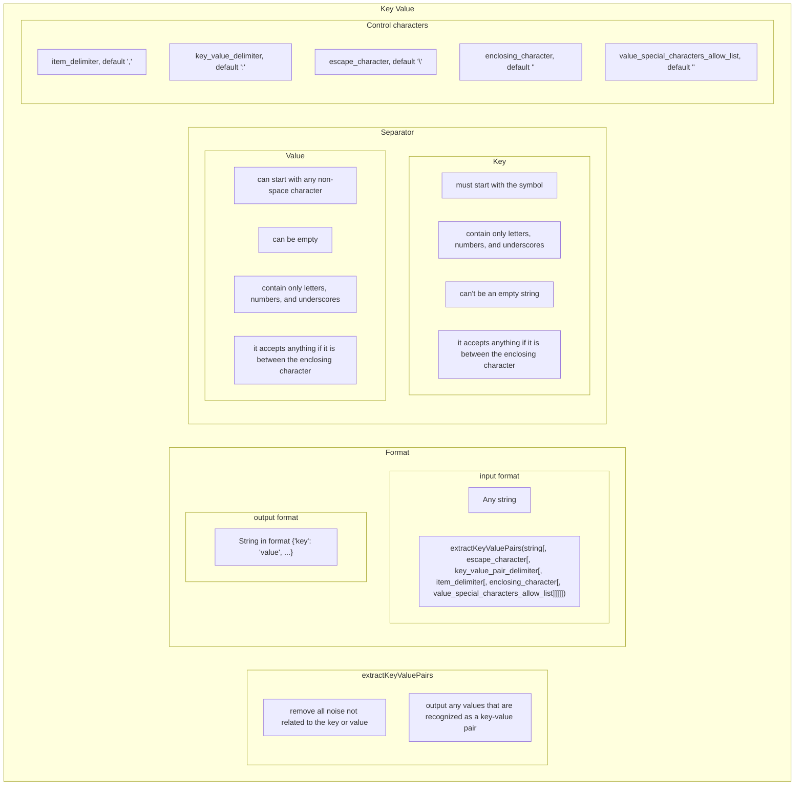

# SRS033 ClickHouse Key Value Function
# Software Requirements Specification

## Table of Contents

* 1 [Introduction](#introduction)
* 2 [Test Feature Diagram](#test-feature-diagram)
* 3 [Requirements](#requirements)
  * 3.1 [extractKeyValuePairs Function](#extractkeyvaluepairs-function)
    * 3.1.1 [RQ.SRS-033.ClickHouse.ExtractKeyValuePairs.Function](#rqsrs-033clickhouseextractkeyvaluepairsfunction)
    * 3.1.2 [RQ.SRS-033.ClickHouse.ExtractKeyValuePairs.Function.SupportedDataTypes](#rqsrs-033clickhouseextractkeyvaluepairsfunctionsupporteddatatypes)
    * 3.1.3 [RQ.SRS-033.ClickHouse.ExtractKeyValuePairs.Function.UnsupportedDataTypes](#rqsrs-033clickhouseextractkeyvaluepairsfunctionunsupporteddatatypes)
  * 3.2 [Parsing](#parsing)
    * 3.2.1 [RQ.SRS-033.ClickHouse.ExtractKeyValuePairs.Parsing.Noise](#rqsrs-033clickhouseextractkeyvaluepairsparsingnoise)
    * 3.2.2 [RQ.SRS-033.ClickHouse.ExtractKeyValuePairs.Parsing.RecognizedKeyValuePairs](#rqsrs-033clickhouseextractkeyvaluepairsparsingrecognizedkeyvaluepairs)
  * 3.3 [Format](#format)
    * 3.3.1 [RQ.SRS-033.ClickHouse.ExtractKeyValuePairs.Format.Input](#rqsrs-033clickhouseextractkeyvaluepairsformatinput)
    * 3.3.2 [RQ.SRS-033.ClickHouse.ExtractKeyValuePairs.Format.Output](#rqsrs-033clickhouseextractkeyvaluepairsformatoutput)
  * 3.4 [Key](#key)
    * 3.4.1 [RQ.SRS-033.ClickHouse.ExtractKeyValuePairs.Key.Format](#rqsrs-033clickhouseextractkeyvaluepairskeyformat)
  * 3.5 [Value](#value)
    * 3.5.1 [RQ.SRS-033.ClickHouse.ExtractKeyValuePairs.Value.Format](#rqsrs-033clickhouseextractkeyvaluepairsvalueformat)
  * 3.6 [Item Delimiter](#item-delimiter)
    * 3.6.1 [RQ.SRS-033.ClickHouse.ExtractKeyValuePairs.ItemDelimiter](#rqsrs-033clickhouseextractkeyvaluepairsitemdelimiter)
  * 3.7 [Key Value Delimiter](#key-value-delimiter)
    * 3.7.1 [RQ.SRS-033.ClickHouse.ExtractKeyValuePairs.KeyValueDelimiter](#rqsrs-033clickhouseextractkeyvaluepairskeyvaluedelimiter)
  * 3.8 [Escape Character](#escape-character)
    * 3.8.1 [RQ.SRS-033.ClickHouse.ExtractKeyValuePairs.EscapeCharacter](#rqsrs-033clickhouseextractkeyvaluepairsescapecharacter)
  * 3.9 [Enclosing Character](#enclosing-character)
    * 3.9.1 [RQ.SRS-033.ClickHouse.ExtractKeyValuePairs.EnclosingCharacter](#rqsrs-033clickhouseextractkeyvaluepairsenclosingcharacter)
  * 3.10 [Value Special Characters Allow List](#value-special-characters-allow-list)
    * 3.10.1 [RQ.SRS-033.ClickHouse.ExtractKeyValuePairs.ValueSpecialCharactersAllowList](#rqsrs-033clickhouseextractkeyvaluepairsvaluespecialcharactersallowlist)
  * 3.11 [Special Characters Conflict](#special-characters-conflict)
    * 3.11.1 [RQ.SRS-033.ClickHouse.ExtractKeyValuePairs.SpecialCharactersConflict](#rqsrs-033clickhouseextractkeyvaluepairsspecialcharactersconflict)

## Introduction

This software requirements specification covers requirements related to [ClickHouse]
[extractKeyValuePairs] function.

## Test Feature Diagram



## Requirements

### extractKeyValuePairs Function

#### RQ.SRS-033.ClickHouse.ExtractKeyValuePairs.Function
version: 1.0

[ClickHouse] SHALL support `extractKeyValuePairs` function that SHALL have the following syntax:


```sql
extractKeyValuePairs(<column_name>|<constant>|<function_return_value>|<alias>[, escape_character[, key_value_pair_delimiter[, item_delimiter[, enclosing_character[, value_special_characters_allow_list]]]]])
```

For example, 

> Insert into the table parsed key-values from another table

```sql
INSERT INTO table_2 SELECT extractKeyValuePairs(x) FROM table_1;
```

The function SHALL return a `String` object containing parsed keys and values. 

#### RQ.SRS-033.ClickHouse.ExtractKeyValuePairs.Function.SupportedDataTypes
version: 1.0

[ClickHouse] SHALL support using the [extractKeyValuePairs] function with the following data types:

* [String]
* [FixedString]

#### RQ.SRS-033.ClickHouse.ExtractKeyValuePairs.Function.UnsupportedDataTypes
version: 1.0

[ClickHouse]'s [extractKeyValuePairs] function SHALL return an error if input data type is not supported.

### Parsing

#### RQ.SRS-033.ClickHouse.ExtractKeyValuePairs.Parsing.Noise
version: 1.0

[ClickHouse]'s [extractKeyValuePairs] function SHALL remove all noise that is not related to the key or value.

#### RQ.SRS-033.ClickHouse.ExtractKeyValuePairs.Parsing.RecognizedKeyValuePairs
version: 1.0

[ClickHouse]'s [extractKeyValuePairs] function SHALL output all values that are recognized as a key-value pair.

### Format

#### RQ.SRS-033.ClickHouse.ExtractKeyValuePairs.Format.Input
version: 1.0

[ClickHouse]'s [extractKeyValuePairs] function SHALL accept any string as input.

#### RQ.SRS-033.ClickHouse.ExtractKeyValuePairs.Format.Output
version: 1.0

[ClickHouse]'s [extractKeyValuePairs] function SHALL return a string in the following format:

`{'key': 'value', ...}`

### Key

#### RQ.SRS-033.ClickHouse.ExtractKeyValuePairs.Key.Format
version: 1.0

[ClickHouse]'s [extractKeyValuePairs] function SHALL recognize the key in the input string
if it satisfies the following conditions:

* Key starts with the alfabet symbol.
* Only alfabet symbols, numbers, and underscore are used in the key.
* Key can't be an empty string.
* If not supported symbols are escaped or a value is enclosed, the key can be any string. 

### Value

#### RQ.SRS-033.ClickHouse.ExtractKeyValuePairs.Value.Format
version: 1.0

[ClickHouse]'s [extractKeyValuePairs] function SHALL recognize the value in the input string
if it satisfies the following conditions:

* Key starts with any non-space symbol.
* Only symbols, numbers, and underscore are used in the value.
* Value can be an empty string.
* If not supported symbols are escaped or a value is enclosed, value can be any string. 

### Item Delimiter

#### RQ.SRS-033.ClickHouse.ExtractKeyValuePairs.ItemDelimiter
version: 1.0

[ClickHouse]'s [extractKeyValuePairs] function SHALL support specifying `item_delimeter`
which SHALL divide key value pairs in input string.

By default, the function SHALL specify `item_delimeter` as `,`.

### Key Value Delimiter

#### RQ.SRS-033.ClickHouse.ExtractKeyValuePairs.KeyValueDelimiter
version: 1.0

[ClickHouse]'s [extractKeyValuePairs] function SHALL support specifying `key_value_delimiter`
which SHALL divide key value pairs among themselves.

By default, the function SHALL specify `key_value_delimiter` as `:`.

### Escape Character

#### RQ.SRS-033.ClickHouse.ExtractKeyValuePairs.EscapeCharacter
version: 1.0

[ClickHouse]'s [extractKeyValuePairs] function SHALL support specifying `escape_character`
which SHALL escape symbols which allows you to use unsupported characters in a key or value.

By default, the function SHALL specify `escape_character` as `\`.

### Enclosing Character

#### RQ.SRS-033.ClickHouse.ExtractKeyValuePairs.EnclosingCharacter
version: 1.0

[ClickHouse]'s [extractKeyValuePairs] function SHALL support specifying `enclosing_character`
which SHALL enclose symbols which allows you to use unsupported characters in a key or value.

By default, the function SHALL specify `enclosing_character` as `"`.

### Value Special Characters Allow List

#### RQ.SRS-033.ClickHouse.ExtractKeyValuePairs.ValueSpecialCharactersAllowList
version: 1.0

[ClickHouse]'s [extractKeyValuePairs] function SHALL support specifying `Value Special Characters Allow List`
which SHALL specify symbols, that can be used in key and value without escaping or enclosing.

By default, the function SHALL specify `value_special_characters_allow_list` as empty string.

### Special Characters Conflict

#### RQ.SRS-033.ClickHouse.ExtractKeyValuePairs.SpecialCharactersConflict
version: 1.0

[ClickHouse]'s [extractKeyValuePairs] function SHALL return an error if any 
specified special symbols match.

[String]: https://clickhouse.com/docs/en/sql-reference/data-types/string
[FixedString]: https://clickhouse.com/docs/en/sql-reference/data-types/fixedstring
[extractKeyValuePairs]: https://github.com/arthurpassos/KeyValuePairFileProcessor
[ClickHouse]: https://clickhouse.tech
