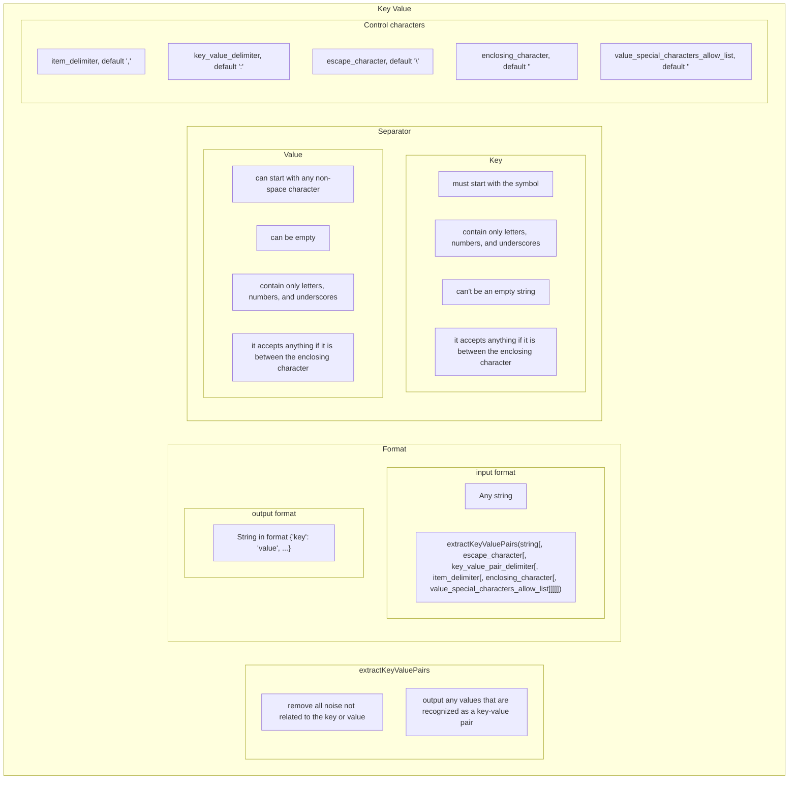

# SRS033 ClickHouse Key Value Function
# Software Requirements Specification

## Table of Contents

* 1 [Introduction](#introduction)
* 2 [Test Feature Diagram](#test-feature-diagram)
* 3 [Requirements](#requirements)
  * 3.1 [extractKeyValuePairs Function](#extractkeyvaluepairs-function)
    * 3.1.1 [RQ.SRS-033.ClickHouse.ExtractKeyValuePairs.Function](#rqsrs-033clickhouseextractkeyvaluepairsfunction)
    * 3.1.2 [RQ.SRS-033.ClickHouse.ExtractKeyValuePairs.Function.SupportedDataTypes](#rqsrs-033clickhouseextractkeyvaluepairsfunctionsupporteddatatypes)
    * 3.1.3 [RQ.SRS-033.ClickHouse.ExtractKeyValuePairs.Function.UnsupportedDataTypes](#rqsrs-033clickhouseextractkeyvaluepairsfunctionunsupporteddatatypes)
  * 3.2 [Input Data Source](#input-data-source)
    * 3.2.1 [RQ.SRS-033.ClickHouse.ExtractKeyValuePairs.InputDataSource.Constant](#rqsrs-033clickhouseextractkeyvaluepairsinputdatasourceconstant)
    * 3.2.2 [RQ.SRS-033.ClickHouse.ExtractKeyValuePairs.InputDataSource.Column](#rqsrs-033clickhouseextractkeyvaluepairsinputdatasourcecolumn)
    * 3.2.3 [RQ.SRS-033.ClickHouse.ExtractKeyValuePairs.InputDataSource.Array](#rqsrs-033clickhouseextractkeyvaluepairsinputdatasourcearray)
    * 3.2.4 [RQ.SRS-033.ClickHouse.ExtractKeyValuePairs.InputDataSource.Map](#rqsrs-033clickhouseextractkeyvaluepairsinputdatasourcemap)
  * 3.3 [Parsing](#parsing)
    * 3.3.1 [RQ.SRS-033.ClickHouse.ExtractKeyValuePairs.Parsing.Noise](#rqsrs-033clickhouseextractkeyvaluepairsparsingnoise)
  * 3.4 [Format](#format)
    * 3.4.1 [RQ.SRS-033.ClickHouse.ExtractKeyValuePairs.Format.Input](#rqsrs-033clickhouseextractkeyvaluepairsformatinput)
  * 3.5 [Key](#key)
    * 3.5.1 [RQ.SRS-033.ClickHouse.ExtractKeyValuePairs.Key.Format](#rqsrs-033clickhouseextractkeyvaluepairskeyformat)
  * 3.6 [Value](#value)
    * 3.6.1 [RQ.SRS-033.ClickHouse.ExtractKeyValuePairs.Value.Format](#rqsrs-033clickhouseextractkeyvaluepairsvalueformat)
  * 3.7 [Parameters specifying](#parameters-specifying)
    * 3.7.1 [RQ.SRS-033.ClickHouse.ExtractKeyValuePairs.ParametersSpecifying](#rqsrs-033clickhouseextractkeyvaluepairsparametersspecifying)
    * 3.7.2 [Escape Character](#escape-character)
      * 3.7.2.1 [RQ.SRS-033.ClickHouse.ExtractKeyValuePairs.ParametersSpecifying.EscapeCharacter](#rqsrs-033clickhouseextractkeyvaluepairsparametersspecifyingescapecharacter)
    * 3.7.3 [Key Value Delimiter](#key-value-delimiter)
      * 3.7.3.1 [RQ.SRS-033.ClickHouse.ExtractKeyValuePairs.ParametersSpecifying.KeyValuePairDelimiter](#rqsrs-033clickhouseextractkeyvaluepairsparametersspecifyingkeyvaluepairdelimiter)
    * 3.7.4 [Item Delimiter](#item-delimiter)
      * 3.7.4.1 [RQ.SRS-033.ClickHouse.ExtractKeyValuePairs.ParametersSpecifying.ItemDelimiter](#rqsrs-033clickhouseextractkeyvaluepairsparametersspecifyingitemdelimiter)
    * 3.7.5 [Enclosing Character](#enclosing-character)
      * 3.7.5.1 [RQ.SRS-033.ClickHouse.ExtractKeyValuePairs.ParametersSpecifying.EnclosingCharacter](#rqsrs-033clickhouseextractkeyvaluepairsparametersspecifyingenclosingcharacter)
    * 3.7.6 [Value Special Characters Allow List](#value-special-characters-allow-list)
      * 3.7.6.1 [RQ.SRS-033.ClickHouse.ExtractKeyValuePairs.ParametersSpecifying.ValueSpecialCharactersAllowList](#rqsrs-033clickhouseextractkeyvaluepairsparametersspecifyingvaluespecialcharactersallowlist)
    * 3.7.7 [Special Characters Conflict](#special-characters-conflict)
      * 3.7.7.1 [RQ.SRS-033.ClickHouse.ExtractKeyValuePairs.ParametersSpecifying.SpecialCharactersConflict](#rqsrs-033clickhouseextractkeyvaluepairsparametersspecifyingspecialcharactersconflict)
  * 3.8 [Default Parameters Values](#default-parameters-values)
    * 3.8.1 [RQ.SRS-033.ClickHouse.ExtractKeyValuePairs.Default.EscapeCharacter](#rqsrs-033clickhouseextractkeyvaluepairsdefaultescapecharacter)
  * 3.9 [RQ.SRS-033.ClickHouse.ExtractKeyValuePairs.Default.KeyValuePairDelimiter](#rqsrs-033clickhouseextractkeyvaluepairsdefaultkeyvaluepairdelimiter)
    * 3.9.1 [RQ.SRS-033.ClickHouse.ExtractKeyValuePairs.Default.ItemDelimiter](#rqsrs-033clickhouseextractkeyvaluepairsdefaultitemdelimiter)
    * 3.9.2 [RQ.SRS-033.ClickHouse.ExtractKeyValuePairs.Default.EnclosingCharacter](#rqsrs-033clickhouseextractkeyvaluepairsdefaultenclosingcharacter)
    * 3.9.3 [RQ.SRS-033.ClickHouse.ExtractKeyValuePairs.Default.ValueSpecialCharactersAllowList](#rqsrs-033clickhouseextractkeyvaluepairsdefaultvaluespecialcharactersallowlist)
## Introduction

This software requirements specification covers requirements related to [ClickHouse]
[extractKeyValuePairs] function.

## Test Feature Diagram



## Requirements

### extractKeyValuePairs Function

#### RQ.SRS-033.ClickHouse.ExtractKeyValuePairs.Function
version: 1.0

[ClickHouse] SHALL support `extractKeyValuePairs` function that SHALL have the following syntax:


```sql
extractKeyValuePairs(<column_name>|<constant>|<function_return_value>|<alias>[, escape_character[, key_value_pair_delimiter[, item_delimiter[, enclosing_character[, value_special_characters_allow_list]]]]])
```

For example, 

> Insert into the table parsed key-values from another table

```sql
INSERT INTO table_2 SELECT extractKeyValuePairs(x) FROM table_1;
```

The function SHALL return a `map` object containing all recognized parsed keys and values. 

`{'key': 'value', ...}`

#### RQ.SRS-033.ClickHouse.ExtractKeyValuePairs.Function.SupportedDataTypes
version: 1.0

[ClickHouse] SHALL support using the [extractKeyValuePairs] function with the following data types:

* [String]
* [LowCardinality]
* [FixedString]

#### RQ.SRS-033.ClickHouse.ExtractKeyValuePairs.Function.UnsupportedDataTypes
version: 1.0

[ClickHouse]'s [extractKeyValuePairs] function SHALL return an error if input data type is not supported. 
Nullable types are not supported.

### Input Data Source

#### RQ.SRS-033.ClickHouse.ExtractKeyValuePairs.InputDataSource.Constant
version: 1.0

[ClickHouse]'s [extractKeyValuePairs] function SHALL accept input as a string constant.

#### RQ.SRS-033.ClickHouse.ExtractKeyValuePairs.InputDataSource.Column
version: 1.0

[ClickHouse]'s [extractKeyValuePairs] function SHALL accept input as a string column.

#### RQ.SRS-033.ClickHouse.ExtractKeyValuePairs.InputDataSource.Array
version: 1.0

[ClickHouse]'s [extractKeyValuePairs] function SHALL accept input as the value 
returned from the array.

#### RQ.SRS-033.ClickHouse.ExtractKeyValuePairs.InputDataSource.Map
version: 1.0

[ClickHouse]'s [extractKeyValuePairs] function SHALL accept input as 
value that returned from the map.

### Parsing

#### RQ.SRS-033.ClickHouse.ExtractKeyValuePairs.Parsing.Noise
version: 1.0

[ClickHouse]'s [extractKeyValuePairs] function SHALL remove all noise that is not related to the key or value.

### Format

#### RQ.SRS-033.ClickHouse.ExtractKeyValuePairs.Format.Input
version: 1.0

[ClickHouse]'s [extractKeyValuePairs] function SHALL accept any string as input.

### Key

#### RQ.SRS-033.ClickHouse.ExtractKeyValuePairs.Key.Format
version: 1.0

[ClickHouse]'s [extractKeyValuePairs] function SHALL recognize the key in the input string
if it satisfies the following conditions:

* Key starts with the alphabet symbol.
* Only alphabet symbols, numbers, and underscore are used in the key.
* Key can't be an empty string.
* If not supported symbols are escaped or a value is enclosed, the key can be any string. 

### Value

#### RQ.SRS-033.ClickHouse.ExtractKeyValuePairs.Value.Format
version: 1.0

[ClickHouse]'s [extractKeyValuePairs] function SHALL recognize the value in the input string
if it satisfies the following conditions:

* Value starts with any non-space symbol.
* Only symbols, numbers, and underscore are used in the value.
* Value can be an empty string.
* If not supported symbols are escaped or a value is enclosed, value can be any string. 

### Parameters specifying

#### RQ.SRS-033.ClickHouse.ExtractKeyValuePairs.ParametersSpecifying
version: 1.0

[ClickHouse]'s [extractKeyValuePairs] function SHALL support specifying following parameters:
`escape_character`, `key_value_pair_delimiter`, `item_delimiter`, `enclosing_character`,
`value_special_characters_allow_list`.

#### Escape Character

##### RQ.SRS-033.ClickHouse.ExtractKeyValuePairs.ParametersSpecifying.EscapeCharacter
version: 1.0

[ClickHouse]'s [extractKeyValuePairs] function SHALL support specifying `escape_character`
which SHALL escape symbols which allows you to use unsupported characters in a key or value.

#### Key Value Delimiter

##### RQ.SRS-033.ClickHouse.ExtractKeyValuePairs.ParametersSpecifying.KeyValuePairDelimiter
version: 1.0

[ClickHouse]'s [extractKeyValuePairs] function SHALL support specifying `key_value_pair_delimiter`
which SHALL divide key value pairs among themselves.

#### Item Delimiter

##### RQ.SRS-033.ClickHouse.ExtractKeyValuePairs.ParametersSpecifying.ItemDelimiter
version: 1.0

[ClickHouse]'s [extractKeyValuePairs] function SHALL support specifying `item_delimiter`
which SHALL divide key value pairs in input string.

#### Enclosing Character

##### RQ.SRS-033.ClickHouse.ExtractKeyValuePairs.ParametersSpecifying.EnclosingCharacter
version: 1.0

[ClickHouse]'s [extractKeyValuePairs] function SHALL support specifying `enclosing_character`
which SHALL enclose symbols which allows you to use unsupported characters in a key or value.

#### Value Special Characters Allow List

##### RQ.SRS-033.ClickHouse.ExtractKeyValuePairs.ParametersSpecifying.ValueSpecialCharactersAllowList
version: 1.0

[ClickHouse]'s [extractKeyValuePairs] function SHALL support specifying 
`value_special_characters_allow_list` which SHALL specify symbols,
that can be used in value without escaping or enclosing.

#### Special Characters Conflict

##### RQ.SRS-033.ClickHouse.ExtractKeyValuePairs.ParametersSpecifying.SpecialCharactersConflict
version: 1.0

[ClickHouse]'s [extractKeyValuePairs] function SHALL return an error if any of the following 
parameters are specified with the same symbol: `escape_character`, `key_value_pair_delimiter`, 
`item_delimiter`, `enclosing_character`, `value_special_characters_allow_list`.

For example:

`SELECT extractKeyValuePairs('a=a', '=', '=', '=', '=')`

### Default Parameters Values

#### RQ.SRS-033.ClickHouse.ExtractKeyValuePairs.Default.EscapeCharacter
version: 1.0

By default, [ClickHouse]'s [extractKeyValuePairs] function SHALL 
specify `escape_character` using \ .

### RQ.SRS-033.ClickHouse.ExtractKeyValuePairs.Default.KeyValuePairDelimiter
version: 1.0

By default, [ClickHouse]'s [extractKeyValuePairs] function SHALL 
specify `key_value_pair_delimiter` using `:`.

#### RQ.SRS-033.ClickHouse.ExtractKeyValuePairs.Default.ItemDelimiter
version: 1.0

By default, [ClickHouse]'s [extractKeyValuePairs] function SHALL 
specify `item_delimiter` using `,`.

#### RQ.SRS-033.ClickHouse.ExtractKeyValuePairs.Default.EnclosingCharacter
version: 1.0

By default, [ClickHouse]'s [extractKeyValuePairs] function SHALL 
specify `enclosing_character` using `"`.

#### RQ.SRS-033.ClickHouse.ExtractKeyValuePairs.Default.ValueSpecialCharactersAllowList
version: 1.0

By default, [ClickHouse]'s [extractKeyValuePairs] function SHALL 
specify `value_special_characters_allow_list` using empty string.

[String]: https://clickhouse.com/docs/en/sql-reference/data-types/string
[FixedString]: https://clickhouse.com/docs/en/sql-reference/data-types/fixedstring
[LowCardinality]: https://clickhouse.com/docs/en/sql-reference/data-types/lowcardinality
[extractKeyValuePairs]: https://github.com/arthurpassos/KeyValuePairFileProcessor
[ClickHouse]: https://clickhouse.tech
