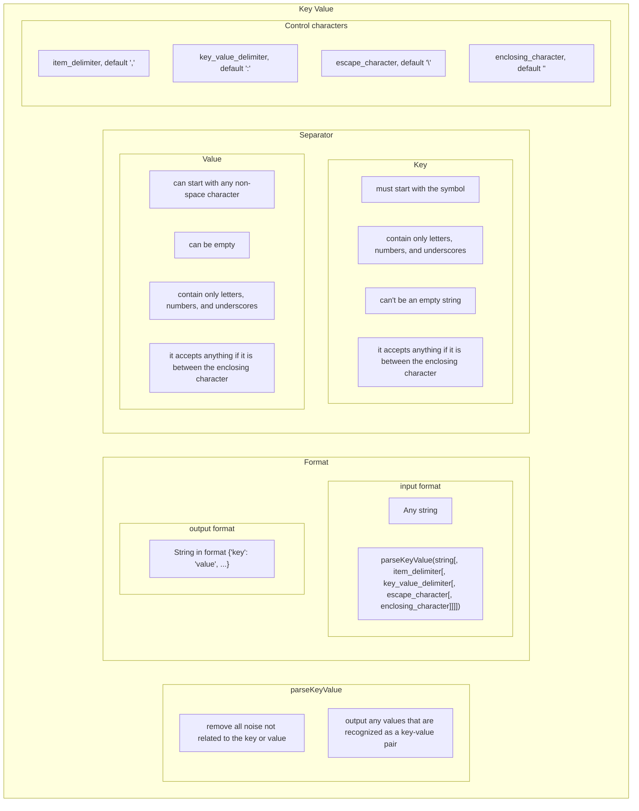

# SRS033 ClickHouse Key Value Function
# Software Requirements Specification

## Table of Contents

* 1 [Introduction](#introduction)
* 2 [Test Feature Diagram](#test-feature-diagram)
* 3 [Requirements](#requirements)
  * 3.1 [Parse Key Value Function](#parse-key-value-function)
    * 3.1.1 [RQ.SRS-033.ClickHouse.ParseKeyValue.Function](#rqsrs-033clickhouseparsekeyvaluefunction)
    * 3.1.2 [RQ.SRS-033.ClickHouse.ParseKeyValue.Function.SupportedDataTypes](#rqsrs-033clickhouseparsekeyvaluefunctionsupporteddatatypes)
    * 3.1.3 [RQ.SRS-033.ClickHouse.ParseKeyValue.Function.UnsupportedDataTypes](#rqsrs-033clickhouseparsekeyvaluefunctionunsupporteddatatypes)
  * 3.2 [Parsing](#parsing)
    * 3.2.1 [RQ.SRS-033.ClickHouse.ParseKeyValue.Parsing.Noise](#rqsrs-033clickhouseparsekeyvalueparsingnoise)
    * 3.2.2 [RQ.SRS-033.ClickHouse.ParseKeyValue.Parsing.RecognizedKeyValuePairs](#rqsrs-033clickhouseparsekeyvalueparsingrecognizedkeyvaluepairs)
  * 3.3 [Format](#format)
    * 3.3.1 [RQ.SRS-033.ClickHouse.ParseKeyValue.Format.Input](#rqsrs-033clickhouseparsekeyvalueformatinput)
    * 3.3.2 [RQ.SRS-033.ClickHouse.ParseKeyValue.Format.Output](#rqsrs-033clickhouseparsekeyvalueformatoutput)
  * 3.4 [Key](#key)
    * 3.4.1 [RQ.SRS-033.ClickHouse.ParseKeyValue.Key.Format](#rqsrs-033clickhouseparsekeyvaluekeyformat)
  * 3.5 [Value](#value)
    * 3.5.1 [RQ.SRS-033.ClickHouse.ParseKeyValue.Value.Format](#rqsrs-033clickhouseparsekeyvaluevalueformat)
  * 3.6 [Item Delimiter](#item-delimiter)
    * 3.6.1 [RQ.SRS-033.ClickHouse.ParseKeyValue.ItemDelimiter](#rqsrs-033clickhouseparsekeyvalueitemdelimiter)
  * 3.7 [Key Value Delimiter](#key-value-delimiter)
    * 3.7.1 [RQ.SRS-033.ClickHouse.ParseKeyValue.KeyValueDelimiter](#rqsrs-033clickhouseparsekeyvaluekeyvaluedelimiter)
  * 3.8 [Escape Character](#escape-character)
    * 3.8.1 [RQ.SRS-033.ClickHouse.ParseKeyValue.EscapeCharacter](#rqsrs-033clickhouseparsekeyvalueescapecharacter)
  * 3.9 [Enclosing Character](#enclosing-character)
    * 3.9.1 [RQ.SRS-033.ClickHouse.ParseKeyValue.EnclosingCharacter](#rqsrs-033clickhouseparsekeyvalueenclosingcharacter)

## Introduction

This software requirements specification covers requirements related to [ClickHouse]
[parseKeyValue] function.

## Test Feature Diagram



## Requirements

### Parse Key Value Function

#### RQ.SRS-033.ClickHouse.ParseKeyValue.Function
version: 1.0

[ClickHouse] SHALL support `parseKeyValue` function that SHALL have the following syntax:


```sql
parseKeyValue(<column_name>|<constant>|<function_return_value>|<alias>[, item_delimiter[, key_value_delimiter[, escape_character[, enclosing_character]]]])
```

For example, 

> Insert into the table parsed key-values from another table

```sql
INSERT INTO table_2 SELECT parseKeyValue(x) FROM table_1;
```

The function SHALL return a `String` object containing parsed keys and values. 

#### RQ.SRS-033.ClickHouse.ParseKeyValue.Function.SupportedDataTypes
version: 1.0

[ClickHouse] SHALL support using the [parseKeyValue] function with the following data types:

* [String]
* [FixedString]

#### RQ.SRS-033.ClickHouse.ParseKeyValue.Function.UnsupportedDataTypes
version: 1.0

[ClickHouse]'s [parseKeyValue] function SHALL return an error if input data type is not supported.

### Parsing

#### RQ.SRS-033.ClickHouse.ParseKeyValue.Parsing.Noise
version: 1.0

[ClickHouse]'s [parseKeyValue] function SHALL remove all noise that is not related to the key or value.

#### RQ.SRS-033.ClickHouse.ParseKeyValue.Parsing.RecognizedKeyValuePairs
version: 1.0

[ClickHouse]'s [parseKeyValue] function SHALL output all values that are recognized as a key-value pair.

### Format

#### RQ.SRS-033.ClickHouse.ParseKeyValue.Format.Input
version: 1.0

[ClickHouse]'s [parseKeyValue] function SHALL accept any string as input.

#### RQ.SRS-033.ClickHouse.ParseKeyValue.Format.Output
version: 1.0

[ClickHouse]'s [parseKeyValue] function SHALL return a string in the following format:

`{'key': 'value', ...}`

### Key

#### RQ.SRS-033.ClickHouse.ParseKeyValue.Key.Format
version: 1.0

[ClickHouse]'s [parseKeyValue] function SHALL recognize the key in the input string
if it satisfies the following conditions:

* Key starts with the symbol.
* Only symbols, numbers, and underscore are used in the key.
* Key can't be an empty string.
* If not supported symbols are escaped or a value is enclosed, the key can be any string. 

### Value

#### RQ.SRS-033.ClickHouse.ParseKeyValue.Value.Format
version: 1.0

[ClickHouse]'s [parseKeyValue] function SHALL recognize the value in the input string
if it satisfies the following conditions:

* Key starts with any non-space symbol.
* Only symbols, numbers, and underscore are used in the value.
* Value can be an empty string.
* If not supported symbols are escaped or a value is enclosed, value can be any string. 

### Item Delimiter

#### RQ.SRS-033.ClickHouse.ParseKeyValue.ItemDelimiter
version: 1.0

[ClickHouse]'s [parseKeyValue] function SHALL support specifying `item_delimeter`
which SHALL divide key value pairs in input string.

By default the function SHALL specify `item_delimeter` as `,`.

### Key Value Delimiter

#### RQ.SRS-033.ClickHouse.ParseKeyValue.KeyValueDelimiter
version: 1.0

[ClickHouse]'s [parseKeyValue] function SHALL support specifying `key_value_delimiter`
which SHALL divide key value pairs among themselves.

By default the function SHALL specify `key_value_delimiter` as `:`.

### Escape Character

#### RQ.SRS-033.ClickHouse.ParseKeyValue.EscapeCharacter
version: 1.0

[ClickHouse]'s [parseKeyValue] function SHALL support specifying `escape_character`
which SHALL escape symbols which allows you to use unsupported characters in a key or value.

By default the function SHALL specify `escape_character` as `\`.

### Enclosing Character

#### RQ.SRS-033.ClickHouse.ParseKeyValue.EnclosingCharacter
version: 1.0

[ClickHouse]'s [parseKeyValue] function SHALL support specifying `enclosing_character`
which SHALL enclose symbols which allows you to use unsupported characters in a key or value.

By default the function SHALL specify `enclosing_character` as `"`.

[String]: https://clickhouse.com/docs/en/sql-reference/data-types/string
[FixedString]: https://clickhouse.com/docs/en/sql-reference/data-types/fixedstring
[parseKeyValue]: https://github.com/arthurpassos/KeyValuePairFileProcessor
[ClickHouse]: https://clickhouse.tech
