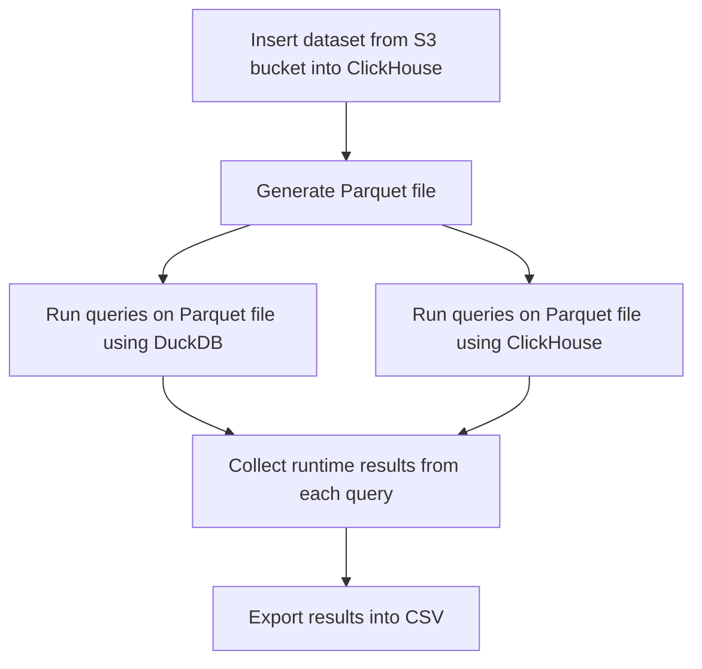

# Parquet Performance

## ClickHouse Performance Test Program

Performance tests can be launched with `./perfomance.py` command. The program will generate a parquet file and run 
a set of queries on it using ClickHouse and DuckDB, collect runtime results from each query and export the 
results into a CSV file. Below you can see a [diagram](#performance-tests-diagram) demonstrating the flow of the process.


> ***WARNING:*** For clear runs `rm -rf _instances` should be used to delete all docker-compose volumes information.


### Performance Tests Diagram


## Running Tests and Program Settings

### Run Tests

*Example* to run tests on `x86` machine:

```shell
./performance.py --clickhouse-binary-path docker://clickhouse/clickhouse-server:23.7.4.5-alpine --clickhouse-version 23.7.4.5 --duckdb-binary-path https://github.com/duckdb/duckdb/releases/download/v0.8.1/duckdb_cli-linux-amd64.zip 
```

*Example* to run tests on `ARM` machine:

```shell
./performance.py --clickhouse-binary-path docker://clickhouse/clickhouse-server:23.7.4.5-alpine --clickhouse-version 23.7.4.5 --duckdb-binary-path https://github.com/duckdb/duckdb/releases/download/v0.8.1/duckdb_cli-linux-aarch64.zip 
```

### Program Settings

- `--clickhouse-binary-path` specifies the path to the ClickHouse binary on the host machine that will be used during the run. You can also use docker image that should have docker:// prefix. (default: `/usr/bin/clickhouse`)
- `--duckdb-binary-path` path to duckdb binary, need to specify duckdb CLI binary download link from [duckdb website](https://duckdb.org/docs/installation/) (default:: `/tmp/binary`)
- `--from-year` and `--to-year` these settings determine the size of the dataset for the parquet file. (default values are: from 1987 to 2022, the range results in a parquet file with 200 million rows)
- `--threads` determines the number of threads used in creating a parquet file with large dataset. (default: 20)
- `--max-memory-usage` sets the maximum amount of RAM (in bytes) to use for running a query on a single server, 0 sets it to unlimited (default: 0)
- `--compression` determines the compression used for a generated parquet file (default: snappy)
- `--rerun-queries` the number of times each query in the steps file will be run (default: 3)
- `--filename` determines the name of the CSV file that contains the results of the test run (default: query.csv)
- `--log` path to the log file where test output will be stored


 
> - If you set `--threads` to 0 it will disable parallel execution, but this will significantly increase test runtime and potentially result in a test timeout.
> - If you change the`--compression` value make sure DuckDB supports reading from file with this compression type. Currently `none` and `snappy` are supported both by ClickHouse and DuckDB.

#### Examples

1) In the process of generating parquet file, we use the [ontime airlines dataset](https://clickhouse.com/docs/en/getting-started/example-datasets/ontime).
We can choose the size of our dataset by specifying `--from-year` and `--to-year`, these values can be set in range of `1987-2022`.

*Examples* to run performance test with parquet file that has 200 million rows

```shell
sudo ./performance.py --duckdb-binary-path https://github.com/duckdb/duckdb/releases/download/v0.8.1/duckdb_cli-linux-amd64.zip --clickhouse-binary-path docker://clickhouse/clickhouse-server:23.7.4.5-alpine --clickhouse-version 23.7.4.5 --from-year 1987 --to-year 2022 
```
> Decreasing the range between `--from-year` and `--to-year` results in a smaller dataset. For examples from our tests `--from-year 1987 --to-year 2015` is around 166 million rows.
 

