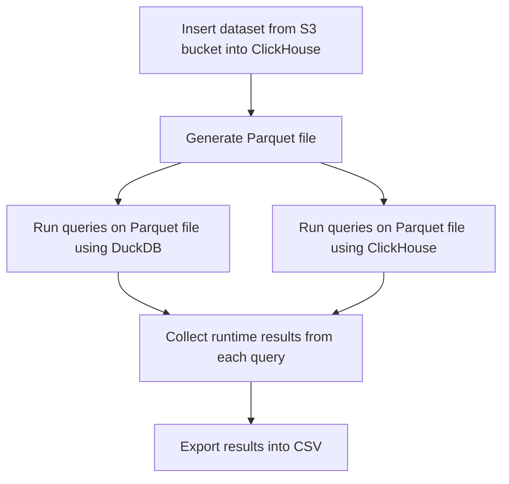

# Parquet Performance

## ClickHouse Performance Test Program

Performance tests can be launched with `./perfomance.py` command. The program will generate a parquet file and run 
a set of queries on it using ClickHouse and DuckDB, at the end comparing the runtime of these two.
Default paths for ClickHouse and Duckdb binaries are `/usr/bin/clickhouse` and `/usr/bin/duckdb`.

*WARNING:* For clear runs `rm -rf _instances` should be used to delete all docker-compose volumes information.

## Performance Tests Diagram

