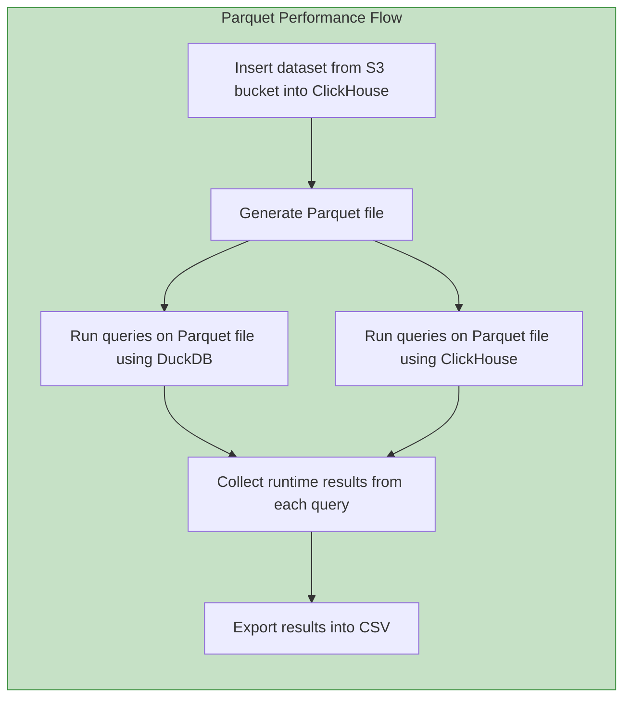

# Parquet Performance

## Performance Tests flow

```mermaid
flowchart LR
    style R fill:#C6E1C6,stroke:#3D9140,stroke-width:1px;


    subgraph R[Parquet Performance Flow]
        B[Insert dataset from S3 bucket into ClickHouse]
        B --> C[Generate Parquet file]
        C --> D[Run queries on Parquet file using DuckDB]
        C --> E[Run queries on Parquet file using ClickHouse]
        D --> F[Collect runtime results from each query]
        E --> F
        F --> G[Export results into CSV]
    end

```
