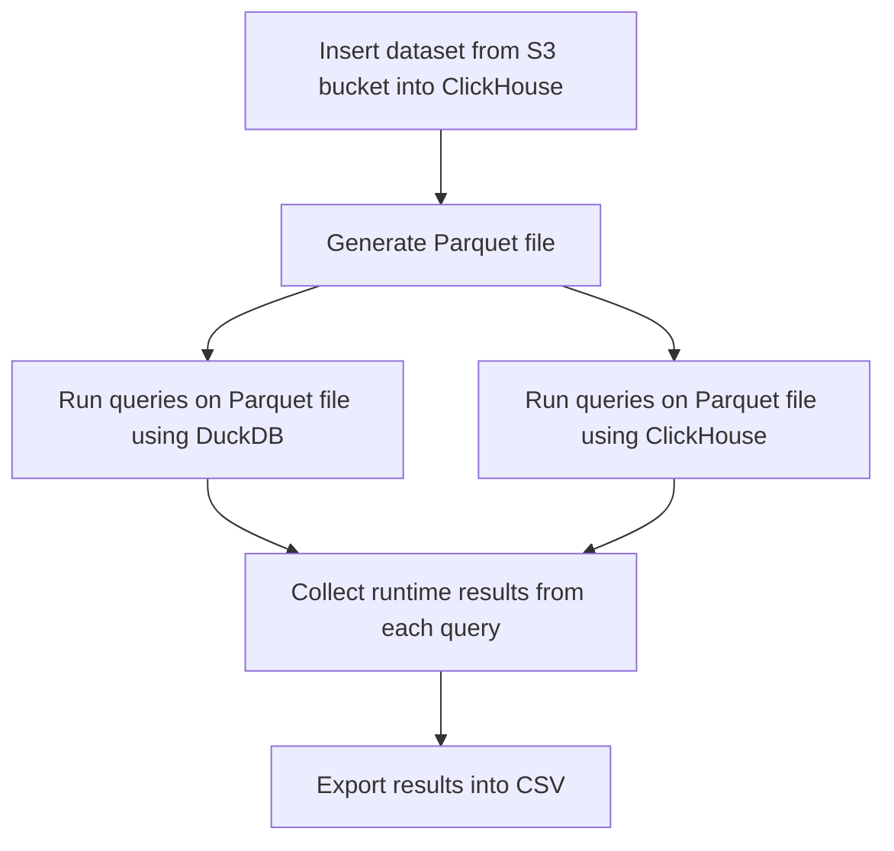

# Parquet Performance

## Table of Contents

* 1 [ClickHouse Performance Test Program](#ClickHouse-Performance-Test-Program)
  * 1.1 [Performance Tests Diagram](#performance-tests-diagram)
* 2 [Running Tests and Program Settings](#running-tests-and-program-settings)
  * 2.1 [Run Tests](#run-tests)
  * 2.2 [Program Settings](#program-settings)
    * 2.2.1 [Examples](#examples)
* 3 [Additional Information](#additional-information)
  * 3.1 [How Do We Calculate The Runtime](#how-do-we-calculate-the-runtime)
  * 3.2 [Test Environment Configuration](#test-environment-configuration)

## [ClickHouse Performance Test Program](#table-of-contents)

Performance tests can be launched with `./perfomance.py` command. The program will generate a parquet file and run 
a set of queries on it using ClickHouse and DuckDB, collect runtime results from each query and export the 
results into a CSV file. Below you can see a [diagram](#performance-tests-diagram) demonstrating the flow of the process.

> [!WARNING]
> For clear runs `rm -rf _instances` should be used to delete all docker-compose volumes information.


### [Performance Tests Diagram](#table-of-contents)


## [Running Tests and Program Settings](#table-of-contents)

### [Run Tests](#table-of-contents)

*Example* to run tests on `x86` machine:

```shell
./performance.py --clickhouse-binary-path docker://clickhouse/clickhouse-server:23.7.4.5-alpine --clickhouse-version 23.7.4.5 --duckdb-binary-path https://github.com/duckdb/duckdb/releases/download/v0.8.1/duckdb_cli-linux-amd64.zip 
```

*Example* to run tests on `ARM` machine:

```shell
./performance.py --clickhouse-binary-path docker://clickhouse/clickhouse-server:23.7.4.5-alpine --clickhouse-version 23.7.4.5 --duckdb-binary-path https://github.com/duckdb/duckdb/releases/download/v0.8.1/duckdb_cli-linux-aarch64.zip 
```

### [Program Settings](#table-of-contents)

- `--clickhouse-binary-path` specifies the path to the ClickHouse binary on the host machine that will be used during the run. You can also use docker image that should have docker:// prefix. (default: `/usr/bin/clickhouse`)
- `--duckdb-binary-path` path to duckdb binary, need to specify duckdb CLI binary download link from [duckdb website]
- `--from-year` and `--to-year` these settings determine the size of the dataset for the parquet file. (default values are: from 1987 to 2022, the range results in a parquet file with 200 million rows)
- `--threads` determines the number of threads used in creating a parquet file with large dataset. (default: 20)
- `--max-memory-usage` sets the maximum amount of RAM (in bytes) to use for running a query on a single server, 0 sets it to unlimited (default: 0)
- `--compression` determines the compression used for a generated parquet file (default: snappy)
- `--rerun-queries` the number of times each query in the [steps] file will be run (default: 3)
- `--filename` determines the name of the CSV file that contains the results of the test run (default: query.csv)
- `--log` path to the log file where test output will be stored


> [!IMPORTANT] 
> - If you set `--threads` to 0 it will disable parallel execution, but this will significantly increase test runtime and potentially result in a test timeout (this setting is only used to speed up the process of generating a parquet file).
> - If you change the`--compression` value make sure DuckDB supports reading from file with this compression type. Currently `none` and `snappy` are supported both by ClickHouse and DuckDB.
> - `--duckdb-binary-path` is a required setting, test program will throw an error if it's not specified. 

#### [Examples](#table-of-contents)

1) In the process of generating parquet file, we use the [ontime airlines dataset].
We can choose the size of our dataset by specifying `--from-year` and `--to-year`, these values can be set in range of `1987-2022`.

*Example* to run performance test with parquet file that has 200 million rows:

```shell
sudo ./performance.py --duckdb-binary-path https://github.com/duckdb/duckdb/releases/download/v0.8.1/duckdb_cli-linux-amd64.zip --clickhouse-binary-path docker://clickhouse/clickhouse-server:23.7.4.5-alpine --clickhouse-version 23.7.4.5 --from-year 1987 --to-year 2022 
```
> Decreasing the range between `--from-year` and `--to-year` results in a smaller dataset. For example, from our tests `--from-year 1987 --to-year 2015` is around 166 million rows.
 
2) You can run performance test program using different ClickHouse and DuckDB versions, for this use `--clickhouse-binary-path` and `--duckdb-binary-path` settings.

*Example* to run test with ClickHouse 22.8:
```shell
./performance.py --clickhouse-binary-path docker://clickhouse/clickhouse-server:22.8 --clickhouse-version 22.8 --duckdb-binary-path https://github.com/duckdb/duckdb/releases/download/v0.8.1/duckdb_cli-linux-amd64.zip 
```

*Example* to run test with DuckDB 0.7.1:
```shell
./performance.py --clickhouse-binary-path docker://clickhouse/clickhouse-server:22.8 --clickhouse-version 22.8 --duckdb-binary-path https://github.com/duckdb/duckdb/releases/download/v0.7.1/duckdb_cli-linux-amd64.zip 
```
> [!NOTE]
> I'f you want to run the test with different DuckDB version after already running it once, make sure to remove `duckdb` from `/tmp` directory.

> [!WARNING]
> Tests were performed using the latest DuckDB release, using old versions might cause some compatability issues.

3) Other than reading the generated CSV file you can check the runtime for each query directly form the terminal using [testflows].
For this you need to access the temporary log file that is generated by default or specify the path before running the test with `--log test.log`.

*Example* to get metrics using [testflows]:
```shell
cat test.log | tfs show metrics
```

## [Additional Information](#table-of-contents)

### [How Do We Calculate The Runtime](#table-of-contents)
We have a set of queries stored inside the [steps] file, both ClickHouse and DuckDB run each query `n` number of times based on the value of `--rerun-queries` setting.
For each query we get samples containing the runtime of each run, from this sample we take a minimal value and use it as a metric. 

For example, if we use the default value of `--rerun-queries` setting, which is 3, each query from the [steps] 
file will be run 3 times and each one of these queries will produce samples like this: `[0.53, 0.52, 0.54]`. As a metric we will use the minimal value from this list
 `runtime = min[0.53, 0.52, 0.54]`

### [Test Environment Configuration](#table-of-contents)

The test program was executed on a Hetzner Cloud machine (CPX51) with the following specifications:

- vCPU: 16 (AMD)
- RAM: 32GB
- Disk space: 360 GB
- System: Ubuntu 22.04.2 LTS

[testflows]: https://testflows.com/
[steps]: https://github.com/Altinity/clickhouse-regression/blob/main/parquet/performance/tests/duckdb/steps.py
[duckdb website]: https://duckdb.org/docs/installation/
[ontime airlines dataset]: https://clickhouse.com/docs/en/getting-started/example-datasets/ontime
