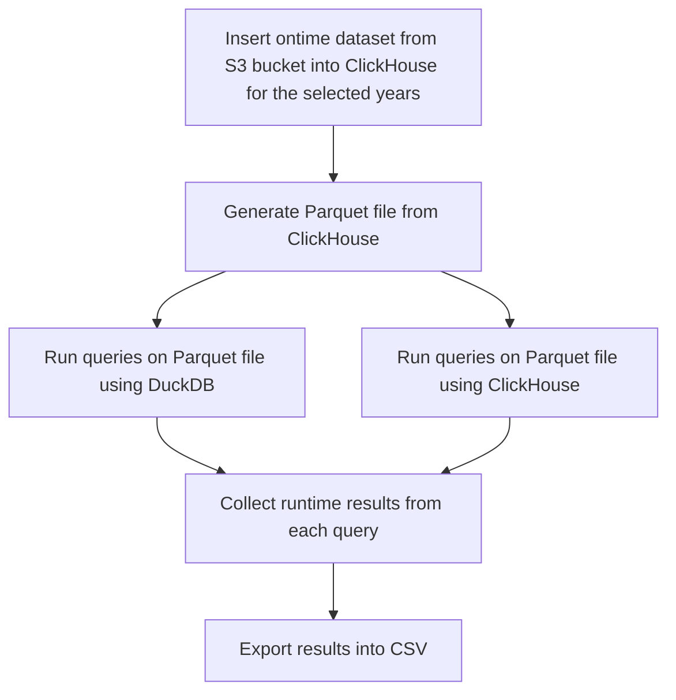

# Parquet Performance

## Table of Contents

* 1 [ClickHouse Performance Test Program](#ClickHouse-Performance-Test-Program)
  * 1.1 [References and Resources](#references-and-resources)
  * 1.2 [Versions Tested](#versions-tested)
  * 1.3 [Performance Tests Diagram](#performance-tests-diagram)
* 2 [Running The Test Program](#running-the-test-program)
  * 2.1 [Run Tests](#run-tests)
    * 2.1.1 [Run Tests On x86 Machine](#run-tests-on-x86-machine)
    * 2.1.2 [Run Tests On ARM Machine](#run-tests-on-arm-machine)
  * 2.2 [Program Settings](#program-settings)
  * 2.3 [Examples](#examples)
    * 2.3.1 [Run Performance Test Program With Parquet File That Has 200 Million Rows](#run-performance-test-program-with-parquet-file-that-has-200-million-rows)
    * 2.3.2 [Run Performance Test Program With Parquet File That Has 166 Million Rows](#run-performance-test-program-with-parquet-file-that-has-166-million-rows)
    * 2.3.3 [Run Test Program With ClickHouse 22.8](#run-test-program-with-clickhouse-228)
    * 2.3.4 [Run Test Program With DuckDB 0.7.1](#run-test-program-with-duckdb-071)
    * 2.3.5 [Get Metrics Using TestFlows](#get-metrics-using-testflows)
* 3 [Additional Information](#additional-information)
  * 3.1 [How Do We Calculate The Runtime](#how-do-we-calculate-the-runtime)
  * 3.2 [Test Environment Configuration](#test-environment-configuration)
  * 3.3 [Test Results](#test-results)

## [ClickHouse Performance Test Program](#table-of-contents)

Performance tests can be launched with `./perfomance.py` command. The program will generate a parquet file and run 
a set of queries on it using ClickHouse and DuckDB, collect runtime results from each query and export the 
results into a CSV file. Below you can see a [diagram](#performance-tests-diagram) demonstrating the flow of the process.

> [!WARNING]
> - For clear runs `rm -rf _instances` should be used to delete all docker-compose volume information.
> - Tests were performed using the latest DuckDB release, using old versions might cause some compatability issues.


### [References and Resources](#table-of-contents)

* https://clickhouse.com/docs/en/intro
* https://clickhouse.com/docs/en/getting-started/example-datasets/ontime
* https://transtats.bts.gov/PREZIP/
* https://duckdb.org/docs/


### [Versions Tested](#table-of-contents)

The list contains the versions of ClickHouse and DuckDB that were used when running the test program:

* ClickHouse:
  * 23.7.4.5
  * 23.3.1
  * 22.8.10
* DuckDB:
  * 0.8.1

### [Performance Tests Diagram](#table-of-contents)


## [Running The Test Program](#table-of-contents)

### [Run Tests](#table-of-contents)

#### Run tests on `x86` machine:

```shell
./performance.py --clickhouse-binary-path docker://clickhouse/clickhouse-server:23.7.4.5-alpine --clickhouse-version 23.7.4.5 --duckdb-binary-path https://github.com/duckdb/duckdb/releases/download/v0.8.1/duckdb_cli-linux-amd64.zip 
```

#### Run tests on `ARM` machine:

```shell
./performance.py --clickhouse-binary-path docker://clickhouse/clickhouse-server:23.7.4.5-alpine --clickhouse-version 23.7.4.5 --duckdb-binary-path https://github.com/duckdb/duckdb/releases/download/v0.8.1/duckdb_cli-linux-aarch64.zip 
```

### [Program Settings](#table-of-contents)

- `--clickhouse-binary-path` specifies the path to the ClickHouse binary on the host machine that will be used during the run. You can also use docker image that should have `docker://` prefix. (default: `/usr/bin/clickhouse`)
- `--duckdb-binary-path` path to duckdb binary, need to specify duckdb CLI binary download link from the [DuckDB website]
- `--from-year` and `--to-year` these settings determine the size of the dataset for the parquet file. (default values are: from 1987 to 2022, the range results in a parquet file with 200 million rows)
- `--threads` determines the number of threads used in creating a parquet file. (default: 20)
- `--max-memory-usage` sets the maximum amount of RAM (in bytes) to use for running a query on a single server, 0 sets it to unlimited (default: 0)
- `--compression` determines the compression used for a generated parquet file (default: snappy)
- `--rerun-queries` the number of times each query will be run (default: 3)
- `--filename` determines the name of the CSV file that contains the results of the program run (default: performance.csv)
- `--log` path to the log file where test program output will be stored


> [!IMPORTANT] 
> - If you set `--threads` to 0 it will disable parallel execution when creating a parquet file, but this will significantly increase test program runtime and potentially result in a test timeout (this setting is only used to speed up the process of generating a parquet file using ClickHouse).
> - If you change the`--compression` value make sure DuckDB supports reading from file with this compression type. Currently `none` and `snappy` are supported both by ClickHouse and DuckDB.
> - `--duckdb-binary-path` is a required setting, test program will throw an error if it's not specified. 

### [Examples](#table-of-contents)

#### Run performance test program with parquet file that has 200 million rows:

```shell
sudo ./performance.py --duckdb-binary-path https://github.com/duckdb/duckdb/releases/download/v0.8.1/duckdb_cli-linux-amd64.zip --clickhouse-binary-path docker://clickhouse/clickhouse-server:23.7.4.5-alpine --clickhouse-version 23.7.4.5 --to-year 2022 
```

#### Run performance test program with parquet file that has 166 million rows:

```shell
sudo ./performance.py --duckdb-binary-path https://github.com/duckdb/duckdb/releases/download/v0.8.1/duckdb_cli-linux-amd64.zip --clickhouse-binary-path docker://clickhouse/clickhouse-server:23.7.4.5-alpine --clickhouse-version 23.7.4.5 --to-year 2015 
```

#### Run test program with ClickHouse 22.8:
```shell
./performance.py --clickhouse-binary-path docker://clickhouse/clickhouse-server:22.8 --clickhouse-version 22.8 --duckdb-binary-path https://github.com/duckdb/duckdb/releases/download/v0.8.1/duckdb_cli-linux-amd64.zip 
```

#### Run test program with DuckDB 0.7.1:
```shell
./performance.py --clickhouse-binary-path docker://clickhouse/clickhouse-server:22.8 --clickhouse-version 22.8 --duckdb-binary-path https://github.com/duckdb/duckdb/releases/download/v0.7.1/duckdb_cli-linux-amd64.zip 
```
> [!NOTE]
> If you want to run the test program with different DuckDB version after already running it once, make sure to remove `duckdb` from the `/tmp` directory.

#### Get metrics using [TestFlows]:
```shell
cat test.log | tfs show metrics
```

## [Additional Information](#table-of-contents)

### [Calculating Query Runtime](#table-of-contents)
The set of queries is stored inside the [steps] file. both ClickHouse and DuckDB run each query `n` number of times based on the value of `--rerun-queries` setting.
For each query we get samples containing the runtime of each query run, from the samples collected we take a minimal value and use it as a metric. 

For example, if we use the default value of `--rerun-queries` setting, which is 3, each query from the [steps] 
file will be run 3 times and each one of these queries will produce samples like this: `[0.53, 0.52, 0.54]`. As a metric we will use the minimal value from this list:
```python
runtime = min([0.53, 0.52, 0.54])
```
### [Test Environment Configuration](#table-of-contents)

The test program was executed on a Hetzner Cloud machine (CPX51) with the following specifications:

- vCPU: 16 (AMD)
- RAM: 32GB
- Disk space: 360 GB
- System: Ubuntu 22.04.2 LTS

### [Test Results](#table-of-contents)

Test results can be found inside the [performance_reports] directory.

[TestFlows]: https://testflows.com/
[steps]: https://github.com/Altinity/clickhouse-regression/blob/main/parquet/performance/tests/duckdb/steps.py
[DuckDB website]: https://duckdb.org/docs/installation/
[ontime airlines dataset]: https://clickhouse.com/docs/en/getting-started/example-datasets/ontime
[performance_reports]: https://github.com/Altinity/clickhouse-regression/tree/main/parquet/performance/performance_reports
