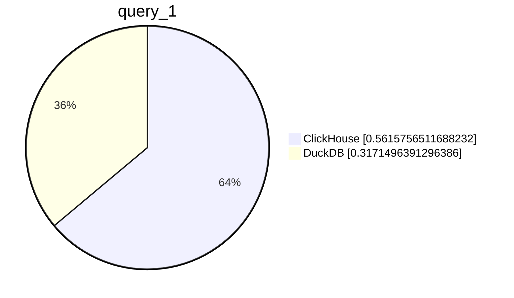
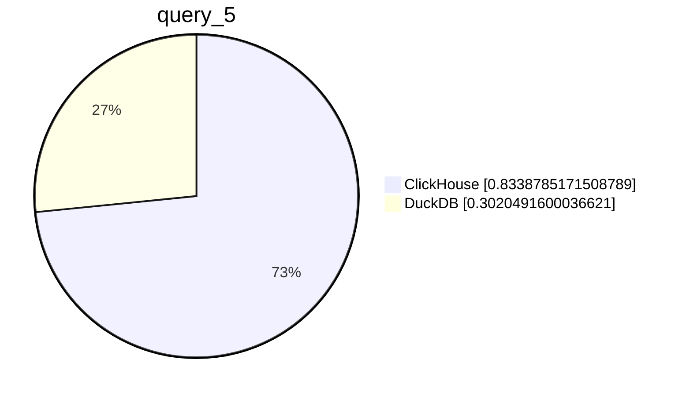
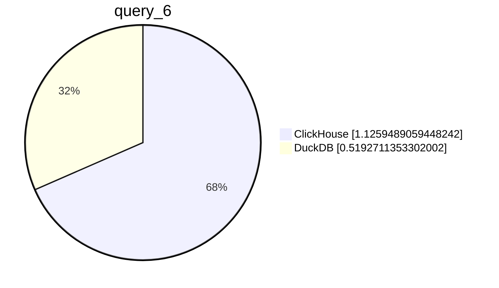
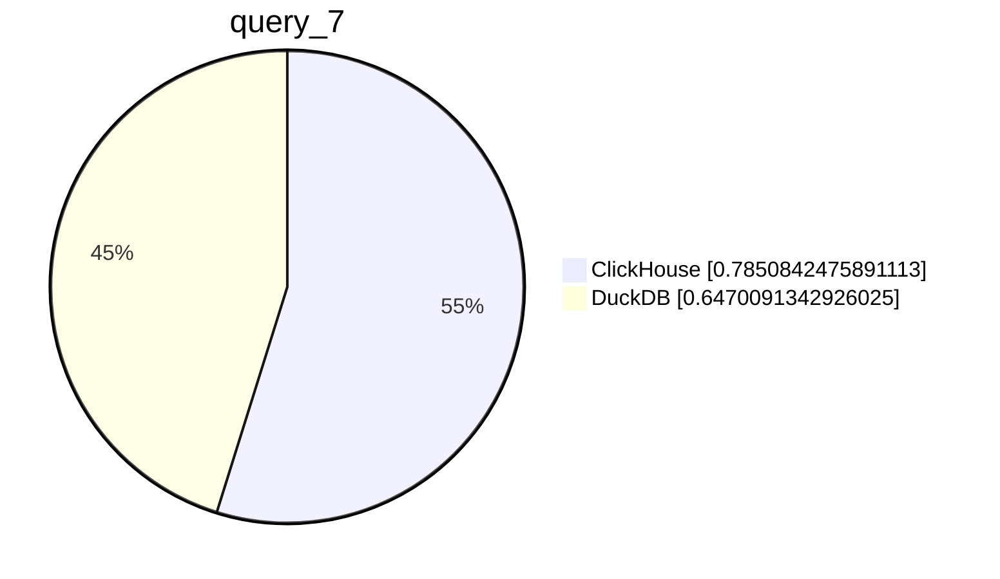
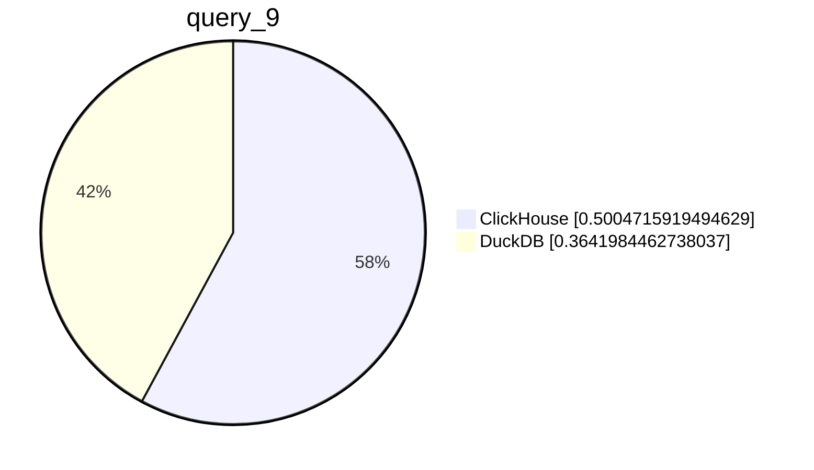

# ClickHouse vs DuckDB Runtime in Seconds

                

                

                

                

                

                

                

                

                

                
