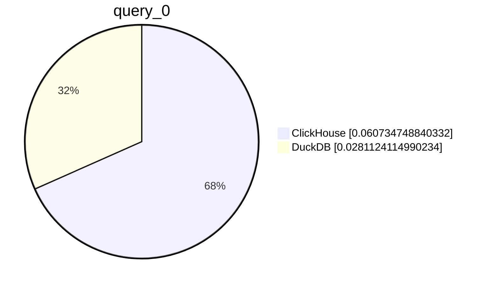
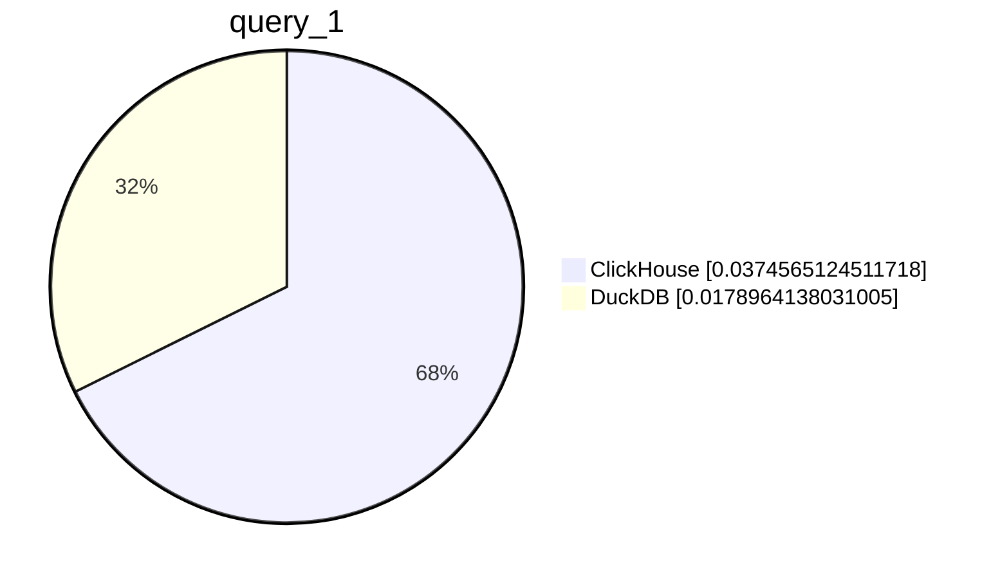
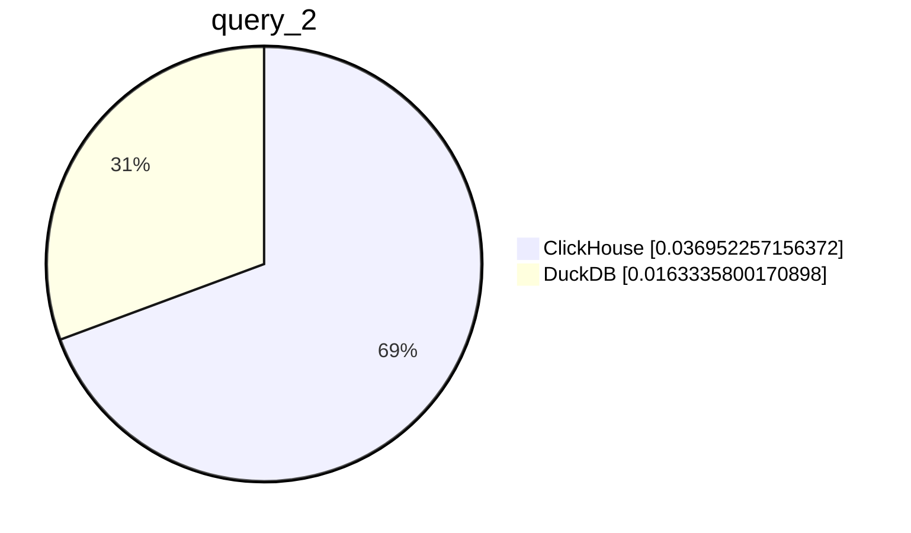
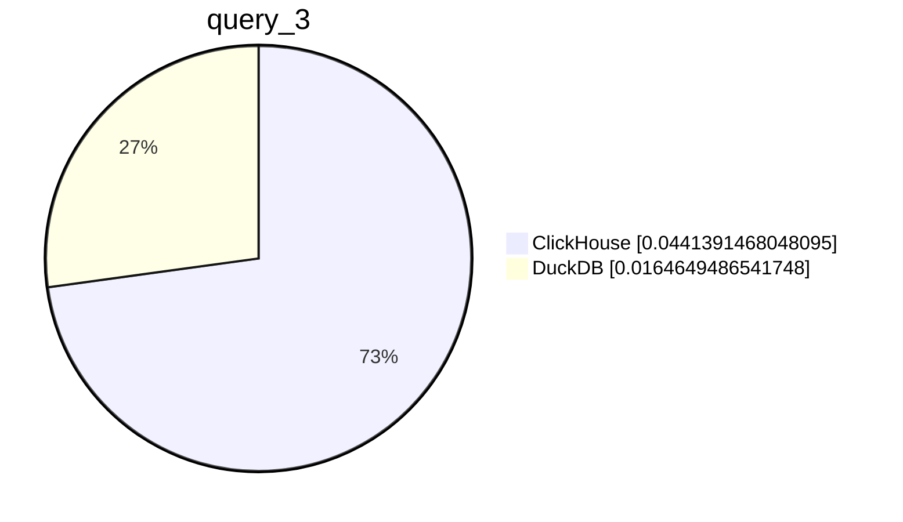
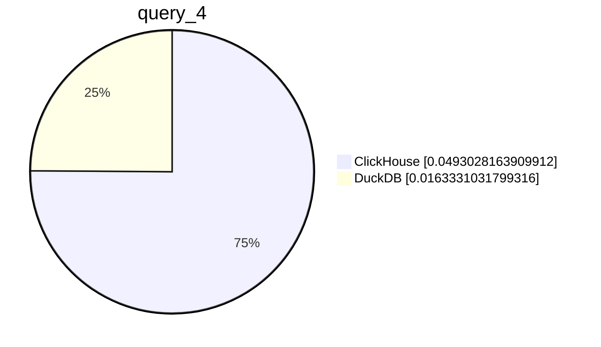
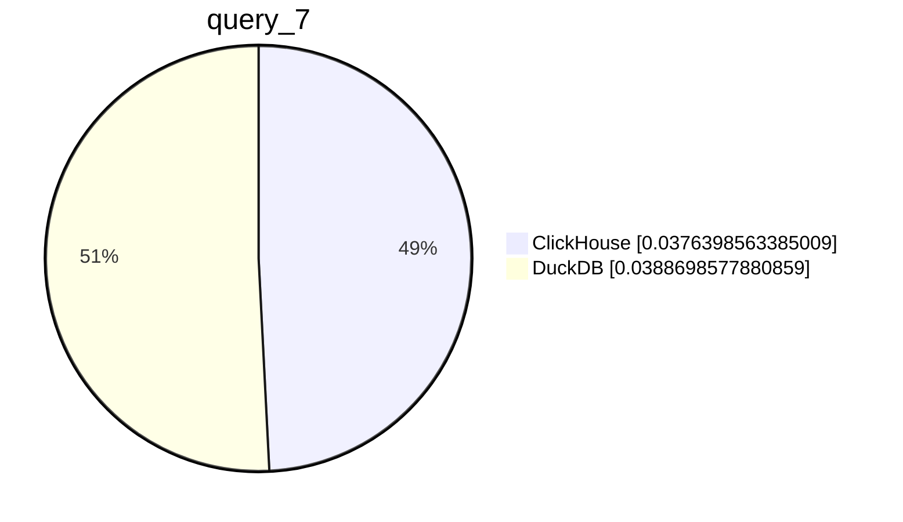
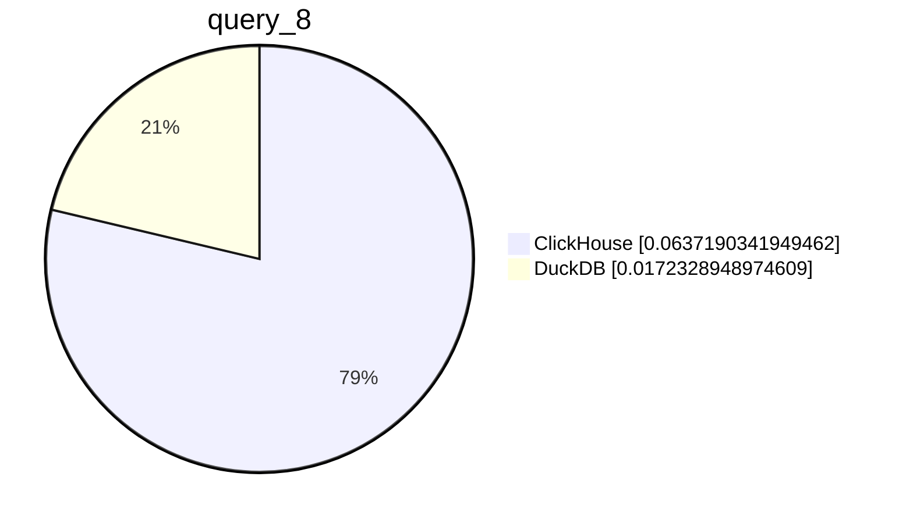

# ClickHouse vs DuckDB

                

                

                

                

                

                

                

                

                

                