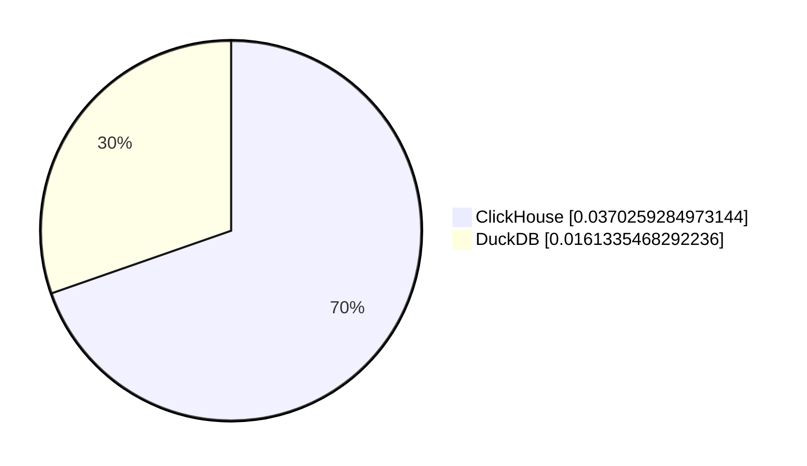
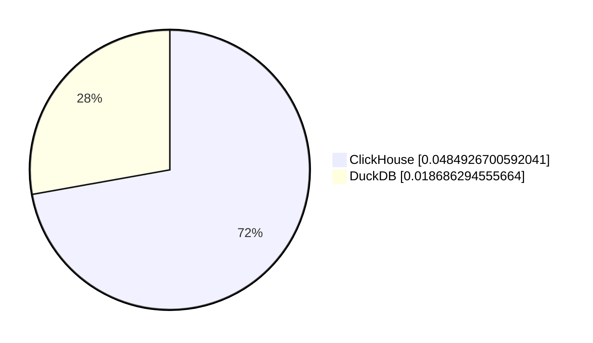
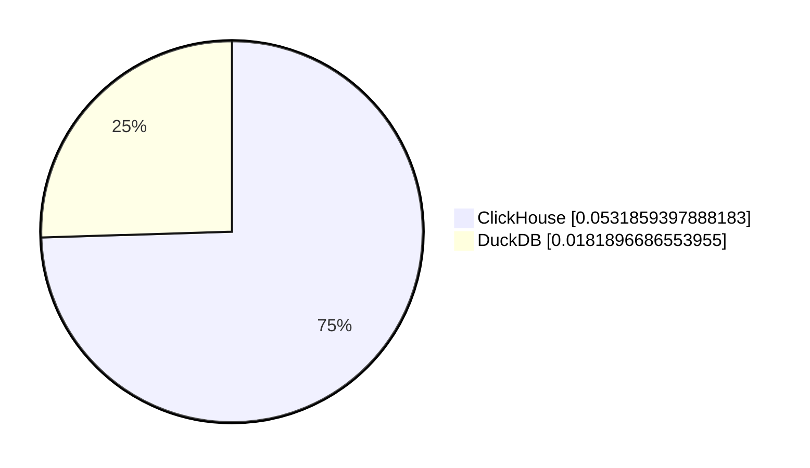
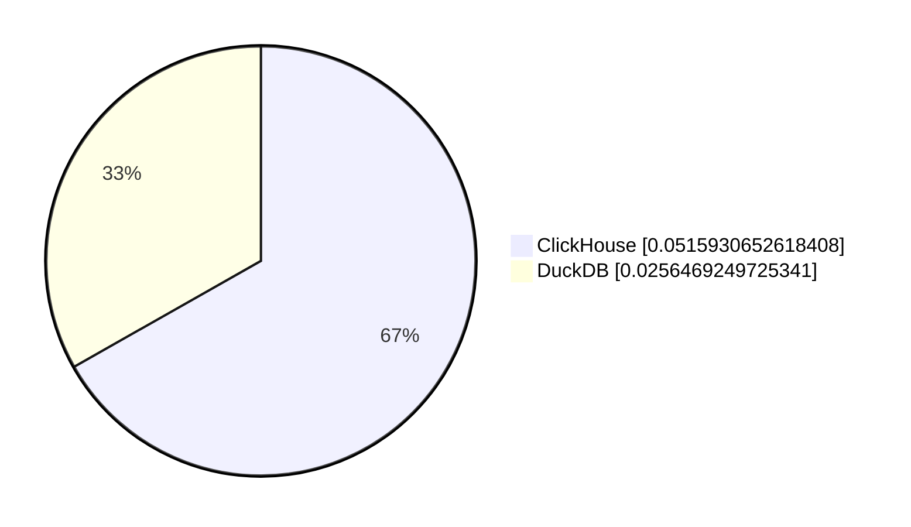
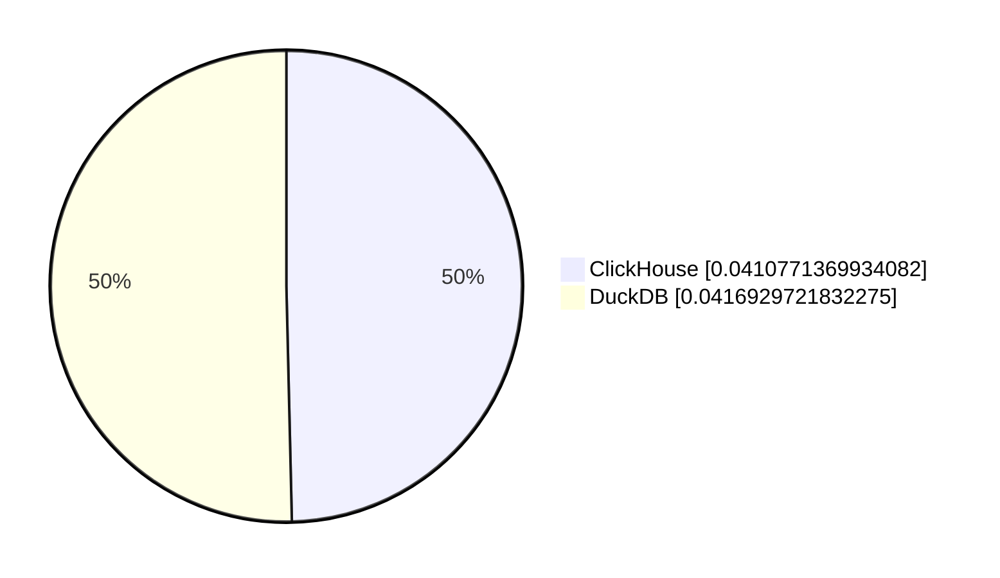
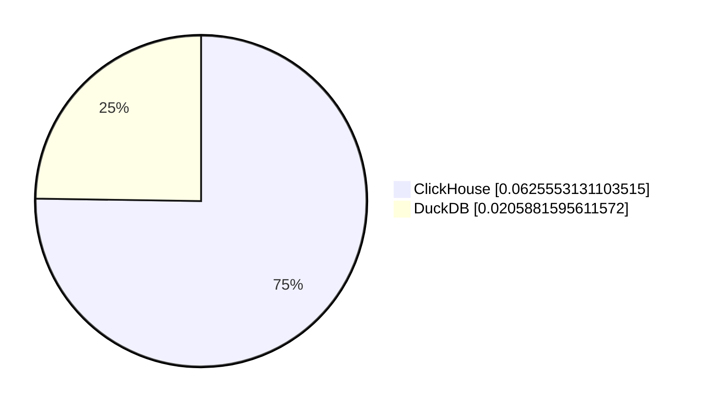
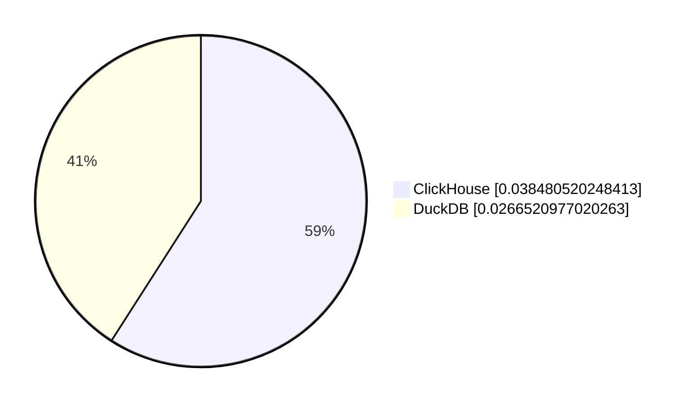

# ClickHouse vs DuckDB (Runtime in Seconds)

## Bar Chart

# query_0
```sql
 0.03050994873046875
```


# query_1
```sql
 0.01834726333618164
```


# query_2
```sql
 0.017071008682250977
```


# query_3
```sql
 0.017354726791381836
```


# query_4
```sql
 0.01774454116821289
```


# query_5
```sql
 0.017787456512451172
```


# query_6
```sql
 0.01692819595336914
```


# query_7
```sql
 0.04089522361755371
```


# query_8
```sql
 0.02028656005859375
```


# query_9
```sql
 0.02611255645751953
```


