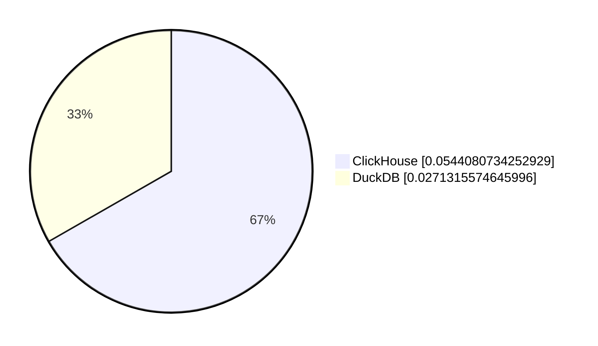
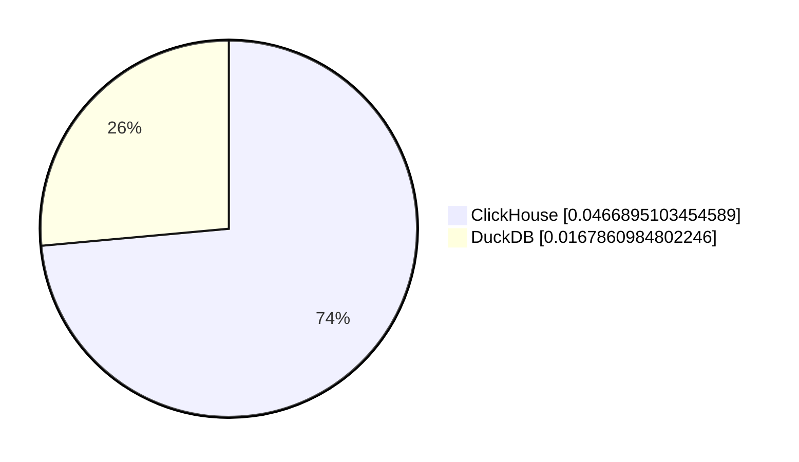
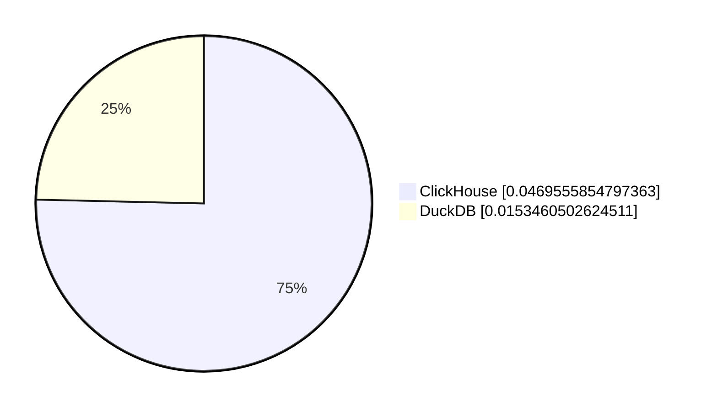
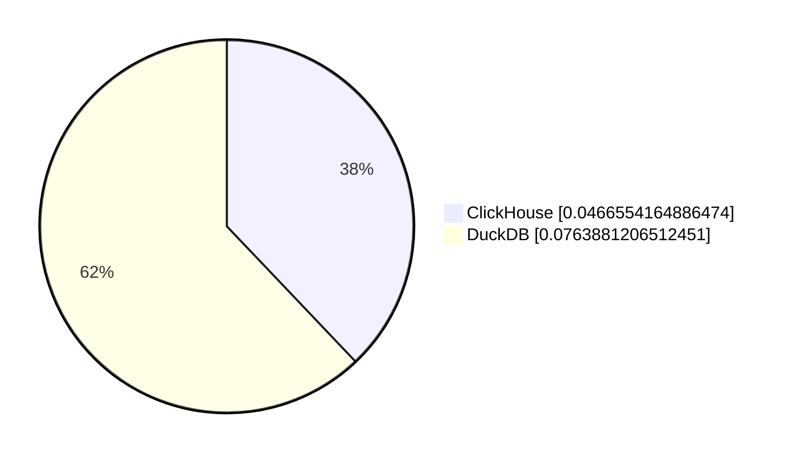
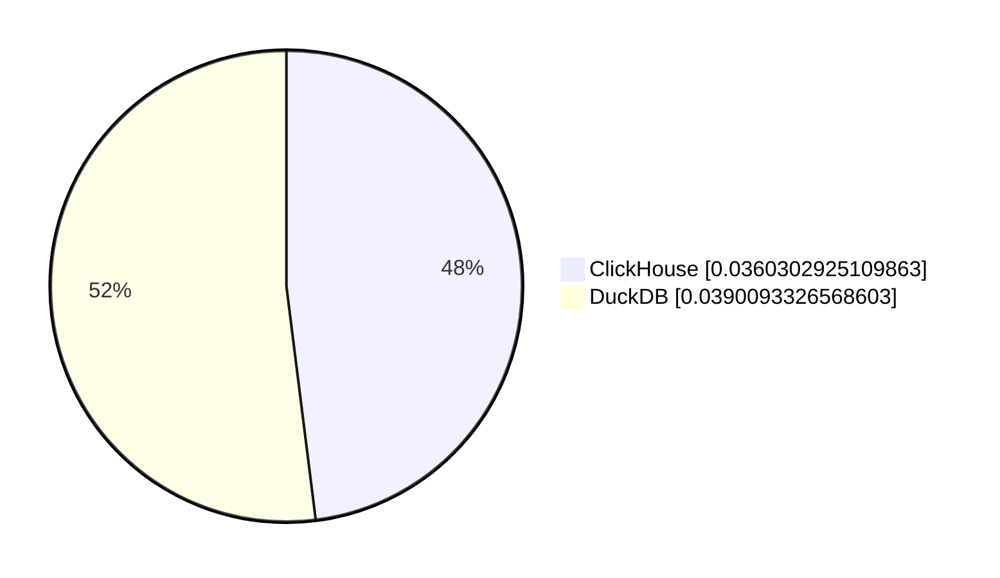
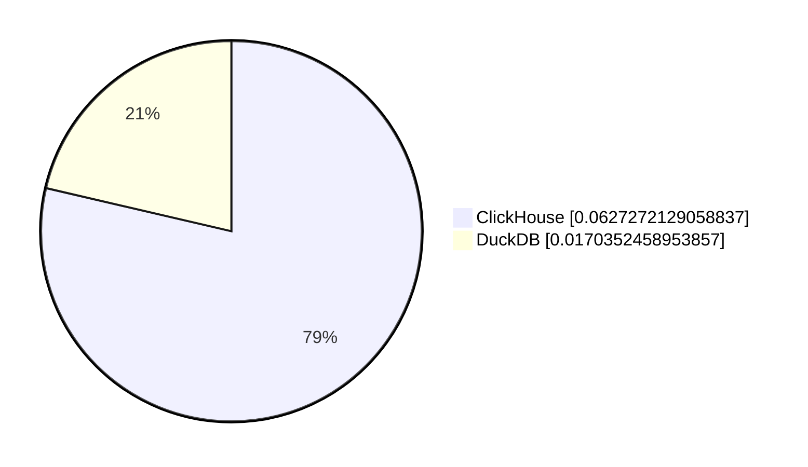
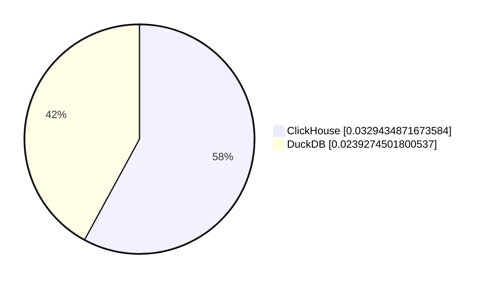

# ClickHouse vs DuckDB (Runtime in Seconds)

# query_0
```sql
 SELECT avg(c1) FROM(SELECT Year, Month, count(*) AS c1 FROM file(ontime_parquet_5dc41c59_45b8_11ee_9778_5ddce775f86b.parquet) GROUP BY Year, Month);
```


# query_1
```sql
 SELECT DayOfWeek, count(*) AS c FROM file(ontime_parquet_5dc41c59_45b8_11ee_9778_5ddce775f86b.parquet) WHERE Year>=2000 AND Year<=2008 GROUP BY DayOfWeek ORDER BY c DESC;
```


# query_2
```sql
 SELECT DayOfWeek, count(*) AS c FROM file('ontime_parquet_5dc41c59_45b8_11ee_9778_5ddce775f86b.parquet') WHERE Year>=2000 AND Year<=2008 GROUP BY DayOfWeek ORDER BY c DESC;
```


# query_3
```sql
 SELECT Origin, count(*) AS c FROM file('ontime_parquet_5dc41c59_45b8_11ee_9778_5ddce775f86b.parquet') WHERE DepDelay>10 AND Year>=2000 AND Year<=2008 GROUP BY Origin ORDER BY c DESC LIMIT 10;
```


# query_4
```sql
 SELECT IATA_CODE_Reporting_Airline AS Carrier, count(*) FROM file('ontime_parquet_5dc41c59_45b8_11ee_9778_5ddce775f86b.parquet') WHERE DepDelay>10 AND Year=2007 GROUP BY Carrier ORDER BY count(*) DESC;
```


# query_5
```sql
 SELECT IATA_CODE_Reporting_Airline AS Carrier, avg(DepDelay>10)*100 AS c3 FROM file('ontime_parquet_5dc41c59_45b8_11ee_9778_5ddce775f86b.parquet') WHERE Year=2007 GROUP BY Carrier ORDER BY c3 DESC
```


# query_6
```sql
 SELECT IATA_CODE_Reporting_Airline AS Carrier, avg(DepDelay>10)*100 AS c3 FROM file('ontime_parquet_5dc41c59_45b8_11ee_9778_5ddce775f86b.parquet') WHERE Year>=2000 AND Year<=2008 GROUP BY Carrier ORDER BY c3 DESC;
```


# query_7
```sql
 SELECT Year, avg(DepDelay>10)*100 FROM file('ontime_parquet_5dc41c59_45b8_11ee_9778_5ddce775f86b.parquet') GROUP BY Year ORDER BY Year;
```


# query_8
```sql
 SELECT DestCityName, uniqExact(OriginCityName) AS u FROM file('ontime_parquet_5dc41c59_45b8_11ee_9778_5ddce775f86b.parquet') WHERE Year >= 2000 and Year <= 2010 GROUP BY DestCityName ORDER BY u DESC LIMIT 10;
```


# query_9
```sql
 SELECT Year, count(*) AS c1 FROM file('ontime_parquet_5dc41c59_45b8_11ee_9778_5ddce775f86b.parquet') GROUP BY Year;
```


