# ClickHouse vs DuckDB (Runtime in Seconds)

## Versions
  * ClickHouse: 23.8.2.7
  * DuckDB: 0.8.1


## Bar Chart
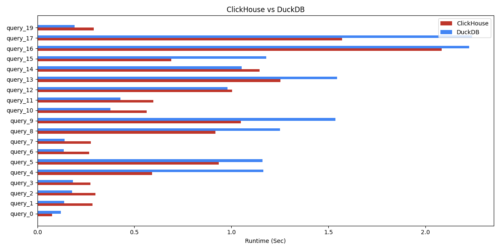
# query_0
```sql
 SELECT COUNT(*) FROM file(hits_parquet_8d18d12d_4cc2_11ee_924e_01a4aa584ed2.parquet);
```

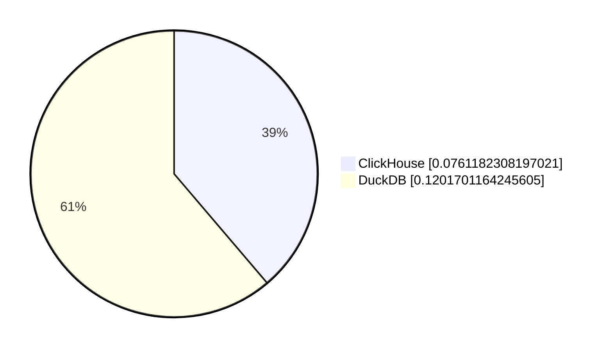
# query_1
```sql
 SELECT COUNT(*) FROM file(hits_parquet_8d18d12d_4cc2_11ee_924e_01a4aa584ed2.parquet) WHERE AdvEngineID <> 0;
```

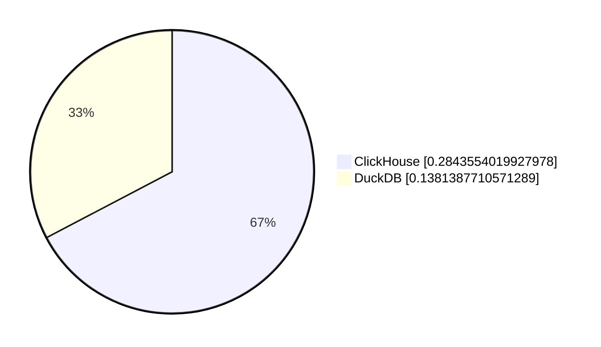
# query_2
```sql
 SELECT SUM(AdvEngineID), COUNT(*), AVG(ResolutionWidth) FROM file(hits_parquet_8d18d12d_4cc2_11ee_924e_01a4aa584ed2.parquet);
```

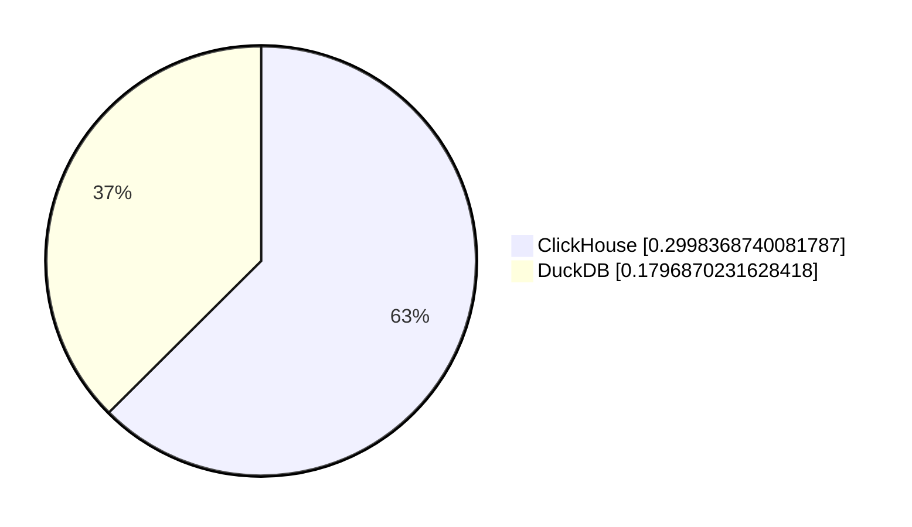
# query_3
```sql
 SELECT AVG(UserID) FROM file(hits_parquet_8d18d12d_4cc2_11ee_924e_01a4aa584ed2.parquet);
```

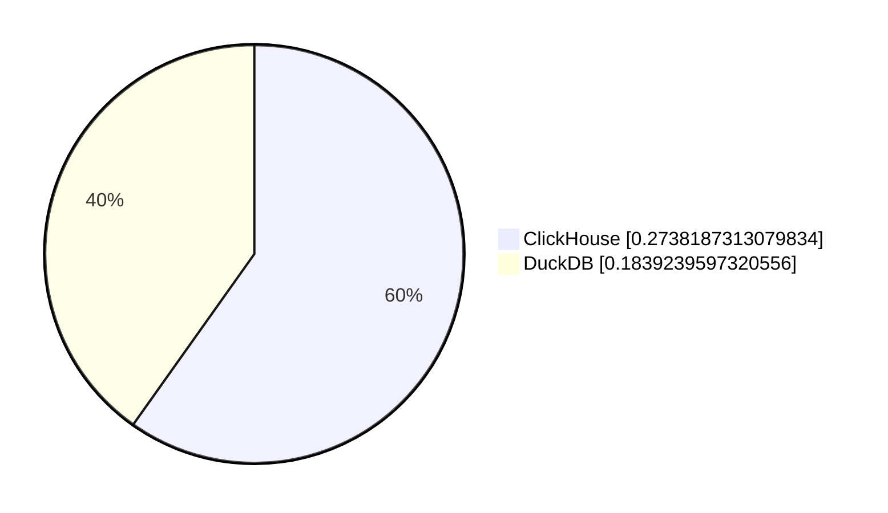
# query_4
```sql
 SELECT COUNT(DISTINCT UserID) FROM file(hits_parquet_8d18d12d_4cc2_11ee_924e_01a4aa584ed2.parquet);
```

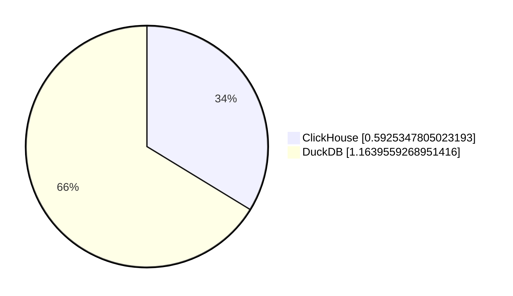
# query_5
```sql
 SELECT COUNT(DISTINCT SearchPhrase) FROM file(hits_parquet_8d18d12d_4cc2_11ee_924e_01a4aa584ed2.parquet);
```

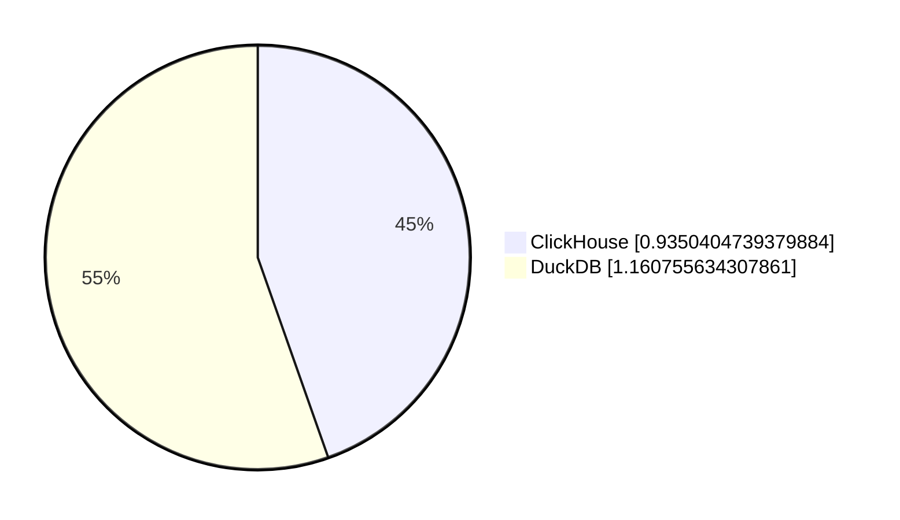
# query_6
```sql
 SELECT MIN(EventDate), MAX(EventDate) FROM file(hits_parquet_8d18d12d_4cc2_11ee_924e_01a4aa584ed2.parquet);
```


# query_7
```sql
 SELECT AdvEngineID, COUNT(*) FROM file(hits_parquet_8d18d12d_4cc2_11ee_924e_01a4aa584ed2.parquet) WHERE AdvEngineID <> 0 GROUP BY AdvEngineID ORDER BY COUNT(*) DESC;
```

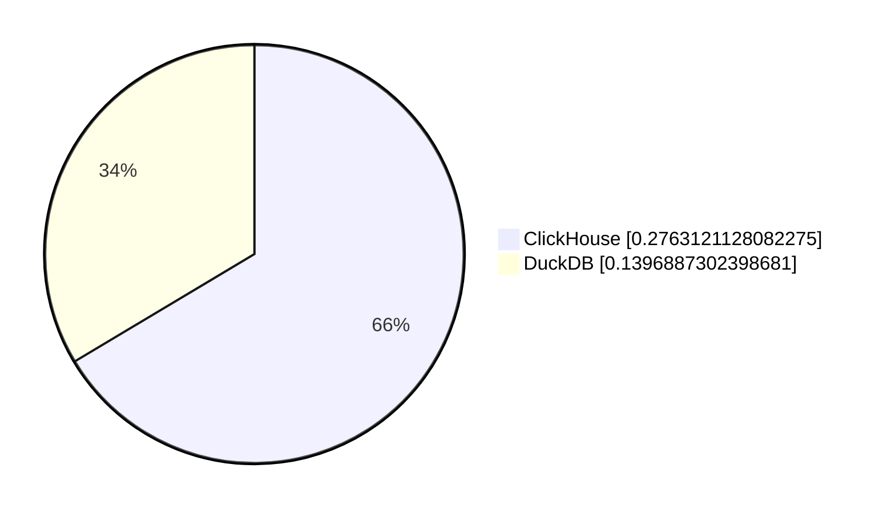
# query_8
```sql
 SELECT RegionID, COUNT(DISTINCT UserID) AS u FROM file(hits_parquet_8d18d12d_4cc2_11ee_924e_01a4aa584ed2.parquet) GROUP BY RegionID ORDER BY u DESC LIMIT 10;
```

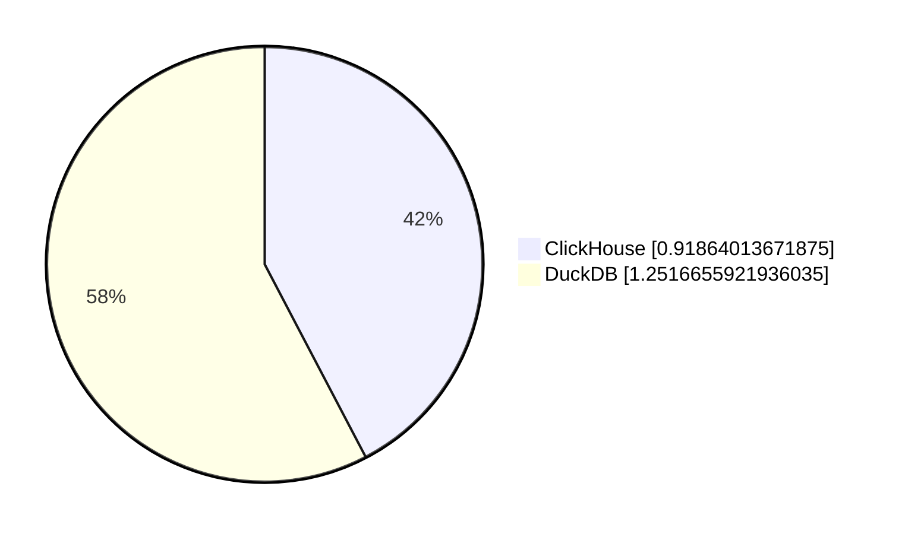
# query_9
```sql
 SELECT RegionID, SUM(AdvEngineID), COUNT(*) AS c, AVG(ResolutionWidth), COUNT(DISTINCT UserID) FROM file(hits_parquet_8d18d12d_4cc2_11ee_924e_01a4aa584ed2.parquet) GROUP BY RegionID ORDER BY c DESC LIMIT 10;
```

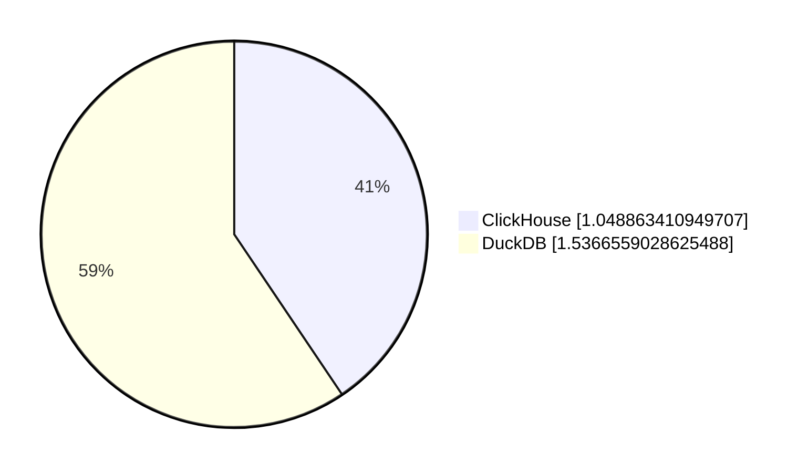
# query_10
```sql
 SELECT MobilePhoneModel, COUNT(DISTINCT UserID) AS u FROM file(hits_parquet_8d18d12d_4cc2_11ee_924e_01a4aa584ed2.parquet) WHERE MobilePhoneModel <> '' GROUP BY MobilePhoneModel ORDER BY u DESC LIMIT 10;
```


# query_11
```sql
 SELECT MobilePhone, MobilePhoneModel, COUNT(DISTINCT UserID) AS u FROM file(hits_parquet_8d18d12d_4cc2_11ee_924e_01a4aa584ed2.parquet) WHERE MobilePhoneModel <> '' GROUP BY MobilePhone, MobilePhoneModel ORDER BY u DESC LIMIT 10;
```

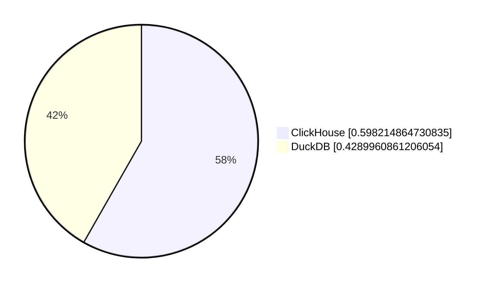
# query_12
```sql
 SELECT SearchPhrase, COUNT(*) AS c FROM file(hits_parquet_8d18d12d_4cc2_11ee_924e_01a4aa584ed2.parquet) WHERE SearchPhrase <> '' GROUP BY SearchPhrase ORDER BY c DESC LIMIT 10;
```

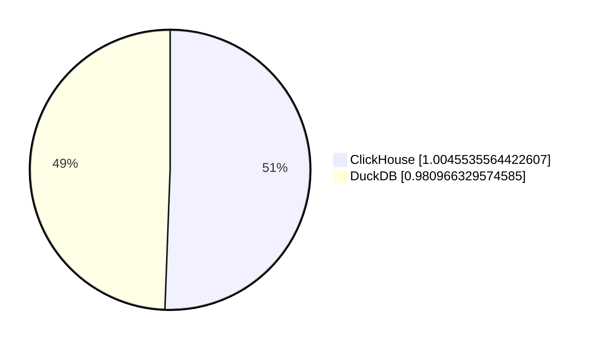
# query_13
```sql
 SELECT SearchPhrase, COUNT(DISTINCT UserID) AS u FROM file(hits_parquet_8d18d12d_4cc2_11ee_924e_01a4aa584ed2.parquet) WHERE SearchPhrase <> '' GROUP BY SearchPhrase ORDER BY u DESC LIMIT 10;
```

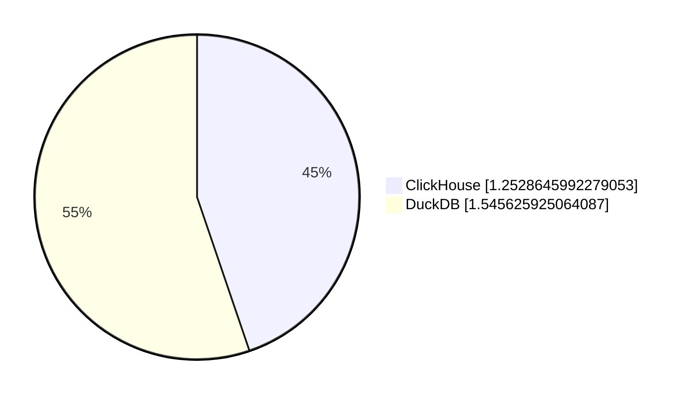
# query_14
```sql
 SELECT SearchEngineID, SearchPhrase, COUNT(*) AS c FROM file(hits_parquet_8d18d12d_4cc2_11ee_924e_01a4aa584ed2.parquet) WHERE SearchPhrase <> '' GROUP BY SearchEngineID, SearchPhrase ORDER BY c DESC LIMIT 10;
```

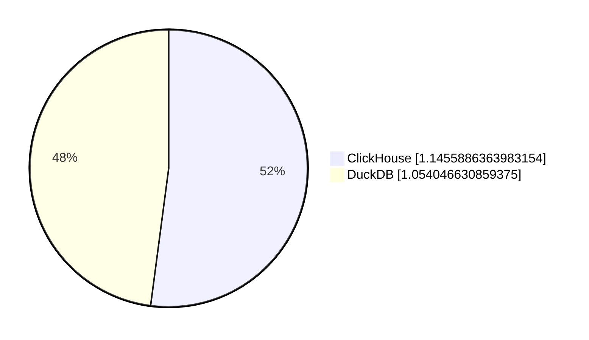
# query_15
```sql
 SELECT UserID, COUNT(*) FROM file(hits_parquet_8d18d12d_4cc2_11ee_924e_01a4aa584ed2.parquet) GROUP BY UserID ORDER BY COUNT(*) DESC LIMIT 10;
```

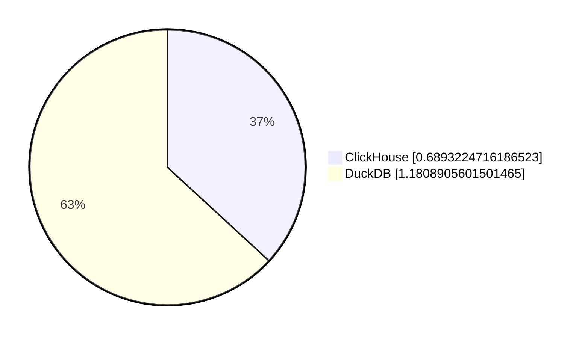
# query_16
```sql
 SELECT UserID, SearchPhrase, COUNT(*) FROM file(hits_parquet_8d18d12d_4cc2_11ee_924e_01a4aa584ed2.parquet) GROUP BY UserID, SearchPhrase ORDER BY COUNT(*) DESC LIMIT 10;
```

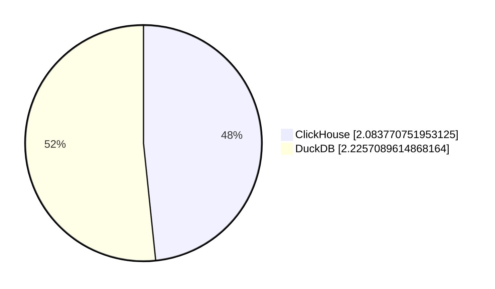
# query_17
```sql
 SELECT UserID, SearchPhrase, COUNT(*) FROM file(hits_parquet_8d18d12d_4cc2_11ee_924e_01a4aa584ed2.parquet) GROUP BY UserID, SearchPhrase LIMIT 10;
```

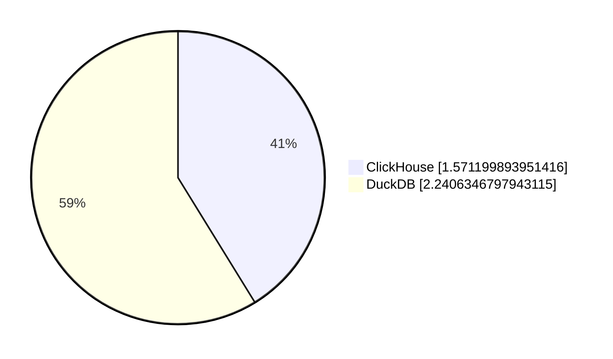
# query_19
```sql
 SELECT UserID FROM file(hits_parquet_8d18d12d_4cc2_11ee_924e_01a4aa584ed2.parquet) WHERE UserID = 435090932899640449;
```

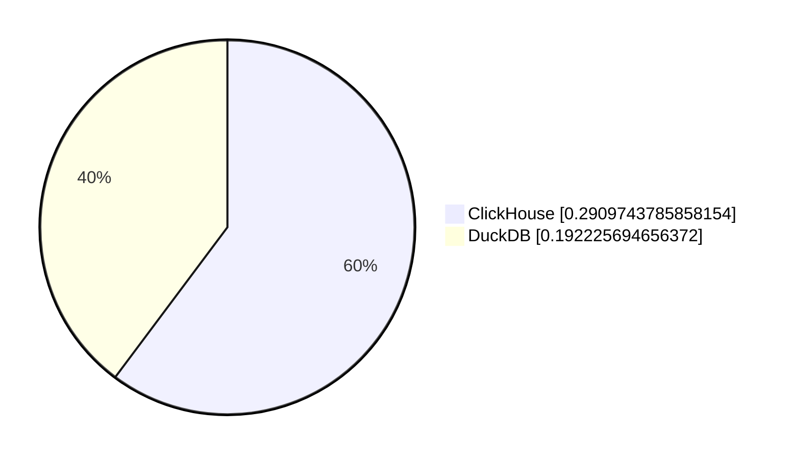
