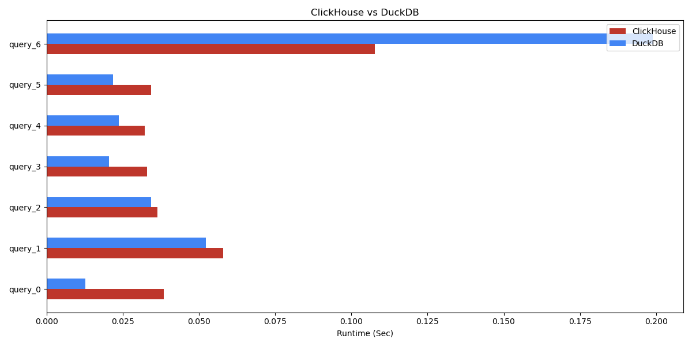
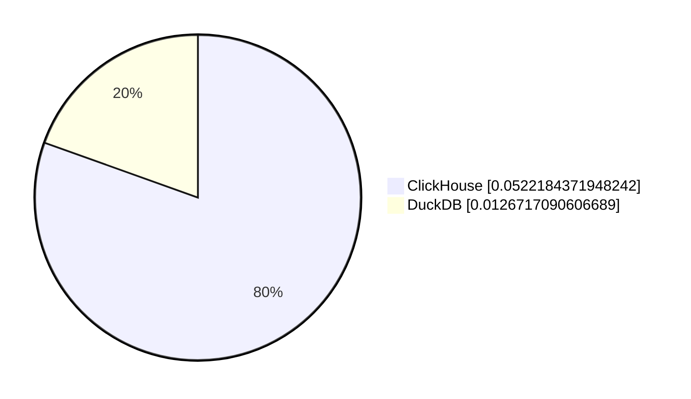

# ClickHouse vs DuckDB (Runtime in Seconds)

## Bar Chart

# query_0
```sql
 SELECT COUNT(*) FROM file(nyc_taxi_parquet_df78fb21_5d63_11ee_8734_83580fb48b84.parquet);
```


```mermaid
     pie showData
         "ClickHouse" : 0.0522184371948242
         "DuckDB" : 0.0126717090606689
```
