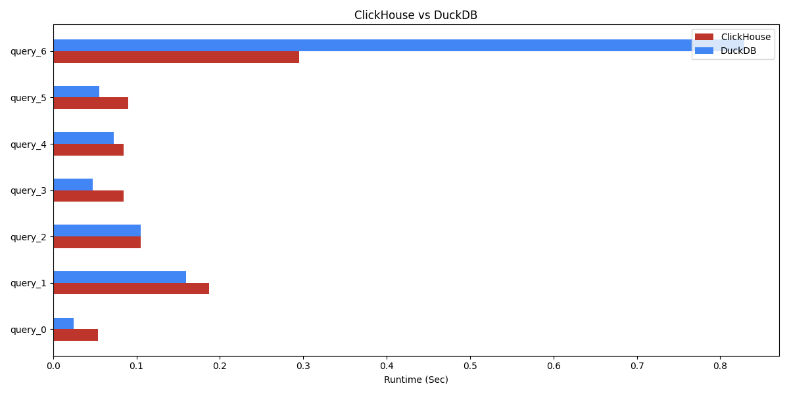

# ClickHouse vs DuckDB (Runtime in Seconds)

## Bar Chart

# query_0
```sql
 SELECT COUNT(*) FROM file(nyc_taxi_parquet_3767f60d_5d8b_11ee_924e_01a4aa584ed2.parquet);
```


# query_1
```sql
 SELECT pickup_ntaname, count(*) AS count FROM file(nyc_taxi_parquet_3767f60d_5d8b_11ee_924e_01a4aa584ed2.parquet) GROUP BY pickup_ntaname ORDER BY count DESC LIMIT 10;
```


# query_2
```sql
 SELECT passenger_count, avg(total_amount) FROM file('nyc_taxi_parquet_3767f60d_5d8b_11ee_924e_01a4aa584ed2.parquet') GROUP BY passenger_count;
```


# query_3
```sql
 SELECT AVG(tip_amount) FROM file('nyc_taxi_parquet_3767f60d_5d8b_11ee_924e_01a4aa584ed2.parquet');
```


# query_4
```sql
 SELECT COUNT(DISTINCT payment_type) FROM file('nyc_taxi_parquet_3767f60d_5d8b_11ee_924e_01a4aa584ed2.parquet');
```


# query_5
```sql
 SELECT MIN(pickup_datetime), MAX(pickup_datetime) FROM file('nyc_taxi_parquet_3767f60d_5d8b_11ee_924e_01a4aa584ed2.parquet');
```


# query_6
```sql
 SELECT trip_id, COUNT(*) FROM file('nyc_taxi_parquet_3767f60d_5d8b_11ee_924e_01a4aa584ed2.parquet') GROUP BY trip_id ORDER BY COUNT(*) DESC LIMIT 10;;
```


