# SRS032 ClickHouse Parquet Data Format
# Software Requirements Specification

## Table of Contents

* 1 [Revision History](#revision-history)
* 2 [Introduction](#introduction)
* 3 [Feature Diagram](#feature-diagram)
* 4 [Requirements](#requirements)
  * 4.1 [Working With Parquet](#working-with-parquet)
    * 4.1.1 [RQ.SRS-032.ClickHouse.Parquet](#rqsrs-032clickhouseparquet)
  * 4.2 [Supported Parquet Versions](#supported-parquet-versions)
    * 4.2.1 [RQ.SRS-032.ClickHouse.Parquet.SupportedVersions](#rqsrs-032clickhouseparquetsupportedversions)
    * 4.2.2 [RQ.SRS-032.ClickHouse.Parquet.ClickHouseLocal](#rqsrs-032clickhouseparquetclickhouselocal)
  * 4.3 [Import from Parquet Files](#import-from-parquet-files)
      * 4.3.2.1 [RQ.SRS-032.ClickHouse.Parquet.Import](#rqsrs-032clickhouseparquetimport)
      * 4.3.2.2 [Auto Detect Parquet File When Importing](#auto-detect-parquet-file-when-importing)
        * 4.3.2.2.1 [RQ.SRS-032.ClickHouse.Parquet.Import.AutoDetectParquetFileFormat](#rqsrs-032clickhouseparquetimportautodetectparquetfileformat)
    * 4.3.3 [Supported Datatypes](#supported-datatypes)
      * 4.3.3.1 [RQ.SRS-032.ClickHouse.Parquet.DataTypes.Conversion](#rqsrs-032clickhouseparquetdatatypesconversion)
      * 4.3.3.2 [RQ.SRS-032.ClickHouse.Parquet.DataTypes.Import](#rqsrs-032clickhouseparquetdatatypesimport)
      * 4.3.3.3 [UTCAdjusted](#utcadjusted)
        * 4.3.3.3.1 [RQ.SRS-032.ClickHouse.Parquet.DataTypes.DateUTCAdjusted](#rqsrs-032clickhouseparquetdatatypesdateutcadjusted)
        * 4.3.3.3.2 [RQ.SRS-032.ClickHouse.Parquet.DataTypes.TimestampUTCAdjusted](#rqsrs-032clickhouseparquetdatatypestimestamputcadjusted)
        * 4.3.3.3.3 [RQ.SRS-032.ClickHouse.Parquet.DataTypes.TimeUTCAdjusted](#rqsrs-032clickhouseparquetdatatypestimeutcadjusted)
      * 4.3.3.4 [Nullable](#nullable)
        * 4.3.3.4.1 [RQ.SRS-032.ClickHouse.Parquet.DataTypes.NullValues](#rqsrs-032clickhouseparquetdatatypesnullvalues)
        * 4.3.3.4.2 [RQ.SRS-032.ClickHouse.Parquet.DataTypes.ImportInto.Nullable](#rqsrs-032clickhouseparquetdatatypesimportintonullable)
      * 4.3.3.5 [LowCardinality](#lowcardinality)
        * 4.3.3.5.1 [RQ.SRS-032.ClickHouse.Parquet.DataTypes.ImportInto.LowCardinality](#rqsrs-032clickhouseparquetdatatypesimportintolowcardinality)
      * 4.3.3.6 [Nested](#nested)
        * 4.3.3.6.1 [RQ.SRS-032.ClickHouse.Parquet.DataTypes.ImportInto.Nested](#rqsrs-032clickhouseparquetdatatypesimportintonested)
      * 4.3.3.7 [UNKNOWN](#unknown)
        * 4.3.3.7.1 [RQ.SRS-032.ClickHouse.Parquet.DataTypes.ImportInto.Unknown](#rqsrs-032clickhouseparquetdatatypesimportintounknown)
    * 4.3.4 [Unsupported Datatypes](#unsupported-datatypes)
      * 4.3.4.1 [RQ.SRS-032.ClickHouse.Parquet.DataTypes.Unsupported](#rqsrs-032clickhouseparquetdatatypesunsupported)
      * 4.3.4.2 [RQ.SRS-032.ClickHouse.Parquet.DataTypes.Unsupported.ChunkedArray](#rqsrs-032clickhouseparquetdatatypesunsupportedchunkedarray)
      * 4.3.4.3 [Projections](#projections)
        * 4.3.4.3.1 [RQ.SRS-032.ClickHouse.Parquet.Import.Projections](#rqsrs-032clickhouseparquetimportprojections)
      * 4.3.4.4 [Skip Columns](#skip-columns)
        * 4.3.4.4.1 [RQ.SRS-032.ClickHouse.Parquet.Import.SkipColumns](#rqsrs-032clickhouseparquetimportskipcolumns)
      * 4.3.4.5 [Skip Values](#skip-values)
        * 4.3.4.5.1 [RQ.SRS-032.ClickHouse.Parquet.Import.SkipValues](#rqsrs-032clickhouseparquetimportskipvalues)
      * 4.3.4.6 [Auto Typecast](#auto-typecast)
        * 4.3.4.6.1 [RQ.SRS-032.ClickHouse.Parquet.Import.AutoTypecast](#rqsrs-032clickhouseparquetimportautotypecast)
      * 4.3.4.7 [Row Group Size](#row-group-size)
        * 4.3.4.7.1 [RQ.SRS-032.ClickHouse.Parquet.Import.RowGroupSize](#rqsrs-032clickhouseparquetimportrowgroupsize)
      * 4.3.4.8 [Data Page Size](#data-page-size)
        * 4.3.4.8.1 [RQ.SRS-032.ClickHouse.Parquet.Import.DataPageSize](#rqsrs-032clickhouseparquetimportdatapagesize)
    * 4.3.5 [Import Into New Table](#import-into-new-table)
      * 4.3.5.1 [RQ.SRS-032.ClickHouse.Parquet.Import.NewTable](#rqsrs-032clickhouseparquetimportnewtable)
    * 4.3.6 [Import Nested Types](#import-nested-types)
      * 4.3.6.1 [RQ.SRS-032.ClickHouse.Parquet.Import.Nested.ArrayIntoNested](#rqsrs-032clickhouseparquetimportnestedarrayintonested)
      * 4.3.6.2 [RQ.SRS-032.ClickHouse.Parquet.DataTypes.ImportNested](#rqsrs-032clickhouseparquetdatatypesimportnested)
      * 4.3.6.3 [RQ.SRS-032.ClickHouse.Parquet.Import.Nested.ArrayIntoNested.ImportNested](#rqsrs-032clickhouseparquetimportnestedarrayintonestedimportnested)
      * 4.3.6.4 [RQ.SRS-032.ClickHouse.Parquet.Import.Nested.ArrayIntoNested.NotImportNested](#rqsrs-032clickhouseparquetimportnestedarrayintonestednotimportnested)
      * 4.3.6.5 [RQ.SRS-032.ClickHouse.Parquet.Import.Nested.ArrayIntoNotNested](#rqsrs-032clickhouseparquetimportnestedarrayintonotnested)
      * 4.3.6.6 [RQ.SRS-032.ClickHouse.Parquet.Import.Nested.NonArrayIntoNested](#rqsrs-032clickhouseparquetimportnestednonarrayintonested)
    * 4.3.7 [Import Chunked Columns](#import-chunked-columns)
      * 4.3.7.1 [RQ.SRS-032.ClickHouse.Parquet.Import.ChunkedColumns](#rqsrs-032clickhouseparquetimportchunkedcolumns)
    * 4.3.8 [Import Encoded](#import-encoded)
      * 4.3.8.1 [Plain (Import)](#plain-import)
        * 4.3.8.1.1 [RQ.SRS-032.ClickHouse.Parquet.Import.Encoding.Plain](#rqsrs-032clickhouseparquetimportencodingplain)
      * 4.3.8.2 [Run Length Encoding (Import)](#run-length-encoding-import)
        * 4.3.8.2.1 [RQ.SRS-032.ClickHouse.Parquet.Import.Encoding.RunLength](#rqsrs-032clickhouseparquetimportencodingrunlength)
      * 4.3.8.3 [Delta (Import)](#delta-import)
        * 4.3.8.3.1 [RQ.SRS-032.ClickHouse.Parquet.Import.Encoding.Delta](#rqsrs-032clickhouseparquetimportencodingdelta)
      * 4.3.8.4 [Delta-length byte array (Import)](#delta-length-byte-array-import)
        * 4.3.8.4.1 [RQ.SRS-032.ClickHouse.Parquet.Import.Encoding.DeltaLengthByteArray](#rqsrs-032clickhouseparquetimportencodingdeltalengthbytearray)
      * 4.3.8.5 [Delta Strings (Import)](#delta-strings-import)
        * 4.3.8.5.1 [RQ.SRS-032.ClickHouse.Parquet.Import.Encoding.DeltaStrings](#rqsrs-032clickhouseparquetimportencodingdeltastrings)
      * 4.3.8.6 [Byte Stream Split (Import)](#byte-stream-split-import)
      * 4.3.8.7 [RQ.SRS-032.ClickHouse.Parquet.Import.Encoding.ByteStreamSplit](#rqsrs-032clickhouseparquetimportencodingbytestreamsplit)
    * 4.3.9 [Import Settings](#import-settings)
      * 4.3.9.1 [RQ.SRS-032.ClickHouse.Parquet.Import.Settings.ImportNested](#rqsrs-032clickhouseparquetimportsettingsimportnested)
      * 4.3.9.2 [RQ.SRS-032.ClickHouse.Parquet.Import.Settings.CaseInsensitiveColumnMatching](#rqsrs-032clickhouseparquetimportsettingscaseinsensitivecolumnmatching)
      * 4.3.9.3 [RQ.SRS-032.ClickHouse.Parquet.Import.Settings.AllowMissingColumns](#rqsrs-032clickhouseparquetimportsettingsallowmissingcolumns)
      * 4.3.9.4 [RQ.SRS-032.ClickHouse.Parquet.Import.Settings.SkipColumnsWithUnsupportedTypesInSchemaInference](#rqsrs-032clickhouseparquetimportsettingsskipcolumnswithunsupportedtypesinschemainference)
  * 4.4 [Export from Parquet Files](#export-from-parquet-files)
      * 4.4.9.1 [RQ.SRS-032.ClickHouse.Parquet.Export](#rqsrs-032clickhouseparquetexport)
      * 4.4.9.2 [Auto Detect Parquet File When Exporting](#auto-detect-parquet-file-when-exporting)
        * 4.4.9.2.1 [RQ.SRS-032.ClickHouse.Parquet.Export.Outfile.AutoDetectParquetFileFormat](#rqsrs-032clickhouseparquetexportoutfileautodetectparquetfileformat)
    * 4.4.10 [Supported Data types](#supported-data-types)
      * 4.4.10.1 [RQ.SRS-032.ClickHouse.Parquet.Export.Datatypes.Supported](#rqsrs-032clickhouseparquetexportdatatypessupported)
      * 4.4.10.2 [RQ.SRS-032.ClickHouse.Parquet.DataTypes.ExportNullable](#rqsrs-032clickhouseparquetdatatypesexportnullable)
    * 4.4.11 [Working With Nested Types Export](#working-with-nested-types-export)
      * 4.4.11.1 [RQ.SRS-032.ClickHouse.Parquet.Export.Nested](#rqsrs-032clickhouseparquetexportnested)
      * 4.4.11.2 [RQ.SRS-032.ClickHouse.Parquet.Export.DataTypes.Nested](#rqsrs-032clickhouseparquetexportdatatypesnested)
    * 4.4.12 [Exporting Chunked Columns](#exporting-chunked-columns)
      * 4.4.12.1 [RQ.SRS-032.ClickHouse.Parquet.Export.DataTypes.ChunkedColumns](#rqsrs-032clickhouseparquetexportdatatypeschunkedcolumns)
    * 4.4.13 [Query Types](#query-types)
      * 4.4.13.1 [RQ.SRS-032.ClickHouse.Export.Parquet.Join](#rqsrs-032clickhouseexportparquetjoin)
      * 4.4.13.2 [RQ.SRS-032.ClickHouse.Parquet.Export.Union](#rqsrs-032clickhouseparquetexportunion)
      * 4.4.13.3 [RQ.SRS-032.ClickHouse.Parquet.Export.View](#rqsrs-032clickhouseparquetexportview)
      * 4.4.13.4 [RQ.SRS-032.ClickHouse.Parquet.Export.Select.MaterializedView](#rqsrs-032clickhouseparquetexportselectmaterializedview)
    * 4.4.14 [Export Encoded](#export-encoded)
      * 4.4.14.1 [Plain (Export)](#plain-export)
        * 4.4.14.1.1 [RQ.SRS-032.ClickHouse.Parquet.Export.Encoding.Plain](#rqsrs-032clickhouseparquetexportencodingplain)
      * 4.4.14.2 [Run Length Encoding (Export)](#run-length-encoding-export)
        * 4.4.14.2.1 [RQ.SRS-032.ClickHouse.Parquet.Export.Encoding.RunLength](#rqsrs-032clickhouseparquetexportencodingrunlength)
      * 4.4.14.3 [Delta (Export)](#delta-export)
        * 4.4.14.3.1 [RQ.SRS-032.ClickHouse.Parquet.Export.Encoding.Delta](#rqsrs-032clickhouseparquetexportencodingdelta)
      * 4.4.14.4 [Delta-length byte array (Export)](#delta-length-byte-array-export)
        * 4.4.14.4.1 [RQ.SRS-032.ClickHouse.Parquet.Export.Encoding.DeltaLengthByteArray](#rqsrs-032clickhouseparquetexportencodingdeltalengthbytearray)
      * 4.4.14.5 [Delta Strings (Export)](#delta-strings-export)
        * 4.4.14.5.1 [RQ.SRS-032.ClickHouse.Parquet.Export.Encoding.DeltaStrings](#rqsrs-032clickhouseparquetexportencodingdeltastrings)
      * 4.4.14.6 [Byte Stream Split (Export)](#byte-stream-split-export)
      * 4.4.14.7 [RQ.SRS-032.ClickHouse.Parquet.Export.Encoding.ByteStreamSplit](#rqsrs-032clickhouseparquetexportencodingbytestreamsplit)
    * 4.4.15 [Export Settings](#export-settings)
      * 4.4.15.1 [RQ.SRS-032.ClickHouse.Parquet.Export.Settings.RowGroupSize](#rqsrs-032clickhouseparquetexportsettingsrowgroupsize)
      * 4.4.15.2 [RQ.SRS-032.ClickHouse.Parquet.Export.Settings.StringAsString](#rqsrs-032clickhouseparquetexportsettingsstringasstring)
      * 4.4.15.3 [RQ.SRS-032.ClickHouse.Parquet.Export.Settings.StringAsFixedByteArray](#rqsrs-032clickhouseparquetexportsettingsstringasfixedbytearray)
      * 4.4.15.4 [RQ.SRS-032.ClickHouse.Parquet.Export.Settings.ParquetVersion](#rqsrs-032clickhouseparquetexportsettingsparquetversion)
      * 4.4.15.5 [RQ.SRS-032.ClickHouse.Parquet.Export.Settings.CompressionMethod](#rqsrs-032clickhouseparquetexportsettingscompressionmethod)
    * 4.4.16 [Type Conversion](#type-conversion)
      * 4.4.16.1 [RQ.SRS-032.ClickHouse.Parquet.DataTypes.TypeConversionFunction](#rqsrs-032clickhouseparquetdatatypestypeconversionfunction)
  * 4.5 [Parquet Encryption](#parquet-encryption)
    * 4.5.1 [RQ.SRS-032.ClickHouse.Parquet.Encryption](#rqsrs-032clickhouseparquetencryption)
  * 4.6 [DESCRIBE Parquet](#describe-parquet)
    * 4.6.1 [RQ.SRS-032.ClickHouse.Parquet.Structure](#rqsrs-032clickhouseparquetstructure)
  * 4.7 [Compression](#compression)
    * 4.7.1 [None](#none)
      * 4.7.1.1 [RQ.SRS-032.ClickHouse.Parquet.Compression.None](#rqsrs-032clickhouseparquetcompressionnone)
    * 4.7.2 [Gzip](#gzip)
      * 4.7.2.1 [RQ.SRS-032.ClickHouse.Parquet.Compression.Gzip](#rqsrs-032clickhouseparquetcompressiongzip)
    * 4.7.3 [Brotli](#brotli)
      * 4.7.3.1 [RQ.SRS-032.ClickHouse.Parquet.Compression.Brotli](#rqsrs-032clickhouseparquetcompressionbrotli)
    * 4.7.4 [Lz4](#lz4)
      * 4.7.4.1 [RQ.SRS-032.ClickHouse.Parquet.Compression.Lz4](#rqsrs-032clickhouseparquetcompressionlz4)
    * 4.7.5 [Lz4Raw](#lz4raw)
      * 4.7.5.1 [RQ.SRS-032.ClickHouse.Parquet.Compression.Lz4Raw](#rqsrs-032clickhouseparquetcompressionlz4raw)
    * 4.7.6 [Unsupported Compression](#unsupported-compression)
      * 4.7.6.1 [Snappy](#snappy)
        * 4.7.6.1.1 [RQ.SRS-032.ClickHouse.Parquet.UnsupportedCompression.Snappy](#rqsrs-032clickhouseparquetunsupportedcompressionsnappy)
      * 4.7.6.2 [Lzo](#lzo)
        * 4.7.6.2.1 [RQ.SRS-032.ClickHouse.Parquet.UnsupportedCompression.Lzo](#rqsrs-032clickhouseparquetunsupportedcompressionlzo)
      * 4.7.6.3 [Zstd](#zstd)
        * 4.7.6.3.1 [RQ.SRS-032.ClickHouse.Parquet.UnsupportedCompression.Zstd](#rqsrs-032clickhouseparquetunsupportedcompressionzstd)
  * 4.8 [Table Functions](#table-functions)
    * 4.8.1 [URL](#url)
      * 4.8.1.1 [RQ.SRS-032.ClickHouse.Parquet.TableFunctions.URL](#rqsrs-032clickhouseparquettablefunctionsurl)
    * 4.8.2 [File](#file)
      * 4.8.2.1 [RQ.SRS-032.ClickHouse.Parquet.TableFunctions.File](#rqsrs-032clickhouseparquettablefunctionsfile)
      * 4.8.2.2 [RQ.SRS-032.ClickHouse.Parquet.TableFunctions.File.AutoDetectParquetFileFormat](#rqsrs-032clickhouseparquettablefunctionsfileautodetectparquetfileformat)
    * 4.8.3 [S3](#s3)
      * 4.8.3.1 [RQ.SRS-032.ClickHouse.Parquet.TableFunctions.S3](#rqsrs-032clickhouseparquettablefunctionss3)
    * 4.8.4 [JDBC](#jdbc)
      * 4.8.4.1 [RQ.SRS-032.ClickHouse.Parquet.TableFunctions.JDBC](#rqsrs-032clickhouseparquettablefunctionsjdbc)
    * 4.8.5 [ODBC](#odbc)
      * 4.8.5.1 [RQ.SRS-032.ClickHouse.Parquet.TableFunctions.ODBC](#rqsrs-032clickhouseparquettablefunctionsodbc)
    * 4.8.6 [HDFS](#hdfs)
      * 4.8.6.1 [RQ.SRS-032.ClickHouse.Parquet.TableFunctions.HDFS](#rqsrs-032clickhouseparquettablefunctionshdfs)
    * 4.8.7 [Remote](#remote)
      * 4.8.7.1 [RQ.SRS-032.ClickHouse.Parquet.TableFunctions.Remote](#rqsrs-032clickhouseparquettablefunctionsremote)
    * 4.8.8 [MySQL](#mysql)
      * 4.8.8.1 [RQ.SRS-032.ClickHouse.Parquet.TableFunctions.MySQL](#rqsrs-032clickhouseparquettablefunctionsmysql)
    * 4.8.9 [PostgreSQL](#postgresql)
      * 4.8.9.1 [RQ.SRS-032.ClickHouse.Parquet.TableFunctions.PostgreSQL](#rqsrs-032clickhouseparquettablefunctionspostgresql)
  * 4.9 [Table Engines](#table-engines)
    * 4.9.1 [MergeTree](#mergetree)
      * 4.9.1.1 [RQ.SRS-032.ClickHouse.Parquet.TableEngines.MergeTree.MergeTree](#rqsrs-032clickhouseparquettableenginesmergetreemergetree)
      * 4.9.1.2 [ReplicatedMergeTree](#replicatedmergetree)
        * 4.9.1.2.1 [RQ.SRS-032.ClickHouse.Parquet.TableEngines.MergeTree.ReplicatedMergeTree](#rqsrs-032clickhouseparquettableenginesmergetreereplicatedmergetree)
      * 4.9.1.3 [ReplacingMergeTree](#replacingmergetree)
        * 4.9.1.3.1 [RQ.SRS-032.ClickHouse.Parquet.TableEngines.MergeTree.ReplacingMergeTree](#rqsrs-032clickhouseparquettableenginesmergetreereplacingmergetree)
      * 4.9.1.4 [SummingMergeTree](#summingmergetree)
        * 4.9.1.4.1 [RQ.SRS-032.ClickHouse.Parquet.TableEngines.MergeTree.SummingMergeTree](#rqsrs-032clickhouseparquettableenginesmergetreesummingmergetree)
      * 4.9.1.5 [AggregatingMergeTree](#aggregatingmergetree)
        * 4.9.1.5.1 [RQ.SRS-032.ClickHouse.Parquet.TableEngines.MergeTree.AggregatingMergeTree](#rqsrs-032clickhouseparquettableenginesmergetreeaggregatingmergetree)
      * 4.9.1.6 [CollapsingMergeTree](#collapsingmergetree)
        * 4.9.1.6.1 [RQ.SRS-032.ClickHouse.Parquet.TableEngines.MergeTree.CollapsingMergeTree](#rqsrs-032clickhouseparquettableenginesmergetreecollapsingmergetree)
      * 4.9.1.7 [VersionedCollapsingMergeTree](#versionedcollapsingmergetree)
        * 4.9.1.7.1 [RQ.SRS-032.ClickHouse.Parquet.TableEngines.MergeTree.VersionedCollapsingMergeTree](#rqsrs-032clickhouseparquettableenginesmergetreeversionedcollapsingmergetree)
      * 4.9.1.8 [GraphiteMergeTree](#graphitemergetree)
        * 4.9.1.8.1 [RQ.SRS-032.ClickHouse.Parquet.TableEngines.MergeTree.GraphiteMergeTree](#rqsrs-032clickhouseparquettableenginesmergetreegraphitemergetree)
    * 4.9.2 [Integration Engines](#integration-engines)
      * 4.9.2.1 [ODBC Engine](#odbc-engine)
        * 4.9.2.1.1 [RQ.SRS-032.ClickHouse.Parquet.TableEngines.Integration.ODBC](#rqsrs-032clickhouseparquettableenginesintegrationodbc)
      * 4.9.2.2 [JDBC Engine](#jdbc-engine)
        * 4.9.2.2.1 [RQ.SRS-032.ClickHouse.Parquet.TableEngines.Integration.JDBC](#rqsrs-032clickhouseparquettableenginesintegrationjdbc)
      * 4.9.2.3 [MySQL Engine](#mysql-engine)
        * 4.9.2.3.1 [RQ.SRS-032.ClickHouse.Parquet.TableEngines.Integration.MySQL](#rqsrs-032clickhouseparquettableenginesintegrationmysql)
      * 4.9.2.4 [MongoDB Engine](#mongodb-engine)
        * 4.9.2.4.1 [RQ.SRS-032.ClickHouse.Parquet.TableEngines.Integration.MongoDB](#rqsrs-032clickhouseparquettableenginesintegrationmongodb)
      * 4.9.2.5 [HDFS Engine](#hdfs-engine)
        * 4.9.2.5.1 [RQ.SRS-032.ClickHouse.Parquet.TableEngines.Integration.HDFS](#rqsrs-032clickhouseparquettableenginesintegrationhdfs)
      * 4.9.2.6 [S3 Engine](#s3-engine)
        * 4.9.2.6.1 [RQ.SRS-032.ClickHouse.Parquet.TableEngines.Integration.S3](#rqsrs-032clickhouseparquettableenginesintegrations3)
      * 4.9.2.7 [Kafka Engine](#kafka-engine)
        * 4.9.2.7.1 [RQ.SRS-032.ClickHouse.Parquet.TableEngines.Integration.Kafka](#rqsrs-032clickhouseparquettableenginesintegrationkafka)
      * 4.9.2.8 [EmbeddedRocksDB Engine](#embeddedrocksdb-engine)
        * 4.9.2.8.1 [RQ.SRS-032.ClickHouse.Parquet.TableEngines.Integration.EmbeddedRocksDB](#rqsrs-032clickhouseparquettableenginesintegrationembeddedrocksdb)
      * 4.9.2.9 [PostgreSQL Engine](#postgresql-engine)
      * 4.9.2.10 [RQ.SRS-032.ClickHouse.Parquet.TableEngines.Integration.PostgreSQL](#rqsrs-032clickhouseparquettableenginesintegrationpostgresql)
    * 4.9.3 [Special Engines](#special-engines)
      * 4.9.3.1 [RQ.SRS-032.ClickHouse.Parquet.TableEngines.Special.Memory](#rqsrs-032clickhouseparquettableenginesspecialmemory)
      * 4.9.3.2 [RQ.SRS-032.ClickHouse.Parquet.TableEngines.Special.Distributed](#rqsrs-032clickhouseparquettableenginesspecialdistributed)
      * 4.9.3.3 [RQ.SRS-032.ClickHouse.Parquet.TableEngines.Special.Dictionary](#rqsrs-032clickhouseparquettableenginesspecialdictionary)
      * 4.9.3.4 [RQ.SRS-032.ClickHouse.Parquet.TableEngines.Special.File](#rqsrs-032clickhouseparquettableenginesspecialfile)
      * 4.9.3.5 [RQ.SRS-032.ClickHouse.Parquet.TableEngines.Special.URL](#rqsrs-032clickhouseparquettableenginesspecialurl)
  * 4.10 [Metadata](#metadata)
    * 4.10.1 [ParquetFormat](#parquetformat)
      * 4.10.1.1 [RQ.SRS-032.ClickHouse.Parquet.Metadata.ParquetMetadataFormat](#rqsrs-032clickhouseparquetmetadataparquetmetadataformat)
      * 4.10.1.2 [RQ.SRS-032.ClickHouse.Parquet.Metadata.ParquetMetadataFormat.Output](#rqsrs-032clickhouseparquetmetadataparquetmetadataformatoutput)
      * 4.10.1.3 [RQ.SRS-032.ClickHouse.Parquet.Metadata.ParquetMetadata.Content](#rqsrs-032clickhouseparquetmetadataparquetmetadatacontent)
      * 4.10.1.4 [RQ.SRS-032.ClickHouse.Parquet.Metadata.ParquetMetadata.MinMax](#rqsrs-032clickhouseparquetmetadataparquetmetadataminmax)
    * 4.10.2 [Metadata Types](#metadata-types)
      * 4.10.2.1 [RQ.SRS-032.ClickHouse.Parquet.Metadata.File](#rqsrs-032clickhouseparquetmetadatafile)
      * 4.10.2.2 [RQ.SRS-032.ClickHouse.Parquet.Metadata.Column](#rqsrs-032clickhouseparquetmetadatacolumn)
      * 4.10.2.3 [RQ.SRS-032.ClickHouse.Parquet.Metadata.Header](#rqsrs-032clickhouseparquetmetadataheader)
  * 4.11 [Error Recovery](#error-recovery)
    * 4.11.1 [RQ.SRS-032.ClickHouse.Parquet.ErrorRecovery.Corrupt.Metadata.MagicNumber](#rqsrs-032clickhouseparqueterrorrecoverycorruptmetadatamagicnumber)
    * 4.11.2 [RQ.SRS-032.ClickHouse.Parquet.ErrorRecovery.Corrupt.Metadata.File](#rqsrs-032clickhouseparqueterrorrecoverycorruptmetadatafile)
    * 4.11.3 [RQ.SRS-032.ClickHouse.Parquet.ErrorRecovery.Corrupt.Metadata.Column](#rqsrs-032clickhouseparqueterrorrecoverycorruptmetadatacolumn)
    * 4.11.4 [RQ.SRS-032.ClickHouse.Parquet.ErrorRecovery.Corrupt.Metadata.PageHeader](#rqsrs-032clickhouseparqueterrorrecoverycorruptmetadatapageheader)
    * 4.11.5 [RQ.SRS-032.ClickHouse.Parquet.ErrorRecovery.Corrupt.Metadata.PageData](#rqsrs-032clickhouseparqueterrorrecoverycorruptmetadatapagedata)
    * 4.11.6 [RQ.SRS-032.ClickHouse.Parquet.ErrorRecovery.Corrupt.Metadata.Checksum](#rqsrs-032clickhouseparqueterrorrecoverycorruptmetadatachecksum)
    * 4.11.7 [RQ.SRS-032.ClickHouse.Parquet.ErrorRecovery.Corrupt.Values](#rqsrs-032clickhouseparqueterrorrecoverycorruptvalues)
      * 4.11.7.1 [RQ.SRS-032.ClickHouse.Parquet.ErrorRecovery.Corrupt.Values.Date](#rqsrs-032clickhouseparqueterrorrecoverycorruptvaluesdate)
      * 4.11.7.2 [RQ.SRS-032.ClickHouse.Parquet.ErrorRecovery.Corrupt.Values.Int](#rqsrs-032clickhouseparqueterrorrecoverycorruptvaluesint)
      * 4.11.7.3 [RQ.SRS-032.ClickHouse.Parquet.ErrorRecovery.Corrupt.Values.BigInt](#rqsrs-032clickhouseparqueterrorrecoverycorruptvaluesbigint)
      * 4.11.7.4 [RQ.SRS-032.ClickHouse.Parquet.ErrorRecovery.Corrupt.Values.SmallInt](#rqsrs-032clickhouseparqueterrorrecoverycorruptvaluessmallint)
      * 4.11.7.5 [RQ.SRS-032.ClickHouse.Parquet.ErrorRecovery.Corrupt.Values.TinyInt](#rqsrs-032clickhouseparqueterrorrecoverycorruptvaluestinyint)
      * 4.11.7.6 [RQ.SRS-032.ClickHouse.Parquet.ErrorRecovery.Corrupt.Values.UInt](#rqsrs-032clickhouseparqueterrorrecoverycorruptvaluesuint)
      * 4.11.7.7 [RQ.SRS-032.ClickHouse.Parquet.ErrorRecovery.Corrupt.Values.UBigInt](#rqsrs-032clickhouseparqueterrorrecoverycorruptvaluesubigint)
      * 4.11.7.8 [RQ.SRS-032.ClickHouse.Parquet.ErrorRecovery.Corrupt.Values.USmallInt](#rqsrs-032clickhouseparqueterrorrecoverycorruptvaluesusmallint)
      * 4.11.7.9 [RQ.SRS-032.ClickHouse.Parquet.ErrorRecovery.Corrupt.Values.UTinyInt](#rqsrs-032clickhouseparqueterrorrecoverycorruptvaluesutinyint)
      * 4.11.7.10 [RQ.SRS-032.ClickHouse.Parquet.ErrorRecovery.Corrupt.Values.TimestampUS](#rqsrs-032clickhouseparqueterrorrecoverycorruptvaluestimestampus)
      * 4.11.7.11 [RQ.SRS-032.ClickHouse.Parquet.ErrorRecovery.Corrupt.Values.TimestampMS](#rqsrs-032clickhouseparqueterrorrecoverycorruptvaluestimestampms)
      * 4.11.7.12 [RQ.SRS-032.ClickHouse.Parquet.ErrorRecovery.Corrupt.Values.Bool](#rqsrs-032clickhouseparqueterrorrecoverycorruptvaluesbool)
      * 4.11.7.13 [RQ.SRS-032.ClickHouse.Parquet.ErrorRecovery.Corrupt.Values.Float](#rqsrs-032clickhouseparqueterrorrecoverycorruptvaluesfloat)
      * 4.11.7.14 [RQ.SRS-032.ClickHouse.Parquet.ErrorRecovery.Corrupt.Values.Double](#rqsrs-032clickhouseparqueterrorrecoverycorruptvaluesdouble)
      * 4.11.7.15 [RQ.SRS-032.ClickHouse.Parquet.ErrorRecovery.Corrupt.Values.TimeMS](#rqsrs-032clickhouseparqueterrorrecoverycorruptvaluestimems)
      * 4.11.7.16 [RQ.SRS-032.ClickHouse.Parquet.ErrorRecovery.Corrupt.Values.TimeUS](#rqsrs-032clickhouseparqueterrorrecoverycorruptvaluestimeus)
      * 4.11.7.17 [RQ.SRS-032.ClickHouse.Parquet.ErrorRecovery.Corrupt.Values.TimeNS](#rqsrs-032clickhouseparqueterrorrecoverycorruptvaluestimens)
      * 4.11.7.18 [RQ.SRS-032.ClickHouse.Parquet.ErrorRecovery.Corrupt.Values.String](#rqsrs-032clickhouseparqueterrorrecoverycorruptvaluesstring)
      * 4.11.7.19 [RQ.SRS-032.ClickHouse.Parquet.ErrorRecovery.Corrupt.Values.Binary](#rqsrs-032clickhouseparqueterrorrecoverycorruptvaluesbinary)
      * 4.11.7.20 [RQ.SRS-032.ClickHouse.Parquet.ErrorRecovery.Corrupt.Values.FixedLengthByteArray](#rqsrs-032clickhouseparqueterrorrecoverycorruptvaluesfixedlengthbytearray)
      * 4.11.7.21 [RQ.SRS-032.ClickHouse.Parquet.ErrorRecovery.Corrupt.Values.Decimal](#rqsrs-032clickhouseparqueterrorrecoverycorruptvaluesdecimal)
      * 4.11.7.22 [RQ.SRS-032.ClickHouse.Parquet.ErrorRecovery.Corrupt.Values.List](#rqsrs-032clickhouseparqueterrorrecoverycorruptvalueslist)
      * 4.11.7.23 [RQ.SRS-032.ClickHouse.Parquet.ErrorRecovery.Corrupt.Values.Struct](#rqsrs-032clickhouseparqueterrorrecoverycorruptvaluesstruct)
      * 4.11.7.24 [RQ.SRS-032.ClickHouse.Parquet.ErrorRecovery.Corrupt.Values.Map](#rqsrs-032clickhouseparqueterrorrecoverycorruptvaluesmap)


## Revision History

This document is stored in an electronic form using [Git] source control management software
hosted in a [GitHub Repository].
All the updates are tracked using the [Revision History].

## Introduction

This software requirements specification covers requirements for `Parquet` data format in [ClickHouse].

The documentation used:
- https://clickhouse.com/docs/en/operations/settings/formats#parquet-format-settings
- https://clickhouse.com/docs/en/interfaces/formats#data-format-parquet
- https://clickhouse.com/docs/en/integrations/data-formats/parquet#importing-from-parquet
- https://parquet.apache.org/docs/

## Feature Diagram

```mermaid
flowchart TB;
    subgraph Overhead[Parquet]
        direction TB;
        subgraph Sources[Source of data]
            direction TB;   
            MySQL

            subgraph Libraries[Parquet Libraries]
                direction LR;
                parquet-tools
                pyarrow
                parquet-cpp
                parquet-mr
                fastparquet
                pyspark
            end

            subgraph ClickHouse_source[ClickHouse]
                style ClickHouse_source fill:#fcbb30
                direction TB;   
                subgraph Select_query[SELECT]
                    style Select_query fill:#d9ead3
                    direction LR;
                    subgraph Select_sources[Sources]
                        direction TB;
                        subgraph Funcs_sel[Functions]
                            direction LR;
                            URL_func_sel[URL]
                            File_func_sel[FILE]
                            Query_func_sel[Query]
                            S3_func_sel[S3]
                            jdbc_func_sel[JDBC]
                            odbc_func_sel[ODBC]
                            hdfs_func_sel[HDFS]
                            remote_func_sel[Remote]
                            mysql_func_sel[MySQL]
                            postgresql_func_sel[PostgreSQL]
                        end

                        subgraph Integration_Engines_sel[Integration Engines]
                            direction LR;
                            ODBC_eng_sel[ODBC]
                            jdbc_eng_sel[JDBC]
                            mysql_eng_sel[MySQL]
                            mongodb_eng_sel[MongoDB]
                            hdfs_eng_sel[HDFS]
                            s3_eng_sel[S3]
                            kafka_eng_sel[Kafka]
                            embeddedrocksDB_eng_sel[EmbeddedRocksDB]
                            RabbitMQ_eng_sel[RabbitMQ]
                            PostgreSQL_eng_sel[PostgreSQL]
                        end

                        subgraph Special_Engines_sel[Special Engines]
                            direction LR;
                            distributed_eng_sel[Distributed]
                            dictionary_eng_sel[Dictionary]
                            file_eng_sel[File]
                            url_eng_sel[URL]
                            mat_view_sel[Materialized View]
                            merge_sel[Merge]
                            join_sel[Join]
                            view_sel[View]
                            memory_sel[Memory]
                            buffer_sel[Buffer]
                        end
                    end

                    subgraph Select_opt[Clauses]
                        JOIN_clause[JOIN]
                        Union_clause[UNION]
                    end
                end

                subgraph ClickHouse_write_direct[Writing into file directly]
                    direction LR;
                    s3_tb_write[S3 table function]
                    s3_en_write[S3 engine]
                    file_tb_write[File table function]
                    file_en_write[File engine]
                    hdfs_tb_write[HDFS table function]
                    hdfs_en_write[HDFS engine]
                    url_tb_write[URL table function]
                    url_en_write[URL engine]
                end
            end
        end

        subgraph Input_settings[Input settings]
            direction LR
            input_format_parquet_import_nested
            input_format_parquet_case_insensitive_column_matching
            input_format_parquet_allow_missing_columns
            input_format_parquet_skip_columns_with_unsupported_types_in_schema_inference 
        end

        subgraph Output_settings[Output settings]
            direction LR
            output_format_parquet_row_group_size
            output_format_parquet_string_as_string
            output_format_parquet_fixed_string_as_fixed_byte_array
            output_format_parquet_version
            output_format_parquet_compression_method
        end

        subgraph Compression
            direction TB
            Uncompressed
            Snappy
            Gzip
            LZO
            Brotli
            LZ4
            ZSTD
            LZ4_RAW
        end

        subgraph Encryption
            direction LR
            AesGcmV1
            AesGcmCtrV1
        end

        subgraph Corrupted
            direction LR
            CorruptedYes[Yes]
            CorruptedNo[No]
        end

        subgraph Possible_Corruptions[Possible Corruptions]
            direction LR
            CorruptFile[Corrupt File]
            CorruptColumn[Corrupted Column]
            CorruptPageHeader[Corrupt Page Header]
            CorruptPageData[Corrupted Page Data]
            CorruptColumnValues[Corrupted Column Values]
        end

        subgraph Error
            direction LR
            Error_message[File is not inserted into ClickHouse. Error Message Is Shown.]
        end

        subgraph ClickHouse[ClickHouse]
            style ClickHouse fill:#fcbb30
            direction TB;
            subgraph Insert_query[INSERT Targets]
                style Insert_query fill:#ffb5b5
                direction TB;
                subgraph Funcs[Functions]
                    URL_func_in[URL]
                    File_func_in[FILE]
                    Query_func_in[Query]
                    S3_func_in[S3]
                    jdbc_func_in[JDBC]
                    odbc_func_in[ODBC]
                    hdfs_func_in[HDFS]
                    remote_func_in[Remote]
                    mysql_func_in[MySQL]
                    postgresql_func_in[PostgreSQL]
                end

                subgraph Integration_Engines[Integration Engines]
                    ODBC_eng[ODBC]
                    jdbc_eng[JDBC]
                    mysql_eng[MySQL]
                    mongodb_eng[MongoDB]
                    hdfs_eng[HDFS]
                    s3_eng[S3]
                    kafka_eng[Kafka]
                    embeddedrocksDB_eng[EmbeddedRocksDB]
                    RabbitMQ_eng[RabbitMQ]
                    PostgreSQL_eng[PostgreSQL]
                end

                subgraph Special_Engines[Special Engines]
                    distributed_eng[Distributed]
                    dictionary_eng[Dictionary]
                    file_eng[File]
                    url_eng[URL]
                    merge[Merge]
                    join[Join]
                    memory[Memory]
                    buffer[Buffer]
                end

            end
            subgraph ClickHouse_read_direct[Reading from file directly]
                s3_tb_read[S3 table function]
                s3_en_read[S3 engine]
                file_tb_read[File table function]
                file_en_read[File engine]
                hdfs_tb_read[HDFS table function]
                hdfs_en_read[HDFS engine]
                url_tb_read[URL table function]
                url_en_read[URL engine]
            end
        end

    Parquet_File_in[Parquet File]
    Parquet_File_out[Parquet File]

        subgraph PossibleCorruptions[Possible Corrupted Parquet Datatypes]
            direction LR;
                UInt8in[UInt8]
                Boolin[Bool]
                Int8in[Int8]
                UInt16in[UInt16]
                Int16in[Int16]
                UInt32in[UInt32]
                Int32in[Int32]
                UInt64in[UInt64]
                Int64in[Int64]
                Floatin[Float]
                HalfFloatin[Half Float]
                Doublein[Double]
                Date32in[Date32]
                Date64in[Date62]
                Timestampin[Timestamp]
                Stringin[String]
                Binaryin[Binary]
                Decimalin[Decimal]
                Listin[List]
                Structin[Struct]
                Mapin[Map]
            end

        subgraph TypeConversion[Parquet type > ClickHouse type > Parquet type]
            direction LR;
            subgraph Insert_types[Parquet]
                UInt8_in[UInt8]
                Bool_in[Bool]
                Int8_in[Int8]
                UInt16_in[UInt16]
                Int16_in[Int16]
                UInt32_in[UInt32]
                Int32_in[Int32]
                UInt64_in[UInt64]
                Int64_in[Int64]
                Float_in[Float]
                Half_Float_in[Half Float]
                Double_in[Double]
                Date32_in[Date32]
                Date64_in[Date62]
                Timestamp_in[Timestamp]
                String_in[String]
                Binary_in[Binary]
                Decimal_in[Decimal]
                List_in[List]
                Struct_in[Struct]
                Map_in[Map]
            end

            subgraph CH_types[ClickHouse]
                UInt8_ch[UInt8]
                Int8_ch[Int8]
                UInt16_ch[UInt16]
                Int16_ch[Int16]
                UInt32_ch[UInt32]
                Int32_ch[Int32]
                UInt64_ch[UInt64]
                Int64_ch[Int64]
                Float32_ch[Float32]
                Float64_ch[Float64]
                Date_ch[Date]
                DateTime_ch[DateTime]
                String_ch[String]
                FixedString_ch[FixedString]
                Decimal128_ch[Decimal128]
                Array_ch[Array]
                Tuple_ch[Tuple]
                Map_ch[Map]
            end

            subgraph Select_types[Parquet]
                UInt8_out[UInt8]
                Int8_out[Int8]
                UInt16_out[UInt16]
                Int16_out[Int16]
                UInt32_out[UInt32]
                Int32_out[Int32]
                UInt64_out[UInt64]
                Int64_out[Int64]
                Float_out[Float]
                Double_out[Double]
                Binary_out[Binary]
                Decimal_out[Decimal]
                List_out[List]
                Struct_out[Struct]
                Map_out[Map]
            end

            subgraph AutoConversions[Type Auto Conversion Based On The Target Table]
                direction LR
                Parquet_type[Parquet Datatype]
                ClickHouse_type[ClickHouse Datatype]
            end

            subgraph Modifiers[Supported Modifiers]
                direction LR
                Nullable
                LowCardinality
            end
        end
        subgraph Not_supported_by_ch[Parquet Types not supported by ClickHouse]
            direction LR
            Time32
            FIXED_SIZE_BINARY
            JSON
            UUID
            ENUM
            Chunked_arr[Chunked Array]
        end
    end


Sources --> Compression --> Encryption --> Parquet_File_in 
Parquet_File_in --> CorruptedYes
CorruptedYes --> Possible_Corruptions --> Error
Parquet_File_in --> CorruptedNo --Insert Into ClickHouse --> Input_settings --> ClickHouse -- Read From ClickHouse --> Output_settings --> Parquet_File_out
CorruptColumnValues --> PossibleCorruptions
ClickHouse_type --> Parquet_type --> ClickHouse_type


UInt8_in --> UInt8_ch --> UInt8_out
Bool_in --> UInt8_ch
Int8_in --> Int8_ch --> Int8_out
UInt16_in --> UInt16_ch --> UInt16_out
UInt32_in --> UInt32_ch --> UInt32_out
UInt64_in --> UInt64_ch --> UInt64_out
Int16_in --> Int16_ch --> Int16_out
Int32_in --> Int32_ch --> Int32_out
Int64_in --> Int64_ch --> Int64_out
Float_in --> Float32_ch --> Float_out
Half_Float_in --> Float32_ch
Double_in --> Float64_ch --> Double_out
Date32_in --> Date_ch --> UInt16_out
Date64_in --> DateTime_ch --> UInt32_out
Timestamp_in --> DateTime_ch
String_in --> String_ch --> Binary_out
Binary_in --> String_ch
Decimal_in --> Decimal128_ch --> Decimal_out
List_in --> Array_ch --> List_out
Struct_in --> Tuple_ch --> Struct_out
Map_in --> Map_ch --> Map_out
FixedString_ch --> Binary_out
```



## Requirements

### Working With Parquet

#### RQ.SRS-032.ClickHouse.Parquet
version: 1.0

[ClickHouse] SHALL support `Parquet` data format.

### Supported Parquet Versions

#### RQ.SRS-032.ClickHouse.Parquet.SupportedVersions
version: 1.0

[ClickHouse] SHALL support importing Parquet files with the following versions: `1.0.0`, `2.0.0`, `2.1.0`, `2.2.0`, `2.4.0`, `2.6.0`, `2.7.0`, `2.8.0`, `2.9.0`.

#### RQ.SRS-032.ClickHouse.Parquet.ClickHouseLocal
version: 1.0

[ClickHouse] SHALL support the usage of `clickhouse-local` with `Parquet` data format.

### Import from Parquet Files

##### RQ.SRS-032.ClickHouse.Parquet.Import
version: 1.0

[ClickHouse] SHALL support using `INSERT` query with `FROM INFILE {file_name}` and `FORMAT Parquet` clauses to
read data from Parquet files and insert data into tables or table functions.

```sql
INSERT INTO sometable
FROM INFILE 'data.parquet' FORMAT Parquet;
```

##### Auto Detect Parquet File When Importing

###### RQ.SRS-032.ClickHouse.Parquet.Import.AutoDetectParquetFileFormat
version: 1.0

[ClickHouse] SHALL support automatically detecting Parquet file format based on 
when using INFILE clause without explicitly specifying the format setting.

```sql
INSERT INTO sometable
FROM INFILE 'data.parquet';
```

#### Supported Datatypes

##### RQ.SRS-032.ClickHouse.Parquet.DataTypes.Conversion
version: 1.0

[ClickHouse] SHALL support importing the Parquet files with the following datatypes and converting them into corresponding ClickHouse columns as described in the table.

The conversion MAY not be possible between some datatypes.
>
>For example,
>
>`Bool` -> `IPv6`

| Parquet to ClickHouse supported Datatypes     | ClickHouse Datatype Family        | alias_to Datatype | case_insensitive |
|-----------------------------------------------|-----------------------------------|-------------------|------------------|
|                                               | `JSON`                            |                   | 1                |
|                                               | `Polygon`                         |                   | 0                |
|                                               | `Ring`                            |                   | 0                |
|                                               | `Point`                           |                   | 0                |
|                                               | `SimpleAggregateFunction`         |                   | 0                |
|                                               | `IntervalQuarter`                 |                   | 0                |
|                                               | `IntervalMonth`                   |                   | 0                |
| `INT64`                                       | `Int64`                           |                   | 0                |
|                                               | `IntervalDay`                     |                   | 0                |
|                                               | `IntervalHour`                    |                   | 0                |
| `UINT32`                                      | `IPv4`                            |                   | 0                |
|                                               | `IntervalSecond`                  |                   | 0                |
|                                               | `LowCardinality`                  |                   | 0                |
| `INT16`                                       | `Int16`                           |                   | 0                |
| `FIXED_LENGTH_BYTE_ARRAY`, `BINARY`           | `UInt256`                         |                   | 0                |
|                                               | `AggregateFunction`               |                   | 0                |
|                                               | `MultiPolygon`                    |                   | 0                |
| `FIXED_LENGTH_BYTE_ARRAY`, `BINARY`           | `IPv6`                            |                   | 0                |
|                                               | `Nothing`                         |                   | 0                |
|                                               | `Decimal256`                      |                   | 1                |
| `STRUCT`                                      | `Tuple`                           |                   | 0                |
| `LIST`                                        | `Array`                           |                   | 0                |
|                                               | `IntervalMicrosecond`             |                   | 0                |
|                                               | `Bool`                            |                   | 1                |
| `INT16`                                       | `Enum16`                          |                   | 0                |
|                                               | `IntervalMinute`                  |                   | 0                |
|                                               | `FixedString`                     |                   | 0                |
| `STRING`, `BINARY`                            | `String`                          |                   | 0                |
| `TIME (ms)`                                   | `DateTime`                        |                   | 1                |
|                                               | `Object`                          |                   | 0                |
| `MAP`                                         | `Map`                             |                   | 0                |
|                                               | `UUID`                            |                   | 0                |
|                                               | `Decimal64`                       |                   | 1                |
|                                               | `Nullable`                        |                   | 0                |
|                                               | `Enum`                            |                   | 1                |
| `INT32`                                       | `Int32`                           |                   | 0                |
| `UINT8`, `BOOL`                               | `UInt8`                           |                   | 0                |
|                                               | `Date`                            |                   | 1                |
|                                               | `Decimal32`                       |                   | 1                |
| `FIXED_LENGTH_BYTE_ARRAY`, `BINARY`           | `UInt128`                         |                   | 0                |
| `DOUBLE`                                      | `Float64`                         |                   | 0                |
|                                               | `Nested`                          |                   | 0                |
| `UINT16`                                      | `UInt16`                          |                   | 0                |
|                                               | `IntervalMillisecond`             |                   | 0                |
| `FIXED_LENGTH_BYTE_ARRAY`, `BINARY`           | `Int128`                          |                   | 0                |
|                                               | `Decimal128`                      |                   | 1                |
| `INT8`                                        | `Int8`                            |                   | 0                |
| `DECIMAL`                                     | `Decimal`                         |                   | 1                |
| `FIXED_LENGTH_BYTE_ARRAY`, `BINARY`           | `Int256`                          |                   | 0                |
| `TIMESTAMP (ms, ns, us)`, `TIME (us, ns)`     | `DateTime64`                      |                   | 1                |
| `INT8`                                        | `Enum8`                           |                   | 0                |
|                                               | `DateTime32`                      |                   | 1                |
| `DATE (ms, ns, us)`                           | `Date32`                          |                   | 1                |
|                                               | `IntervalWeek`                    |                   | 0                |
| `UINT64`                                      | `UInt64`                          |                   | 0                |
|                                               | `IntervalNanosecond`              |                   | 0                |
|                                               | `IntervalYear`                    |                   | 0                |
| `UINT32`                                      | `UInt32`                          |                   | 0                |
| `FLOAT`                                       | `Float32`                         |                   | 0                |
| `BOOL`                                        | `bool`                            | `Bool`            | 1                |
| `FIXED_LENGTH_BYTE_ARRAY`, `BINARY`           | `INET6`                           | `IPv6`            | 1                |
| `UINT32`                                      | `INET4`                           | `IPv4`            | 1                |
|                                               | `ENUM`                            | `Enum`            | 1                |
| `STRING`, `BINARY`, `FIXED_LENGTH_BYTE_ARRAY` | `BINARY`                          | `FixedString`     | 1                |
| `STRING`, `BINARY`                            | `GEOMETRY`                        | `String`          | 1                |
| `STRING`, `BINARY`                            | `NATIONAL CHAR VARYING`           | `String`          | 1                |
| `STRING`, `BINARY`                            | `BINARY VARYING`                  | `String`          | 1                |
| `STRING`, `BINARY`                            | `NCHAR LARGE OBJECT`              | `String`          | 1                |
| `STRING`, `BINARY`                            | `NATIONAL CHARACTER VARYING`      | `String`          | 1                |
|                                               | `boolean`                         | `Bool`            | 1                |
| `STRING`, `BINARY`                            | `NATIONAL CHARACTER LARGE OBJECT` | `String`          | 1                |
| `STRING`, `BINARY`                            | `NATIONAL CHARACTER`              | `String`          | 1                |
| `STRING`, `BINARY`                            | `NATIONAL CHAR`                   | `String`          | 1                |
| `STRING`, `BINARY`                            | `CHARACTER VARYING`               | `String`          | 1                |
| `STRING`, `BINARY`                            | `LONGBLOB`                        | `String`          | 1                |
| `STRING`, `BINARY`                            | `TINYBLOB`                        | `String`          | 1                |
| `STRING`, `BINARY`                            | `MEDIUMTEXT`                      | `String`          | 1                |
| `STRING`, `BINARY`                            | `TEXT`                            | `String`          | 1                |
| `STRING`, `BINARY`                            | `VARCHAR2`                        | `String`          | 1                |
| `STRING`, `BINARY`                            | `CHARACTER LARGE OBJECT`          | `String`          | 1                |
| `DOUBLE`                                      | `DOUBLE PRECISION`                | `Float64`         | 1                |
| `STRING`, `BINARY`                            | `LONGTEXT`                        | `String`          | 1                |
| `STRING`, `BINARY`                            | `NVARCHAR`                        | `String`          | 1                |
|                                               | `INT1 UNSIGNED`                   | `UInt8`           | 1                |
| `STRING`, `BINARY`                            | `VARCHAR`                         | `String`          | 1                |
| `STRING`, `BINARY`                            | `CHAR VARYING`                    | `String`          | 1                |
| `STRING`, `BINARY`                            | `MEDIUMBLOB`                      | `String`          | 1                |
| `STRING`, `BINARY`                            | `NCHAR`                           | `String`          | 1                |
| `STRING`, `BINARY`                            | `VARBINARY`                       | `String`          | 1                |
| `STRING`, `BINARY`                            | `CHAR`                            | `String`          | 1                |
| `UINT16`                                      | `SMALLINT UNSIGNED`               | `UInt16`          | 1                |
| `TIME (ms)`                                   | `TIMESTAMP`                       | `DateTime`        | 1                |
| `DECIMAL`                                     | `FIXED`                           | `Decimal`         | 1                |
| `STRING`, `BINARY`                            | `TINYTEXT`                        | `String`          | 1                |
| `DECIMAL`                                     | `NUMERIC`                         | `Decimal`         | 1                |
| `DECIMAL`                                     | `DEC`                             | `Decimal`         | 1                |
| `INT64`                                       | `TIME`                            | `Int64`           | 1                |
| `FLOAT`                                       | `FLOAT`                           | `Float32`         | 1                |
| `UINT64`                                      | `SET`                             | `UInt64`          | 1                |
|                                               | `TINYINT UNSIGNED`                | `UInt8`           | 1                |
| `UINT32`                                      | `INTEGER UNSIGNED`                | `UInt32`          | 1                |
| `UINT32`                                      | `INT UNSIGNED`                    | `UInt32`          | 1                |
| `STRING`, `BINARY`                            | `CLOB`                            | `String`          | 1                |
| `UINT32`                                      | `MEDIUMINT UNSIGNED`              | `UInt32`          | 1                |
| `STRING`, `BINARY`                            | `BLOB`                            | `String`          | 1                |
| `FLOAT`                                       | `REAL`                            | `Float32`         | 1                |
|                                               | `SMALLINT`                        | `Int16`           | 1                |
| `INT32`                                       | `INTEGER SIGNED`                  | `Int32`           | 1                |
| `STRING`, `BINARY`                            | `NCHAR VARYING`                   | `String`          | 1                |
| `INT32`                                       | `INT SIGNED`                      | `Int32`           | 1                |
|                                               | `TINYINT SIGNED`                  | `Int8`            | 1                |
| `INT64`                                       | `BIGINT SIGNED`                   | `Int64`           | 1                |
| `STRING`, `BINARY`                            | `BINARY LARGE OBJECT`             | `String`          | 1                |
|                                               | `SMALLINT SIGNED`                 | `Int16`           | 1                |
|                                               | `YEAR`                            | `UInt16`          | 1                |
| `INT32`                                       | `MEDIUMINT`                       | `Int32`           | 1                |
| `INT32`                                       | `INTEGER`                         | `Int32`           | 1                |
|                                               | `INT1 SIGNED`                     | `Int8`            | 1                |
| `UINT64`                                      | `BIT`                             | `UInt64`          | 1                |
| `UINT64`                                      | `BIGINT UNSIGNED`                 | `UInt64`          | 1                |
| `STRING`, `BINARY`                            | `BYTEA`                           | `String`          | 1                |
| `INT32`                                       | `INT`                             | `Int32`           | 1                |
| `FLOAT`                                       | `SINGLE`                          | `Float32`         | 1                |
| `INT32`                                       | `MEDIUMINT SIGNED`                | `Int32`           | 1                |
| `DOUBLE`                                      | `DOUBLE`                          | `Float64`         | 1                |
|                                               | `INT1`                            | `Int8`            | 1                |
| `STRING`, `BINARY`                            | `CHAR LARGE OBJECT`               | `String`          | 1                |
|                                               | `TINYINT`                         | `Int8`            | 1                |
| `INT64`                                       | `BIGINT`                          | `Int64`           | 1                |
| `STRING`, `BINARY`                            | `CHARACTER`                       | `String`          | 1                |
|                                               | `BYTE`                            | `Int8`            | 1                |


##### RQ.SRS-032.ClickHouse.Parquet.DataTypes.Import
version:1.0

[ClickHouse] SHALL support importing the following Parquet data types:
Parquet Decimal is currently not tested.

| Parquet data type                             | ClickHouse data type                  |
|-----------------------------------------------|---------------------------------------|
| `BOOL`                                        | `Bool`                                |
| `UINT8`, `BOOL`                               | `UInt8`                               |
| `INT8`                                        | `Int8`/`Enum8`                        |
| `UINT16`                                      | `UInt16`                              |
| `INT16`                                       | `Int16`/`Enum16`                      |
| `UINT32`                                      | `UInt32`                              |
| `INT32`                                       | `Int32`                               |
| `UINT64`                                      | `UInt64`                              |
| `INT64`                                       | `Int64`                               |
| `FLOAT`                                       | `Float32`                             |
| `DOUBLE`                                      | `Float64`                             |
| `DATE (ms, ns, us)`                           | `Date32`                              |
| `TIME (ms)`                                   | `DateTime`                            |
| `TIMESTAMP (ms, ns, us)`, `TIME (us, ns)`     | `DateTime64`                          |
| `STRING`, `BINARY`                            | `String`                              |
| `STRING`, `BINARY`, `FIXED_LENGTH_BYTE_ARRAY` | `FixedString`                         |
| `DECIMAL`                                     | `Decimal`                             |
| `LIST`                                        | `Array`                               |
| `STRUCT`                                      | `Tuple`                               |
| `MAP`                                         | `Map`                                 |
| `UINT32`                                      | `IPv4`                                |
| `FIXED_LENGTH_BYTE_ARRAY`, `BINARY`           | `IPv6`                                |
| `FIXED_LENGTH_BYTE_ARRAY`, `BINARY`           | `Int128`/`UInt128`/`Int256`/`UInt256` |


##### UTCAdjusted

###### RQ.SRS-032.ClickHouse.Parquet.DataTypes.DateUTCAdjusted
version:1.0

[ClickHouse] SHALL support importing `DATE` Parquet datatype with `isAdjustedToUTC = true`.

###### RQ.SRS-032.ClickHouse.Parquet.DataTypes.TimestampUTCAdjusted
version:1.0

[ClickHouse] SHALL support importing `TIMESTAMP` Parquet datatype with `isAdjustedToUTC = true`.

###### RQ.SRS-032.ClickHouse.Parquet.DataTypes.TimeUTCAdjusted
version:1.0

[ClickHouse] SHALL support importing `TIME` Parquet datatype with `isAdjustedToUTC = true`.

##### Nullable

###### RQ.SRS-032.ClickHouse.Parquet.DataTypes.NullValues
version:1.0

[ClickHouse] SHALL support importing columns that have `Null` values in Parquet files. If the target [ClickHouse] column is not `Nullable` then the `Null` value should be converted to the default values for the target column datatype.

For example, if the target column has `Int32`, then the `Null` value will be replaced with `0`.

###### RQ.SRS-032.ClickHouse.Parquet.DataTypes.ImportInto.Nullable
version:1.0

[ClickHouse] SHALL support importing Parquet files into target table's `Nullable` datatype columns.

##### LowCardinality

###### RQ.SRS-032.ClickHouse.Parquet.DataTypes.ImportInto.LowCardinality
version:1.0

[ClickHouse] SHALL support importing Parquet files into target table's `LowCardinality` datatype columns.

##### Nested

###### RQ.SRS-032.ClickHouse.Parquet.DataTypes.ImportInto.Nested
version:1.0

[ClickHouse] SHALL support importing Parquet files into target table's `Nested` datatype columns.

##### UNKNOWN

###### RQ.SRS-032.ClickHouse.Parquet.DataTypes.ImportInto.Unknown
version:1.0

[ClickHouse] SHALL support importing Parquet files with `UNKNOWN` logical type.

The example as to why the Parquet might have an `UNKNOWN` types is as follows,

> Sometimes, when discovering the schema of existing data, values are always null and there's no type information. 
> The UNKNOWN type can be used to annotate a column that is always null. (Similar to Null type in Avro and Arrow)

#### Unsupported Datatypes

##### RQ.SRS-032.ClickHouse.Parquet.DataTypes.Unsupported
version:1.0

[ClickHouse] MAY not support the following Parquet types:

- `Time32`
- `Fixed_Size_Binary`
- `JSON`
- `UUID`
- `ENUM`

##### RQ.SRS-032.ClickHouse.Parquet.DataTypes.Unsupported.ChunkedArray
version:1.0

[ClickHouse] MAY not support Parquet chunked arrays.

##### Projections

###### RQ.SRS-032.ClickHouse.Parquet.Import.Projections
version: 1.0

[ClickHouse] SHALL support inserting parquet data into a table that has a projection on it.

##### Skip Columns

###### RQ.SRS-032.ClickHouse.Parquet.Import.SkipColumns
version: 1.0

[ClickHouse] SHALL support skipping unexistent columns when importing from Parquet files.

##### Skip Values

###### RQ.SRS-032.ClickHouse.Parquet.Import.SkipValues
version: 1.0

[ClickHouse] SHALL support skipping unsupported values when import from Parquet files. When the values are being skipped, the inserted values SHALL be the default value for the corresponding column's datatype.

For example, trying to insert `Null` values into the non-`Nullable` column.

```sql
CREATE TABLE TestTable
(
    `path` String,
    `date` Date,
    `hits` UInt32
)
ENGINE = MergeTree
ORDER BY (date, path);

SELECT *
FROM file(output.parquet);

┌─path───┬─date───────┬─hits─┐
│ /path1 │ 2021-06-01 │   10 │
│ /path2 │ 2021-06-02 │    5 │
│ ᴺᵁᴸᴸ   │ 2021-06-03 │    8 │
└────────┴────────────┴──────┘

INSERT INTO TestTable
FROM INFILE 'output.parquet' FORMAT Parquet;

SELECT *
FROM TestTable;

┌─path───┬───────date─┬─hits─┐
│ /path1 │ 2021-06-01 │   10 │
│ /path2 │ 2021-06-02 │    5 │
│        │ 2021-06-03 │    8 │
└────────┴────────────┴──────┘
```

##### Auto Typecast

###### RQ.SRS-032.ClickHouse.Parquet.Import.AutoTypecast
version: 1.0

[ClickHouse] SHALL automatically typecast parquet datatype based on the types in the target table.

For example,

> When we take the following Parquet file:
> 
> ```
> ┌─path────────────────────────────────────────────────────────────┬─date───────┬──hits─┐
> │ Akiba_Hebrew_Academy                                            │ 2017-08-01 │   241 │
> │ 1980_Rugby_League_State_of_Origin_match                         │ 2017-07-01 │     2 │
> │ Column_of_Santa_Felicita,_Florence                              │ 2017-06-01 │    14 │
> └─────────────────────────────────────────────────────────────────┴────────────┴───────┘
> ```
> 
> ```
> ┌─name─┬─type─────────────┬─default_type─┬─default_expression─┬─comment─┬─codec_expression─┬─ttl_expression─┐
> │ path │ Nullable(String) │              │                    │         │                  │                │
> │ date │ Nullable(String) │              │                    │         │                  │                │
> │ hits │ Nullable(Int64)  │              │                    │         │                  │                │
> └──────┴──────────────────┴──────────────┴────────────────────┴─────────┴──────────────────┴────────────────┘
> ```
> 
> 
> Then create a table to import parquet data to:
> ```sql
> CREATE TABLE sometable
> (
>     `path` String,
>     `date` Date,
>     `hits` UInt32
> )
> ENGINE = MergeTree
> ORDER BY (date, path)
> ```
> 
> Then import data using a FROM INFILE clause:
> 
> 
> ```sql
> INSERT INTO sometable
> FROM INFILE 'data.parquet' FORMAT Parquet;
> ```
> 
> As a result ClickHouse automatically converted parquet `strings` (in the `date` column) to the `Date` type.
> 
> 
> ```sql
> DESCRIBE TABLE sometable
> ```
> 
> ```
> ┌─name─┬─type───┬─default_type─┬─default_expression─┬─comment─┬─codec_expression─┬─ttl_expression─┐
> │ path │ String │              │                    │         │                  │                │
> │ date │ Date   │              │                    │         │                  │                │
> │ hits │ UInt32 │              │                    │         │                  │                │
> └──────┴────────┴──────────────┴────────────────────┴─────────┴──────────────────┴────────────────┘
> ```

##### Row Group Size

###### RQ.SRS-032.ClickHouse.Parquet.Import.RowGroupSize
version: 1.0

[ClickHouse] SHALL support importing Parquet files with different Row Group Sizes.

As described in https://parquet.apache.org/docs/file-format/configurations/#row-group-size,

> We recommend large row groups (512MB - 1GB). Since an entire row group might need to be read, 
> we want it to completely fit on one HDFS block.

##### Data Page Size

###### RQ.SRS-032.ClickHouse.Parquet.Import.DataPageSize
version: 1.0

[ClickHouse] SHALL support importing Parquet files with different Data Page Sizes.

As described in https://parquet.apache.org/docs/file-format/configurations/#data-page--size,

> Note: for sequential scans, it is not expected to read a page at a time; this is not the IO chunk. We recommend 8KB for page sizes.


#### Import Into New Table

##### RQ.SRS-032.ClickHouse.Parquet.Import.NewTable
version: 1.0

[ClickHouse] SHALL support creating and populating tables directly from the Parquet files with table schema being auto-detected
from file's structure.

For example,

> Since ClickHouse reads parquet file schema, we can create tables on the fly:
> 
> ```sql
> CREATE TABLE imported_from_parquet
> ENGINE = MergeTree
> ORDER BY tuple() AS
> SELECT *
> FROM file('data.parquet', Parquet)
> ```
> 
> This will automatically create and populate a table from a given parquet file:
> 
> ```sql
> DESCRIBE TABLE imported_from_parquet;
> ```
> ```
> ┌─name─┬─type─────────────┬─default_type─┬─default_expression─┬─comment─┬─codec_expression─┬─ttl_expression─┐
> │ path │ Nullable(String) │              │                    │         │                  │                │
> │ date │ Nullable(String) │              │                    │         │                  │                │
> │ hits │ Nullable(Int64)  │              │                    │         │                  │                │
> └──────┴──────────────────┴──────────────┴────────────────────┴─────────┴──────────────────┴────────────────┘
> ```

#### Import Nested Types

##### RQ.SRS-032.ClickHouse.Parquet.Import.Nested.ArrayIntoNested
version: 1.0

[ClickHouse] SHALL support importing nested columns from the Parquet file.

##### RQ.SRS-032.ClickHouse.Parquet.DataTypes.ImportNested
version:1.0

[ClickHouse] SHALL support importing nested: `Array`, `Tuple` and `Map` datatypes from Parquet files.

##### RQ.SRS-032.ClickHouse.Parquet.Import.Nested.ArrayIntoNested.ImportNested
version: 1.0

[ClickHouse] SHALL support inserting arrays of nested structs from Parquet files into [ClickHouse] Nested columns when `input_format_parquet_import_nested` setting is set to `1`.

##### RQ.SRS-032.ClickHouse.Parquet.Import.Nested.ArrayIntoNested.NotImportNested
version: 1.0

[ClickHouse] SHALL return an error when trying to insert arrays of nested structs from Parquet files into [ClickHouse] Nested columns when
`input_format_parquet_import_nested` setting is set to `0`.

##### RQ.SRS-032.ClickHouse.Parquet.Import.Nested.ArrayIntoNotNested
version: 1.0

[ClickHouse] SHALL return an error when trying to insert arrays of nested structs from Parquet files into [ClickHouse] not Nested columns.

##### RQ.SRS-032.ClickHouse.Parquet.Import.Nested.NonArrayIntoNested
version: 1.0

[ClickHouse] SHALL return an error when trying to insert datatypes other than arrays of nested structs from Parquet files into [ClickHouse] Nested columns.

#### Import Chunked Columns

##### RQ.SRS-032.ClickHouse.Parquet.Import.ChunkedColumns
version: 1.0

[ClickHouse] SHALL support importing Parquet files with chunked columns.

#### Import Encoded

##### Plain (Import)

###### RQ.SRS-032.ClickHouse.Parquet.Import.Encoding.Plain
version: 1.0

[ClickHouse] SHALL support importing `Plain` encoded Parquet files.

##### Run Length Encoding (Import)

###### RQ.SRS-032.ClickHouse.Parquet.Import.Encoding.RunLength
version: 1.0

[ClickHouse] SHALL support importing `Run Length Encoding / Bit-Packing Hybrid` encoded Parquet files.

##### Delta (Import)

###### RQ.SRS-032.ClickHouse.Parquet.Import.Encoding.Delta
version: 1.0

[ClickHouse] SHALL support importing `Delta Encoding` encoded Parquet files.

##### Delta-length byte array (Import)

###### RQ.SRS-032.ClickHouse.Parquet.Import.Encoding.DeltaLengthByteArray
version: 1.0

[ClickHouse] SHALL support importing `Delta-length byte array` encoded Parquet files.

##### Delta Strings (Import)

###### RQ.SRS-032.ClickHouse.Parquet.Import.Encoding.DeltaStrings
version: 1.0

[ClickHouse] SHALL support importing `Delta Strings` encoded Parquet files.

##### Byte Stream Split (Import)

##### RQ.SRS-032.ClickHouse.Parquet.Import.Encoding.ByteStreamSplit
version: 1.0

[ClickHouse] SHALL support importing `Byte Stream Split` encoded Parquet files.

#### Import Settings

##### RQ.SRS-032.ClickHouse.Parquet.Import.Settings.ImportNested
version: 1.0

[ClickHouse] SHALL support specifying `input_format_parquet_import_nested` to allow inserting arrays of
nested structs into Nested tables. The default value SHALL be `0`.

- `0` — Data can not be inserted into Nested columns as an array of structs.
- `1` — Data can be inserted into Nested columns as an array of structs.

##### RQ.SRS-032.ClickHouse.Parquet.Import.Settings.CaseInsensitiveColumnMatching
version: 1.0

[ClickHouse] SHALL support specifying `input_format_parquet_case_insensitive_column_matching` to ignore matching
Parquet and ClickHouse columns. The default value SHALL be `0`.

##### RQ.SRS-032.ClickHouse.Parquet.Import.Settings.AllowMissingColumns
version: 1.0

[ClickHouse] SHALL support specifying `input_format_parquet_allow_missing_columns` to allow missing columns.
The default value SHALL be `0`.

##### RQ.SRS-032.ClickHouse.Parquet.Import.Settings.SkipColumnsWithUnsupportedTypesInSchemaInference
version: 1.0

[ClickHouse] SHALL support specifying `input_format_parquet_skip_columns_with_unsupported_types_in_schema_inference`
to allow skipping unsupported types. The default value SHALL be `0`.

### Export from Parquet Files

##### RQ.SRS-032.ClickHouse.Parquet.Export
version: 1.0

[ClickHouse] SHALL support using `SELECT` query with either the `INTO OUTFILE {file_name}` or just `FORMAT Parquet` clauses to Export Parquet files. 

For example,

```sql
SELECT *
FROM sometable
INTO OUTFILE 'export.parquet'
FORMAT Parquet
```

or

```sql
SELECT *
FROM sometable
FORMAT Parquet
```

##### Auto Detect Parquet File When Exporting

###### RQ.SRS-032.ClickHouse.Parquet.Export.Outfile.AutoDetectParquetFileFormat
version: 1.0


[ClickHouse] SHALL support automatically detecting Parquet file format based on file extension when using OUTFILE clause without explicitly specifying the format setting.

```sql
SELECT *
FROM sometable
INTO OUTFILE 'export.parquet'
```

#### Supported Data types

##### RQ.SRS-032.ClickHouse.Parquet.Export.Datatypes.Supported
version:1.0

[ClickHouse] SHALL support exporting the following datatypes to Parquet:

| ClickHouse data type                  | Parquet data type         |
|---------------------------------------|---------------------------|
| `Bool`                                | `BOOL`                    |
| `UInt8`                               | `UINT8`                   |
| `Int8`/`Enum8`                        | `INT8`                    |
| `UInt16`                              | `UINT16`                  |
| `Int16`/`Enum16`                      | `INT16`                   |
| `UInt32`                              | `UINT32`                  |
| `Int32`                               | `INT32`                   |
| `UInt64`                              | `UINT64`                  |
| `Int64`                               | `INT64`                   |
| `Float32`                             | `FLOAT`                   |
| `Float64`                             | `DOUBLE`                  |
| `Date32`                              | `DATE`                    |
| `DateTime`                            | `UINT32`                  |
| `DateTime64`                          | `TIMESTAMP`               |
| `String`                              | `BINARY`                  |
| `FixedString`                         | `FIXED_LENGTH_BYTE_ARRAY` |
| `Decimal`                             | `DECIMAL`                 |
| `Array`                               | `LIST`                    |
| `Tuple`                               | `STRUCT`                  |
| `Map`                                 | `MAP`                     |
| `IPv4`                                | `UINT32`                  |
| `IPv6`                                | `FIXED_LENGTH_BYTE_ARRAY` |
| `Int128`/`UInt128`/`Int256`/`UInt256` | `FIXED_LENGTH_BYTE_ARRAY` |

##### RQ.SRS-032.ClickHouse.Parquet.DataTypes.ExportNullable
version:1.0

[ClickHouse] SHALL support exporting `Nullable` datatypes to Parquet files and `Nullable` datatypes that consist only of `Null`.

#### Working With Nested Types Export

##### RQ.SRS-032.ClickHouse.Parquet.Export.Nested
version: 1.0

[ClickHouse] SHALL support exporting nested columns to the Parquet file.

##### RQ.SRS-032.ClickHouse.Parquet.Export.DataTypes.Nested
version:1.0

[ClickHouse] SHALL support exporting nested: `Array`, `Tuple` and `Map` datatypes to Parquet files.

#### Exporting Chunked Columns

##### RQ.SRS-032.ClickHouse.Parquet.Export.DataTypes.ChunkedColumns
version: 1.0

[ClickHouse] SHALL support exporting chunked columns to Parquet files.

#### Query Types

##### RQ.SRS-032.ClickHouse.Export.Parquet.Join
version: 1.0

[ClickHouse] SHALL support exporting output of `SELECT` query with a `JOIN` clause into a Parquet file.

##### RQ.SRS-032.ClickHouse.Parquet.Export.Union
version: 1.0

[ClickHouse] SHALL support exporting output of `SELECT` query with a `UNION` clause into a Parquet file.

##### RQ.SRS-032.ClickHouse.Parquet.Export.View
version: 1.0

[ClickHouse] SHALL support exporting output of `SELECT * FROM {view_name}` query into a Parquet file.

##### RQ.SRS-032.ClickHouse.Parquet.Export.Select.MaterializedView
version: 1.0

[ClickHouse] SHALL support exporting output of `SELECT * FROM {mat_view_name}` query into a Parquet file.

#### Export Encoded

##### Plain (Export)

###### RQ.SRS-032.ClickHouse.Parquet.Export.Encoding.Plain
version: 1.0

[ClickHouse] SHALL support exporting `Plain` encoded Parquet files.

##### Run Length Encoding (Export)

###### RQ.SRS-032.ClickHouse.Parquet.Export.Encoding.RunLength
version: 1.0

[ClickHouse] SHALL support exporting `Run Length Encoding / Bit-Packing Hybrid` encoded Parquet files.

##### Delta (Export)

###### RQ.SRS-032.ClickHouse.Parquet.Export.Encoding.Delta
version: 1.0

[ClickHouse] SHALL support exporting `Delta Encoding` encoded Parquet files.

##### Delta-length byte array (Export)

###### RQ.SRS-032.ClickHouse.Parquet.Export.Encoding.DeltaLengthByteArray
version: 1.0

[ClickHouse] SHALL support exporting `Delta-length byte array` encoded Parquet files.

##### Delta Strings (Export)

###### RQ.SRS-032.ClickHouse.Parquet.Export.Encoding.DeltaStrings
version: 1.0

[ClickHouse] SHALL support exporting `Delta Strings` encoded Parquet files.

##### Byte Stream Split (Export)

##### RQ.SRS-032.ClickHouse.Parquet.Export.Encoding.ByteStreamSplit
version: 1.0

[ClickHouse] SHALL support exporting `Byte Stream Split` encoded Parquet files.

#### Export Settings

##### RQ.SRS-032.ClickHouse.Parquet.Export.Settings.RowGroupSize
version: 1.0

[ClickHouse] SHALL support specifying `output_format_parquet_row_group_size` row group size by row count.
The default value SHALL be `1000000`.

##### RQ.SRS-032.ClickHouse.Parquet.Export.Settings.StringAsString
version: 1.0

[ClickHouse] SHALL support specifying `output_format_parquet_string_as_string` to use Parquet String type instead of Binary.
The default value SHALL be `0`.

##### RQ.SRS-032.ClickHouse.Parquet.Export.Settings.StringAsFixedByteArray
version: 1.0

[ClickHouse] SHALL support specifying `output_format_parquet_fixed_string_as_fixed_byte_array` to use Parquet FIXED_LENGTH_BYTE_ARRAY type instead of Binary/String for FixedString columns. The default value SHALL be `1`.

##### RQ.SRS-032.ClickHouse.Parquet.Export.Settings.ParquetVersion
version: 1.0

[ClickHouse] SHALL support specifying `output_format_parquet_version` to set the version of Parquet used in the output file.
The default value SHALL be `2.latest`.

##### RQ.SRS-032.ClickHouse.Parquet.Export.Settings.CompressionMethod
version: 1.0

[ClickHouse] SHALL support specifying `output_format_parquet_compression_method` to set the compression method used in the Parquet file.
The default value SHALL be `lz4`.

#### Type Conversion

##### RQ.SRS-032.ClickHouse.Parquet.DataTypes.TypeConversionFunction
version:1.0

[ClickHouse] SHALL support using type conversion functions when importing Parquet files.

For example,

```sql
SELECT
    n,
    toDateTime(time)
FROM file('time.parquet', Parquet);
```

### Parquet Encryption

#### RQ.SRS-032.ClickHouse.Parquet.Encryption
version: 1.0

[ClickHouse] MAY not support importing or exporting encrypted Parquet files.

### DESCRIBE Parquet

#### RQ.SRS-032.ClickHouse.Parquet.Structure
version: 1.0

[ClickHouse] SHALL support using `DESCRIBE TABLE` statement on the Parquet to read the file structure.

For example,

```sql
DESCRIBE TABLE file('data.parquet', Parquet)
```

### Compression

#### None

##### RQ.SRS-032.ClickHouse.Parquet.Compression.None
version: 1.0

[ClickHouse] SHALL support importing or exporting uncompressed Parquet files.

#### Gzip

##### RQ.SRS-032.ClickHouse.Parquet.Compression.Gzip
version: 1.0

[ClickHouse] SHALL support importing or exporting Parquet files compressed using gzip.

#### Brotli

##### RQ.SRS-032.ClickHouse.Parquet.Compression.Brotli
version: 1.0

[ClickHouse] SHALL support importing or exporting Parquet files compressed using brotli.

#### Lz4

##### RQ.SRS-032.ClickHouse.Parquet.Compression.Lz4
version: 1.0

[ClickHouse] SHALL support importing or exporting Parquet files compressed using lz4.

#### Lz4Raw

##### RQ.SRS-032.ClickHouse.Parquet.Compression.Lz4Raw
version: 1.0

[ClickHouse] SHALL support importing or exporting Parquet files compressed using lz4_raw.

#### Unsupported Compression

##### Snappy

###### RQ.SRS-032.ClickHouse.Parquet.UnsupportedCompression.Snappy
version: 1.0

[ClickHouse] MAY not support importing or exporting Parquet files compressed using snapy.

##### Lzo

###### RQ.SRS-032.ClickHouse.Parquet.UnsupportedCompression.Lzo
version: 1.0

[ClickHouse] MAY not support importing or exporting Parquet files compressed using lzo.

##### Zstd

###### RQ.SRS-032.ClickHouse.Parquet.UnsupportedCompression.Zstd
version: 1.0

[ClickHouse] MAY not support importing or exporting Parquet files compressed using zstd.


### Table Functions

#### URL

##### RQ.SRS-032.ClickHouse.Parquet.TableFunctions.URL
version: 1.0

[ClickHouse] SHALL support `url` table function importing and exporting Parquet format.

#### File

##### RQ.SRS-032.ClickHouse.Parquet.TableFunctions.File
version: 1.0

[ClickHouse] SHALL support `file` table function importing and exporting Parquet format.

For example,

```sql
SELECT * FROM file('data.parquet', Parquet)
```

##### RQ.SRS-032.ClickHouse.Parquet.TableFunctions.File.AutoDetectParquetFileFormat
version: 1.0

[ClickHouse] SHALL support automatically detecting Parquet file format based on file extension when using `file()` function without explicitly specifying the format setting.

```sql
SELECT * FROM file('data.parquet')
```

#### S3

##### RQ.SRS-032.ClickHouse.Parquet.TableFunctions.S3
version: 1.0

[ClickHouse] SHALL support `s3` table function for import and exporting Parquet format.

For example,

```sql
SELECT *
FROM gcs('https://storage.googleapis.com/my-test-bucket-768/data.parquet', Parquet)
```

#### JDBC

##### RQ.SRS-032.ClickHouse.Parquet.TableFunctions.JDBC
version: 1.0

[ClickHouse] SHALL support `jdbc` table function for import and exporting Parquet format.

#### ODBC

##### RQ.SRS-032.ClickHouse.Parquet.TableFunctions.ODBC
version: 1.0

[ClickHouse] SHALL support `odbc` table function for importing and exporting Parquet format.

#### HDFS

##### RQ.SRS-032.ClickHouse.Parquet.TableFunctions.HDFS
version: 1.0

[ClickHouse] SHALL support `hdfs` table function for importing and exporting Parquet format.

#### Remote

##### RQ.SRS-032.ClickHouse.Parquet.TableFunctions.Remote
version: 1.0

[ClickHouse] SHALL support `remote` table function for importing and exporting Parquet format.

#### MySQL

##### RQ.SRS-032.ClickHouse.Parquet.TableFunctions.MySQL
version: 1.0

[ClickHouse] SHALL support `mysql` table function for import and exporting Parquet format.

For example,

> Given we have a table with a `mysql` engine:
> 
> ```sql
> CREATE TABLE mysql_table1 (
>   id UInt64,
>   column1 String
> )
> ENGINE = MySQL('mysql-host.domain.com','db1','table1','mysql_clickhouse','Password123!')
> ```
> 
> We can Export from a Parquet file format with:
> 
> ```sql
> SELECT * FROM mysql_table1 INTO OUTFILE testTable.parquet FORMAT Parquet
> ```

#### PostgreSQL

##### RQ.SRS-032.ClickHouse.Parquet.TableFunctions.PostgreSQL
version: 1.0

[ClickHouse] SHALL support `postgresql` table function importing and exporting Parquet format.

### Table Engines

#### MergeTree

##### RQ.SRS-032.ClickHouse.Parquet.TableEngines.MergeTree.MergeTree
version: 1.0

[ClickHouse] SHALL support Parquet format being exported from and imported into a `MergeTree` table engine.

##### ReplicatedMergeTree

###### RQ.SRS-032.ClickHouse.Parquet.TableEngines.MergeTree.ReplicatedMergeTree
version: 1.0

[ClickHouse] SHALL support Parquet format being exported from and imported into a `ReplicatedMergeTree` table engine.

##### ReplacingMergeTree

###### RQ.SRS-032.ClickHouse.Parquet.TableEngines.MergeTree.ReplacingMergeTree
version: 1.0

[ClickHouse] SHALL support Parquet format being exported from and imported into a `ReplacingMergeTree` table engine.

##### SummingMergeTree

###### RQ.SRS-032.ClickHouse.Parquet.TableEngines.MergeTree.SummingMergeTree
version: 1.0

[ClickHouse] SHALL support Parquet format being exported from and imported into a `SummingMergeTree` table engine.

##### AggregatingMergeTree

###### RQ.SRS-032.ClickHouse.Parquet.TableEngines.MergeTree.AggregatingMergeTree
version: 1.0

[ClickHouse] SHALL support Parquet format being exported from and imported into a `AggregatingMergeTree` table engine.

##### CollapsingMergeTree

###### RQ.SRS-032.ClickHouse.Parquet.TableEngines.MergeTree.CollapsingMergeTree
version: 1.0

[ClickHouse] SHALL support Parquet format being exported from and imported into a `CollapsingMergeTree` table engine.

##### VersionedCollapsingMergeTree

###### RQ.SRS-032.ClickHouse.Parquet.TableEngines.MergeTree.VersionedCollapsingMergeTree
version: 1.0

[ClickHouse] SHALL support Parquet format being exported from and imported into a `VersionedCollapsingMergeTree` table engine.

##### GraphiteMergeTree

###### RQ.SRS-032.ClickHouse.Parquet.TableEngines.MergeTree.GraphiteMergeTree
version: 1.0

[ClickHouse] SHALL support Parquet format being exported from and imported into a `GraphiteMergeTree` table engine.

#### Integration Engines

##### ODBC Engine

###### RQ.SRS-032.ClickHouse.Parquet.TableEngines.Integration.ODBC
version: 1.0

[ClickHouse] SHALL support Parquet format being exported from and imported into an `ODBC` table engine.

##### JDBC Engine

###### RQ.SRS-032.ClickHouse.Parquet.TableEngines.Integration.JDBC
version: 1.0

[ClickHouse] SHALL support Parquet format being exported from and imported into a `JDBC` table engine.

##### MySQL Engine

###### RQ.SRS-032.ClickHouse.Parquet.TableEngines.Integration.MySQL
version: 1.0

[ClickHouse] SHALL support Parquet format being exported from and imported into a `MySQL` table engine.

##### MongoDB Engine

###### RQ.SRS-032.ClickHouse.Parquet.TableEngines.Integration.MongoDB
version: 1.0

[ClickHouse] SHALL support Parquet format being exported from and imported into a `MongoDB` table engine.

##### HDFS Engine

###### RQ.SRS-032.ClickHouse.Parquet.TableEngines.Integration.HDFS
version: 1.0

[ClickHouse] SHALL support Parquet format being exported from and imported into a `HDFS` table engine.

##### S3 Engine

###### RQ.SRS-032.ClickHouse.Parquet.TableEngines.Integration.S3
version: 1.0

[ClickHouse] SHALL support Parquet format being exported from and imported into an `S3` table engine.

##### Kafka Engine

###### RQ.SRS-032.ClickHouse.Parquet.TableEngines.Integration.Kafka
version: 1.0

[ClickHouse] SHALL support Parquet format being exported from and imported into a `Kafka` table engine.

##### EmbeddedRocksDB Engine

###### RQ.SRS-032.ClickHouse.Parquet.TableEngines.Integration.EmbeddedRocksDB
version: 1.0

[ClickHouse] SHALL support Parquet format being exported from and imported into an `EmbeddedRocksDB` table engine.

##### PostgreSQL Engine

##### RQ.SRS-032.ClickHouse.Parquet.TableEngines.Integration.PostgreSQL
version: 1.0

[ClickHouse] SHALL support Parquet format being exported from and imported into a `PostgreSQL` table engine.

#### Special Engines

##### RQ.SRS-032.ClickHouse.Parquet.TableEngines.Special.Memory
version: 1.0

[ClickHouse] SHALL support Parquet format being exported from and imported into a `Memory` table engine.

##### RQ.SRS-032.ClickHouse.Parquet.TableEngines.Special.Distributed
version: 1.0

[ClickHouse] SHALL support Parquet format being exported from and imported into a `Distributed` table engine.

##### RQ.SRS-032.ClickHouse.Parquet.TableEngines.Special.Dictionary
version: 1.0

[ClickHouse] SHALL support Parquet format being exported from and imported into a `Dictionary` table engine.

##### RQ.SRS-032.ClickHouse.Parquet.TableEngines.Special.File
version: 1.0

[ClickHouse] SHALL support Parquet format being exported from and imported into a `File` table engine.

##### RQ.SRS-032.ClickHouse.Parquet.TableEngines.Special.URL
version: 1.0

[ClickHouse] SHALL support Parquet format being exported from and imported into a `URL` table engine.

### Metadata

Parquet files have three types of metadata

- file metadata
- column (chunk) metadata
- page header metadata

as described in https://parquet.apache.org/docs/file-format/metadata/.

#### ParquetFormat

##### RQ.SRS-032.ClickHouse.Parquet.Metadata.ParquetMetadataFormat
version: 1.0

[ClickHouse] SHALL support `ParquetMetadata` format to read metadata from Parquet files.

For example,

```sql
SELECT * FROM file(data.parquet, ParquetMetadata) format PrettyJSONEachRow
```

##### RQ.SRS-032.ClickHouse.Parquet.Metadata.ParquetMetadataFormat.Output
version: 1.0

[ClickHouse] SHALL not support `ParquetMetadata` format as an output format and the `FORMAT_IS_NOT_SUITABLE_FOR_OUTPUT` 
error SHALL be returned.

For example,

```sql
SELECT *
FROM file('writing_nullable_int8.parquet', 'ParquetMetadata')
FORMAT ParquetMetadata

Exception on client:
Code: 399. DB::Exception: Code: 399. DB::Exception: Format ParquetMetadata is not suitable for output. (FORMAT_IS_NOT_SUITABLE_FOR_OUTPUT) (version 23.5.1.2890 (official build)). (FORMAT_IS_NOT_SUITABLE_FOR_OUTPUT)
```

##### RQ.SRS-032.ClickHouse.Parquet.Metadata.ParquetMetadata.Content
version: 1.0

[ClickHouse]'s ParquetMetadata format SHALL output the Parquet metadata in the following structure:

> - num_columns - the number of columns
> - num_rows - the total number of rows
> - num_row_groups - the total number of row groups
> - format_version - parquet format version, always 1.0 or 2.6
> - total_uncompressed_size - total uncompressed bytes size of the data, calculated as the sum of total_byte_size from all row groups
> - total_compressed_size - total compressed bytes size of the data, calculated as the sum of total_compressed_size from all row groups
> - columns - the list of columns metadata with the next structure:
>     - name - column name
>     - path - column path (differs from name for nested column)
>     - max_definition_level - maximum definition level
>     - max_repetition_level - maximum repetition level
>     - physical_type - column physical type
>     - logical_type - column logical type
>     - compression - compression used for this column
>     - total_uncompressed_size - total uncompressed bytes size of the column, calculated as the sum of total_uncompressed_size of the column from all row groups
>     - total_compressed_size - total compressed bytes size of the column, calculated as the sum of total_compressed_size of the column from all row groups
>     - space_saved - percent of space saved by compression, calculated as (1 - total_compressed_size/total_uncompressed_size).
>     - encodings - the list of encodings used for this column
> - row_groups - the list of row groups metadata with the next structure:
>     - num_columns - the number of columns in the row group
>     - num_rows - the number of rows in the row group
>     - total_uncompressed_size - total uncompressed bytes size of the row group
>     - total_compressed_size - total compressed bytes size of the row group
>     - columns - the list of column chunks metadata with the next structure:
>        - name - column name
>        - path - column path
>        - total_compressed_size - total compressed bytes size of the column
>        - total_uncompressed_size - total uncompressed bytes size of the row group
>        - have_statistics - boolean flag that indicates if column chunk metadata contains column statistics
>        - statistics - column chunk statistics (all fields are NULL if have_statistics = false) with the next structure:
>            - num_values - the number of non-null values in the column chunk
>            - null_count - the number of NULL values in the column chunk
>            - distinct_count - the number of distinct values in the column chunk
>            - min - the minimum value of the column chunk
>            - max - the maximum column of the column chunk

For example,

> ```json
> {
>     "num_columns": "2",
>     "num_rows": "100000",
>     "num_row_groups": "2",
>     "format_version": "2.6",
>     "metadata_size": "577",
>     "total_uncompressed_size": "282436",
>     "total_compressed_size": "26633",
>     "columns": [
>         {
>             "name": "number",
>             "path": "number",
>             "max_definition_level": "0",
>             "max_repetition_level": "0",
>             "physical_type": "INT32",
>             "logical_type": "Int(bitWidth=16, isSigned=false)",
>             "compression": "LZ4",
>             "total_uncompressed_size": "133321",
>             "total_compressed_size": "13293",
>             "space_saved": "90.03%",
>             "encodings": [
>                 "RLE_DICTIONARY",
>                 "PLAIN",
>                 "RLE"
>             ]
>         },
>         {
>             "name": "concat('Hello', toString(modulo(number, 1000)))",
>             "path": "concat('Hello', toString(modulo(number, 1000)))",
>             "max_definition_level": "0",
>             "max_repetition_level": "0",
>             "physical_type": "BYTE_ARRAY",
>             "logical_type": "None",
>             "compression": "LZ4",
>             "total_uncompressed_size": "149115",
>             "total_compressed_size": "13340",
>             "space_saved": "91.05%",
>             "encodings": [
>                 "RLE_DICTIONARY",
>                 "PLAIN",
>                 "RLE"
>             ]
>         }
>     ],
>     "row_groups": [
>         {
>             "num_columns": "2",
>             "num_rows": "65409",
>             "total_uncompressed_size": "179809",
>             "total_compressed_size": "14163",
>             "columns": [
>                 {
>                     "name": "number",
>                     "path": "number",
>                     "total_compressed_size": "7070",
>                     "total_uncompressed_size": "85956",
>                     "have_statistics": true,
>                     "statistics": {
>                         "num_values": "65409",
>                         "null_count": "0",
>                         "distinct_count": null,
>                         "min": "0",
>                         "max": "999"
>                     }
>                 },
>                 {
>                     "name": "concat('Hello', toString(modulo(number, 1000)))",
>                     "path": "concat('Hello', toString(modulo(number, 1000)))",
>                     "total_compressed_size": "7093",
>                     "total_uncompressed_size": "93853",
>                     "have_statistics": true,
>                     "statistics": {
>                         "num_values": "65409",
>                         "null_count": "0",
>                         "distinct_count": null,
>                         "min": "Hello0",
>                         "max": "Hello999"
>                     }
>                 }
>             ]
>         }
> 
>     ]
> }
> ```

##### RQ.SRS-032.ClickHouse.Parquet.Metadata.ParquetMetadata.MinMax
version: 1.0

[ClickHouse] SHALL support Parquet files that have Min/Max values in the metadata and the files that are missing Min/Max values.

#### Metadata Types

##### RQ.SRS-032.ClickHouse.Parquet.Metadata.File
version: 1.0

[ClickHouse] SHALL support accessing `File Metadata` in Parquet files.

##### RQ.SRS-032.ClickHouse.Parquet.Metadata.Column
version: 1.0

[ClickHouse] SHALL support accessing `Column (Chunk) Metadata` in Parquet files.

##### RQ.SRS-032.ClickHouse.Parquet.Metadata.Header
version: 1.0

[ClickHouse] SHALL support accessing `Page Header Metadata` in Parquet files.

### Error Recovery

#### RQ.SRS-032.ClickHouse.Parquet.ErrorRecovery.Corrupt.Metadata.MagicNumber
version: 1.0

[ClickHouse] SHALL output an error if the 4-byte magic number "PAR1" is missing from the Parquet metadata.

For example,

When using hexeditor on the Parquet file we alter the values of "PAR1" and change it to "PARQ".
then when we try to import that Parquet file to [ClickHouse] we SHALL get an exception:

```
exception. Code: 1001, type: parquet::ParquetInvalidOrCorruptedFileException,
e.what() = Invalid: Parquet magic bytes not found in footer.
Either the file is corrupted or this is not a Parquet file.
```

#### RQ.SRS-032.ClickHouse.Parquet.ErrorRecovery.Corrupt.Metadata.File
version: 1.0

[ClickHouse] SHALL output an error when trying to access the corrupt `file` metadata.
In this case the file metadata is corrupt, the file is lost.

#### RQ.SRS-032.ClickHouse.Parquet.ErrorRecovery.Corrupt.Metadata.Column
version: 1.0

[ClickHouse] SHALL output an error when trying to access the corrupt `column` metadata.
In this case that column chunk MAY be lost but column chunks for this column in other row groups SHALL be okay.

#### RQ.SRS-032.ClickHouse.Parquet.ErrorRecovery.Corrupt.Metadata.PageHeader
version: 1.0

[ClickHouse] SHALL output an error when trying to access the corrupt `Page Header`.
In this case the remaining pages in that chunk SHALL be lost.

#### RQ.SRS-032.ClickHouse.Parquet.ErrorRecovery.Corrupt.Metadata.PageData
version: 1.0

[ClickHouse] SHALL output an error when trying to access the corrupt `Page Data`.
In this case that page SHALL be lost.

#### RQ.SRS-032.ClickHouse.Parquet.ErrorRecovery.Corrupt.Metadata.Checksum
version: 1.0

[ClickHouse] SHALL output an error if the Parquet file's checksum is corrupted.

#### RQ.SRS-032.ClickHouse.Parquet.ErrorRecovery.Corrupt.Values
version: 1.0

[ClickHouse] SHALL output an error when trying to access the corrupt column values.

Error message example,

> DB::Exception: Cannot extract table structure from Parquet format file.


##### RQ.SRS-032.ClickHouse.Parquet.ErrorRecovery.Corrupt.Values.Date
version: 1.0

[ClickHouse] SHALL output an error when trying to import the Parquet files with corrupt `date` values.


##### RQ.SRS-032.ClickHouse.Parquet.ErrorRecovery.Corrupt.Values.Int
version: 1.0

[ClickHouse] SHALL output an error when trying to import the Parquet files with corrupt `Int` values.

##### RQ.SRS-032.ClickHouse.Parquet.ErrorRecovery.Corrupt.Values.BigInt
version: 1.0

[ClickHouse] SHALL output an error when trying to import the Parquet files with corrupt `BigInt` values.

##### RQ.SRS-032.ClickHouse.Parquet.ErrorRecovery.Corrupt.Values.SmallInt
version: 1.0

[ClickHouse] SHALL output an error when trying to import the Parquet files with corrupt `SmallInt` values.

##### RQ.SRS-032.ClickHouse.Parquet.ErrorRecovery.Corrupt.Values.TinyInt
version: 1.0

[ClickHouse] SHALL output an error when trying to import the Parquet files with corrupt `TinyInt` values.

##### RQ.SRS-032.ClickHouse.Parquet.ErrorRecovery.Corrupt.Values.UInt
version: 1.0

[ClickHouse] SHALL output an error when trying to import the Parquet files with corrupt `UInt` values.

##### RQ.SRS-032.ClickHouse.Parquet.ErrorRecovery.Corrupt.Values.UBigInt
version: 1.0

[ClickHouse] SHALL output an error when trying to import the Parquet files with corrupt `UBigInt` values.

##### RQ.SRS-032.ClickHouse.Parquet.ErrorRecovery.Corrupt.Values.USmallInt
version: 1.0

[ClickHouse] SHALL output an error when trying to import the Parquet files with corrupt `USmallInt` values.

##### RQ.SRS-032.ClickHouse.Parquet.ErrorRecovery.Corrupt.Values.UTinyInt
version: 1.0

[ClickHouse] SHALL output an error when trying to import the Parquet files with corrupt `UTinyInt` values.


##### RQ.SRS-032.ClickHouse.Parquet.ErrorRecovery.Corrupt.Values.TimestampUS
version: 1.0

[ClickHouse] SHALL output an error when trying to import the Parquet files with corrupt `Timestamp (us)` values.

##### RQ.SRS-032.ClickHouse.Parquet.ErrorRecovery.Corrupt.Values.TimestampMS
version: 1.0

[ClickHouse] SHALL output an error when trying to import the Parquet files with corrupt `Timestamp (ms)` values.

##### RQ.SRS-032.ClickHouse.Parquet.ErrorRecovery.Corrupt.Values.Bool
version: 1.0

[ClickHouse] SHALL output an error when trying to import the Parquet files with corrupt `BOOL` values.

##### RQ.SRS-032.ClickHouse.Parquet.ErrorRecovery.Corrupt.Values.Float
version: 1.0

[ClickHouse] SHALL output an error when trying to import the Parquet files with corrupt `FLOAT` values.

##### RQ.SRS-032.ClickHouse.Parquet.ErrorRecovery.Corrupt.Values.Double
version: 1.0

[ClickHouse] SHALL output an error when trying to import the Parquet files with corrupt `DOUBLE` values.

##### RQ.SRS-032.ClickHouse.Parquet.ErrorRecovery.Corrupt.Values.TimeMS
version: 1.0

[ClickHouse] SHALL output an error when trying to import the Parquet files with corrupt `TIME (ms)` values.

##### RQ.SRS-032.ClickHouse.Parquet.ErrorRecovery.Corrupt.Values.TimeUS
version: 1.0

[ClickHouse] SHALL output an error when trying to import the Parquet files with corrupt `TIME (us)` values.

##### RQ.SRS-032.ClickHouse.Parquet.ErrorRecovery.Corrupt.Values.TimeNS
version: 1.0

[ClickHouse] SHALL output an error when trying to import the Parquet files with corrupt `TIME (ns)` values.

##### RQ.SRS-032.ClickHouse.Parquet.ErrorRecovery.Corrupt.Values.String
version: 1.0

[ClickHouse] SHALL output an error when trying to import the Parquet files with corrupt `STRING` values.

##### RQ.SRS-032.ClickHouse.Parquet.ErrorRecovery.Corrupt.Values.Binary
version: 1.0

[ClickHouse] SHALL output an error when trying to import the Parquet files with corrupt `BINARY` values.

##### RQ.SRS-032.ClickHouse.Parquet.ErrorRecovery.Corrupt.Values.FixedLengthByteArray
version: 1.0

[ClickHouse] SHALL output an error when trying to import the Parquet files with corrupt `FIXED_LENGTH_BYTE_ARRAY` values.

##### RQ.SRS-032.ClickHouse.Parquet.ErrorRecovery.Corrupt.Values.Decimal
version: 1.0

[ClickHouse] SHALL output an error when trying to import the Parquet files with corrupt `DECIMAL` values.

##### RQ.SRS-032.ClickHouse.Parquet.ErrorRecovery.Corrupt.Values.List
version: 1.0

[ClickHouse] SHALL output an error when trying to import the Parquet files with corrupt `LIST` values.

##### RQ.SRS-032.ClickHouse.Parquet.ErrorRecovery.Corrupt.Values.Struct
version: 1.0

[ClickHouse] SHALL output an error when trying to import the Parquet files with corrupt `STRUCT` values.

##### RQ.SRS-032.ClickHouse.Parquet.ErrorRecovery.Corrupt.Values.Map
version: 1.0

[ClickHouse] SHALL output an error when trying to import the Parquet files with corrupt `MAP` values.


[ClickHouse]: https://clickhouse.com
[GitHub Repository]: https://github.com/Altinity/clickhouse-regression/blob/main/parquet/requirements/requirements.md
[Revision History]: https://github.com/Altinity/clickhouse-regression/commits/main/parquet/requirements/requirements.md
[Git]: https://git-scm.com/
[GitHub]: https://github.com
