# SRS032 ClickHouse Parquet Data Format
# Software Requirements Specification

## Table of Contents

* 1 [Revision History](#revision-history)
* 2 [Introduction](#introduction)
* 3 [Feature Diagram](#feature-diagram)
* 4 [Requirements](#requirements)
  * 4.1 [General](#general)
    * 4.1.1 [RQ.SRS-032.ClickHouse.Parquet](#rqsrs-032clickhouseparquet)
    * 4.1.2 [RQ.SRS-032.ClickHouse.Parquet.Null](#rqsrs-032clickhouseparquetnull)
  * 4.2 [INSERT](#insert)
    * 4.2.1 [RQ.SRS-032.ClickHouse.Parquet.Insert](#rqsrs-032clickhouseparquetinsert)
    * 4.2.2 [RQ.SRS-032.ClickHouse.Parquet.Insert.Projections](#rqsrs-032clickhouseparquetinsertprojections)
    * 4.2.3 [Compression](#compression)
      * 4.2.3.1 [RQ.SRS-032.ClickHouse.Parquet.Insert.Compression.None](#rqsrs-032clickhouseparquetinsertcompressionnone)
      * 4.2.3.2 [RQ.SRS-032.ClickHouse.Parquet.Insert.Compression.Gzip](#rqsrs-032clickhouseparquetinsertcompressiongzip)
      * 4.2.3.3 [RQ.SRS-032.ClickHouse.Parquet.Insert.Compression.Brotli](#rqsrs-032clickhouseparquetinsertcompressionbrotli)
      * 4.2.3.4 [RQ.SRS-032.ClickHouse.Parquet.Insert.Compression.Lz4](#rqsrs-032clickhouseparquetinsertcompressionlz4)
      * 4.2.3.5 [RQ.SRS-032.ClickHouse.Parquet.Insert.Compression.Lz4Raw](#rqsrs-032clickhouseparquetinsertcompressionlz4raw)
    * 4.2.4 [Unsupported Compression](#unsupported-compression)
      * 4.2.4.1 [RQ.SRS-032.ClickHouse.Parquet.Insert.UnsupportedCompression.Snappy](#rqsrs-032clickhouseparquetinsertunsupportedcompressionsnappy)
      * 4.2.4.2 [RQ.SRS-032.ClickHouse.Parquet.Insert.UnsupportedCompression.Lzo](#rqsrs-032clickhouseparquetinsertunsupportedcompressionlzo)
      * 4.2.4.3 [RQ.SRS-032.ClickHouse.Parquet.Insert.UnsupportedCompression.Zstd](#rqsrs-032clickhouseparquetinsertunsupportedcompressionzstd)
    * 4.2.5 [INSERT Settings](#insert-settings)
      * 4.2.5.1 [RQ.SRS-032.ClickHouse.Parquet.Insert.Settings.ImportNested](#rqsrs-032clickhouseparquetinsertsettingsimportnested)
      * 4.2.5.2 [RQ.SRS-032.ClickHouse.Parquet.Insert.Settings.CaseInsensitiveColumnMatching](#rqsrs-032clickhouseparquetinsertsettingscaseinsensitivecolumnmatching)
      * 4.2.5.3 [RQ.SRS-032.ClickHouse.Parquet.Insert.Settings.AllowMissingColumns](#rqsrs-032clickhouseparquetinsertsettingsallowmissingcolumns)
      * 4.2.5.4 [RQ.SRS-032.ClickHouse.Parquet.Insert.Settings.SkipColumnsWithUnsupportedTypesInSchemaInference](#rqsrs-032clickhouseparquetinsertsettingsskipcolumnswithunsupportedtypesinschemainference)
    * 4.2.6 [INSERT Conversions](#insert-conversions)
      * 4.2.6.1 [RQ.SRS-032.ClickHouse.Parquet.InsertConversions](#rqsrs-032clickhouseparquetinsertconversions)
  * 4.3 [SELECT](#select)
    * 4.3.1 [RQ.SRS-032.ClickHouse.Parquet.Select](#rqsrs-032clickhouseparquetselect)
    * 4.3.2 [RQ.SRS-032.ClickHouse.Parquet.Select.Join](#rqsrs-032clickhouseparquetselectjoin)
    * 4.3.3 [RQ.SRS-032.ClickHouse.Parquet.Select.Union](#rqsrs-032clickhouseparquetselectunion)
    * 4.3.4 [RQ.SRS-032.ClickHouse.Parquet.Select.View](#rqsrs-032clickhouseparquetselectview)
    * 4.3.5 [RQ.SRS-032.ClickHouse.Parquet.Select.MaterializedView](#rqsrs-032clickhouseparquetselectmaterializedview)
    * 4.3.6 [SELECT Settings](#select-settings)
      * 4.3.6.1 [RQ.SRS-032.ClickHouse.Parquet.Select.Settings.RowGroupSize](#rqsrs-032clickhouseparquetselectsettingsrowgroupsize)
      * 4.3.6.2 [RQ.SRS-032.ClickHouse.Parquet.Select.Settings.StringAsString](#rqsrs-032clickhouseparquetselectsettingsstringasstring)
    * 4.3.7 [SELECT Conversions](#select-conversions)
      * 4.3.7.1 [RQ.SRS-032.ClickHouse.Parquet.SelectConversions](#rqsrs-032clickhouseparquetselectconversions)
  * 4.4 [Nested Types](#nested-types)
    * 4.4.1 [RQ.SRS-032.ClickHouse.Parquet.NestedTypes.Arrays](#rqsrs-032clickhouseparquetnestedtypesarrays)
    * 4.4.2 [RQ.SRS-032.ClickHouse.Parquet.NestedTypes.Tuple](#rqsrs-032clickhouseparquetnestedtypestuple)
    * 4.4.3 [RQ.SRS-032.ClickHouse.Parquet.NestedTypes.Map](#rqsrs-032clickhouseparquetnestedtypesmap)
    * 4.4.4 [RQ.SRS-032.ClickHouse.Parquet.NestedTypes.LowCardinalityNullable](#rqsrs-032clickhouseparquetnestedtypeslowcardinalitynullable)
  * 4.5 [Unsupported Parquet Types](#unsupported-parquet-types)
    * 4.5.1 [RQ.SRS-032.ClickHouse.Parquet.UnsupportedParquetTypes.Time32](#rqsrs-032clickhouseparquetunsupportedparquettypestime32)
    * 4.5.2 [RQ.SRS-032.ClickHouse.Parquet.UnsupportedParquetTypes.FixedSizeBinary](#rqsrs-032clickhouseparquetunsupportedparquettypesfixedsizebinary)
    * 4.5.3 [RQ.SRS-032.ClickHouse.Parquet.UnsupportedParquetTypes.JSON](#rqsrs-032clickhouseparquetunsupportedparquettypesjson)
    * 4.5.4 [RQ.SRS-032.ClickHouse.Parquet.UnsupportedParquetTypes.UUID](#rqsrs-032clickhouseparquetunsupportedparquettypesuuid)
    * 4.5.5 [RQ.SRS-032.ClickHouse.Parquet.UnsupportedParquetTypes.ENUM](#rqsrs-032clickhouseparquetunsupportedparquettypesenum)
    * 4.5.6 [RQ.SRS-032.ClickHouse.Parquet.UnsupportedParquetTypes.ChunkedArray](#rqsrs-032clickhouseparquetunsupportedparquettypeschunkedarray)
  * 4.6 [Table Functions](#table-functions)
    * 4.6.1 [RQ.SRS-032.ClickHouse.Parquet.TableFunctions.URL](#rqsrs-032clickhouseparquettablefunctionsurl)
    * 4.6.2 [RQ.SRS-032.ClickHouse.Parquet.TableFunctions.File](#rqsrs-032clickhouseparquettablefunctionsfile)
    * 4.6.3 [RQ.SRS-032.ClickHouse.Parquet.TableFunctions.S3](#rqsrs-032clickhouseparquettablefunctionss3)
    * 4.6.4 [RQ.SRS-032.ClickHouse.Parquet.TableFunctions.JDBC](#rqsrs-032clickhouseparquettablefunctionsjdbc)
    * 4.6.5 [RQ.SRS-032.ClickHouse.Parquet.TableFunctions.ODBC](#rqsrs-032clickhouseparquettablefunctionsodbc)
    * 4.6.6 [RQ.SRS-032.ClickHouse.Parquet.TableFunctions.HDFS](#rqsrs-032clickhouseparquettablefunctionshdfs)
    * 4.6.7 [RQ.SRS-032.ClickHouse.Parquet.TableFunctions.Remote](#rqsrs-032clickhouseparquettablefunctionsremote)
    * 4.6.8 [RQ.SRS-032.ClickHouse.Parquet.TableFunctions.MySQL](#rqsrs-032clickhouseparquettablefunctionsmysql)
    * 4.6.9 [RQ.SRS-032.ClickHouse.Parquet.TableFunctions.PostgeSQL](#rqsrs-032clickhouseparquettablefunctionspostgesql)
  * 4.7 [Table Engines](#table-engines)
    * 4.7.1 [Integration Engines](#integration-engines)
      * 4.7.1.1 [RQ.SRS-032.ClickHouse.Parquet.TableEngines.Integration.ODBC](#rqsrs-032clickhouseparquettableenginesintegrationodbc)
      * 4.7.1.2 [RQ.SRS-032.ClickHouse.Parquet.TableEngines.Integration.JDBC](#rqsrs-032clickhouseparquettableenginesintegrationjdbc)
      * 4.7.1.3 [RQ.SRS-032.ClickHouse.Parquet.TableEngines.Integration.MySQL](#rqsrs-032clickhouseparquettableenginesintegrationmysql)
      * 4.7.1.4 [RQ.SRS-032.ClickHouse.Parquet.TableEngines.Integration.MongoDB](#rqsrs-032clickhouseparquettableenginesintegrationmongodb)
      * 4.7.1.5 [RQ.SRS-032.ClickHouse.Parquet.TableEngines.Integration.HDFS](#rqsrs-032clickhouseparquettableenginesintegrationhdfs)
      * 4.7.1.6 [RQ.SRS-032.ClickHouse.Parquet.TableEngines.Integration.S3](#rqsrs-032clickhouseparquettableenginesintegrations3)
      * 4.7.1.7 [RQ.SRS-032.ClickHouse.Parquet.TableEngines.Integration.Kafka](#rqsrs-032clickhouseparquettableenginesintegrationkafka)
      * 4.7.1.8 [RQ.SRS-032.ClickHouse.Parquet.TableEngines.Integration.EmbeddedRocksDB](#rqsrs-032clickhouseparquettableenginesintegrationembeddedrocksdb)
      * 4.7.1.9 [RQ.SRS-032.ClickHouse.Parquet.TableEngines.Integration.PostgreSQL](#rqsrs-032clickhouseparquettableenginesintegrationpostgresql)
    * 4.7.2 [Special Engines](#special-engines)
      * 4.7.2.1 [RQ.SRS-032.ClickHouse.Parquet.TableEngines.Special.Distributed](#rqsrs-032clickhouseparquettableenginesspecialdistributed)
      * 4.7.2.2 [RQ.SRS-032.ClickHouse.Parquet.TableEngines.Special.Dictionary](#rqsrs-032clickhouseparquettableenginesspecialdictionary)
      * 4.7.2.3 [RQ.SRS-032.ClickHouse.Parquet.TableEngines.Special.File](#rqsrs-032clickhouseparquettableenginesspecialfile)
      * 4.7.2.4 [RQ.SRS-032.ClickHouse.Parquet.TableEngines.Special.URL](#rqsrs-032clickhouseparquettableenginesspecialurl)


## Revision History

This document is stored in an electronic form using [Git] source control management software
hosted in a [GitHub Repository].
All the updates are tracked using the [Revision History].

## Introduction

This software requirements specification covers requirements for `Parquet` data format in [ClickHouse].

## Feature Diagram

```mermaid
flowchart LR;
    subgraph Overhead[Parquet]
        direction LR;
        subgraph Sources[Source of data]

            MySQL

            subgraph Libraries[Parquet Libraries]
                direction LR;
                parquet-tools
                pyarrow
                parquet-cpp
                parquet-mr
                fastparquet
                pyspark
            end

            subgraph ClickHouse_source[ClickHouse]
                style ClickHouse_source fill:#fcbb30
                direction TB;
                subgraph Select_query[SELECT]
                    style Select_query fill:#d9ead3
                    direction TB;
                    subgraph Select_sources[Sources]
                        direction TB;
                        subgraph Funcs_sel[Functions]
                            URL_func_sel[URL]
                            File_func_sel[FILE]
                            Query_func_sel[Query]
                            S3_func_sel[S3]
                            jdbc_func_sel[JDBC]
                            odbc_func_sel[ODBC]
                            hdfs_func_sel[HDFS]
                            remote_func_sel[Remote]
                            mysql_func_sel[MySQL]
                            postgresql_func_sel[PostgreSQL]
                        end

                        subgraph Integration_Engines_sel[Integration Engines]
                            ODBC_eng_sel[ODBC]
                            jdbc_eng_sel[JDBC]
                            mysql_eng_sel[MySQL]
                            mongodb_eng_sel[MongoDB]
                            hdfs_eng_sel[HDFS]
                            s3_eng_sel[S3]
                            kafka_eng_sel[Kafka]
                            embeddedrocksDB_eng_sel[EmbeddedRocksDB]
                            RabbitMQ_eng_sel[RabbitMQ]
                            PostgreSQL_eng_sel[PostgreSQL]
                        end

                        subgraph Special_Engines_sel[Special Engines]
                            distributed_eng_sel[Distributed]
                            dictionary_eng_sel[Dictionary]
                            file_eng_sel[File]
                            url_eng_sel[URL]
                            mat_view_sel[Materialized View]
                            merge_sel[Merge]
                            join_sel[Join]
                            view_sel[View]
                            memory_sel[Memory]
                            buffer_sel[Buffer]
                        end
                    end

                    subgraph Select_opt[Clauses]
                        JOIN_clause[JOIN]
                        Union_clause[UNION]
                    end
                end

                subgraph ClickHouse_write_direct[Writing into file directly]
                    s3_tb_write[S3 table function]
                    s3_en_write[S3 engine]
                    file_tb_write[File table function]
                    file_en_write[File engine]
                    hdfs_tb_write[HDFS table function]
                    hdfs_en_write[HDFS engine]
                end
            end
        end

        subgraph ClickHouse_Conversion[Pqrquet type > ClickHouse type > Parquet type]
            direction TB;
            subgraph Insert_types[INSERT]
                UInt8_in[UInt8]
                Bool_in[Bool]
                Int8_in[Int8]
                UInt16_in[UInt16]
                Int16_in[Int16]
                UInt32_in[UInt32]
                Int32_in[Int32]
                UInt64_in[UInt64]
                Int64_in[Int64]
                Float_in[Float]
                Half_Float_in[Half Float]
                Double_in[Double]
                Date32_in[Date32]
                Date64_in[Date62]
                Timestamp_in[Timestamp]
                String_in[String]
                Binary_in[Binary]
                Decimal_in[Decimal]
                List_in[List]
                Struct_in[Struct]
                Map_in[Map]
            end

            subgraph CH_types[ClickHouse]
                UInt8_ch[UInt8]
                Int8_ch[Int8]
                UInt16_ch[UInt16]
                Int16_ch[Int16]
                UInt32_ch[UInt32]
                Int32_ch[Int32]
                UInt64_ch[UInt64]
                Int64_ch[Int64]
                Float32_ch[Float32]
                Float64_ch[Float64]
                Date_ch[Date]
                DateTime_ch[DateTime]
                String_ch[String]
                FixedString_ch[FixedString]
                Decimal128_ch[Decimal128]
                Array_ch[Array]
                Tuple_ch[Tuple]
                Map_ch[Map]
            end

            subgraph Select_types[SELECT]
                UInt8_out[UInt8]
                Int8_out[Int8]
                UInt16_out[UInt16]
                Int16_out[Int16]
                UInt32_out[UInt32]
                Int32_out[Int32]
                UInt64_out[UInt64]
                Int64_out[Int64]
                Float_out[Float]
                Double_out[Double]
                Binary_out[Binary]
                Decimal_out[Decimal]
                List_out[List]
                Struct_out[Struct]
                Map_out[Map]
            end

            subgraph Not_supported_by_ch[Parquet Types not supported by ClickHouse]
                direction LR
                Time32
                FIXED_SIZE_BINARY
                JSON
                UUID
                ENUM
                Chunked_arr[Chunked Array]
            end

            subgraph Modifiers[Supported Modifiers]
                direction LR
                Nullable
                LowCardinality
            end

        end

        subgraph Input_settings[Input settings]
            direction LR
            import_nested
            case_insensitive_column_matching
            allow_missing_columns
            skip_columns_with_unsupported_types_in_schema_inference 
        end

        subgraph Output_settings[Output settings]
            direction LR
            row_group_size
            string_as_string
        end

        subgraph Compression
            direction LR
            Uncompressed
            Snappy
            Gzip
            LZO
            Brotli
            LZ4
            ZSTD
            LZ4_RAW
        end

        subgraph Encryption
            direction LR
            AesGcmV1
            AesGcmCtrV1
        end
      
        subgraph ClickHouse[ClickHouse]
            style ClickHouse fill:#fcbb30
            direction TB;
            subgraph Insert_query[INSERT Targets]
                style Insert_query fill:#ffb5b5
                direction TB;
                subgraph Funcs[Functions]
                    URL_func_in[URL]
                    File_func_in[FILE]
                    Query_func_in[Query]
                    S3_func_in[S3]
                    jdbc_func_in[JDBC]
                    odbc_func_in[ODBC]
                    hdfs_func_in[HDFS]
                    remote_func_in[Remote]
                    mysql_func_in[MySQL]
                    postgresql_func_in[PostgreSQL]
                end

                subgraph Integration_Engines[Integration Engines]
                    ODBC_eng[ODBC]
                    jdbc_eng[JDBC]
                    mysql_eng[MySQL]
                    mongodb_eng[MongoDB]
                    hdfs_eng[HDFS]
                    s3_eng[S3]
                    kafka_eng[Kafka]
                    embeddedrocksDB_eng[EmbeddedRocksDB]
                    RabbitMQ_eng[RabbitMQ]
                    PostgreSQL_eng[PostgreSQL]
                end

                subgraph Special_Engines[Special Engines]
                    distributed_eng[Distributed]
                    dictionary_eng[Dictionary]
                    file_eng[File]
                    url_eng[URL]
                    merge[Merge]
                    join[Join]
                    memory[Memory]
                    buffer[Buffer]
                end

            end
            subgraph ClickHouse_read_direct[Reading into file directly]
                s3_tb_read[S3 table function]
                s3_en_read[S3 engine]
                file_tb_read[File table function]
                file_en_read[File engine]
                hdfs_tb_read[HDFS table function]
                hdfs_en_read[HDFS engine]
            end
        end

    Parquet_File_in[Parquet File]
    Parquet_File_out[Parquet File]

    end

Sources --> Compression --> Encryption --> Parquet_File_in[Parquet File] --Insert into ClickHouse--> Input_settings --> ClickHouse -- Read From ClickHouse --> Output_settings --> Parquet_File_out

UInt8_in --> UInt8_ch --> UInt8_out
Bool_in --> UInt8_ch
Int8_in --> Int8_ch --> Int8_out
UInt16_in --> UInt16_ch --> UInt16_out
UInt32_in --> UInt32_ch --> UInt32_out
UInt64_in --> UInt64_ch --> UInt64_out
Int16_in --> Int16_ch --> Int16_out
Int32_in --> Int32_ch --> Int32_out
Int64_in --> Int64_ch --> Int64_out
Float_in --> Float32_ch --> Float_out
Half_Float_in --> Float32_ch
Double_in --> Float64_ch --> Double_out
Date32_in --> Date_ch --> UInt16_out
Date64_in --> DateTime_ch --> UInt32_out
Timestamp_in --> DateTime_ch
String_in --> String_ch --> Binary_out
Binary_in --> String_ch
Decimal_in --> Decimal128_ch --> Decimal_out
List_in --> Array_ch --> List_out
Struct_in --> Tuple_ch --> Struct_out
Map_in --> Map_ch --> Map_out
FixedString_ch --> Binary_out
```



## Requirements

### General

#### RQ.SRS-032.ClickHouse.Parquet
version: 1.0

[ClickHouse] SHALL support `Parquet` data format.

#### RQ.SRS-032.ClickHouse.Parquet.Null
version:1.0

[ClickHouse] SHALL support Null and Nullable(type) data when reading or writing Parquet format.

### INSERT

#### RQ.SRS-032.ClickHouse.Parquet.Insert
version: 1.0

[ClickHouse] SHALL support using `INSERT` query with `FROM INFILE {file_name}` and `FORMAT Parquet` clauses to
read data from Parquet files and insert data into tables or table functions.

#### RQ.SRS-032.ClickHouse.Parquet.Insert.Projections
version: 1.0

[ClickHouse] SHALL support inserting parquet data into a table that has a projection on it.

#### Compression

##### RQ.SRS-032.ClickHouse.Parquet.Insert.Compression.None
version: 1.0

[ClickHouse] SHALL support reading uncompressed Parquet files.

##### RQ.SRS-032.ClickHouse.Parquet.Insert.Compression.Gzip
version: 1.0

[ClickHouse] SHALL support reading Parquet files compressed using gzip.

##### RQ.SRS-032.ClickHouse.Parquet.Insert.Compression.Brotli
version: 1.0

[ClickHouse] SHALL support reading Parquet files compressed using brotli.

##### RQ.SRS-032.ClickHouse.Parquet.Insert.Compression.Lz4
version: 1.0

[ClickHouse] SHALL support reading Parquet files compressed using lz4.

##### RQ.SRS-032.ClickHouse.Parquet.Insert.Compression.Lz4Raw
version: 1.0

[ClickHouse] SHALL support reading Parquet files compressed using lz4_raw.

#### Unsupported Compression

##### RQ.SRS-032.ClickHouse.Parquet.Insert.UnsupportedCompression.Snappy
version: 1.0

[ClickHouse] MAY not support reading Parquet files compressed using snapy.

##### RQ.SRS-032.ClickHouse.Parquet.Insert.UnsupportedCompression.Lzo
version: 1.0

[ClickHouse] MAY not support reading Parquet files compressed using lzo.

##### RQ.SRS-032.ClickHouse.Parquet.Insert.UnsupportedCompression.Zstd
version: 1.0

[ClickHouse] MAY not support reading Parquet files compressed using zstd.

#### INSERT Settings

##### RQ.SRS-032.ClickHouse.Parquet.Insert.Settings.ImportNested
version: 1.0

[ClickHouse] SHALL support specifying `input_format_parquet_import_nested` to allow inserting arrays of
nested structs into Nested tables.
Default: `false`

##### RQ.SRS-032.ClickHouse.Parquet.Insert.Settings.CaseInsensitiveColumnMatching
version: 1.0

[ClickHouse] SHALL support specifying `input_format_parquet_case_insensitive_column_matching` to ignore matching
Parquet and ClickHouse columns.
Default: `false`

##### RQ.SRS-032.ClickHouse.Parquet.Insert.Settings.AllowMissingColumns
version: 1.0

[ClickHouse] SHALL support specifying `input_format_parquet_allow_missing_columns` to allow missing columns.
Default: `false`

##### RQ.SRS-032.ClickHouse.Parquet.Insert.Settings.SkipColumnsWithUnsupportedTypesInSchemaInference
version: 1.0

[ClickHouse] SHALL support specifying `input_format_parquet_skip_columns_with_unsupported_types_in_schema_inference`
to allow skipping unsupported types..Format
Default: `false`

#### INSERT Conversions

##### RQ.SRS-032.ClickHouse.Parquet.InsertConversions
version:1.0

[ClickHouse] SHALL convert Parquet types to ClickHouse types in the following manner:

Parquet | ClickHouse
--- | ---
UInt8 | UInt8
Bool | UInt8
Int8 | Int8
UInt16 | UInt16
UInt32 | UInt32
UInt64 | UInt64
Int16 | Int16
Int32 | Int32
Int64 | Int64
Float | Float32
Half_Float | Float32
Double | Float64
Date32 | Date
Date64 | DateTime
Timestamp | DateTime
String | String
Binary | String
Decimal | Decimal128
List | Array
Struct | Tuple
Map | Map

### SELECT

#### RQ.SRS-032.ClickHouse.Parquet.Select
version: 1.0

[ClickHouse] SHALL support writing output of `SELECT` query into a Parquet file.
```bash
clickhouse-client --query="SELECT * FROM {some_table} FORMAT Parquet" > {some_file.pq}
```

#### RQ.SRS-032.ClickHouse.Parquet.Select.Join
version: 1.0

[ClickHouse] SHALL support writing output of `SELECT` query with a `JOIN` clause into a Parquet file.

#### RQ.SRS-032.ClickHouse.Parquet.Select.Union
version: 1.0

[ClickHouse] SHALL support writing output of `SELECT` query with a `UNION` clause into a Parquet file.

#### RQ.SRS-032.ClickHouse.Parquet.Select.View
version: 1.0

[ClickHouse] SHALL support writing output of `SELECT * FROM {view_name}` query into a Parquet file.

#### RQ.SRS-032.ClickHouse.Parquet.Select.MaterializedView
version: 1.0

[ClickHouse] SHALL support writing output of `SELECT * FROM {mat_view_name}` query into a Parquet file.

#### SELECT Settings

##### RQ.SRS-032.ClickHouse.Parquet.Select.Settings.RowGroupSize
version: 1.0

[ClickHouse] SHALL support specifying `output_format_parquet_row_group_size` row group size by row count.
Default: `1000000`

##### RQ.SRS-032.ClickHouse.Parquet.Select.Settings.StringAsString
version: 1.0

[ClickHouse] SHALL support specifying `output_format_parquet_string_as_string` to use Parquet String type instead of Binary.
Default: `false`

#### SELECT Conversions

##### RQ.SRS-032.ClickHouse.Parquet.SelectConversions
version:1.0

[ClickHouse] SHALL convert ClickHouse types to Parquet types in the following manner:

ClickHouse | Parquet
--- | ---
UInt8 | UInt8
Int8 | Int8
UInt16 | UInt16
UInt32 | UInt32
UInt64 | UInt64
Int16 | Int16
Int32 | Int32
Int64 | Int64
Float32 | Float
Float64 | Double
Date | UInt16
DateTime | UInt32
String | Binary
Decimal128 | Decimal
Array | List
Tuple | Struct
Map | Map

### Nested Types

#### RQ.SRS-032.ClickHouse.Parquet.NestedTypes.Arrays
version:1.0

[ClickHouse] SHALL support nested `arrays` in Parquet format.

#### RQ.SRS-032.ClickHouse.Parquet.NestedTypes.Tuple
version:1.0

[ClickHouse] SHALL support nested `tuples` in Parquet format.

#### RQ.SRS-032.ClickHouse.Parquet.NestedTypes.Map
version:1.0

[ClickHouse] SHALL support nested `maps` in Parquet format.

#### RQ.SRS-032.ClickHouse.Parquet.NestedTypes.LowCardinalityNullable
version: 1.0

[ClickHouse] SHALL support nesting LowCardinality and Nullable data types in any order.
Example:
LowCardinality(Nullable(String))
Nullable(LowCradinality(String))

### Unsupported Parquet Types

#### RQ.SRS-032.ClickHouse.Parquet.UnsupportedParquetTypes.Time32
version:1.0

[ClickHouse] MAY not support Parquet `Time32` type.

#### RQ.SRS-032.ClickHouse.Parquet.UnsupportedParquetTypes.FixedSizeBinary
version:1.0

[ClickHouse] MAY not support Parquet `Fixed_Size_Binary` type.

#### RQ.SRS-032.ClickHouse.Parquet.UnsupportedParquetTypes.JSON
version:1.0

[ClickHouse] MAY not support Parquet `JSON` type.

#### RQ.SRS-032.ClickHouse.Parquet.UnsupportedParquetTypes.UUID
version:1.0

[ClickHouse] MAY not support Parquet `UUID` type.

#### RQ.SRS-032.ClickHouse.Parquet.UnsupportedParquetTypes.ENUM
version:1.0

[ClickHouse] MAY not support Parquet `ENUM` type.

#### RQ.SRS-032.ClickHouse.Parquet.UnsupportedParquetTypes.ChunkedArray
version:1.0

[ClickHouse] MAY not support Parquet chunked arrays.

### Table Functions

#### RQ.SRS-032.ClickHouse.Parquet.TableFunctions.URL
version: 1.0

[ClickHouse] SHALL support `url` table function reading and writing Parquet format.

#### RQ.SRS-032.ClickHouse.Parquet.TableFunctions.File
version: 1.0

[ClickHouse] SHALL support `file` table function reading and writing Parquet format.

#### RQ.SRS-032.ClickHouse.Parquet.TableFunctions.S3
version: 1.0

[ClickHouse] SHALL support `s3` table function reading and writing Parquet format.

#### RQ.SRS-032.ClickHouse.Parquet.TableFunctions.JDBC
version: 1.0

[ClickHouse] SHALL support `jdbc` table function reading and writing Parquet format.

#### RQ.SRS-032.ClickHouse.Parquet.TableFunctions.ODBC
version: 1.0

[ClickHouse] SHALL support `odbc` table function reading and writing Parquet format.

#### RQ.SRS-032.ClickHouse.Parquet.TableFunctions.HDFS
version: 1.0

[ClickHouse] SHALL support `hdfs` table function reading and writing Parquet format.

#### RQ.SRS-032.ClickHouse.Parquet.TableFunctions.Remote
version: 1.0

[ClickHouse] SHALL support `remote` table function reading and writing Parquet format.

#### RQ.SRS-032.ClickHouse.Parquet.TableFunctions.MySQL
version: 1.0

[ClickHouse] SHALL support `mysql` table function reading and writing Parquet format.

#### RQ.SRS-032.ClickHouse.Parquet.TableFunctions.PostgeSQL
version: 1.0

[ClickHouse] SHALL support `postgresql` table function reading and writing Parquet format.

### Table Engines

#### Integration Engines

##### RQ.SRS-032.ClickHouse.Parquet.TableEngines.Integration.ODBC
version: 1.0

[ClickHouse] SHALL support Parquet format being writen into and read from an `ODBC` table engine.

##### RQ.SRS-032.ClickHouse.Parquet.TableEngines.Integration.JDBC
version: 1.0

[ClickHouse] SHALL support Parquet format being writen into and read from a `JDBC` table engine.

##### RQ.SRS-032.ClickHouse.Parquet.TableEngines.Integration.MySQL
version: 1.0

[ClickHouse] SHALL support Parquet format being writen into and read from a `MySQL` table engine.

##### RQ.SRS-032.ClickHouse.Parquet.TableEngines.Integration.MongoDB
version: 1.0

[ClickHouse] SHALL support Parquet format being writen into and read from a `MongoDB` table engine.

##### RQ.SRS-032.ClickHouse.Parquet.TableEngines.Integration.HDFS
version: 1.0

[ClickHouse] SHALL support Parquet format being writen into and read from a `HDFS` table engine.

##### RQ.SRS-032.ClickHouse.Parquet.TableEngines.Integration.S3
version: 1.0

[ClickHouse] SHALL support Parquet format being writen into and read from an `S3` table engine.

##### RQ.SRS-032.ClickHouse.Parquet.TableEngines.Integration.Kafka
version: 1.0

[ClickHouse] SHALL support Parquet format being writen into and read from a `Kafka` table engine.

##### RQ.SRS-032.ClickHouse.Parquet.TableEngines.Integration.EmbeddedRocksDB
version: 1.0

[ClickHouse] SHALL support Parquet format being writen into and read from an `EmbeddedRocksDB` table engine.

##### RQ.SRS-032.ClickHouse.Parquet.TableEngines.Integration.PostgreSQL
version: 1.0

[ClickHouse] SHALL support Parquet format being writen into and read from a `PostgreSQL` table engine.

#### Special Engines

##### RQ.SRS-032.ClickHouse.Parquet.TableEngines.Special.Distributed
version: 1.0

[ClickHouse] SHALL support Parquet format being writen into and read from a `Distributed` table engine.

##### RQ.SRS-032.ClickHouse.Parquet.TableEngines.Special.Dictionary
version: 1.0

[ClickHouse] SHALL support Parquet format being writen into and read from a `Dictionary` table engine.

##### RQ.SRS-032.ClickHouse.Parquet.TableEngines.Special.File
version: 1.0

[ClickHouse] SHALL support Parquet format being writen into and read from a `File` table engine.

##### RQ.SRS-032.ClickHouse.Parquet.TableEngines.Special.URL
version: 1.0

[ClickHouse] SHALL support Parquet format being writen into and read from a `URL` table engine.

[ClickHouse]: https://clickhouse.com
[GitHub Repository]: https://github.com/ClickHouse/ClickHouse/blob/master/tests/testflows/parquet/requirements/requirements.md 
[Revision History]: https://github.com/ClickHouse/ClickHouse/commits/master/tests/testflows/parquet/requirements/requirements.md
[Git]: https://git-scm.com/
[GitHub]: https://github.com
