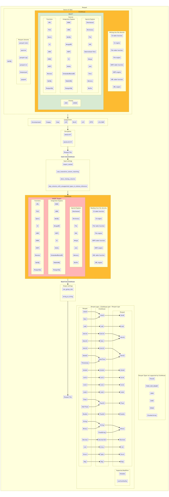

# SRS032 ClickHouse Parquet Data Format
# Software Requirements Specification

## Table of Contents

* 1 [Revision History](#revision-history)
* 2 [Introduction](#introduction)
* 3 [Feature Diagram](#feature-diagram)
* 4 [Requirements](#requirements)
  * 4.1 [General](#general)
    * 4.1.1 [RQ.SRS-032.ClickHouse.Parquet](#rqsrs-032clickhouseparquet)
    * 4.1.2 [RQ.SRS-032.ClickHouse.Parquet.Encryption](#rqsrs-032clickhouseparquetencryption)
    * 4.1.3 [Compression](#compression)
      * 4.1.3.1 [RQ.SRS-032.ClickHouse.Parquet.Compression.None](#rqsrs-032clickhouseparquetcompressionnone)
      * 4.1.3.2 [RQ.SRS-032.ClickHouse.Parquet.Compression.Gzip](#rqsrs-032clickhouseparquetcompressiongzip)
      * 4.1.3.3 [RQ.SRS-032.ClickHouse.Parquet.Compression.Brotli](#rqsrs-032clickhouseparquetcompressionbrotli)
      * 4.1.3.4 [RQ.SRS-032.ClickHouse.Parquet.Compression.Lz4](#rqsrs-032clickhouseparquetcompressionlz4)
      * 4.1.3.5 [RQ.SRS-032.ClickHouse.Parquet.Compression.Lz4Raw](#rqsrs-032clickhouseparquetcompressionlz4raw)
    * 4.1.4 [Unsupported Compression](#unsupported-compression)
      * 4.1.4.1 [RQ.SRS-032.ClickHouse.Parquet.UnsupportedCompression.Snappy](#rqsrs-032clickhouseparquetunsupportedcompressionsnappy)
      * 4.1.4.2 [RQ.SRS-032.ClickHouse.Parquet.UnsupportedCompression.Lzo](#rqsrs-032clickhouseparquetunsupportedcompressionlzo)
      * 4.1.4.3 [RQ.SRS-032.ClickHouse.Parquet.UnsupportedCompression.Zstd](#rqsrs-032clickhouseparquetunsupportedcompressionzstd)
  * 4.2 [Data Types](#data-types)
    * 4.2.1 [RQ.SRS-032.ClickHouse.Parquet.DataTypes.Read](#rqsrs-032clickhouseparquetdatatypesread)
    * 4.2.2 [RQ.SRS-032.ClickHouse.Parquet.DataTypes.Write](#rqsrs-032clickhouseparquetdatatypeswrite)
  * 4.3 [Unsupported Parquet Types](#unsupported-parquet-types)
    * 4.3.1 [RQ.SRS-032.ClickHouse.Parquet.UnsupportedParquetTypes](#rqsrs-032clickhouseparquetunsupportedparquettypes)
    * 4.3.2 [RQ.SRS-032.ClickHouse.Parquet.UnsupportedParquetTypes.ChunkedArray](#rqsrs-032clickhouseparquetunsupportedparquettypeschunkedarray)
  * 4.4 [INSERT](#insert)
    * 4.4.1 [RQ.SRS-032.ClickHouse.Parquet.Insert](#rqsrs-032clickhouseparquetinsert)
    * 4.4.2 [RQ.SRS-032.ClickHouse.Parquet.Insert.Projections](#rqsrs-032clickhouseparquetinsertprojections)
    * 4.4.3 [INSERT Settings](#insert-settings)
      * 4.4.3.1 [RQ.SRS-032.ClickHouse.Parquet.Insert.Settings.ImportNested](#rqsrs-032clickhouseparquetinsertsettingsimportnested)
      * 4.4.3.2 [RQ.SRS-032.ClickHouse.Parquet.Insert.Settings.CaseInsensitiveColumnMatching](#rqsrs-032clickhouseparquetinsertsettingscaseinsensitivecolumnmatching)
      * 4.4.3.3 [RQ.SRS-032.ClickHouse.Parquet.Insert.Settings.AllowMissingColumns](#rqsrs-032clickhouseparquetinsertsettingsallowmissingcolumns)
      * 4.4.3.4 [RQ.SRS-032.ClickHouse.Parquet.Insert.Settings.SkipColumnsWithUnsupportedTypesInSchemaInference](#rqsrs-032clickhouseparquetinsertsettingsskipcolumnswithunsupportedtypesinschemainference)
  * 4.5 [SELECT](#select)
    * 4.5.1 [RQ.SRS-032.ClickHouse.Parquet.Select](#rqsrs-032clickhouseparquetselect)
    * 4.5.2 [RQ.SRS-032.ClickHouse.Parquet.Select.Join](#rqsrs-032clickhouseparquetselectjoin)
    * 4.5.3 [RQ.SRS-032.ClickHouse.Parquet.Select.Union](#rqsrs-032clickhouseparquetselectunion)
    * 4.5.4 [RQ.SRS-032.ClickHouse.Parquet.Select.View](#rqsrs-032clickhouseparquetselectview)
    * 4.5.5 [RQ.SRS-032.ClickHouse.Parquet.Select.MaterializedView](#rqsrs-032clickhouseparquetselectmaterializedview)
    * 4.5.6 [SELECT Settings](#select-settings)
      * 4.5.6.1 [RQ.SRS-032.ClickHouse.Parquet.Select.Settings.RowGroupSize](#rqsrs-032clickhouseparquetselectsettingsrowgroupsize)
      * 4.5.6.2 [RQ.SRS-032.ClickHouse.Parquet.Select.Settings.StringAsString](#rqsrs-032clickhouseparquetselectsettingsstringasstring)
  * 4.6 [Table Functions](#table-functions)
    * 4.6.1 [RQ.SRS-032.ClickHouse.Parquet.TableFunctions.URL](#rqsrs-032clickhouseparquettablefunctionsurl)
    * 4.6.2 [RQ.SRS-032.ClickHouse.Parquet.TableFunctions.File](#rqsrs-032clickhouseparquettablefunctionsfile)
    * 4.6.3 [RQ.SRS-032.ClickHouse.Parquet.TableFunctions.S3](#rqsrs-032clickhouseparquettablefunctionss3)
    * 4.6.4 [RQ.SRS-032.ClickHouse.Parquet.TableFunctions.JDBC](#rqsrs-032clickhouseparquettablefunctionsjdbc)
    * 4.6.5 [RQ.SRS-032.ClickHouse.Parquet.TableFunctions.ODBC](#rqsrs-032clickhouseparquettablefunctionsodbc)
    * 4.6.6 [RQ.SRS-032.ClickHouse.Parquet.TableFunctions.HDFS](#rqsrs-032clickhouseparquettablefunctionshdfs)
    * 4.6.7 [RQ.SRS-032.ClickHouse.Parquet.TableFunctions.Remote](#rqsrs-032clickhouseparquettablefunctionsremote)
    * 4.6.8 [RQ.SRS-032.ClickHouse.Parquet.TableFunctions.MySQL](#rqsrs-032clickhouseparquettablefunctionsmysql)
    * 4.6.9 [RQ.SRS-032.ClickHouse.Parquet.TableFunctions.PostgreSQL](#rqsrs-032clickhouseparquettablefunctionspostgresql)
  * 4.7 [Table Engines](#table-engines)
    * 4.7.1 [MergeTree](#mergetree)
      * 4.7.1.1 [RQ.SRS-032.ClickHouse.Parquet.TableEngines.MergeTree.MergeTree](#rqsrs-032clickhouseparquettableenginesmergetreemergetree)
      * 4.7.1.2 [RQ.SRS-032.ClickHouse.Parquet.TableEngines.MergeTree.ReplicatedMergeTree](#rqsrs-032clickhouseparquettableenginesmergetreereplicatedmergetree)
      * 4.7.1.3 [RQ.SRS-032.ClickHouse.Parquet.TableEngines.MergeTree.ReplacingMergeTree](#rqsrs-032clickhouseparquettableenginesmergetreereplacingmergetree)
      * 4.7.1.4 [RQ.SRS-032.ClickHouse.Parquet.TableEngines.MergeTree.SummingMergeTree](#rqsrs-032clickhouseparquettableenginesmergetreesummingmergetree)
      * 4.7.1.5 [RQ.SRS-032.ClickHouse.Parquet.TableEngines.MergeTree.AggregatingMergeTree](#rqsrs-032clickhouseparquettableenginesmergetreeaggregatingmergetree)
      * 4.7.1.6 [RQ.SRS-032.ClickHouse.Parquet.TableEngines.MergeTree.CollapsingMergeTree](#rqsrs-032clickhouseparquettableenginesmergetreecollapsingmergetree)
      * 4.7.1.7 [RQ.SRS-032.ClickHouse.Parquet.TableEngines.MergeTree.VersionedCollapsingMergeTree](#rqsrs-032clickhouseparquettableenginesmergetreeversionedcollapsingmergetree)
      * 4.7.1.8 [RQ.SRS-032.ClickHouse.Parquet.TableEngines.MergeTree.GraphiteMergeTree](#rqsrs-032clickhouseparquettableenginesmergetreegraphitemergetree)
    * 4.7.2 [Integration Engines](#integration-engines)
      * 4.7.2.1 [RQ.SRS-032.ClickHouse.Parquet.TableEngines.Integration.ODBC](#rqsrs-032clickhouseparquettableenginesintegrationodbc)
      * 4.7.2.2 [RQ.SRS-032.ClickHouse.Parquet.TableEngines.Integration.JDBC](#rqsrs-032clickhouseparquettableenginesintegrationjdbc)
      * 4.7.2.3 [RQ.SRS-032.ClickHouse.Parquet.TableEngines.Integration.MySQL](#rqsrs-032clickhouseparquettableenginesintegrationmysql)
      * 4.7.2.4 [RQ.SRS-032.ClickHouse.Parquet.TableEngines.Integration.MongoDB](#rqsrs-032clickhouseparquettableenginesintegrationmongodb)
      * 4.7.2.5 [RQ.SRS-032.ClickHouse.Parquet.TableEngines.Integration.HDFS](#rqsrs-032clickhouseparquettableenginesintegrationhdfs)
      * 4.7.2.6 [RQ.SRS-032.ClickHouse.Parquet.TableEngines.Integration.S3](#rqsrs-032clickhouseparquettableenginesintegrations3)
      * 4.7.2.7 [RQ.SRS-032.ClickHouse.Parquet.TableEngines.Integration.Kafka](#rqsrs-032clickhouseparquettableenginesintegrationkafka)
      * 4.7.2.8 [RQ.SRS-032.ClickHouse.Parquet.TableEngines.Integration.EmbeddedRocksDB](#rqsrs-032clickhouseparquettableenginesintegrationembeddedrocksdb)
      * 4.7.2.9 [RQ.SRS-032.ClickHouse.Parquet.TableEngines.Integration.PostgreSQL](#rqsrs-032clickhouseparquettableenginesintegrationpostgresql)
    * 4.7.3 [Special Engines](#special-engines)
      * 4.7.3.1 [RQ.SRS-032.ClickHouse.Parquet.TableEngines.Special.Memory](#rqsrs-032clickhouseparquettableenginesspecialmemory)
      * 4.7.3.2 [RQ.SRS-032.ClickHouse.Parquet.TableEngines.Special.Distributed](#rqsrs-032clickhouseparquettableenginesspecialdistributed)
      * 4.7.3.3 [RQ.SRS-032.ClickHouse.Parquet.TableEngines.Special.Dictionary](#rqsrs-032clickhouseparquettableenginesspecialdictionary)
      * 4.7.3.4 [RQ.SRS-032.ClickHouse.Parquet.TableEngines.Special.File](#rqsrs-032clickhouseparquettableenginesspecialfile)
      * 4.7.3.5 [RQ.SRS-032.ClickHouse.Parquet.TableEngines.Special.URL](#rqsrs-032clickhouseparquettableenginesspecialurl)


## Revision History

This document is stored in an electronic form using [Git] source control management software
hosted in a [GitHub Repository].
All the updates are tracked using the [Revision History].

## Introduction

This software requirements specification covers requirements for `Parquet` data format in [ClickHouse].

## Feature Diagram



Generated using code in flowchart_code.txt

## Requirements

### General

#### RQ.SRS-032.ClickHouse.Parquet
version: 1.0

[ClickHouse] SHALL support `Parquet` data format.

#### RQ.SRS-032.ClickHouse.Parquet.Encryption
version: 1.0

[ClickHouse] MAY not support reading encrypted Parquet files.

#### Compression

##### RQ.SRS-032.ClickHouse.Parquet.Compression.None
version: 1.0

[ClickHouse] SHALL support reading or writing uncompressed Parquet files.

##### RQ.SRS-032.ClickHouse.Parquet.Compression.Gzip
version: 1.0

[ClickHouse] SHALL support reading or writing Parquet files compressed using gzip.

##### RQ.SRS-032.ClickHouse.Parquet.Compression.Brotli
version: 1.0

[ClickHouse] SHALL support reading or writing Parquet files compressed using brotli.

##### RQ.SRS-032.ClickHouse.Parquet.Compression.Lz4
version: 1.0

[ClickHouse] SHALL support reading or writing Parquet files compressed using lz4.

##### RQ.SRS-032.ClickHouse.Parquet.Compression.Lz4Raw
version: 1.0

[ClickHouse] SHALL support reading or writing Parquet files compressed using lz4_raw.

#### Unsupported Compression

##### RQ.SRS-032.ClickHouse.Parquet.UnsupportedCompression.Snappy
version: 1.0

[ClickHouse] MAY not support reading or writing Parquet files compressed using snapy.

##### RQ.SRS-032.ClickHouse.Parquet.UnsupportedCompression.Lzo
version: 1.0

[ClickHouse] MAY not support reading or writing Parquet files compressed using lzo.

##### RQ.SRS-032.ClickHouse.Parquet.UnsupportedCompression.Zstd
version: 1.0

[ClickHouse] MAY not support reading or writing Parquet files compressed using zstd.

### Data Types

#### RQ.SRS-032.ClickHouse.Parquet.DataTypes.Read
version:1.0

[ClickHouse] SHALL support reading the following Parquet data types:
Parquet Decimal is currently not tested.

- Bool
- UInt8
- Int8
- UInt16
- UInt32
- UInt64
- Int16
- Int32
- Int64
- Float
- Half_Float
- Double
- Date32
- Date64
- Timestamp
- String
- Binary
- Decimal
- List
- Struct
- Map

#### RQ.SRS-032.ClickHouse.Parquet.DataTypes.Write
version:1.0

[ClickHouse] SHALL support writing the following datatypes to Parquet:

- UInt8
- Int8
- UInt16
- UInt32
- UInt64
- Int16
- Int32
- Int64
- Float32
- Float64
- Date
- DateTime
- String
- Decimal128
- Array
- Tuple
- Map
- Nullable
- LowCardinality

### Unsupported Parquet Types

#### RQ.SRS-032.ClickHouse.Parquet.UnsupportedParquetTypes
version:1.0

[ClickHouse] MAY not support the following Parquet types:

- `Time32`
- `Fixed_Size_Binary`
- `JSON`
- `UUID`
- `ENUM`

#### RQ.SRS-032.ClickHouse.Parquet.UnsupportedParquetTypes.ChunkedArray
version:1.0

[ClickHouse] MAY not support Parquet chunked arrays.

### INSERT

#### RQ.SRS-032.ClickHouse.Parquet.Insert
version: 1.0

[ClickHouse] SHALL support using `INSERT` query with `FROM INFILE {file_name}` and `FORMAT Parquet` clauses to
read data from Parquet files and insert data into tables or table functions.

#### RQ.SRS-032.ClickHouse.Parquet.Insert.Projections
version: 1.0

[ClickHouse] SHALL support inserting parquet data into a table that has a projection on it.

#### INSERT Settings

##### RQ.SRS-032.ClickHouse.Parquet.Insert.Settings.ImportNested
version: 1.0

[ClickHouse] SHALL support specifying `input_format_parquet_import_nested` to allow inserting arrays of
nested structs into Nested tables.
Default: `false`

##### RQ.SRS-032.ClickHouse.Parquet.Insert.Settings.CaseInsensitiveColumnMatching
version: 1.0

[ClickHouse] SHALL support specifying `input_format_parquet_case_insensitive_column_matching` to ignore matching
Parquet and ClickHouse columns.
Default: `false`

##### RQ.SRS-032.ClickHouse.Parquet.Insert.Settings.AllowMissingColumns
version: 1.0

[ClickHouse] SHALL support specifying `input_format_parquet_allow_missing_columns` to allow missing columns.
Default: `false`

##### RQ.SRS-032.ClickHouse.Parquet.Insert.Settings.SkipColumnsWithUnsupportedTypesInSchemaInference
version: 1.0

[ClickHouse] SHALL support specifying `input_format_parquet_skip_columns_with_unsupported_types_in_schema_inference`
to allow skipping unsupported types.
Default: `false`

### SELECT

#### RQ.SRS-032.ClickHouse.Parquet.Select
version: 1.0

[ClickHouse] SHALL support writing output of `SELECT` query into a Parquet file.
```bash
clickhouse-client --query="SELECT * FROM {some_table} FORMAT Parquet" > {some_file.pq}
```

#### RQ.SRS-032.ClickHouse.Parquet.Select.Join
version: 1.0

[ClickHouse] SHALL support writing output of `SELECT` query with a `JOIN` clause into a Parquet file.

#### RQ.SRS-032.ClickHouse.Parquet.Select.Union
version: 1.0

[ClickHouse] SHALL support writing output of `SELECT` query with a `UNION` clause into a Parquet file.

#### RQ.SRS-032.ClickHouse.Parquet.Select.View
version: 1.0

[ClickHouse] SHALL support writing output of `SELECT * FROM {view_name}` query into a Parquet file.

#### RQ.SRS-032.ClickHouse.Parquet.Select.MaterializedView
version: 1.0

[ClickHouse] SHALL support writing output of `SELECT * FROM {mat_view_name}` query into a Parquet file.

#### SELECT Settings

##### RQ.SRS-032.ClickHouse.Parquet.Select.Settings.RowGroupSize
version: 1.0

[ClickHouse] SHALL support specifying `output_format_parquet_row_group_size` row group size by row count.
Default: `1000000`

##### RQ.SRS-032.ClickHouse.Parquet.Select.Settings.StringAsString
version: 1.0

[ClickHouse] SHALL support specifying `output_format_parquet_string_as_string` to use Parquet String type instead of Binary.
Default: `false`

### Table Functions

#### RQ.SRS-032.ClickHouse.Parquet.TableFunctions.URL
version: 1.0

[ClickHouse] SHALL support `url` table function reading and writing Parquet format.

#### RQ.SRS-032.ClickHouse.Parquet.TableFunctions.File
version: 1.0

[ClickHouse] SHALL support `file` table function reading and writing Parquet format.

#### RQ.SRS-032.ClickHouse.Parquet.TableFunctions.S3
version: 1.0

[ClickHouse] SHALL support `s3` table function reading and writing Parquet format.

#### RQ.SRS-032.ClickHouse.Parquet.TableFunctions.JDBC
version: 1.0

[ClickHouse] SHALL support `jdbc` table function reading and writing Parquet format.

#### RQ.SRS-032.ClickHouse.Parquet.TableFunctions.ODBC
version: 1.0

[ClickHouse] SHALL support `odbc` table function reading and writing Parquet format.

#### RQ.SRS-032.ClickHouse.Parquet.TableFunctions.HDFS
version: 1.0

[ClickHouse] SHALL support `hdfs` table function reading and writing Parquet format.

#### RQ.SRS-032.ClickHouse.Parquet.TableFunctions.Remote
version: 1.0

[ClickHouse] SHALL support `remote` table function reading and writing Parquet format.

#### RQ.SRS-032.ClickHouse.Parquet.TableFunctions.MySQL
version: 1.0

[ClickHouse] SHALL support `mysql` table function reading and writing Parquet format.

#### RQ.SRS-032.ClickHouse.Parquet.TableFunctions.PostgreSQL
version: 1.0

[ClickHouse] SHALL support `postgresql` table function reading and writing Parquet format.

### Table Engines

#### MergeTree

##### RQ.SRS-032.ClickHouse.Parquet.TableEngines.MergeTree.MergeTree
version: 1.0

[ClickHouse] SHALL support Parquet format being writen into and read from a `MergeTree` table engine.

##### RQ.SRS-032.ClickHouse.Parquet.TableEngines.MergeTree.ReplicatedMergeTree
version: 1.0

[ClickHouse] SHALL support Parquet format being writen into and read from a `ReplicatedMergeTree` table engine.

##### RQ.SRS-032.ClickHouse.Parquet.TableEngines.MergeTree.ReplacingMergeTree
version: 1.0

[ClickHouse] SHALL support Parquet format being writen into and read from a `ReplacingMergeTree` table engine.

##### RQ.SRS-032.ClickHouse.Parquet.TableEngines.MergeTree.SummingMergeTree
version: 1.0

[ClickHouse] SHALL support Parquet format being writen into and read from a `SummingMergeTree` table engine.

##### RQ.SRS-032.ClickHouse.Parquet.TableEngines.MergeTree.AggregatingMergeTree
version: 1.0

[ClickHouse] SHALL support Parquet format being writen into and read from a `AggregatingMergeTree` table engine.

##### RQ.SRS-032.ClickHouse.Parquet.TableEngines.MergeTree.CollapsingMergeTree
version: 1.0

[ClickHouse] SHALL support Parquet format being writen into and read from a `CollapsingMergeTree` table engine.

##### RQ.SRS-032.ClickHouse.Parquet.TableEngines.MergeTree.VersionedCollapsingMergeTree
version: 1.0

[ClickHouse] SHALL support Parquet format being writen into and read from a `VersionedCollapsingMergeTree` table engine.

##### RQ.SRS-032.ClickHouse.Parquet.TableEngines.MergeTree.GraphiteMergeTree
version: 1.0

[ClickHouse] SHALL support Parquet format being writen into and read from a `GraphiteMergeTree` table engine.

#### Integration Engines

##### RQ.SRS-032.ClickHouse.Parquet.TableEngines.Integration.ODBC
version: 1.0

[ClickHouse] SHALL support Parquet format being writen into and read from an `ODBC` table engine.

##### RQ.SRS-032.ClickHouse.Parquet.TableEngines.Integration.JDBC
version: 1.0

[ClickHouse] SHALL support Parquet format being writen into and read from a `JDBC` table engine.

##### RQ.SRS-032.ClickHouse.Parquet.TableEngines.Integration.MySQL
version: 1.0

[ClickHouse] SHALL support Parquet format being writen into and read from a `MySQL` table engine.

##### RQ.SRS-032.ClickHouse.Parquet.TableEngines.Integration.MongoDB
version: 1.0

[ClickHouse] SHALL support Parquet format being writen into and read from a `MongoDB` table engine.

##### RQ.SRS-032.ClickHouse.Parquet.TableEngines.Integration.HDFS
version: 1.0

[ClickHouse] SHALL support Parquet format being writen into and read from a `HDFS` table engine.

##### RQ.SRS-032.ClickHouse.Parquet.TableEngines.Integration.S3
version: 1.0

[ClickHouse] SHALL support Parquet format being writen into and read from an `S3` table engine.

##### RQ.SRS-032.ClickHouse.Parquet.TableEngines.Integration.Kafka
version: 1.0

[ClickHouse] SHALL support Parquet format being writen into and read from a `Kafka` table engine.

##### RQ.SRS-032.ClickHouse.Parquet.TableEngines.Integration.EmbeddedRocksDB
version: 1.0

[ClickHouse] SHALL support Parquet format being writen into and read from an `EmbeddedRocksDB` table engine.

##### RQ.SRS-032.ClickHouse.Parquet.TableEngines.Integration.PostgreSQL
version: 1.0

[ClickHouse] SHALL support Parquet format being writen into and read from a `PostgreSQL` table engine.

#### Special Engines

##### RQ.SRS-032.ClickHouse.Parquet.TableEngines.Special.Memory
version: 1.0

[ClickHouse] SHALL support Parquet format being writen into and read from a `Memory` table engine.

##### RQ.SRS-032.ClickHouse.Parquet.TableEngines.Special.Distributed
version: 1.0

[ClickHouse] SHALL support Parquet format being writen into and read from a `Distributed` table engine.

##### RQ.SRS-032.ClickHouse.Parquet.TableEngines.Special.Dictionary
version: 1.0

[ClickHouse] SHALL support Parquet format being writen into and read from a `Dictionary` table engine.

##### RQ.SRS-032.ClickHouse.Parquet.TableEngines.Special.File
version: 1.0

[ClickHouse] SHALL support Parquet format being writen into and read from a `File` table engine.

##### RQ.SRS-032.ClickHouse.Parquet.TableEngines.Special.URL
version: 1.0

[ClickHouse] SHALL support Parquet format being writen into and read from a `URL` table engine.

[ClickHouse]: https://clickhouse.com
[GitHub Repository]: https://github.com/ClickHouse/ClickHouse/blob/master/tests/testflows/parquet/requirements/requirements.md 
[Revision History]: https://github.com/ClickHouse/ClickHouse/commits/master/tests/testflows/parquet/requirements/requirements.md
[Git]: https://git-scm.com/
[GitHub]: https://github.com
