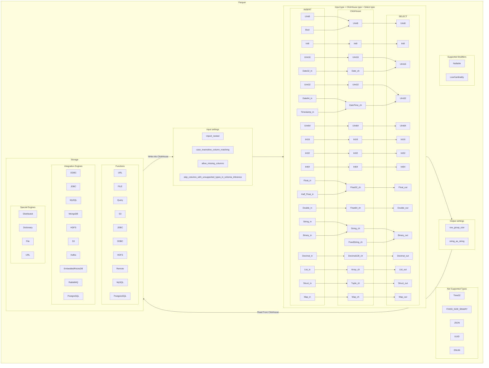

# SRS032 ClickHouse Parquet Data Format
# Software Requirements Specification

## Table of Contents

* 1 [Revision History](#revision-history)
* 2 [Introduction](#introduction)
* 3 [Feature Diagram](#feature-diagram)
* 4 [Requirements](#requirements)
  * 4.1 [General](#general)
    * 4.1.1 [RQ.SRS-032.ClickHouse.Parquet](#rqsrs-032clickhouseparquet)
  * 4.2 [INSERT](#insert)
    * 4.2.1 [RQ.SRS-032.ClickHouse.Parquet.Insert.Projections](#rqsrs-032clickhouseparquetinsertprojections)
    * 4.2.2 [INSERT Settings](#insert-settings)
      * 4.2.2.1 [RQ.SRS-032.ClickHouse.Parquet.Settings.InputFormatParquet.ImportNested](#rqsrs-032clickhouseparquetsettingsinputformatparquetimportnested)
      * 4.2.2.2 [RQ.SRS-032.ClickHouse.Parquet.Settings.InputFormatParquet.CaseInsensitiveColumnMatching](#rqsrs-032clickhouseparquetsettingsinputformatparquetcaseinsensitivecolumnmatching)
      * 4.2.2.3 [RQ.SRS-032.ClickHouse.Parquet.Settings.InputFormatParquet.AllowMissingColumns](#rqsrs-032clickhouseparquetsettingsinputformatparquetallowmissingcolumns)
      * 4.2.2.4 [RQ.SRS-032.ClickHouse.Parquet.Settings.InputFormatParquet.SkipColumnsWithUnsupportedTypesInSchemaInference](#rqsrs-032clickhouseparquetsettingsinputformatparquetskipcolumnswithunsupportedtypesinschemainference)
    * 4.2.3 [INSERT Conversions](#insert-conversions)
      * 4.2.3.1 [RQ.SRS-032.ClickHouse.Parquet.InsertConversions](#rqsrs-032clickhouseparquetinsertconversions)
  * 4.3 [SELECT](#select)
    * 4.3.1 [SELECT Settings](#select-settings)
    * 4.3.2 [RQ.SRS-032.ClickHouse.Parquet.Settings.OutFormatParquet.RowGroupSize](#rqsrs-032clickhouseparquetsettingsoutformatparquetrowgroupsize)
    * 4.3.3 [RQ.SRS-032.ClickHouse.Parquet.Settings.OutFormatParquet.StringAsString](#rqsrs-032clickhouseparquetsettingsoutformatparquetstringasstring)
    * 4.3.4 [SELECT Conversions](#select-conversions)
      * 4.3.4.1 [RQ.SRS-032.ClickHouse.Parquet.SelectConversions](#rqsrs-032clickhouseparquetselectconversions)
      * 4.3.4.2 [RQ.SRS-032.ClickHouse.Parquet.SelectConversions.UInt8ToUInt8](#rqsrs-032clickhouseparquetselectconversionsuint8touint8)
      * 4.3.4.3 [RQ.SRS-032.ClickHouse.Parquet.SelectConversions.BoolToUInt8](#rqsrs-032clickhouseparquetselectconversionsbooltouint8)
      * 4.3.4.4 [RQ.SRS-032.ClickHouse.Parquet.SelectConversions.Int8ToInt8](#rqsrs-032clickhouseparquetselectconversionsint8toint8)
      * 4.3.4.5 [RQ.SRS-032.ClickHouse.Parquet.SelectConversions.UInt16ToUInt16](#rqsrs-032clickhouseparquetselectconversionsuint16touint16)
      * 4.3.4.6 [RQ.SRS-032.ClickHouse.Parquet.SelectConversions.Int16ToInt16](#rqsrs-032clickhouseparquetselectconversionsint16toint16)
      * 4.3.4.7 [RQ.SRS-032.ClickHouse.Parquet.SelectConversions.UInt32ToUInt32](#rqsrs-032clickhouseparquetselectconversionsuint32touint32)
      * 4.3.4.8 [RQ.SRS-032.ClickHouse.Parquet.SelectConversions.Int32ToInt32](#rqsrs-032clickhouseparquetselectconversionsint32toint32)
      * 4.3.4.9 [RQ.SRS-032.ClickHouse.Parquet.SelectConversions.UInt64ToUInt64](#rqsrs-032clickhouseparquetselectconversionsuint64touint64)
      * 4.3.4.10 [RQ.SRS-032.ClickHouse.Parquet.SelectConversions.Int64ToInt64](#rqsrs-032clickhouseparquetselectconversionsint64toint64)
      * 4.3.4.11 [RQ.SRS-032.ClickHouse.Parquet.SelectConversions.Float32ToFloat](#rqsrs-032clickhouseparquetselectconversionsfloat32tofloat)
      * 4.3.4.12 [RQ.SRS-032.ClickHouse.Parquet.SelectConversions.Float64ToDouble](#rqsrs-032clickhouseparquetselectconversionsfloat64todouble)
      * 4.3.4.13 [RQ.SRS-032.ClickHouse.Parquet.SelectConversions.DateToUInt16](#rqsrs-032clickhouseparquetselectconversionsdatetouint16)
      * 4.3.4.14 [RQ.SRS-032.ClickHouse.Parquet.SelectConversions.DateTimeToUInt32](#rqsrs-032clickhouseparquetselectconversionsdatetimetouint32)
      * 4.3.4.15 [RQ.SRS-032.ClickHouse.Parquet.SelectConversions.StringToBinary](#rqsrs-032clickhouseparquetselectconversionsstringtobinary)
      * 4.3.4.16 [RQ.SRS-032.ClickHouse.Parquet.SelectConversions.FixedStringToBinary](#rqsrs-032clickhouseparquetselectconversionsfixedstringtobinary)
      * 4.3.4.17 [RQ.SRS-032.ClickHouse.Parquet.SelectConversions.DecimalToDecimal](#rqsrs-032clickhouseparquetselectconversionsdecimaltodecimal)
      * 4.3.4.18 [RQ.SRS-032.ClickHouse.Parquet.SelectConversions.ArrayToList](#rqsrs-032clickhouseparquetselectconversionsarraytolist)
      * 4.3.4.19 [RQ.SRS-032.ClickHouse.Parquet.SelectConversions.TupleToStruct](#rqsrs-032clickhouseparquetselectconversionstupletostruct)
      * 4.3.4.20 [RQ.SRS-032.ClickHouse.Parquet.SelectConversions.MapToMap](#rqsrs-032clickhouseparquetselectconversionsmaptomap)
  * 4.4 [Null](#null)
    * 4.4.1 [RQ.SRS-032.ClickHouse.Parquet.Null](#rqsrs-032clickhouseparquetnull)
  * 4.5 [Nested Types](#nested-types)
    * 4.5.1 [RQ.SRS-032.ClickHouse.Parquet.NestedTypes.Arrays](#rqsrs-032clickhouseparquetnestedtypesarrays)
    * 4.5.2 [RQ.SRS-032.ClickHouse.Parquet.NestedTypes.Tuple](#rqsrs-032clickhouseparquetnestedtypestuple)
    * 4.5.3 [RQ.SRS-032.ClickHouse.Parquet.NestedTypes.Map](#rqsrs-032clickhouseparquetnestedtypesmap)
    * 4.5.4 [RQ.SRS-032.ClickHouse.Parquet.NestedTypes.LowCardinalityNullable](#rqsrs-032clickhouseparquetnestedtypeslowcardinalitynullable)
  * 4.6 [Unsupported Parquet Types](#unsupported-parquet-types)
    * 4.6.1 [RQ.SRS-032.ClickHouse.Parquet.UnsupportedParquetTypes.Time32](#rqsrs-032clickhouseparquetunsupportedparquettypestime32)
    * 4.6.2 [RQ.SRS-032.ClickHouse.Parquet.UnsupportedParquetTypes.FixedSizeBinary](#rqsrs-032clickhouseparquetunsupportedparquettypesfixedsizebinary)
    * 4.6.3 [RQ.SRS-032.ClickHouse.Parquet.UnsupportedParquetTypes.JSON](#rqsrs-032clickhouseparquetunsupportedparquettypesjson)
    * 4.6.4 [RQ.SRS-032.ClickHouse.Parquet.UnsupportedParquetTypes.UUID](#rqsrs-032clickhouseparquetunsupportedparquettypesuuid)
    * 4.6.5 [RQ.SRS-032.ClickHouse.Parquet.UnsupportedParquetTypes.ENUM](#rqsrs-032clickhouseparquetunsupportedparquettypesenum)
  * 4.7 [Sources](#sources)
    * 4.7.1 [RQ.SRS-032.ClickHouse.Parquet.Sources.Query](#rqsrs-032clickhouseparquetsourcesquery)
    * 4.7.2 [Table Functions](#table-functions)
      * 4.7.2.1 [RQ.SRS-032.ClickHouse.Parquet.Sources.TableFunctions.URL](#rqsrs-032clickhouseparquetsourcestablefunctionsurl)
      * 4.7.2.2 [RQ.SRS-032.ClickHouse.Parquet.Sources.TableFunctions.File](#rqsrs-032clickhouseparquetsourcestablefunctionsfile)
      * 4.7.2.3 [RQ.SRS-032.ClickHouse.Parquet.Sources.TableFunctions.S3](#rqsrs-032clickhouseparquetsourcestablefunctionss3)
      * 4.7.2.4 [RQ.SRS-032.ClickHouse.Parquet.Sources.TableFunctions.JDBC](#rqsrs-032clickhouseparquetsourcestablefunctionsjdbc)
      * 4.7.2.5 [RQ.SRS-032.ClickHouse.Parquet.Sources.TableFunctions.ODBC](#rqsrs-032clickhouseparquetsourcestablefunctionsodbc)
      * 4.7.2.6 [RQ.SRS-032.ClickHouse.Parquet.Sources.TableFunctions.HDFS](#rqsrs-032clickhouseparquetsourcestablefunctionshdfs)
      * 4.7.2.7 [RQ.SRS-032.ClickHouse.Parquet.Sources.TableFunctions.Remote](#rqsrs-032clickhouseparquetsourcestablefunctionsremote)
      * 4.7.2.8 [RQ.SRS-032.ClickHouse.Parquet.Sources.TableFunctions.MySQL](#rqsrs-032clickhouseparquetsourcestablefunctionsmysql)
      * 4.7.2.9 [RQ.SRS-032.ClickHouse.Parquet.Sources.TableFunctions.PostgeSQL](#rqsrs-032clickhouseparquetsourcestablefunctionspostgesql)
    * 4.7.3 [Table Engines](#table-engines)
      * 4.7.3.1 [Integration Engines](#integration-engines)
        * 4.7.3.1.1 [RQ.SRS-032.ClickHouse.Parquet.Sources.TableEngines.Integration.ODBC](#rqsrs-032clickhouseparquetsourcestableenginesintegrationodbc)
        * 4.7.3.1.2 [RQ.SRS-032.ClickHouse.Parquet.Sources.TableEngines.Integration.JDBC](#rqsrs-032clickhouseparquetsourcestableenginesintegrationjdbc)
        * 4.7.3.1.3 [RQ.SRS-032.ClickHouse.Parquet.Sources.TableEngines.Integration.MySQL](#rqsrs-032clickhouseparquetsourcestableenginesintegrationmysql)
        * 4.7.3.1.4 [RQ.SRS-032.ClickHouse.Parquet.Sources.TableEngines.Integration.MongoDB](#rqsrs-032clickhouseparquetsourcestableenginesintegrationmongodb)
        * 4.7.3.1.5 [RQ.SRS-032.ClickHouse.Parquet.Sources.TableEngines.Integration.HDFS](#rqsrs-032clickhouseparquetsourcestableenginesintegrationhdfs)
        * 4.7.3.1.6 [RQ.SRS-032.ClickHouse.Parquet.Sources.TableEngines.Integration.S3](#rqsrs-032clickhouseparquetsourcestableenginesintegrations3)
        * 4.7.3.1.7 [RQ.SRS-032.ClickHouse.Parquet.Sources.TableEngines.Integration.Kafka](#rqsrs-032clickhouseparquetsourcestableenginesintegrationkafka)
        * 4.7.3.1.8 [RQ.SRS-032.ClickHouse.Parquet.Sources.TableEngines.Integration.EmbeddedRocksDB](#rqsrs-032clickhouseparquetsourcestableenginesintegrationembeddedrocksdb)
        * 4.7.3.1.9 [RQ.SRS-032.ClickHouse.Parquet.Sources.TableEngines.Integration.PostgreSQL](#rqsrs-032clickhouseparquetsourcestableenginesintegrationpostgresql)
      * 4.7.3.2 [Special Engines](#special-engines)
        * 4.7.3.2.1 [RQ.SRS-032.ClickHouse.Parquet.Sources.TableEngines.Special.Distributed](#rqsrs-032clickhouseparquetsourcestableenginesspecialdistributed)
        * 4.7.3.2.2 [RQ.SRS-032.ClickHouse.Parquet.Sources.TableEngines.Special.Dictionary](#rqsrs-032clickhouseparquetsourcestableenginesspecialdictionary)
        * 4.7.3.2.3 [RQ.SRS-032.ClickHouse.Parquet.Sources.TableEngines.Special.File](#rqsrs-032clickhouseparquetsourcestableenginesspecialfile)
        * 4.7.3.2.4 [RQ.SRS-032.ClickHouse.Parquet.Sources.TableEngines.Special.URL](#rqsrs-032clickhouseparquetsourcestableenginesspecialurl)

## Revision History

This document is stored in an electronic form using [Git] source control management software
hosted in a [GitHub Repository].
All the updates are tracked using the [Revision History].

## Introduction

This software requirements specification covers requirements for `Parquet` data format in [ClickHouse].

## Feature Diagram

## Requirements

### General

#### RQ.SRS-032.ClickHouse.Parquet
version: 1.0

[ClickHouse] SHALL support `Parquet` data format.

### INSERT

#### RQ.SRS-032.ClickHouse.Parquet.Insert.Projections
version: 1.0

[ClickHouse] SHALL support inserting parquet data into a table that has a projection on it.

#### INSERT Settings

##### RQ.SRS-032.ClickHouse.Parquet.Settings.InputFormatParquet.ImportNested
version: 1.0

[ClickHouse] SHALL support specifying `input_format_parquet_import_nested` to allow inserting arrays of
nested structs into Nested tables.
Default: `false`

##### RQ.SRS-032.ClickHouse.Parquet.Settings.InputFormatParquet.CaseInsensitiveColumnMatching
version: 1.0

[ClickHouse] SHALL support specifying `input_format_parquet_case_insensitive_column_matching` to ignore matching
Parquet and ClickHouse columns.
Default: `false`

##### RQ.SRS-032.ClickHouse.Parquet.Settings.InputFormatParquet.AllowMissingColumns
version: 1.0

[ClickHouse] SHALL support specifying `input_format_parquet_allow_missing_columns` to allow missing columns.
Default: `false`

##### RQ.SRS-032.ClickHouse.Parquet.Settings.InputFormatParquet.SkipColumnsWithUnsupportedTypesInSchemaInference
version: 1.0

[ClickHouse] SHALL support specifying `input_format_parquet_skip_columns_with_unsupported_types_in_schema_inference`
to allow skipping unsupported types..Format
Default: `false`

#### INSERT Conversions

##### RQ.SRS-032.ClickHouse.Parquet.InsertConversions
version:1.0

[ClickHouse] SHALL convert Parquet types to ClickHouse types in the following manner:

Parquet | ClickHouse
--- | ---
UInt8 | UInt8
Bool | UInt8
Int8 | Int8
UInt16 | UInt16
UInt32 | UInt32
UInt64 | UInt64
Int16 | Int16
Int32 | Int32
Int64 | Int64
Float | Float32
Half_Float | Float32
Double | Float64
Date32 | Date
Date64 | DateTime
Timestamp | DateTime
String | String
Binary | String
Decimal | Decimal128
List | Array
Struct | Tuple
Map | Map

### SELECT

#### SELECT Settings

#### RQ.SRS-032.ClickHouse.Parquet.Settings.OutFormatParquet.RowGroupSize
version: 1.0

[ClickHouse] SHALL support specifying `output_format_parquet_row_group_size` row group size by row count.
Default: `1000000`

#### RQ.SRS-032.ClickHouse.Parquet.Settings.OutFormatParquet.StringAsString
version: 1.0

[ClickHouse] SHALL support specifying `output_format_parquet_string_as_string` to use Parquet String type instead of Binary.
Default: `false`

#### SELECT Conversions

##### RQ.SRS-032.ClickHouse.Parquet.SelectConversions
version:1.0

[ClickHouse] SHALL convert ClickHouse types to Parquet types in the following manner:

ClickHouse | Parquet
--- | ---
UInt8 | UInt8
Int8 | Int8
UInt16 | UInt16
UInt32 | UInt32
UInt64 | UInt64
Int16 | Int16
Int32 | Int32
Int64 | Int64
Float32 | Float
Float64 | Double
Date | UInt16
DateTime | UInt32
String | Binary
Decimal128 | Decimal
Array | List
Tuple | Struct
Map | Map

##### RQ.SRS-032.ClickHouse.Parquet.SelectConversions.UInt8ToUInt8
version:1.0

[ClickHouse] SHALL convert ClickHouse `UInt8` to Parquet `UInt8` in Select queries.

##### RQ.SRS-032.ClickHouse.Parquet.SelectConversions.BoolToUInt8
version:1.0

[ClickHouse] SHALL convert ClickHouse `Bool` to Parquet `UInt8` in Select queries.

##### RQ.SRS-032.ClickHouse.Parquet.SelectConversions.Int8ToInt8
version:1.0

[ClickHouse] SHALL convert ClickHouse `Int8` to Parquet `Int8` in Select queries.

##### RQ.SRS-032.ClickHouse.Parquet.SelectConversions.UInt16ToUInt16
version:1.0

[ClickHouse] SHALL convert ClickHouse `UInt16` to Parquet `UInt16` in Select queries.

##### RQ.SRS-032.ClickHouse.Parquet.SelectConversions.Int16ToInt16
version:1.0

[ClickHouse] SHALL convert ClickHouse `Int16` to Parquet `Int16` in Select queries.

##### RQ.SRS-032.ClickHouse.Parquet.SelectConversions.UInt32ToUInt32
version:1.0

[ClickHouse] SHALL convert ClickHouse `UInt32` to Parquet `UInt32` in Select queries.

##### RQ.SRS-032.ClickHouse.Parquet.SelectConversions.Int32ToInt32
version:1.0

[ClickHouse] SHALL convert ClickHouse `Int32` to Parquet `Int32` in Select queries.

##### RQ.SRS-032.ClickHouse.Parquet.SelectConversions.UInt64ToUInt64
version:1.0

[ClickHouse] SHALL convert ClickHouse `UInt64` to Parquet `UInt64` in Select queries.

##### RQ.SRS-032.ClickHouse.Parquet.SelectConversions.Int64ToInt64
version:1.0

[ClickHouse] SHALL convert ClickHouse `Int64` to Parquet `Int64` in Select queries.

##### RQ.SRS-032.ClickHouse.Parquet.SelectConversions.Float32ToFloat
version:1.0

[ClickHouse] SHALL convert ClickHouse `Float32` to Parquet `Float` in Select queries.

##### RQ.SRS-032.ClickHouse.Parquet.SelectConversions.Float64ToDouble
version:1.0

[ClickHouse] SHALL convert ClickHouse `Float64` to Parquet `Double` in Select queries.

##### RQ.SRS-032.ClickHouse.Parquet.SelectConversions.DateToUInt16
version:1.0

[ClickHouse] SHALL convert ClickHouse `Date` to Parquet `UInt16` in Select queries.

##### RQ.SRS-032.ClickHouse.Parquet.SelectConversions.DateTimeToUInt32
version:1.0

[ClickHouse] SHALL convert ClickHouse `DateTime` to Parquet `UInt32` in Select queries.

##### RQ.SRS-032.ClickHouse.Parquet.SelectConversions.StringToBinary
version:1.0

[ClickHouse] SHALL convert ClickHouse `String` to Parquet `Binary` in Select queries.

##### RQ.SRS-032.ClickHouse.Parquet.SelectConversions.FixedStringToBinary
version:1.0

[ClickHouse] SHALL convert ClickHouse `FixedString` to Parquet `Binary` in Select queries.

##### RQ.SRS-032.ClickHouse.Parquet.SelectConversions.DecimalToDecimal
version:1.0

[ClickHouse] SHALL convert ClickHouse `Decimal` to Parquet `Decimal` in Select queries.

##### RQ.SRS-032.ClickHouse.Parquet.SelectConversions.ArrayToList
version:1.0

[ClickHouse] SHALL convert ClickHouse `Array` to Parquet `List` in Select queries.

##### RQ.SRS-032.ClickHouse.Parquet.SelectConversions.TupleToStruct
version:1.0

[ClickHouse] SHALL convert ClickHouse `Tuple` to Parquet `Struct` in Select queries.

##### RQ.SRS-032.ClickHouse.Parquet.SelectConversions.MapToMap
version:1.0

[ClickHouse] SHALL convert ClickHouse `Map` to Parquet `Map` in Select queries.

### Null

#### RQ.SRS-032.ClickHouse.Parquet.Null
version:1.0

[ClickHouse] SHALL support Null and Nullable(type) data when inserting or selecting using Parquet format.

### Nested Types

#### RQ.SRS-032.ClickHouse.Parquet.NestedTypes.Arrays
version:1.0

[ClickHouse] SHALL support nested `arrays` in Parquet format.

#### RQ.SRS-032.ClickHouse.Parquet.NestedTypes.Tuple
version:1.0

[ClickHouse] SHALL support nested `tuples` in Parquet format.

#### RQ.SRS-032.ClickHouse.Parquet.NestedTypes.Map
version:1.0

[ClickHouse] SHALL support nested `maps` in Parquet format.

#### RQ.SRS-032.ClickHouse.Parquet.NestedTypes.LowCardinalityNullable
version: 1.0

[ClickHouse] SHALL support nesting LowCardinality and Nullable data types in any order.
Example:
LowCardinality(Nullable(String))
Nullable(LowCradinality(String))

### Unsupported Parquet Types

#### RQ.SRS-032.ClickHouse.Parquet.UnsupportedParquetTypes.Time32
version:1.0

[ClickHouse] MAY not support Parquet `Time32` type.

#### RQ.SRS-032.ClickHouse.Parquet.UnsupportedParquetTypes.FixedSizeBinary
version:1.0

[ClickHouse] MAY not support Parquet `Fixed_Size_Binary` type.

#### RQ.SRS-032.ClickHouse.Parquet.UnsupportedParquetTypes.JSON
version:1.0

[ClickHouse] MAY not support Parquet `JSON` type.

#### RQ.SRS-032.ClickHouse.Parquet.UnsupportedParquetTypes.UUID
version:1.0

[ClickHouse] MAY not support Parquet `UUID` type.

#### RQ.SRS-032.ClickHouse.Parquet.UnsupportedParquetTypes.ENUM
version:1.0

[ClickHouse] MAY not support Parquet `ENUM` type.

### Sources

#### RQ.SRS-032.ClickHouse.Parquet.Sources.Query
version: 1.0

[ClickHouse] SHALL support reading and writing Parquet format from a command line query.

#### Table Functions

##### RQ.SRS-032.ClickHouse.Parquet.Sources.TableFunctions.URL
version: 1.0

[ClickHouse] SHALL support `url` table function reading and writing Parquet format.

##### RQ.SRS-032.ClickHouse.Parquet.Sources.TableFunctions.File
version: 1.0

[ClickHouse] SHALL support `file` table function reading and writing Parquet format.

##### RQ.SRS-032.ClickHouse.Parquet.Sources.TableFunctions.S3
version: 1.0

[ClickHouse] SHALL support `s3` table function reading and writing Parquet format.

##### RQ.SRS-032.ClickHouse.Parquet.Sources.TableFunctions.JDBC
version: 1.0

[ClickHouse] SHALL support `jdbc` table function reading and writing Parquet format.

##### RQ.SRS-032.ClickHouse.Parquet.Sources.TableFunctions.ODBC
version: 1.0

[ClickHouse] SHALL support `odbc` table function reading and writing Parquet format.

##### RQ.SRS-032.ClickHouse.Parquet.Sources.TableFunctions.HDFS
version: 1.0

[ClickHouse] SHALL support `hdfs` table function reading and writing Parquet format.

##### RQ.SRS-032.ClickHouse.Parquet.Sources.TableFunctions.Remote
version: 1.0

[ClickHouse] SHALL support `remote` table function reading and writing Parquet format.

##### RQ.SRS-032.ClickHouse.Parquet.Sources.TableFunctions.MySQL
version: 1.0

[ClickHouse] SHALL support `mysql` table function reading and writing Parquet format.

##### RQ.SRS-032.ClickHouse.Parquet.Sources.TableFunctions.PostgeSQL
version: 1.0

[ClickHouse] SHALL support `postgresql` table function reading and writing Parquet format.

#### Table Engines

##### Integration Engines

###### RQ.SRS-032.ClickHouse.Parquet.Sources.TableEngines.Integration.ODBC
version: 1.0

[ClickHouse] SHALL support Parquet format being inserted into and selected from an `ODBC` table engine.

###### RQ.SRS-032.ClickHouse.Parquet.Sources.TableEngines.Integration.JDBC
version: 1.0

[ClickHouse] SHALL support Parquet format being inserted into and selected from a `JDBC` table engine.

###### RQ.SRS-032.ClickHouse.Parquet.Sources.TableEngines.Integration.MySQL
version: 1.0

[ClickHouse] SHALL support Parquet format being inserted into and selected from a `MySQL` table engine.

###### RQ.SRS-032.ClickHouse.Parquet.Sources.TableEngines.Integration.MongoDB
version: 1.0

[ClickHouse] SHALL support Parquet format being inserted into and selected from a `MongoDB` table engine.

###### RQ.SRS-032.ClickHouse.Parquet.Sources.TableEngines.Integration.HDFS
version: 1.0

[ClickHouse] SHALL support Parquet format being inserted into and selected from an `HDFS` table engine.

###### RQ.SRS-032.ClickHouse.Parquet.Sources.TableEngines.Integration.S3
version: 1.0

[ClickHouse] SHALL support Parquet format being inserted into and selected from an `s3` table engine.

###### RQ.SRS-032.ClickHouse.Parquet.Sources.TableEngines.Integration.Kafka
version: 1.0

[ClickHouse] SHALL support Parquet format being inserted into and selected from an `Kafka` table engine.

###### RQ.SRS-032.ClickHouse.Parquet.Sources.TableEngines.Integration.EmbeddedRocksDB
version: 1.0

[ClickHouse] SHALL support Parquet format being inserted into and selected from an `EmbeddedRocksDB` table engine.

###### RQ.SRS-032.ClickHouse.Parquet.Sources.TableEngines.Integration.PostgreSQL
version: 1.0

[ClickHouse] SHALL support Parquet format being inserted into and selected from an `PostgreSQL` table engine.

##### Special Engines

###### RQ.SRS-032.ClickHouse.Parquet.Sources.TableEngines.Special.Distributed
version: 1.0

[ClickHouse] SHALL support Parquet format being inserted into and selected from an `Distributed` table engine.

###### RQ.SRS-032.ClickHouse.Parquet.Sources.TableEngines.Special.Dictionary
version: 1.0

[ClickHouse] SHALL support Parquet format being inserted into and selected from an `Dictionary` table engine.

###### RQ.SRS-032.ClickHouse.Parquet.Sources.TableEngines.Special.File
version: 1.0

[ClickHouse] SHALL support Parquet format being inserted into and selected from an `File` table engine.

###### RQ.SRS-032.ClickHouse.Parquet.Sources.TableEngines.Special.URL
version: 1.0

[ClickHouse] SHALL support Parquet format being inserted into and selected from an `URL` table engine.

[ClickHouse]: https://clickhouse.com
[GitHub Repository]: https://github.com/ClickHouse/ClickHouse/blob/master/tests/testflows/parquet/requirements/requirements.md 
[Revision History]: https://github.com/ClickHouse/ClickHouse/commits/master/tests/testflows/parquet/requirements/requirements.md
[Git]: https://git-scm.com/
[GitHub]: https://github.com
