# SRS032 ClickHouse Parquet Data Format
# Software Requirements Specification

## Table of Contents

* 1 [Revision History](#revision-history)
* 2 [Introduction](#introduction)
* 3 [Feature Diagram](#feature-diagram)
* 4 [Requirements](#requirements)
  * 4.1 [General](#general)
    * 4.1.1 [RQ.SRS-032.ClickHouse.Parquet](#rqsrs-032clickhouseparquet)
    * 4.1.2 [RQ.SRS-032.ClickHouse.Parquet.ClickHouseLocal](#rqsrs-032clickhouseparquetclickhouselocal)
    * 4.1.3 [RQ.SRS-032.ClickHouse.Parquet.Encryption](#rqsrs-032clickhouseparquetencryption)
    * 4.1.4 [RQ.SRS-032.ClickHouse.Parquet.Chunks](#rqsrs-032clickhouseparquetchunks)
  * 4.2 [Compression](#compression)
    * 4.2.1 [RQ.SRS-032.ClickHouse.Parquet.Compression.None](#rqsrs-032clickhouseparquetcompressionnone)
    * 4.2.2 [RQ.SRS-032.ClickHouse.Parquet.Compression.Gzip](#rqsrs-032clickhouseparquetcompressiongzip)
    * 4.2.3 [RQ.SRS-032.ClickHouse.Parquet.Compression.Brotli](#rqsrs-032clickhouseparquetcompressionbrotli)
    * 4.2.4 [RQ.SRS-032.ClickHouse.Parquet.Compression.Lz4](#rqsrs-032clickhouseparquetcompressionlz4)
    * 4.2.5 [RQ.SRS-032.ClickHouse.Parquet.Compression.Lz4Raw](#rqsrs-032clickhouseparquetcompressionlz4raw)
  * 4.3 [Unsupported Compression](#unsupported-compression)
    * 4.3.1 [RQ.SRS-032.ClickHouse.Parquet.UnsupportedCompression.Snappy](#rqsrs-032clickhouseparquetunsupportedcompressionsnappy)
    * 4.3.2 [RQ.SRS-032.ClickHouse.Parquet.UnsupportedCompression.Lzo](#rqsrs-032clickhouseparquetunsupportedcompressionlzo)
    * 4.3.3 [RQ.SRS-032.ClickHouse.Parquet.UnsupportedCompression.Zstd](#rqsrs-032clickhouseparquetunsupportedcompressionzstd)
  * 4.4 [Data Types](#data-types)
    * 4.4.1 [RQ.SRS-032.ClickHouse.Parquet.DataTypes.Read](#rqsrs-032clickhouseparquetdatatypesread)
    * 4.4.2 [RQ.SRS-032.ClickHouse.Parquet.DataTypes.ReadNested](#rqsrs-032clickhouseparquetdatatypesreadnested)
    * 4.4.3 [RQ.SRS-032.ClickHouse.Parquet.DataTypes.ReadNullable](#rqsrs-032clickhouseparquetdatatypesreadnullable)
    * 4.4.4 [RQ.SRS-032.ClickHouse.Parquet.DataTypes.Write](#rqsrs-032clickhouseparquetdatatypeswrite)
    * 4.4.5 [RQ.SRS-032.ClickHouse.Parquet.DataTypes.WriteNested](#rqsrs-032clickhouseparquetdatatypeswritenested)
    * 4.4.6 [RQ.SRS-032.ClickHouse.Parquet.DataTypes.WriteNullable](#rqsrs-032clickhouseparquetdatatypeswritenullable)
  * 4.5 [Unsupported Parquet Types](#unsupported-parquet-types)
    * 4.5.1 [RQ.SRS-032.ClickHouse.Parquet.UnsupportedParquetTypes](#rqsrs-032clickhouseparquetunsupportedparquettypes)
    * 4.5.2 [RQ.SRS-032.ClickHouse.Parquet.UnsupportedParquetTypes.ChunkedArray](#rqsrs-032clickhouseparquetunsupportedparquettypeschunkedarray)
  * 4.6 [INSERT](#insert)
    * 4.6.1 [RQ.SRS-032.ClickHouse.Parquet.Insert](#rqsrs-032clickhouseparquetinsert)
    * 4.6.2 [RQ.SRS-032.ClickHouse.Parquet.Insert.Projections](#rqsrs-032clickhouseparquetinsertprojections)
    * 4.6.3 [RQ.SRS-032.ClickHouse.Parquet.Insert.SkipColumns](#rqsrs-032clickhouseparquetinsertskipcolumns)
    * 4.6.4 [RQ.SRS-032.ClickHouse.Parquet.Insert.SkipValues](#rqsrs-032clickhouseparquetinsertskipvalues)
    * 4.6.5 [RQ.SRS-032.ClickHouse.Parquet.Insert.AutoTypecast](#rqsrs-032clickhouseparquetinsertautotypecast)
    * 4.6.6 [INSERT Settings](#insert-settings)
      * 4.6.6.1 [RQ.SRS-032.ClickHouse.Parquet.Insert.Settings.ImportNested](#rqsrs-032clickhouseparquetinsertsettingsimportnested)
      * 4.6.6.2 [RQ.SRS-032.ClickHouse.Parquet.Insert.Settings.CaseInsensitiveColumnMatching](#rqsrs-032clickhouseparquetinsertsettingscaseinsensitivecolumnmatching)
      * 4.6.6.3 [RQ.SRS-032.ClickHouse.Parquet.Insert.Settings.AllowMissingColumns](#rqsrs-032clickhouseparquetinsertsettingsallowmissingcolumns)
      * 4.6.6.4 [RQ.SRS-032.ClickHouse.Parquet.Insert.Settings.SkipColumnsWithUnsupportedTypesInSchemaInference](#rqsrs-032clickhouseparquetinsertsettingsskipcolumnswithunsupportedtypesinschemainference)
  * 4.7 [SELECT](#select)
    * 4.7.1 [RQ.SRS-032.ClickHouse.Parquet.Select](#rqsrs-032clickhouseparquetselect)
    * 4.7.2 [RQ.SRS-032.ClickHouse.Parquet.Select.Outfile](#rqsrs-032clickhouseparquetselectoutfile)
    * 4.7.3 [RQ.SRS-032.ClickHouse.Parquet.Select.Join](#rqsrs-032clickhouseparquetselectjoin)
    * 4.7.4 [RQ.SRS-032.ClickHouse.Parquet.Select.Union](#rqsrs-032clickhouseparquetselectunion)
    * 4.7.5 [RQ.SRS-032.ClickHouse.Parquet.Select.View](#rqsrs-032clickhouseparquetselectview)
    * 4.7.6 [RQ.SRS-032.ClickHouse.Parquet.Select.MaterializedView](#rqsrs-032clickhouseparquetselectmaterializedview)
    * 4.7.7 [SELECT Settings](#select-settings)
      * 4.7.7.1 [RQ.SRS-032.ClickHouse.Parquet.Select.Settings.RowGroupSize](#rqsrs-032clickhouseparquetselectsettingsrowgroupsize)
      * 4.7.7.2 [RQ.SRS-032.ClickHouse.Parquet.Select.Settings.StringAsString](#rqsrs-032clickhouseparquetselectsettingsstringasstring)
      * 4.7.7.3 [RQ.SRS-032.ClickHouse.Parquet.Select.Settings.StringAsFixedByteArray](#rqsrs-032clickhouseparquetselectsettingsstringasfixedbytearray)
      * 4.7.7.4 [RQ.SRS-032.ClickHouse.Parquet.Select.Settings.ParquetVersion](#rqsrs-032clickhouseparquetselectsettingsparquetversion)
      * 4.7.7.5 [RQ.SRS-032.ClickHouse.Parquet.Select.Settings.CompressionMethod](#rqsrs-032clickhouseparquetselectsettingscompressionmethod)
  * 4.8 [Table Functions](#table-functions)
    * 4.8.1 [RQ.SRS-032.ClickHouse.Parquet.TableFunctions.URL](#rqsrs-032clickhouseparquettablefunctionsurl)
    * 4.8.2 [RQ.SRS-032.ClickHouse.Parquet.TableFunctions.File](#rqsrs-032clickhouseparquettablefunctionsfile)
    * 4.8.3 [RQ.SRS-032.ClickHouse.Parquet.TableFunctions.S3](#rqsrs-032clickhouseparquettablefunctionss3)
    * 4.8.4 [RQ.SRS-032.ClickHouse.Parquet.TableFunctions.JDBC](#rqsrs-032clickhouseparquettablefunctionsjdbc)
    * 4.8.5 [RQ.SRS-032.ClickHouse.Parquet.TableFunctions.ODBC](#rqsrs-032clickhouseparquettablefunctionsodbc)
    * 4.8.6 [RQ.SRS-032.ClickHouse.Parquet.TableFunctions.HDFS](#rqsrs-032clickhouseparquettablefunctionshdfs)
    * 4.8.7 [RQ.SRS-032.ClickHouse.Parquet.TableFunctions.Remote](#rqsrs-032clickhouseparquettablefunctionsremote)
    * 4.8.8 [RQ.SRS-032.ClickHouse.Parquet.TableFunctions.MySQL](#rqsrs-032clickhouseparquettablefunctionsmysql)
    * 4.8.9 [RQ.SRS-032.ClickHouse.Parquet.TableFunctions.PostgreSQL](#rqsrs-032clickhouseparquettablefunctionspostgresql)
  * 4.9 [Table Engines](#table-engines)
    * 4.9.1 [MergeTree](#mergetree)
      * 4.9.1.1 [RQ.SRS-032.ClickHouse.Parquet.TableEngines.MergeTree.MergeTree](#rqsrs-032clickhouseparquettableenginesmergetreemergetree)
      * 4.9.1.2 [RQ.SRS-032.ClickHouse.Parquet.TableEngines.MergeTree.ReplicatedMergeTree](#rqsrs-032clickhouseparquettableenginesmergetreereplicatedmergetree)
      * 4.9.1.3 [RQ.SRS-032.ClickHouse.Parquet.TableEngines.MergeTree.ReplacingMergeTree](#rqsrs-032clickhouseparquettableenginesmergetreereplacingmergetree)
      * 4.9.1.4 [RQ.SRS-032.ClickHouse.Parquet.TableEngines.MergeTree.SummingMergeTree](#rqsrs-032clickhouseparquettableenginesmergetreesummingmergetree)
      * 4.9.1.5 [RQ.SRS-032.ClickHouse.Parquet.TableEngines.MergeTree.AggregatingMergeTree](#rqsrs-032clickhouseparquettableenginesmergetreeaggregatingmergetree)
      * 4.9.1.6 [RQ.SRS-032.ClickHouse.Parquet.TableEngines.MergeTree.CollapsingMergeTree](#rqsrs-032clickhouseparquettableenginesmergetreecollapsingmergetree)
      * 4.9.1.7 [RQ.SRS-032.ClickHouse.Parquet.TableEngines.MergeTree.VersionedCollapsingMergeTree](#rqsrs-032clickhouseparquettableenginesmergetreeversionedcollapsingmergetree)
      * 4.9.1.8 [RQ.SRS-032.ClickHouse.Parquet.TableEngines.MergeTree.GraphiteMergeTree](#rqsrs-032clickhouseparquettableenginesmergetreegraphitemergetree)
    * 4.9.2 [Integration Engines](#integration-engines)
      * 4.9.2.1 [RQ.SRS-032.ClickHouse.Parquet.TableEngines.Integration.ODBC](#rqsrs-032clickhouseparquettableenginesintegrationodbc)
      * 4.9.2.2 [RQ.SRS-032.ClickHouse.Parquet.TableEngines.Integration.JDBC](#rqsrs-032clickhouseparquettableenginesintegrationjdbc)
      * 4.9.2.3 [RQ.SRS-032.ClickHouse.Parquet.TableEngines.Integration.MySQL](#rqsrs-032clickhouseparquettableenginesintegrationmysql)
      * 4.9.2.4 [RQ.SRS-032.ClickHouse.Parquet.TableEngines.Integration.MongoDB](#rqsrs-032clickhouseparquettableenginesintegrationmongodb)
      * 4.9.2.5 [RQ.SRS-032.ClickHouse.Parquet.TableEngines.Integration.HDFS](#rqsrs-032clickhouseparquettableenginesintegrationhdfs)
      * 4.9.2.6 [RQ.SRS-032.ClickHouse.Parquet.TableEngines.Integration.S3](#rqsrs-032clickhouseparquettableenginesintegrations3)
      * 4.9.2.7 [RQ.SRS-032.ClickHouse.Parquet.TableEngines.Integration.Kafka](#rqsrs-032clickhouseparquettableenginesintegrationkafka)
      * 4.9.2.8 [RQ.SRS-032.ClickHouse.Parquet.TableEngines.Integration.EmbeddedRocksDB](#rqsrs-032clickhouseparquettableenginesintegrationembeddedrocksdb)
      * 4.9.2.9 [RQ.SRS-032.ClickHouse.Parquet.TableEngines.Integration.PostgreSQL](#rqsrs-032clickhouseparquettableenginesintegrationpostgresql)
    * 4.9.3 [Special Engines](#special-engines)
      * 4.9.3.1 [RQ.SRS-032.ClickHouse.Parquet.TableEngines.Special.Memory](#rqsrs-032clickhouseparquettableenginesspecialmemory)
      * 4.9.3.2 [RQ.SRS-032.ClickHouse.Parquet.TableEngines.Special.Distributed](#rqsrs-032clickhouseparquettableenginesspecialdistributed)
      * 4.9.3.3 [RQ.SRS-032.ClickHouse.Parquet.TableEngines.Special.Dictionary](#rqsrs-032clickhouseparquettableenginesspecialdictionary)
      * 4.9.3.4 [RQ.SRS-032.ClickHouse.Parquet.TableEngines.Special.File](#rqsrs-032clickhouseparquettableenginesspecialfile)
      * 4.9.3.5 [RQ.SRS-032.ClickHouse.Parquet.TableEngines.Special.URL](#rqsrs-032clickhouseparquettableenginesspecialurl)
  * 4.10 [Metadata](#metadata)
    * 4.10.1 [ParquetFormat](#parquetformat)
      * 4.10.1.1 [RQ.SRS-032.ClickHouse.Parquet.Metadata.ParquetMetadataFormat](#rqsrs-032clickhouseparquetmetadataparquetmetadataformat)
      * 4.10.1.2 [RQ.SRS-032.ClickHouse.Parquet.Metadata.ParquetMetadataFormat.Output](#rqsrs-032clickhouseparquetmetadataparquetmetadataformatoutput)
      * 4.10.1.3 [RQ.SRS-032.ClickHouse.Parquet.Metadata.PerquetMetadata.Content](#rqsrs-032clickhouseparquetmetadataperquetmetadatacontent)
    * 4.10.2 [Metadata Types](#metadata-types)
      * 4.10.2.1 [RQ.SRS-032.ClickHouse.Parquet.Metadata.File](#rqsrs-032clickhouseparquetmetadatafile)
      * 4.10.2.2 [RQ.SRS-032.ClickHouse.Parquet.Metadata.Column](#rqsrs-032clickhouseparquetmetadatacolumn)
      * 4.10.2.3 [RQ.SRS-032.ClickHouse.Parquet.Metadata.Header](#rqsrs-032clickhouseparquetmetadataheader)
  * 4.11 [Error Recovery](#error-recovery)
    * 4.11.1 [RQ.SRS-032.ClickHouse.Parquet.Metadata.ErrorRecovery.MissingMagicNumber](#rqsrs-032clickhouseparquetmetadataerrorrecoverymissingmagicnumber)
    * 4.11.2 [RQ.SRS-032.ClickHouse.Parquet.Metadata.ErrorRecovery.CorruptFile](#rqsrs-032clickhouseparquetmetadataerrorrecoverycorruptfile)
    * 4.11.3 [RQ.SRS-032.ClickHouse.Parquet.Metadata.ErrorRecovery.CorruptColumn](#rqsrs-032clickhouseparquetmetadataerrorrecoverycorruptcolumn)
    * 4.11.4 [RQ.SRS-032.ClickHouse.Parquet.Metadata.ErrorRecovery.CorruptPageHeader](#rqsrs-032clickhouseparquetmetadataerrorrecoverycorruptpageheader)
    * 4.11.5 [RQ.SRS-032.ClickHouse.Parquet.Metadata.ErrorRecovery.CorruptPageData](#rqsrs-032clickhouseparquetmetadataerrorrecoverycorruptpagedata)
  * 4.12 [Encoding](#encoding)
      * 4.12.5.1 [RQ.SRS-032.ClickHouse.Parquet.Encoding.Plain](#rqsrs-032clickhouseparquetencodingplain)
      * 4.12.5.2 [RQ.SRS-032.ClickHouse.Parquet.Encoding.RunLength](#rqsrs-032clickhouseparquetencodingrunlength)
      * 4.12.5.3 [RQ.SRS-032.ClickHouse.Parquet.Encoding.Delta](#rqsrs-032clickhouseparquetencodingdelta)
      * 4.12.5.4 [RQ.SRS-032.ClickHouse.Parquet.Encoding.DeltaLengthByteArray](#rqsrs-032clickhouseparquetencodingdeltalengthbytearray)
      * 4.12.5.5 [RQ.SRS-032.ClickHouse.Parquet.Encoding.DeltaStrings](#rqsrs-032clickhouseparquetencodingdeltastrings)
      * 4.12.5.6 [RQ.SRS-032.ClickHouse.Parquet.Encoding.ByteStreamSplit](#rqsrs-032clickhouseparquetencodingbytestreamsplit)


## Revision History

This document is stored in an electronic form using [Git] source control management software
hosted in a [GitHub Repository].
All the updates are tracked using the [Revision History].

## Introduction

This software requirements specification covers requirements for `Parquet` data format in [ClickHouse].

The documentation used:
- https://clickhouse.com/docs/en/operations/settings/formats#parquet-format-settings
- https://clickhouse.com/docs/en/interfaces/formats#data-format-parquet
- https://clickhouse.com/docs/en/integrations/data-formats/parquet#importing-from-parquet
- https://parquet.apache.org/docs/

## Feature Diagram

```mermaid
flowchart TB;
    subgraph Overhead[Parquet]
        direction TB;
        subgraph Sources[Source of data]
            direction TB;   
            MySQL

            subgraph Libraries[Parquet Libraries]
                direction LR;
                parquet-tools
                pyarrow
                parquet-cpp
                parquet-mr
                fastparquet
                pyspark
            end

            subgraph ClickHouse_source[ClickHouse]
                style ClickHouse_source fill:#fcbb30
                direction TB;   
                subgraph Select_query[SELECT]
                    style Select_query fill:#d9ead3
                    direction LR;
                    subgraph Select_sources[Sources]
                        direction TB;
                        subgraph Funcs_sel[Functions]
                            direction LR;
                            URL_func_sel[URL]
                            File_func_sel[FILE]
                            Query_func_sel[Query]
                            S3_func_sel[S3]
                            jdbc_func_sel[JDBC]
                            odbc_func_sel[ODBC]
                            hdfs_func_sel[HDFS]
                            remote_func_sel[Remote]
                            mysql_func_sel[MySQL]
                            postgresql_func_sel[PostgreSQL]
                        end

                        subgraph Integration_Engines_sel[Integration Engines]
                            direction LR;
                            ODBC_eng_sel[ODBC]
                            jdbc_eng_sel[JDBC]
                            mysql_eng_sel[MySQL]
                            mongodb_eng_sel[MongoDB]
                            hdfs_eng_sel[HDFS]
                            s3_eng_sel[S3]
                            kafka_eng_sel[Kafka]
                            embeddedrocksDB_eng_sel[EmbeddedRocksDB]
                            RabbitMQ_eng_sel[RabbitMQ]
                            PostgreSQL_eng_sel[PostgreSQL]
                        end

                        subgraph Special_Engines_sel[Special Engines]
                            direction LR;
                            distributed_eng_sel[Distributed]
                            dictionary_eng_sel[Dictionary]
                            file_eng_sel[File]
                            url_eng_sel[URL]
                            mat_view_sel[Materialized View]
                            merge_sel[Merge]
                            join_sel[Join]
                            view_sel[View]
                            memory_sel[Memory]
                            buffer_sel[Buffer]
                        end
                    end

                    subgraph Select_opt[Clauses]
                        JOIN_clause[JOIN]
                        Union_clause[UNION]
                    end
                end

                subgraph ClickHouse_write_direct[Writing into file directly]
                    direction LR;
                    s3_tb_write[S3 table function]
                    s3_en_write[S3 engine]
                    file_tb_write[File table function]
                    file_en_write[File engine]
                    hdfs_tb_write[HDFS table function]
                    hdfs_en_write[HDFS engine]
                    url_tb_write[URL table function]
                    url_en_write[URL engine]
                end
            end
        end

        subgraph Input_settings[Input settings]
            direction LR
            import_nested
            case_insensitive_column_matching
            allow_missing_columns
            skip_columns_with_unsupported_types_in_schema_inference 
        end

        subgraph Output_settings[Output settings]
            direction LR
            row_group_size
            string_as_string
        end

        subgraph Compression
            direction TB
            Uncompressed
            Snappy
            Gzip
            LZO
            Brotli
            LZ4
            ZSTD
            LZ4_RAW
        end

        subgraph Encryption
            direction LR
            AesGcmV1
            AesGcmCtrV1
        end
      
        subgraph ClickHouse[ClickHouse]
            style ClickHouse fill:#fcbb30
            direction TB;
            subgraph Insert_query[INSERT Targets]
                style Insert_query fill:#ffb5b5
                direction TB;
                subgraph Funcs[Functions]
                    URL_func_in[URL]
                    File_func_in[FILE]
                    Query_func_in[Query]
                    S3_func_in[S3]
                    jdbc_func_in[JDBC]
                    odbc_func_in[ODBC]
                    hdfs_func_in[HDFS]
                    remote_func_in[Remote]
                    mysql_func_in[MySQL]
                    postgresql_func_in[PostgreSQL]
                end

                subgraph Integration_Engines[Integration Engines]
                    ODBC_eng[ODBC]
                    jdbc_eng[JDBC]
                    mysql_eng[MySQL]
                    mongodb_eng[MongoDB]
                    hdfs_eng[HDFS]
                    s3_eng[S3]
                    kafka_eng[Kafka]
                    embeddedrocksDB_eng[EmbeddedRocksDB]
                    RabbitMQ_eng[RabbitMQ]
                    PostgreSQL_eng[PostgreSQL]
                end

                subgraph Special_Engines[Special Engines]
                    distributed_eng[Distributed]
                    dictionary_eng[Dictionary]
                    file_eng[File]
                    url_eng[URL]
                    merge[Merge]
                    join[Join]
                    memory[Memory]
                    buffer[Buffer]
                end

            end
            subgraph ClickHouse_read_direct[Reading from file directly]
                s3_tb_read[S3 table function]
                s3_en_read[S3 engine]
                file_tb_read[File table function]
                file_en_read[File engine]
                hdfs_tb_read[HDFS table function]
                hdfs_en_read[HDFS engine]
                url_tb_read[URL table function]
                url_en_read[URL engine]
            end
        end

    Parquet_File_in[Parquet File]
    Parquet_File_out[Parquet File]

        subgraph TypeConversion[Parquet type > ClickHouse type > Parquet type]
            direction LR;
            subgraph Insert_types[Parquet]
                UInt8_in[UInt8]
                Bool_in[Bool]
                Int8_in[Int8]
                UInt16_in[UInt16]
                Int16_in[Int16]
                UInt32_in[UInt32]
                Int32_in[Int32]
                UInt64_in[UInt64]
                Int64_in[Int64]
                Float_in[Float]
                Half_Float_in[Half Float]
                Double_in[Double]
                Date32_in[Date32]
                Date64_in[Date62]
                Timestamp_in[Timestamp]
                String_in[String]
                Binary_in[Binary]
                Decimal_in[Decimal]
                List_in[List]
                Struct_in[Struct]
                Map_in[Map]
            end

            subgraph CH_types[ClickHouse]
                UInt8_ch[UInt8]
                Int8_ch[Int8]
                UInt16_ch[UInt16]
                Int16_ch[Int16]
                UInt32_ch[UInt32]
                Int32_ch[Int32]
                UInt64_ch[UInt64]
                Int64_ch[Int64]
                Float32_ch[Float32]
                Float64_ch[Float64]
                Date_ch[Date]
                DateTime_ch[DateTime]
                String_ch[String]
                FixedString_ch[FixedString]
                Decimal128_ch[Decimal128]
                Array_ch[Array]
                Tuple_ch[Tuple]
                Map_ch[Map]
            end

            subgraph Select_types[Parquet]
                UInt8_out[UInt8]
                Int8_out[Int8]
                UInt16_out[UInt16]
                Int16_out[Int16]
                UInt32_out[UInt32]
                Int32_out[Int32]
                UInt64_out[UInt64]
                Int64_out[Int64]
                Float_out[Float]
                Double_out[Double]
                Binary_out[Binary]
                Decimal_out[Decimal]
                List_out[List]
                Struct_out[Struct]
                Map_out[Map]
            end

            subgraph Modifiers[Supported Modifiers]
                direction LR
                Nullable
                LowCardinality
            end
        end
        subgraph Not_supported_by_ch[Parquet Types not supported by ClickHouse]
            direction LR
            Time32
            FIXED_SIZE_BINARY
            JSON
            UUID
            ENUM
            Chunked_arr[Chunked Array]
        end
    end

Sources --> Compression --> Encryption --> Parquet_File_in --Insert into ClickHouse--> Input_settings --> ClickHouse -- Read From ClickHouse --> Output_settings --> Parquet_File_out

UInt8_in --> UInt8_ch --> UInt8_out
Bool_in --> UInt8_ch
Int8_in --> Int8_ch --> Int8_out
UInt16_in --> UInt16_ch --> UInt16_out
UInt32_in --> UInt32_ch --> UInt32_out
UInt64_in --> UInt64_ch --> UInt64_out
Int16_in --> Int16_ch --> Int16_out
Int32_in --> Int32_ch --> Int32_out
Int64_in --> Int64_ch --> Int64_out
Float_in --> Float32_ch --> Float_out
Half_Float_in --> Float32_ch
Double_in --> Float64_ch --> Double_out
Date32_in --> Date_ch --> UInt16_out
Date64_in --> DateTime_ch --> UInt32_out
Timestamp_in --> DateTime_ch
String_in --> String_ch --> Binary_out
Binary_in --> String_ch
Decimal_in --> Decimal128_ch --> Decimal_out
List_in --> Array_ch --> List_out
Struct_in --> Tuple_ch --> Struct_out
Map_in --> Map_ch --> Map_out
FixedString_ch --> Binary_out
```



Generated using code in flowchart_code.txt

## Requirements

### General

#### RQ.SRS-032.ClickHouse.Parquet
version: 1.0

[ClickHouse] SHALL support `Parquet` data format.

#### RQ.SRS-032.ClickHouse.Parquet.ClickHouseLocal
version: 1.0

[ClickHouse] SHALL support the usage of `clickhouse-local` with `Parquet` data format.

#### RQ.SRS-032.ClickHouse.Parquet.Encryption
version: 1.0

[ClickHouse] MAY not support reading encrypted Parquet files.

#### RQ.SRS-032.ClickHouse.Parquet.Chunks
version: 1.0

[ClickHouse] SHALL support chunked `Parquet` files.

### Compression

#### RQ.SRS-032.ClickHouse.Parquet.Compression.None
version: 1.0

[ClickHouse] SHALL support reading or writing uncompressed Parquet files.

#### RQ.SRS-032.ClickHouse.Parquet.Compression.Gzip
version: 1.0

[ClickHouse] SHALL support reading or writing Parquet files compressed using gzip.

#### RQ.SRS-032.ClickHouse.Parquet.Compression.Brotli
version: 1.0

[ClickHouse] SHALL support reading or writing Parquet files compressed using brotli.

#### RQ.SRS-032.ClickHouse.Parquet.Compression.Lz4
version: 1.0

[ClickHouse] SHALL support reading or writing Parquet files compressed using lz4.

#### RQ.SRS-032.ClickHouse.Parquet.Compression.Lz4Raw
version: 1.0

[ClickHouse] SHALL support reading or writing Parquet files compressed using lz4_raw.

### Unsupported Compression

#### RQ.SRS-032.ClickHouse.Parquet.UnsupportedCompression.Snappy
version: 1.0

[ClickHouse] MAY not support reading or writing Parquet files compressed using snapy.

#### RQ.SRS-032.ClickHouse.Parquet.UnsupportedCompression.Lzo
version: 1.0

[ClickHouse] MAY not support reading or writing Parquet files compressed using lzo.

#### RQ.SRS-032.ClickHouse.Parquet.UnsupportedCompression.Zstd
version: 1.0

[ClickHouse] MAY not support reading or writing Parquet files compressed using zstd.

### Data Types

#### RQ.SRS-032.ClickHouse.Parquet.DataTypes.Read
version:1.0

[ClickHouse] SHALL support reading the following Parquet data types:
Parquet Decimal is currently not tested.

| Parquet data type (INSERT)                    | ClickHouse data type                  |
|-----------------------------------------------|---------------------------------------|
| `BOOL`                                        | `Bool`                                |
| `UINT8`, `BOOL`                               | `UInt8`                               |
| `INT8`                                        | `Int8`/`Enum8`                        |
| `UINT16`                                      | `UInt16`                              |
| `INT16`                                       | `Int16`/`Enum16`                      |
| `UINT32`                                      | `UInt32`                              |
| `INT32`                                       | `Int32`                               |
| `UINT64`                                      | `UInt64`                              |
| `INT64`                                       | `Int64`                               |
| `FLOAT`                                       | `Float32`                             |
| `DOUBLE`                                      | `Float64`                             |
| `DATE`                                        | `Date32`                              |
| `TIME (ms)`                                   | `DateTime`                            |
| `TIMESTAMP`, `TIME (us, ns)`                  | `DateTime64`                          |
| `STRING`, `BINARY`                            | `String`                              |
| `STRING`, `BINARY`, `FIXED_LENGTH_BYTE_ARRAY` | `FixedString`                         |
| `DECIMAL`                                     | `Decimal`                             |
| `LIST`                                        | `Array`                               |
| `STRUCT`                                      | `Tuple`                               |
| `MAP`                                         | `Map`                                 |
| `UINT32`                                      | `IPv4`                                |
| `FIXED_LENGTH_BYTE_ARRAY`, `BINARY`           | `IPv6`                                |
| `FIXED_LENGTH_BYTE_ARRAY`, `BINARY`           | `Int128`/`UInt128`/`Int256`/`UInt256` |

#### RQ.SRS-032.ClickHouse.Parquet.DataTypes.ReadNested
version:1.0

[ClickHouse] SHALL support reading nested: `Array`, `Tuple` and `Map` datatypes in Parquet files.

#### RQ.SRS-032.ClickHouse.Parquet.DataTypes.ReadNullable
version:1.0

[ClickHouse] SHALL support reading `Nullable` datatypes in Parquet files.

#### RQ.SRS-032.ClickHouse.Parquet.DataTypes.Write
version:1.0

[ClickHouse] SHALL support writing the following datatypes to Parquet:

| Parquet data type (SELECT) | ClickHouse data type                  |
|----------------------------|---------------------------------------|
| `BOOL`                     | `Bool`                                |
| `UINT8`                    | `UInt8`                               |
| `INT8`                     | `Int8`/`Enum8`                        |
| `UINT16`                   | `UInt16`                              |
| `INT16`                    | `Int16`/`Enum16`                      |
| `UINT32`                   | `UInt32`                              |
| `INT32`                    | `Int32`                               |
| `UINT64`                   | `UInt64`                              |
| `INT64`                    | `Int64`                               |
| `FLOAT`                    | `Float32`                             |
| `DOUBLE`                   | `Float64`                             |
| `DATE`                     | `Date32`                              |
| `UINT32`                   | `DateTime`                            |
| `TIMESTAMP`                | `DateTime64`                          |
| `BINARY`                   | `String`                              |
| `FIXED_LENGTH_BYTE_ARRAY`  | `FixedString`                         |
| `DECIMAL`                  | `Decimal`                             |
| `LIST`                     | `Array`                               |
| `STRUCT`                   | `Tuple`                               |
| `MAP`                      | `Map`                                 |
| `UINT32`                   | `IPv4`                                |
| `FIXED_LENGTH_BYTE_ARRAY`  | `IPv6`                                |
| `FIXED_LENGTH_BYTE_ARRAY`  | `Int128`/`UInt128`/`Int256`/`UInt256` |

#### RQ.SRS-032.ClickHouse.Parquet.DataTypes.WriteNested
version:1.0

[ClickHouse] SHALL support writing nested: `Array`, `Tuple` and `Map` datatypes in Parquet files.

#### RQ.SRS-032.ClickHouse.Parquet.DataTypes.WriteNullable
version:1.0

[ClickHouse] SHALL support writing `Nullable` datatypes in Parquet files.

### Unsupported Parquet Types

#### RQ.SRS-032.ClickHouse.Parquet.UnsupportedParquetTypes
version:1.0

[ClickHouse] MAY not support the following Parquet types:

- `Time32`
- `Fixed_Size_Binary`
- `JSON`
- `UUID`
- `ENUM`

#### RQ.SRS-032.ClickHouse.Parquet.UnsupportedParquetTypes.ChunkedArray
version:1.0

[ClickHouse] MAY not support Parquet chunked arrays.

### INSERT

#### RQ.SRS-032.ClickHouse.Parquet.Insert
version: 1.0

[ClickHouse] SHALL support using `INSERT` query with `FROM INFILE {file_name}` and `FORMAT Parquet` clauses to
read data from Parquet files and insert data into tables or table functions.

#### RQ.SRS-032.ClickHouse.Parquet.Insert.Projections
version: 1.0

[ClickHouse] SHALL support inserting parquet data into a table that has a projection on it.

#### RQ.SRS-032.ClickHouse.Parquet.Insert.SkipColumns
version: 1.0

[ClickHouse] SHALL support skipping unexistent columns when reading from Parquet files.

#### RQ.SRS-032.ClickHouse.Parquet.Insert.SkipValues
version: 1.0

[ClickHouse] SHALL support skipping unsupported values when reading from Parquet files.

#### RQ.SRS-032.ClickHouse.Parquet.Insert.AutoTypecast
version: 1.0

[ClickHouse] SHALL automatically typecast parquet datatype based on the types in the target table.

For example,

> When we take the following Parquet file:
> 
> ```
> ┌─path────────────────────────────────────────────────────────────┬─date───────┬──hits─┐
> │ Akiba_Hebrew_Academy                                            │ 2017-08-01 │   241 │
> │ 1980_Rugby_League_State_of_Origin_match                         │ 2017-07-01 │     2 │
> │ Column_of_Santa_Felicita,_Florence                              │ 2017-06-01 │    14 │
> └─────────────────────────────────────────────────────────────────┴────────────┴───────┘
> ```
> 
> ```
> ┌─name─┬─type─────────────┬─default_type─┬─default_expression─┬─comment─┬─codec_expression─┬─ttl_expression─┐
> │ path │ Nullable(String) │              │                    │         │                  │                │
> │ date │ Nullable(String) │              │                    │         │                  │                │
> │ hits │ Nullable(Int64)  │              │                    │         │                  │                │
> └──────┴──────────────────┴──────────────┴────────────────────┴─────────┴──────────────────┴────────────────┘
> ```
> 
> 
> Then create a table to import parquet data to:
> ```sql
> CREATE TABLE sometable
> (
>     `path` String,
>     `date` Date,
>     `hits` UInt32
> )
> ENGINE = MergeTree
> ORDER BY (date, path)
> ```
> 
> Then import data using a FROM INFILE clause:
> 
> 
> ```sql
> INSERT INTO sometable
> FROM INFILE 'data.parquet' FORMAT Parquet;
> ```
> 
> As a result ClickHouse automatically converted parquet `strings` (in the `date` column) to the `Date` type.
> 
> 
> ```sql
> DESCRIBE TABLE sometable
> ```
> 
> ```
> ┌─name─┬─type───┬─default_type─┬─default_expression─┬─comment─┬─codec_expression─┬─ttl_expression─┐
> │ path │ String │              │                    │         │                  │                │
> │ date │ Date   │              │                    │         │                  │                │
> │ hits │ UInt32 │              │                    │         │                  │                │
> └──────┴────────┴──────────────┴────────────────────┴─────────┴──────────────────┴────────────────┘
> ```

#### INSERT Settings

##### RQ.SRS-032.ClickHouse.Parquet.Insert.Settings.ImportNested
version: 1.0

[ClickHouse] SHALL support specifying `input_format_parquet_import_nested` to allow inserting arrays of
nested structs into Nested tables. The default value SHALL be `0`.

- `0` — Data can not be inserted into Nested columns as an array of structs.
- `1` — Data can be inserted into Nested columns as an array of structs.

##### RQ.SRS-032.ClickHouse.Parquet.Insert.Settings.CaseInsensitiveColumnMatching
version: 1.0

[ClickHouse] SHALL support specifying `input_format_parquet_case_insensitive_column_matching` to ignore matching
Parquet and ClickHouse columns. The default value SHALL be `0`.

##### RQ.SRS-032.ClickHouse.Parquet.Insert.Settings.AllowMissingColumns
version: 1.0

[ClickHouse] SHALL support specifying `input_format_parquet_allow_missing_columns` to allow missing columns.
The default value SHALL be `0`.

##### RQ.SRS-032.ClickHouse.Parquet.Insert.Settings.SkipColumnsWithUnsupportedTypesInSchemaInference
version: 1.0

[ClickHouse] SHALL support specifying `input_format_parquet_skip_columns_with_unsupported_types_in_schema_inference`
to allow skipping unsupported types. The default value SHALL be `0`.

### SELECT

#### RQ.SRS-032.ClickHouse.Parquet.Select
version: 1.0

[ClickHouse] SHALL support writing output of `SELECT` query into a Parquet file.

For example,

```bash
clickhouse-client --query="SELECT * FROM {some_table} FORMAT Parquet" > {some_file.pq}
```

#### RQ.SRS-032.ClickHouse.Parquet.Select.Outfile
version: 1.0

[ClickHouse] SHALL support writing output of `SELECT` query into a Parquet file using `OUTFILE` clause.

For example,

```sql
SELECT *
FROM sometable
INTO OUTFILE 'export.parquet'
FORMAT Parquet
```

#### RQ.SRS-032.ClickHouse.Parquet.Select.Join
version: 1.0

[ClickHouse] SHALL support writing output of `SELECT` query with a `JOIN` clause into a Parquet file.

#### RQ.SRS-032.ClickHouse.Parquet.Select.Union
version: 1.0

[ClickHouse] SHALL support writing output of `SELECT` query with a `UNION` clause into a Parquet file.

#### RQ.SRS-032.ClickHouse.Parquet.Select.View
version: 1.0

[ClickHouse] SHALL support writing output of `SELECT * FROM {view_name}` query into a Parquet file.

#### RQ.SRS-032.ClickHouse.Parquet.Select.MaterializedView
version: 1.0

[ClickHouse] SHALL support writing output of `SELECT * FROM {mat_view_name}` query into a Parquet file.

#### SELECT Settings

##### RQ.SRS-032.ClickHouse.Parquet.Select.Settings.RowGroupSize
version: 1.0

[ClickHouse] SHALL support specifying `output_format_parquet_row_group_size` row group size by row count.
The default value SHALL be `1000000`.

##### RQ.SRS-032.ClickHouse.Parquet.Select.Settings.StringAsString
version: 1.0

[ClickHouse] SHALL support specifying `output_format_parquet_string_as_string` to use Parquet String type instead of Binary.
The deafult value SHALL be `0`.

##### RQ.SRS-032.ClickHouse.Parquet.Select.Settings.StringAsFixedByteArray
version: 1.0

[ClickHouse] SHALL support specifying `output_format_parquet_fixed_string_as_fixed_byte_array` to use Parquet FIXED_LENGTH_BYTE_ARRAY type instead of Binary/String for FixedString columns. The default value SHALL be `1`.

##### RQ.SRS-032.ClickHouse.Parquet.Select.Settings.ParquetVersion
version: 1.0

[ClickHouse] SHALL support specifying `output_format_parquet_version` to set the version of Parquet used in the output file.
The default value SHALL be `2.latest`.

##### RQ.SRS-032.ClickHouse.Parquet.Select.Settings.CompressionMethod
version: 1.0

[ClickHouse] SHALL support specifying `output_format_parquet_compression_method` to set the compression method used in the Parquet file.
The default value SHALL be `lz4`.

### Table Functions

#### RQ.SRS-032.ClickHouse.Parquet.TableFunctions.URL
version: 1.0

[ClickHouse] SHALL support `url` table function reading and writing Parquet format.

#### RQ.SRS-032.ClickHouse.Parquet.TableFunctions.File
version: 1.0

[ClickHouse] SHALL support `file` table function reading and writing Parquet format.

For example,

```sql
SELECT * FROM file('data.parquet', Parquet)
```


#### RQ.SRS-032.ClickHouse.Parquet.TableFunctions.S3
version: 1.0

[ClickHouse] SHALL support `s3` table function for reading and writing Parquet format.

For example,

```sql
SELECT *
FROM gcs('https://storage.googleapis.com/my-test-bucket-768/data.parquet', Parquet)
```

#### RQ.SRS-032.ClickHouse.Parquet.TableFunctions.JDBC
version: 1.0

[ClickHouse] SHALL support `jdbc` table function for reading and writing Parquet format.

#### RQ.SRS-032.ClickHouse.Parquet.TableFunctions.ODBC
version: 1.0

[ClickHouse] SHALL support `odbc` table function for reading and writing Parquet format.

#### RQ.SRS-032.ClickHouse.Parquet.TableFunctions.HDFS
version: 1.0

[ClickHouse] SHALL support `hdfs` table function for reading and writing Parquet format.

#### RQ.SRS-032.ClickHouse.Parquet.TableFunctions.Remote
version: 1.0

[ClickHouse] SHALL support `remote` table function for reading and writing Parquet format.

#### RQ.SRS-032.ClickHouse.Parquet.TableFunctions.MySQL
version: 1.0

[ClickHouse] SHALL support `mysql` table function for reading and writing Parquet format.

For example,

> Given we have a table with a `mysql` engine:
> 
> ```sql
> CREATE TABLE mysql_table1 (
>   id UInt64,
>   column1 String
> )
> ENGINE = MySQL('mysql-host.domain.com','db1','table1','mysql_clickhouse','Password123!')
> ```
> 
> We can write to a Parquet file format with:
> 
> ```sql
> SELECT * FROM mysql_table1 INTO OUTFILE testTable.parquet FORMAT Parquet
> ```

#### RQ.SRS-032.ClickHouse.Parquet.TableFunctions.PostgreSQL
version: 1.0

[ClickHouse] SHALL support `postgresql` table function reading and writing Parquet format.

### Table Engines

#### MergeTree

##### RQ.SRS-032.ClickHouse.Parquet.TableEngines.MergeTree.MergeTree
version: 1.0

[ClickHouse] SHALL support Parquet format being writen into and read from a `MergeTree` table engine.

##### RQ.SRS-032.ClickHouse.Parquet.TableEngines.MergeTree.ReplicatedMergeTree
version: 1.0

[ClickHouse] SHALL support Parquet format being writen into and read from a `ReplicatedMergeTree` table engine.

##### RQ.SRS-032.ClickHouse.Parquet.TableEngines.MergeTree.ReplacingMergeTree
version: 1.0

[ClickHouse] SHALL support Parquet format being writen into and read from a `ReplacingMergeTree` table engine.

##### RQ.SRS-032.ClickHouse.Parquet.TableEngines.MergeTree.SummingMergeTree
version: 1.0

[ClickHouse] SHALL support Parquet format being writen into and read from a `SummingMergeTree` table engine.

##### RQ.SRS-032.ClickHouse.Parquet.TableEngines.MergeTree.AggregatingMergeTree
version: 1.0

[ClickHouse] SHALL support Parquet format being writen into and read from a `AggregatingMergeTree` table engine.

##### RQ.SRS-032.ClickHouse.Parquet.TableEngines.MergeTree.CollapsingMergeTree
version: 1.0

[ClickHouse] SHALL support Parquet format being writen into and read from a `CollapsingMergeTree` table engine.

##### RQ.SRS-032.ClickHouse.Parquet.TableEngines.MergeTree.VersionedCollapsingMergeTree
version: 1.0

[ClickHouse] SHALL support Parquet format being writen into and read from a `VersionedCollapsingMergeTree` table engine.

##### RQ.SRS-032.ClickHouse.Parquet.TableEngines.MergeTree.GraphiteMergeTree
version: 1.0

[ClickHouse] SHALL support Parquet format being writen into and read from a `GraphiteMergeTree` table engine.

#### Integration Engines

##### RQ.SRS-032.ClickHouse.Parquet.TableEngines.Integration.ODBC
version: 1.0

[ClickHouse] SHALL support Parquet format being writen into and read from an `ODBC` table engine.

##### RQ.SRS-032.ClickHouse.Parquet.TableEngines.Integration.JDBC
version: 1.0

[ClickHouse] SHALL support Parquet format being writen into and read from a `JDBC` table engine.

##### RQ.SRS-032.ClickHouse.Parquet.TableEngines.Integration.MySQL
version: 1.0

[ClickHouse] SHALL support Parquet format being writen into and read from a `MySQL` table engine.

##### RQ.SRS-032.ClickHouse.Parquet.TableEngines.Integration.MongoDB
version: 1.0

[ClickHouse] SHALL support Parquet format being writen into and read from a `MongoDB` table engine.

##### RQ.SRS-032.ClickHouse.Parquet.TableEngines.Integration.HDFS
version: 1.0

[ClickHouse] SHALL support Parquet format being writen into and read from a `HDFS` table engine.

##### RQ.SRS-032.ClickHouse.Parquet.TableEngines.Integration.S3
version: 1.0

[ClickHouse] SHALL support Parquet format being writen into and read from an `S3` table engine.

##### RQ.SRS-032.ClickHouse.Parquet.TableEngines.Integration.Kafka
version: 1.0

[ClickHouse] SHALL support Parquet format being writen into and read from a `Kafka` table engine.

##### RQ.SRS-032.ClickHouse.Parquet.TableEngines.Integration.EmbeddedRocksDB
version: 1.0

[ClickHouse] SHALL support Parquet format being writen into and read from an `EmbeddedRocksDB` table engine.

##### RQ.SRS-032.ClickHouse.Parquet.TableEngines.Integration.PostgreSQL
version: 1.0

[ClickHouse] SHALL support Parquet format being writen into and read from a `PostgreSQL` table engine.

#### Special Engines

##### RQ.SRS-032.ClickHouse.Parquet.TableEngines.Special.Memory
version: 1.0

[ClickHouse] SHALL support Parquet format being writen into and read from a `Memory` table engine.

##### RQ.SRS-032.ClickHouse.Parquet.TableEngines.Special.Distributed
version: 1.0

[ClickHouse] SHALL support Parquet format being writen into and read from a `Distributed` table engine.

##### RQ.SRS-032.ClickHouse.Parquet.TableEngines.Special.Dictionary
version: 1.0

[ClickHouse] SHALL support Parquet format being writen into and read from a `Dictionary` table engine.

##### RQ.SRS-032.ClickHouse.Parquet.TableEngines.Special.File
version: 1.0

[ClickHouse] SHALL support Parquet format being writen into and read from a `File` table engine.

##### RQ.SRS-032.ClickHouse.Parquet.TableEngines.Special.URL
version: 1.0

[ClickHouse] SHALL support Parquet format being writen into and read from a `URL` table engine.

### Metadata

Parquet files have three types of metadata

- file metadata
- column (chunk) metadata
- page header metadata

as described in https://parquet.apache.org/docs/file-format/metadata/.

#### ParquetFormat

##### RQ.SRS-032.ClickHouse.Parquet.Metadata.ParquetMetadataFormat
version: 1.0

[ClickHouse] SHALL support `ParquetMetadata` format to read metadata from Parquet files.

For example,

```sql
SELECT * FROM file(data.parquet, ParquetMetadata) format PrettyJSONEachRow
```

##### RQ.SRS-032.ClickHouse.Parquet.Metadata.ParquetMetadataFormat.Output
version: 1.0

[ClickHouse] SHALL not support `ParquetMetadata` format as an output format and the `FORMAT_IS_NOT_SUITABLE_FOR_OUTPUT` 
error SHALL be returned.

For example,

```sql
SELECT *
FROM file('writing_nullable_int8.parquet', 'ParquetMetadata')
FORMAT ParquetMetadata

Exception on client:
Code: 399. DB::Exception: Code: 399. DB::Exception: Format ParquetMetadata is not suitable for output. (FORMAT_IS_NOT_SUITABLE_FOR_OUTPUT) (version 23.5.1.2890 (official build)). (FORMAT_IS_NOT_SUITABLE_FOR_OUTPUT)
```

##### RQ.SRS-032.ClickHouse.Parquet.Metadata.PerquetMetadata.Content
version: 1.0

[ClickHouse]'s ParquetMetadata format SHALL output the Parquet metadata in the following structure:

> - num_columns - the number of columns
> - num_rows - the total number of rows
> - num_row_groups - the total number of row groups
> - format_version - parquet format version, always 1.0 or 2.6
> - total_uncompressed_size - total uncompressed bytes size of the data, calculated as the sum of total_byte_size from all row groups
> - total_compressed_size - total compressed bytes size of the data, calculated as the sum of total_compressed_size from all row groups
> - columns - the list of columns metadata with the next structure:
>     - name - column name
>     - path - column path (differs from name for nested column)
>     - max_definition_level - maximum definition level
>     - max_repetition_level - maximum repetition level
>     - physical_type - column physical type
>     - logical_type - column logical type
>     - compression - compression used for this column
>     - total_uncompressed_size - total uncompressed bytes size of the column, calculated as the sum of total_uncompressed_size of the column from all row groups
>     - total_compressed_size - total compressed bytes size of the column, calculated as the sum of total_compressed_size of the column from all row groups
>     - space_saved - percent of space saved by compression, calculated as (1 - total_compressed_size/total_uncompressed_size).
>     - encodings - the list of encodings used for this column
> - row_groups - the list of row groups metadata with the next structure:
>     - num_columns - the number of columns in the row group
>     - num_rows - the number of rows in the row group
>     - total_uncompressed_size - total uncompressed bytes size of the row group
>     - total_compressed_size - total compressed bytes size of the row group
>     - columns - the list of column chunks metadata with the next structure:
>        - name - column name
>        - path - column path
>        - total_compressed_size - total compressed bytes size of the column
>        - total_uncompressed_size - total uncompressed bytes size of the row group
>        - have_statistics - boolean flag that indicates if column chunk metadata contains column statistics
>        - statistics - column chunk statistics (all fields are NULL if have_statistics = false) with the next structure:
>            - num_values - the number of non-null values in the column chunk
>            - null_count - the number of NULL values in the column chunk
>            - distinct_count - the number of distinct values in the column chunk
>            - min - the minimum value of the column chunk
>            - max - the maximum column of the column chunk

For example,

> ```json
> {
>     "num_columns": "2",
>     "num_rows": "100000",
>     "num_row_groups": "2",
>     "format_version": "2.6",
>     "metadata_size": "577",
>     "total_uncompressed_size": "282436",
>     "total_compressed_size": "26633",
>     "columns": [
>         {
>             "name": "number",
>             "path": "number",
>             "max_definition_level": "0",
>             "max_repetition_level": "0",
>             "physical_type": "INT32",
>             "logical_type": "Int(bitWidth=16, isSigned=false)",
>             "compression": "LZ4",
>             "total_uncompressed_size": "133321",
>             "total_compressed_size": "13293",
>             "space_saved": "90.03%",
>             "encodings": [
>                 "RLE_DICTIONARY",
>                 "PLAIN",
>                 "RLE"
>             ]
>         },
>         {
>             "name": "concat('Hello', toString(modulo(number, 1000)))",
>             "path": "concat('Hello', toString(modulo(number, 1000)))",
>             "max_definition_level": "0",
>             "max_repetition_level": "0",
>             "physical_type": "BYTE_ARRAY",
>             "logical_type": "None",
>             "compression": "LZ4",
>             "total_uncompressed_size": "149115",
>             "total_compressed_size": "13340",
>             "space_saved": "91.05%",
>             "encodings": [
>                 "RLE_DICTIONARY",
>                 "PLAIN",
>                 "RLE"
>             ]
>         }
>     ],
>     "row_groups": [
>         {
>             "num_columns": "2",
>             "num_rows": "65409",
>             "total_uncompressed_size": "179809",
>             "total_compressed_size": "14163",
>             "columns": [
>                 {
>                     "name": "number",
>                     "path": "number",
>                     "total_compressed_size": "7070",
>                     "total_uncompressed_size": "85956",
>                     "have_statistics": true,
>                     "statistics": {
>                         "num_values": "65409",
>                         "null_count": "0",
>                         "distinct_count": null,
>                         "min": "0",
>                         "max": "999"
>                     }
>                 },
>                 {
>                     "name": "concat('Hello', toString(modulo(number, 1000)))",
>                     "path": "concat('Hello', toString(modulo(number, 1000)))",
>                     "total_compressed_size": "7093",
>                     "total_uncompressed_size": "93853",
>                     "have_statistics": true,
>                     "statistics": {
>                         "num_values": "65409",
>                         "null_count": "0",
>                         "distinct_count": null,
>                         "min": "Hello0",
>                         "max": "Hello999"
>                     }
>                 }
>             ]
>         }
> 
>     ]
> }
> ```

#### Metadata Types

##### RQ.SRS-032.ClickHouse.Parquet.Metadata.File
version: 1.0

[ClickHouse] SHALL support accessing `File Metadata` in Parquet files.

##### RQ.SRS-032.ClickHouse.Parquet.Metadata.Column
version: 1.0

[ClickHouse] SHALL support accessing `Column (Chunk) Metadata` in Parquet files.

##### RQ.SRS-032.ClickHouse.Parquet.Metadata.Header
version: 1.0

[ClickHouse] SHALL support accessing `Page Header Metadata` in Parquet files.


### Error Recovery

#### RQ.SRS-032.ClickHouse.Parquet.Metadata.ErrorRecovery.MissingMagicNumber
version: 1.0

[ClickHouse] SHALL output an error if the 4-byte magic number "PAR1" is missing from the Parquet metadata.

For example:

When using hexeditor on the Parquet file we alter the values of "PAR1" and change it to "PARQ".
then when we try to read that Parquet file in [ClickHouse] we SHALL get an exception:

```
exception. Code: 1001, type: parquet::ParquetInvalidOrCorruptedFileException,
e.what() = Invalid: Parquet magic bytes not found in footer.
Either the file is corrupted or this is not a Parquet file.
```

#### RQ.SRS-032.ClickHouse.Parquet.Metadata.ErrorRecovery.CorruptFile
version: 1.0

[ClickHouse] SHALL output an error when trying to access the corrupt `file` metadata.
In this case the file metadata is corrupt, the file is lost.

#### RQ.SRS-032.ClickHouse.Parquet.Metadata.ErrorRecovery.CorruptColumn
version: 1.0

[ClickHouse] SHALL output an error when trying to access the corrupt `column` metadata.
In this case that column chunk MAY be lost but column chunks for this column in other row groups SHALL be okay.

#### RQ.SRS-032.ClickHouse.Parquet.Metadata.ErrorRecovery.CorruptPageHeader
version: 1.0

[ClickHouse] SHALL output an error when trying to access the corrupt `Page Header`.
In this case the remaining pages in that chunk SHALL be lost.

#### RQ.SRS-032.ClickHouse.Parquet.Metadata.ErrorRecovery.CorruptPageData
version: 1.0

[ClickHouse] SHALL output an error when trying to access the corrupt `Page Data`.
In this case that page SHALL be lost.

### Encoding

##### RQ.SRS-032.ClickHouse.Parquet.Encoding.Plain
version: 1.0

[ClickHouse] SHALL support `Plain` encoded Parquet files.

##### RQ.SRS-032.ClickHouse.Parquet.Encoding.RunLength
version: 1.0

[ClickHouse] SHALL support `Run Length Encoding / Bit-Packing Hybrid` encoded Parquet files.

##### RQ.SRS-032.ClickHouse.Parquet.Encoding.Delta
version: 1.0

[ClickHouse] SHALL support `Delta Encoding` encoded Parquet files.


##### RQ.SRS-032.ClickHouse.Parquet.Encoding.DeltaLengthByteArray
version: 1.0

[ClickHouse] SHALL support `Delta-length byte array` encoded Parquet files.

##### RQ.SRS-032.ClickHouse.Parquet.Encoding.DeltaStrings
version: 1.0

[ClickHouse] SHALL support `Delta Strings` encoded Parquet files.

##### RQ.SRS-032.ClickHouse.Parquet.Encoding.ByteStreamSplit
version: 1.0

[ClickHouse] SHALL support `Byte Stream Split` encoded Parquet files.

[ClickHouse]: https://clickhouse.com
[GitHub Repository]: https://github.com/Altinity/clickhouse-regression/blob/main/parquet/requirements/requirements.md
[Revision History]: https://github.com/Altinity/clickhouse-regression/commits/main/parquet/requirements/requirements.md
[Git]: https://git-scm.com/
[GitHub]: https://github.com
