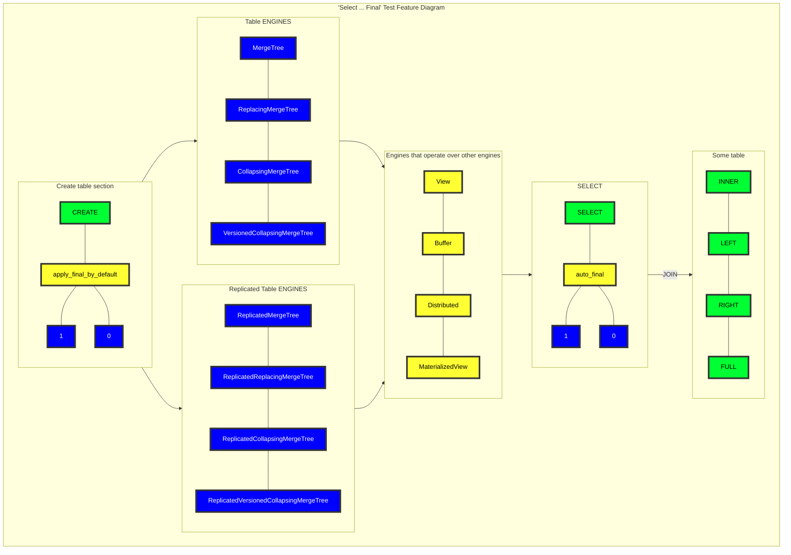

# SRS033 ClickHouse Automatic Final Modifier For Select Queries
# Software Requirements Specification

## Table of Contents

* 1 [Introduction](#introduction)
* 2 [Related Resources](#related-resources)
* 3 [Terminology](#terminology)
  * 3.1 [SRS](#srs)
  * 3.2 [Select Final](#select-final)
  * 3.3 [FinalModifier](#finalmodifier)
      * 3.3.0.1 [RQ.SRS-033.ClickHouse.SelectFinal.FinalModifier](#rqsrs-033clickhouseselectfinalfinalmodifier)
* 4 [Requirements](#requirements)
  * 4.1 [RQ.SRS-033.ClickHouse.SelectFinal](#rqsrs-033clickhouseselectfinal)
  * 4.2 [Config Setting](#config-setting)
    * 4.2.1 [RQ.SRS-033.ClickHouse.SelectFinal.ConfigSetting](#rqsrs-033clickhouseselectfinalconfigsetting)
    * 4.2.2 [RQ.SRS-033.ClickHouse.SelectFinal.SelectAutoFinalSetting](#rqsrs-033clickhouseselectfinalselectautofinalsetting)
  * 4.3 [Supported Table Engines](#supported-table-engines)
    * 4.3.1 [MergeTree](#mergetree)
      * 4.3.1.1 [RQ.SRS-033.ClickHouse.SelectFinal.SupportedTableEngines](#rqsrs-033clickhouseselectfinalsupportedtableengines)

## Introduction

This software requirements specification covers requirements related to [ClickHouse] support for automatically
adding [FINAL modifier] to all [SELECT] queries for a given table.

## Feature Diagram

Test feature diagram.



## Related Resources

**Pull Requests**

* https://github.com/ClickHouse/ClickHouse/pull/40945

## Terminology

### SRS

Software Requirements Specification

## Requirements

### RQ.SRS-033.ClickHouse.AutomaticFinalModifier
version: 1.0

[ClickHouse] SHALL support adding [FINAL modifier] clause to all [SELECT] queries
for all table engines that support it.

### Table Engine Setting

#### RQ.SRS-033.ClickHouse.AutomaticFinalModifier.TableEngineSetting
version: 1.0 priority: 1.0

[ClickHouse] SHALL support `apply_final_by_default` table config setting to enable automatic [FINAL modifier]
when the setting is set to `1`.

For example,

```sql
CREATE TABLE table (...)
Engine=ReplacingMergeTree
SETTTING apply_final_by_default=1
```

### Select Query Setting

#### RQ.SRS-033.ClickHouse.AutomaticFinalModifier.SelectQuerySetting
version: 1.0 priority: 1.0

[ClickHouse] SHALL support `auto_final` SELECT query setting to either enable or disable automatic [FINAL modifier].

For example,

```sql
SELECT * FROM table; -- actually does SELECT * FROM table FINAL if SETTTING apply_final_by_default=1
SELECT * FROM table SETTINGS auto_final=0; -- 1 by default, 0 - means ignore apply_final_by_default from merge tree.
```

### Supported Table Engines

#### MergeTree

##### RQ.SRS-033.ClickHouse.AutomaticFinalModifier.SupportedTableEngines
version: 1.0

[ClickHouse] SHALL support automatic [FINAL modifier] for the following [MergeTree] table engines variants:

* [MergeTree]
* [ReplacingMergeTree]
* [CollapsingMergeTree]
* [VersionedCollapsingMergeTree]


[SRS]: #srs
[SELECT]: https://clickhouse.com/docs/en/sql-reference/statements/select/
[MergeTree]: https://clickhouse.com/docs/en/engines/table-engines/mergetree-family/mergetree/
[ReplacingMergeTree]: https://clickhouse.com/docs/en/engines/table-engines/mergetree-family/replacingmergetree
[CollapsingMergeTree]: https://clickhouse.com/docs/en/engines/table-engines/mergetree-family/collapsingmergetree
[VersionedCollapsingMergeTree]: https://clickhouse.com/docs/en/engines/table-engines/mergetree-family/versionedcollapsingmergetree
[FINAL modifier]: https://clickhouse.com/docs/en/sql-reference/statements/select/from/#final-modifier
[ClickHouse]: https://clickhouse.com

