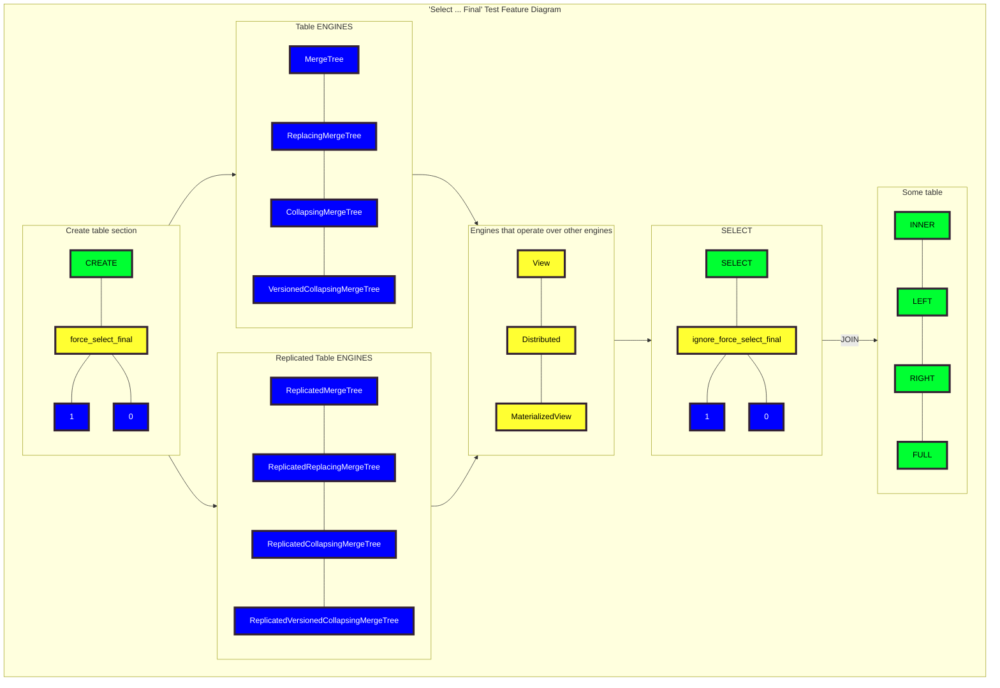

# SRS032 ClickHouse Automatic Final Modifier For Select Queries
# Software Requirements Specification

## Table of Contents

* 1 [Introduction](#introduction)
* 2 [Feature Diagram](#feature-diagram)
* 3 [Related Resources](#related-resources)
* 4 [Terminology](#terminology)
  * 4.1 [SRS](#srs)
* 5 [Requirements](#requirements)
  * 5.1 [RQ.SRS-032.ClickHouse.AutomaticFinalModifier](#rqsrs-032clickhouseautomaticfinalmodifier)
  * 5.2 [Table Engine Setting](#table-engine-setting)
    * 5.2.1 [Create Statement](#create-statement)
      * 5.2.1.1 [RQ.SRS-032.ClickHouse.AutomaticFinalModifier.TableEngineSetting.CreateStatement](#rqsrs-032clickhouseautomaticfinalmodifiertableenginesettingcreatestatement)
    * 5.2.2 [Not Supported Table Engines](#not-supported-table-engines)
      * 5.2.2.1 [RQ.SRS-032.ClickHouse.AutomaticFinalModifier.TableEngineSetting.IgnoreOnNotSupportedTableEngines](#rqsrs-032clickhouseautomaticfinalmodifiertableenginesettingignoreonnotsupportedtableengines)
  * 5.3 [Supported Table Engines](#supported-table-engines)
    * 5.3.1 [MergeTree](#mergetree)
      * 5.3.1.1 [RQ.SRS-032.ClickHouse.AutomaticFinalModifier.SupportedTableEngines.MergeTree](#rqsrs-032clickhouseautomaticfinalmodifiersupportedtableenginesmergetree)
    * 5.3.2 [ReplicatedMergeTree](#replicatedmergetree)
      * 5.3.2.1 [RQ.SRS-032.ClickHouse.AutomaticFinalModifier.SupportedTableEngines.ReplicatedMergeTree](#rqsrs-032clickhouseautomaticfinalmodifiersupportedtableenginesreplicatedmergetree)
    * 5.3.3 [EnginesOverOtherEngines](#enginesoverotherengines)
      * 5.3.3.1 [RQ.SRS-032.ClickHouse.AutomaticFinalModifier.SupportedTableEngines.EnginesOverOtherEngines](#rqsrs-032clickhouseautomaticfinalmodifiersupportedtableenginesenginesoverotherengines)
  * 5.4 [Select Queries](#select-queries)
    * 5.4.1 [RQ.SRS-032.ClickHouse.AutomaticFinalModifier.SelectQueries](#rqsrs-032clickhouseautomaticfinalmodifierselectqueries)
    * 5.4.2 [Select](#select)
      * 5.4.2.1 [RQ.SRS-032.ClickHouse.AutomaticFinalModifier.SelectQueries.Select](#rqsrs-032clickhouseautomaticfinalmodifierselectqueriesselect)
    * 5.4.3 [Distinct](#distinct)
      * 5.4.3.1 [RQ.SRS-032.ClickHouse.AutomaticFinalModifier.SelectQueries.Distinct](#rqsrs-032clickhouseautomaticfinalmodifierselectqueriesdistinct)
    * 5.4.4 [Prewhere](#prewhere)
      * 5.4.4.1 [RQ.SRS-032.ClickHouse.AutomaticFinalModifier.SelectQueries.Prewhere](#rqsrs-032clickhouseautomaticfinalmodifierselectqueriesprewhere)
    * 5.4.5 [Where](#where)
      * 5.4.5.1 [RQ.SRS-032.ClickHouse.AutomaticFinalModifier.SelectQueries.Where](#rqsrs-032clickhouseautomaticfinalmodifierselectquerieswhere)
    * 5.4.6 [Group By](#group-by)
      * 5.4.6.1 [RQ.SRS-032.ClickHouse.AutomaticFinalModifier.SelectQueries.GroupBy](#rqsrs-032clickhouseautomaticfinalmodifierselectqueriesgroupby)
    * 5.4.7 [Limit By](#limit-by)
      * 5.4.7.1 [RQ.SRS-032.ClickHouse.AutomaticFinalModifier.SelectQueries.LimitBy](#rqsrs-032clickhouseautomaticfinalmodifierselectquerieslimitby)
    * 5.4.8 [Limit](#limit)
      * 5.4.8.1 [RQ.SRS-032.ClickHouse.AutomaticFinalModifier.SelectQueries.Limit](#rqsrs-032clickhouseautomaticfinalmodifierselectquerieslimit)
    * 5.4.9 [Array Join](#array-join)
      * 5.4.9.1 [RQ.SRS-032.ClickHouse.AutomaticFinalModifier.SelectQueries.ArrayJoin](#rqsrs-032clickhouseautomaticfinalmodifierselectqueriesarrayjoin)
    * 5.4.10 [Subquery](#subquery)
      * 5.4.10.1 [RQ.SRS-032.ClickHouse.AutomaticFinalModifier.SelectQueries.Subquery](#rqsrs-032clickhouseautomaticfinalmodifierselectqueriessubquery)
        * 5.4.10.1.1 [RQ.SRS-032.ClickHouse.AutomaticFinalModifier.SelectQueries.Subquery.Nested](#rqsrs-032clickhouseautomaticfinalmodifierselectqueriessubquerynested)
        * 5.4.10.1.2 [RQ.SRS-032.ClickHouse.AutomaticFinalModifier.SelectQueries.Subquery.ExpressionInWhere](#rqsrs-032clickhouseautomaticfinalmodifierselectqueriessubqueryexpressioninwhere)
        * 5.4.10.1.3 [RQ.SRS-032.ClickHouse.AutomaticFinalModifier.SelectQueries.Subquery.ExpressionInPrewhere](#rqsrs-032clickhouseautomaticfinalmodifierselectqueriessubqueryexpressioninprewhere)
        * 5.4.10.1.4 [RQ.SRS-032.ClickHouse.AutomaticFinalModifier.SelectQueries.Subquery.ExpressionInArrayJoin](#rqsrs-032clickhouseautomaticfinalmodifierselectqueriessubqueryexpressioninarrayjoin)
        * 5.4.10.1.5 [RQ.SRS-032.ClickHouse.AutomaticFinalModifier.SelectQueries.Subquery.INPrewhere](#rqsrs-032clickhouseautomaticfinalmodifierselectqueriessubqueryinprewhere)
        * 5.4.10.1.6 [RQ.SRS-032.ClickHouse.AutomaticFinalModifier.SelectQueries.Subquery.INWhere](#rqsrs-032clickhouseautomaticfinalmodifierselectqueriessubqueryinwhere)
    * 5.4.11 [JOIN](#join)
      * 5.4.11.1 [RQ.SRS-032.ClickHouse.AutomaticFinalModifier.SelectQueries.Join](#rqsrs-032clickhouseautomaticfinalmodifierselectqueriesjoin)
      * 5.4.11.2 [RQ.SRS-032.ClickHouse.AutomaticFinalModifier.SelectQueries.Join.Select](#rqsrs-032clickhouseautomaticfinalmodifierselectqueriesjoinselect)
        * 5.4.11.2.1 [RQ.SRS-032.ClickHouse.AutomaticFinalModifier.SelectQueries.Join.Multiple](#rqsrs-032clickhouseautomaticfinalmodifierselectqueriesjoinmultiple)
        * 5.4.11.2.2 [RQ.SRS-032.ClickHouse.AutomaticFinalModifier.SelectQueries.Join.Nested](#rqsrs-032clickhouseautomaticfinalmodifierselectqueriesjoinnested)
    * 5.4.12 [UNION](#union)
      * 5.4.12.1 [RQ.SRS-032.ClickHouse.AutomaticFinalModifier.SelectQueries.Union](#rqsrs-032clickhouseautomaticfinalmodifierselectqueriesunion)
    * 5.4.13 [INTERSECT](#intersect)
      * 5.4.13.1 [RQ.SRS-032.ClickHouse.AutomaticFinalModifier.SelectQueries.Intersect](#rqsrs-032clickhouseautomaticfinalmodifierselectqueriesintersect)
    * 5.4.14 [EXCEPT](#except)
      * 5.4.14.1 [RQ.SRS-032.ClickHouse.AutomaticFinalModifier.SelectQueries.Except](#rqsrs-032clickhouseautomaticfinalmodifierselectqueriesexcept)
    * 5.4.15 [WITH ](#with-)
      * 5.4.15.1 [RQ.SRS-032.ClickHouse.AutomaticFinalModifier.SelectQueries.With](#rqsrs-032clickhouseautomaticfinalmodifierselectquerieswith)

## Introduction

This software requirements specification covers requirements related to [ClickHouse] support for automatically
adding [FINAL modifier] to all [SELECT] queries for a given table.

## Feature Diagram

Test feature diagram.



## Related Resources

**Pull Requests**

* https://github.com/ClickHouse/ClickHouse/pull/40945

## Terminology

### SRS

Software Requirements Specification

## Requirements

### RQ.SRS-032.ClickHouse.AutomaticFinalModifier
version: 1.0

[ClickHouse] SHALL support adding [FINAL modifier] clause automatically to all [SELECT] queries
for all table engines that support [FINAL modifier] and return the same result as if [FINAL modifier] clause
was specified in the [SELECT] query explicitly.

### Table Engine Setting

#### Create Statement

##### RQ.SRS-032.ClickHouse.AutomaticFinalModifier.TableEngineSetting.CreateStatement
version: 1.0 priority: 1.0

[ClickHouse] SHALL support `force_select_final` table engine setting to enable automatic [FINAL modifier]
on all [SELECT] queries when the setting is value is set to `1`.

For example,

```sql
CREATE TABLE table (...)
Engine=ReplacingMergeTree
SETTTING force_select_final=1
```

#### Not Supported Table Engines

##### RQ.SRS-032.ClickHouse.AutomaticFinalModifier.TableEngineSetting.IgnoreOnNotSupportedTableEngines
version: 1.0 priority: 1.0

[ClickHouse] SHALL silently ignore `force_select_final` table engine setting for any table
engine that doesn't support [FINAL modifier] clause.


### Supported Table Engines

#### MergeTree

##### RQ.SRS-032.ClickHouse.AutomaticFinalModifier.SupportedTableEngines.MergeTree
version: 1.0

[ClickHouse] SHALL support automatic [FINAL modifier] for the following [MergeTree] table engines variants:

* [ReplacingMergeTree]
* ReplacingMergeTree(version)
* [CollapsingMergeTree(sign)]
* AggregatingMergeTree
* SummingMergeTree
* [VersionedCollapsingMergeTree(sign,version)]


#### ReplicatedMergeTree

##### RQ.SRS-032.ClickHouse.AutomaticFinalModifier.SupportedTableEngines.ReplicatedMergeTree
version: 1.0

[ClickHouse] SHALL support automatic [FINAL modifier] for the following replicated 
[ReplicatedMergeTree](https://clickhouse.com/docs/en/engines/table-engines/mergetree-family/replication) 
table engines variants:

* ReplicatedReplacingMergeTree
* ReplicatedReplacingMergeTree(version)
* ReplicatedCollapsingMergeTree(sign)
* ReplicatedAggregatingMergeTree
* ReplicatedSummingMergeTree
* ReplicatedVersionedCollapsingMergeTree(sign,version)

#### EnginesOverOtherEngines

##### RQ.SRS-032.ClickHouse.AutomaticFinalModifier.SupportedTableEngines.EnginesOverOtherEngines
version: 1.0

[ClickHouse] SHALL support the following table engines over tables that have automatic [FINAL modifier] clause enabled:

* [View](https://clickhouse.com/docs/en/engines/table-engines/special/view)
* [Distributed](https://clickhouse.com/docs/en/engines/table-engines/special/distributed)
* [MaterializedView](https://clickhouse.com/docs/en/engines/table-engines/special/materializedview)


### Select Queries

#### RQ.SRS-032.ClickHouse.AutomaticFinalModifier.SelectQueries
version: 1.0

[ClickHouse] SHALL support automatic [FINAL modifier] for any type of [SELECT] queries.

```sql
[WITH expr_list|(subquery)]
SELECT [DISTINCT [ON (column1, column2, ...)]] expr_list
[FROM [db.]table | (subquery) | table_function] [FINAL]
[SAMPLE sample_coeff]
[ARRAY JOIN ...]
[GLOBAL] [ANY|ALL|ASOF] [INNER|LEFT|RIGHT|FULL|CROSS] [OUTER|SEMI|ANTI] JOIN (subquery)|table (ON <expr_list>)|(USING <column_list>)
[PREWHERE expr]
[WHERE expr]
[GROUP BY expr_list] [WITH ROLLUP|WITH CUBE] [WITH TOTALS]
[HAVING expr]
[ORDER BY expr_list] [WITH FILL] [FROM expr] [TO expr] [STEP expr] [INTERPOLATE [(expr_list)]]
[LIMIT [offset_value, ]n BY columns]
[LIMIT [n, ]m] [WITH TIES]
[SETTINGS ...]
[UNION  ...]
[INTO OUTFILE filename [COMPRESSION type [LEVEL level]] ]
[FORMAT format]
```

#### Select

##### RQ.SRS-032.ClickHouse.AutomaticFinalModifier.SelectQueries.Select
version: 1.0

[ClickHouse] SHALL support automatic [FINAL modifier] for [SELECT] queries with [SELECT] clause.


#### Distinct

##### RQ.SRS-032.ClickHouse.AutomaticFinalModifier.SelectQueries.Distinct
version: 1.0

[ClickHouse] SHALL support automatic [FINAL modifier] for [SELECT] queries with [DISTINCT] clause.

#### Prewhere

##### RQ.SRS-032.ClickHouse.AutomaticFinalModifier.SelectQueries.Prewhere
version: 1.0

[ClickHouse] SHALL support automatic [FINAL modifier] for [SELECT] queries with [PREWHERE] clause.

#### Where

##### RQ.SRS-032.ClickHouse.AutomaticFinalModifier.SelectQueries.Where
version: 1.0

[ClickHouse] SHALL support automatic [FINAL modifier] for [SELECT] queries with [WHERE] clause.

#### Group By

##### RQ.SRS-032.ClickHouse.AutomaticFinalModifier.SelectQueries.GroupBy
version: 1.0

[ClickHouse] SHALL support automatic [FINAL modifier] for [SELECT] queries with [GROUP BY] clause.

#### Limit By

##### RQ.SRS-032.ClickHouse.AutomaticFinalModifier.SelectQueries.LimitBy
version: 1.0

[ClickHouse] SHALL support automatic [FINAL modifier] for [SELECT] queries with [LIMIT BY] clause.

#### Limit

##### RQ.SRS-032.ClickHouse.AutomaticFinalModifier.SelectQueries.Limit
version: 1.0

[ClickHouse] SHALL support automatic [FINAL modifier] for [SELECT] queries with [LIMIT] clause.

#### Array Join

##### RQ.SRS-032.ClickHouse.AutomaticFinalModifier.SelectQueries.ArrayJoin
version: 1.0

[ClickHouse] SHALL support automatic [FINAL modifier] for [SELECT] queries with [ARRAY JOIN] clause.

#### Subquery

##### RQ.SRS-032.ClickHouse.AutomaticFinalModifier.SelectQueries.Subquery
version: 1.0

[ClickHouse] SHALL support applying [FINAL modifier] in any subquery that reads from a table that
has automatic [FINAL modifier] enabled.

###### RQ.SRS-032.ClickHouse.AutomaticFinalModifier.SelectQueries.Subquery.Nested
version: 1.0

[ClickHouse] SHALL support applying [FINAL modifier] in any nested subquery that reads from a table that
has automatic [FINAL modifier] enabled.

###### RQ.SRS-032.ClickHouse.AutomaticFinalModifier.SelectQueries.Subquery.ExpressionInWhere
version: 1.0

[ClickHouse] SHALL support applying [FINAL modifier] in any subquery as expression in `WHERE` clause that reads from a table that
has automatic [FINAL modifier] enabled.

###### RQ.SRS-032.ClickHouse.AutomaticFinalModifier.SelectQueries.Subquery.ExpressionInPrewhere
version: 1.0

[ClickHouse] SHALL support applying [FINAL modifier] in any subquery as expression in `PREWHERE` clause that reads from a table that
has automatic [FINAL modifier] enabled.

###### RQ.SRS-032.ClickHouse.AutomaticFinalModifier.SelectQueries.Subquery.ExpressionInArrayJoin
version: 1.0

[ClickHouse] SHALL support applying [FINAL modifier] in any subquery as expression in `ARRAY JOIN` clause that reads from a table that
has automatic [FINAL modifier] enabled.

###### RQ.SRS-032.ClickHouse.AutomaticFinalModifier.SelectQueries.Subquery.INPrewhere
version: 1.0

[ClickHouse] SHALL support applying [FINAL modifier] in any subquery with `IN` clause in `PREWHERE` that reads from a table that
has automatic [FINAL modifier] enabled.

###### RQ.SRS-032.ClickHouse.AutomaticFinalModifier.SelectQueries.Subquery.INWhere
version: 1.0

[ClickHouse] SHALL support applying [FINAL modifier] in any subquery with `IN` clause in `WHERE` that reads from a table that
has automatic [FINAL modifier] enabled.

#### JOIN

##### RQ.SRS-032.ClickHouse.AutomaticFinalModifier.SelectQueries.Join
version: 1.0

[ClickHouse] SHALL support applying [FINAL modifier] for any table in [JOIN] clause for which
the automatic [FINAL modifier] is enabled.

* INNER JOIN
* LEFT OUTER JOIN
* RIGHT OUTER JOIN
* FULL OUTER JOIN
* CROSS JOIN
* LEFT SEMI JOIN and RIGHT SEMI JOIN
* LEFT ANTI JOIN and RIGHT ANTI JOIN
* LEFT ANY JOIN, RIGHT ANY JOIN and INNER ANY JOIN
* ASOF JOIN and LEFT ASOF JOIN

For example,
```sql
select count() from lhs inner join rhs on lhs.x = rhs.x;
```

##### RQ.SRS-032.ClickHouse.AutomaticFinalModifier.SelectQueries.Join.Select
version: 1.0

[ClickHouse] SHALL support applying [FINAL modifier] for any table in [JOIN] clause with [SELECT] subquery for which
the automatic [FINAL modifier] is enabled.

###### RQ.SRS-032.ClickHouse.AutomaticFinalModifier.SelectQueries.Join.Multiple
version: 1.0

[ClickHouse] SHALL support applying [FINAL modifier] for any table in multiple [JOIN] clause for which
the automatic [FINAL modifier] is enabled.

###### RQ.SRS-032.ClickHouse.AutomaticFinalModifier.SelectQueries.Join.Nested
version: 1.0

[ClickHouse] SHALL support applying [FINAL modifier] for any table in nested [JOIN] clause for which
the automatic [FINAL modifier] is enabled.

#### UNION

##### RQ.SRS-032.ClickHouse.AutomaticFinalModifier.SelectQueries.Union
version: 1.0

[ClickHouse] SHALL support applying [FINAL modifier] for any table in [UNION] clause for which
the automatic [FINAL modifier] is enabled.

For example,
```sql
SELECT id, count(*)
    FROM test1 FINAL
    GROUP BY id

UNION ALL

SELECT id, count(*)
    FROM test2 FINAL
    GROUP BY id

```

#### INTERSECT

##### RQ.SRS-032.ClickHouse.AutomaticFinalModifier.SelectQueries.Intersect
version: 1.0

[ClickHouse] SHALL support applying [FINAL modifier] for any table in [INTERSECT] clause for which
the automatic [FINAL modifier] is enabled.

For example,
```sql
SELECT id, count(*)
    FROM test1 FINAL
    GROUP BY id

INTERSECT

SELECT id, count(*)
    FROM test2 FINAL
    GROUP BY id

```

#### EXCEPT

##### RQ.SRS-032.ClickHouse.AutomaticFinalModifier.SelectQueries.Except
version: 1.0

[ClickHouse] SHALL support applying [FINAL modifier] for any table in [EXCEPT] clause for which
the automatic [FINAL modifier] is enabled.

For example,
```sql
SELECT id, count(*)
    FROM test1 FINAL
    GROUP BY id

EXCEPT

SELECT id, count(*)
    FROM test2 FINAL
    GROUP BY id

```

#### WITH 

##### RQ.SRS-032.ClickHouse.AutomaticFinalModifier.SelectQueries.With
version: 1.0

[ClickHouse] SHALL support applying [FINAL modifier] for any table in subquery inside the [WITH] clause for which
the automatic [FINAL modifier] is enabled.


[SRS]: #srs
[SELECT]: https://clickhouse.com/docs/en/sql-reference/statements/select/
[DISTINCT]: https://clickhouse.com/docs/en/sql-reference/statements/select/distinct
[GROUP BY]: https://clickhouse.com/docs/en/sql-reference/statements/select/group-by
[LIMIT BY]: https://clickhouse.com/docs/en/sql-reference/statements/select/limit-by
[LIMIT]: https://clickhouse.com/docs/en/sql-reference/statements/select/limit
[WHERE]: https://clickhouse.com/docs/en/sql-reference/statements/select/where
[PREWHERE]: https://clickhouse.com/docs/en/sql-reference/statements/select/prewhere
[JOIN]: https://clickhouse.com/docs/en/sql-reference/statements/select/join
[UNION]: https://clickhouse.com/docs/en/sql-reference/statements/select/union
[INTERSECT]: https://clickhouse.com/docs/en/sql-reference/statements/select/intersect
[EXCEPT]: https://clickhouse.com/docs/en/sql-reference/statements/select/except
[ARRAY JOIN]: https://clickhouse.com/docs/en/sql-reference/statements/select/array-join
[WITH]: https://clickhouse.com/docs/en/sql-reference/statements/select/with
[MergeTree]: https://clickhouse.com/docs/en/engines/table-engines/mergetree-family/mergetree/
[ReplacingMergeTree]: https://clickhouse.com/docs/en/engines/table-engines/mergetree-family/replacingmergetree
[CollapsingMergeTree(sign)]: https://clickhouse.com/docs/en/engines/table-engines/mergetree-family/collapsingmergetree
[VersionedCollapsingMergeTree(sign,version)]: https://clickhouse.com/docs/en/engines/table-engines/mergetree-family/versionedcollapsingmergetree
[FINAL modifier]: https://clickhouse.com/docs/en/sql-reference/statements/select/from/#final-modifier
[ClickHouse]: https://clickhouse.com

