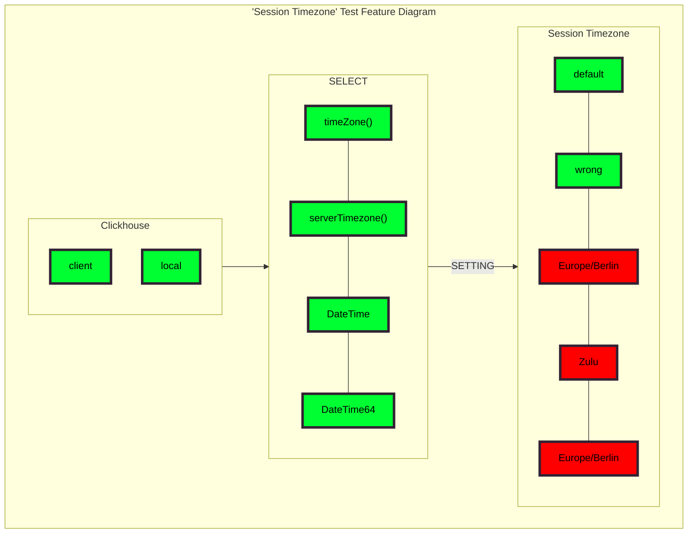

# SRS037 ClickHouse Session Timezone

# Software Requirements Specification

## Table of Contents

* 1 [Introduction](#introduction)
* 2 [Feature Diagram](#feature-diagram)
* 3 [Related Resources](#related-resources)
* 4 [Terminology](#terminology)
  * 4.1 [SRS](#srs)
* 5 [Requirements](#requirements)
  * 5.1 [RQ.SRS-037.ClickHouse.SessionTimezone](#rqsrs-037clickhousesessiontimezone)
  * 5.2 [RQ.SRS-037.ClickHouse.SessionTimezone.ServerDefault](#rqsrs-037clickhousesessiontimezoneserverdefault)
  * 5.3 [RQ.SRS-037.ClickHouse.SessionTimezone.ServerSession](#rqsrs-037clickhousesessiontimezoneserversession)
  * 5.4 [RQ.SRS-037.ClickHouse.SessionTimezone.SettingsPriority](#rqsrs-037clickhousesessiontimezonesettingspriority)
  * 5.5 [RQ.SRS-037.ClickHouse.SessionTimezone.DateTime](#rqsrs-037clickhousesessiontimezonedatetime)
  * 5.6 [RQ.SRS-037.ClickHouse.SessionTimezone.ParsingOfDateOrDateTimeTypes](#rqsrs-037clickhousesessiontimezoneparsingofdateordatetimetypes)
  * 5.7 [RQ.SRS-037.ClickHouse.SessionTimezone.PossibleValues](#rqsrs-037clickhousesessiontimezonepossiblevalues)
  * 5.8 [RQ.SRS-037.ClickHouse.SessionTimezone.DefaultValue](#rqsrs-037clickhousesessiontimezonedefaultvalue)
  * 5.9 [RQ.SRS-037.ClickHouse.SessionTimezone.WrongSettingValue](#rqsrs-037clickhousesessiontimezonewrongsettingvalue)
  * 5.10 [RQ.SRS-037.ClickHouse.SessionTimezone.ClickhouseLocal](#rqsrs-037clickhousesessiontimezoneclickhouselocal)
  * 5.11 [Non-Functional Requirements](#non-functional-requirements)
    * 5.11.1 [Performance](#performance)
    * 5.11.2 [RQ.SRS-037.ClickHouse.SessionTimezone.Performance](#rqsrs-037clickhousesessiontimezoneperformance)
    * 5.11.3 [Reliability](#reliability)
    * 5.11.4 [RQ.SRS-037.ClickHouse.SessionTimezone.Reliability](#rqsrs-037clickhousesessiontimezonereliability)

## Introduction

This software requirements specification covers requirements related to [ClickHouse] support of changing
default timezone with [session_timezone] setting.

## Feature Diagram

Test feature diagram.


## Related Resources

**Pull Requests**

* https://github.com/ClickHouse/ClickHouse/pull/44149

## Terminology

### SRS

Software Requirements Specification

## Requirements

### RQ.SRS-037.ClickHouse.SessionTimezone
version: 1.0

[ClickHouse] SHALL support the `session_timezone` setting in ClickHouse. The `session_timezone` setting allows the 
specification of an implicit timezone, which overrides the default timezone for all DateTime/DateTime64 values and 
function results that do not have an explicit timezone specified. An empty string ('') as the value configures the 
session timezone to the server's default timezone.

### RQ.SRS-037.ClickHouse.SessionTimezone.ServerDefault
version: 1.0

[ClickHouse] SHALL support  the `session_timezone` setting is not specified, and the default timezones are used for the 
session and server.

Example:
```sql
> SELECT timeZone(), serverTimezone() FORMAT TSV

> Europe/Berlin	Europe/Berlin
```

### RQ.SRS-037.ClickHouse.SessionTimezone.ServerSession
version: 1.0

[ClickHouse] SHALL support the `session_timezone` setting overriding the default session timezone while keeping the server
timezone unchanged.

Example:

```sql
> SELECT timeZone(), serverTimezone() SETTINGS session_timezone = 'Asia/Novosibirsk' FORMAT TSV

> Asia/Novosibirsk	Europe/Berlin
```

### RQ.SRS-037.ClickHouse.SessionTimezone.SettingsPriority
version: 1.0

[ClickHouse] SHALL support prioritizing queries with the `SETTINGS session_timezone` clause 
over `SET session_timezone` queries.

### RQ.SRS-037.ClickHouse.SessionTimezone.DateTime
version: 1.0

[ClickHouse] SHALL support the `session_timezone` setting affects the conversion of DateTime values.
A result being adjusted according to the specified session timezone.

```sql
> SELECT toDateTime64(toDateTime64('1999-12-12 23:23:23.123', 3), 3, 'Europe/Zurich') SETTINGS 
session_timezone = 'America/Denver' FORMAT TSV

> 1999-12-13 07:23:23.123
```

### RQ.SRS-037.ClickHouse.SessionTimezone.ParsingOfDateOrDateTimeTypes
version: 1.0

[ClickHouse] SHALL support the `session_timezone` setting on the parsing of Date or DateTime types, 
as illustrated in the following example:

```sql
CREATE TABLE test_tz (`d` DateTime('UTC')) ENGINE = Memory AS SELECT toDateTime('2000-01-01 00:00:00', 'UTC');
SELECT *, timezone() FROM test_tz WHERE d = toDateTime('2000-01-01 00:00:00') SETTINGS session_timezone = 'Asia/Novosibirsk'
0 rows in set.
SELECT *, timezone() FROM test_tz WHERE d = '2000-01-01 00:00:00' SETTINGS session_timezone = 'Asia/Novosibirsk'
┌───────────────────d─┬─timezone()───────┐
│ 2000-01-01 00:00:00 │ Asia/Novosibirsk │
└─────────────────────┴──────────────────┘
```

The parsing behavior differs based on the approach used:
  * toDateTime('2000-01-01 00:00:00') creates a new DateTime with the specified `session_timezone`.
  * '2000-01-01 00:00:00' is parsed based on the DateTime column's inherited type, including its timezone.
  The `session_timezone` setting does not affect this value.

### RQ.SRS-037.ClickHouse.SessionTimezone.PossibleValues
version: 1.0

[ClickHouse] SHALL support any value from `system.time_zones`.

### RQ.SRS-037.ClickHouse.SessionTimezone.DefaultValue
version: 1.0

[ClickHouse] SHALL support an empty string ('') as the `session_timezone` setting default value.

### RQ.SRS-037.ClickHouse.SessionTimezone.WrongSettingValue
version: 1.0

Exception is thrown when attempting to apply invalid setting:

```CMD
Code: 36. DB::Exception: Received from localhost:9000. DB::Exception: Exception: Invalid time zone...
```

### RQ.SRS-037.ClickHouse.SessionTimezone.ClickhouseLocal
version: 1.0

[ClickHouse] SHALL support the `session_timezone` setting for [clickhouse local] in the same way as 
for `clickhouse client`.

### Non-Functional Requirements

#### Performance

#### RQ.SRS-037.ClickHouse.SessionTimezone.Performance
version: 1.0

[ClickHouse] SHALL allow handle large volumes of data efficiently with the `session_timezone` setting.

#### Reliability

#### RQ.SRS-037.ClickHouse.SessionTimezone.Reliability
version: 1.0

[ClickHouse] SHALL be reliable and not lose any data with the `session_timezone` setting.


[SRS]: #srs
[session_timezone]: https://github.com/ClickHouse/ClickHouse/pull/44149
[ClickHouse]: https://clickhouse.com
[timezone]:https://clickhouse.com/docs/en/operations/server-configuration-parameters/settings#server_configuration_parameters-timezone
[clickhouse local]:https://clickhouse.com/docs/en/operations/utilities/clickhouse-local
