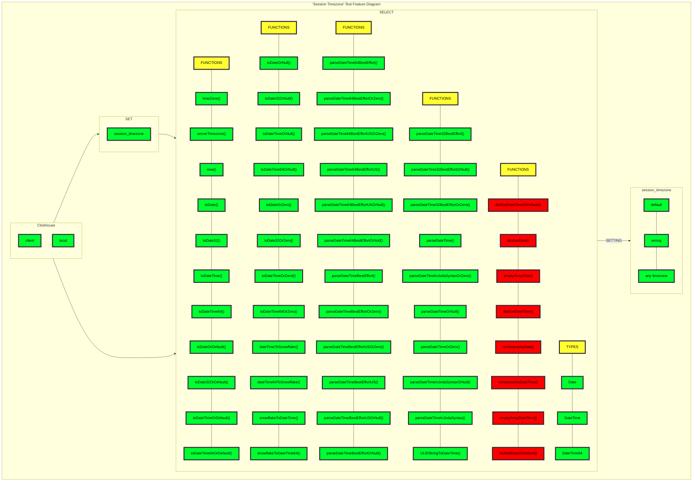

# SRS037 ClickHouse Session Timezone

# Software Requirements Specification

## Table of Contents

* 1 [Introduction](#introduction)
* 2 [Feature Diagram](#feature-diagram)
* 3 [Related Resources](#related-resources)
* 4 [Terminology](#terminology)
  * 4.1 [SRS](#srs)
* 5 [Requirements](#requirements)
  * 5.1 [RQ.SRS-037.ClickHouse.SessionTimezone](#rqsrs-037clickhousesessiontimezone)
  * 5.2 [RQ.SRS-037.ClickHouse.SessionTimezone.ClickhouseClient](#rqsrs-037clickhousesessiontimezoneclickhouseclient)
  * 5.3 [RQ.SRS-037.ClickHouse.SessionTimezone.ClickhouseLocal](#rqsrs-037clickhousesessiontimezoneclickhouselocal)
  * 5.4 [RQ.SRS-037.ClickHouse.SessionTimezone.ServerDefault](#rqsrs-037clickhousesessiontimezoneserverdefault)
  * 5.5 [RQ.SRS-037.ClickHouse.SessionTimezone.ServerSession](#rqsrs-037clickhousesessiontimezoneserversession)
  * 5.6 [RQ.SRS-037.ClickHouse.SessionTimezone.SettingsPriority](#rqsrs-037clickhousesessiontimezonesettingspriority)
  * 5.7 [RQ.SRS-037.ClickHouse.SessionTimezone.DateTime](#rqsrs-037clickhousesessiontimezonedatetime)
  * 5.8 [RQ.SRS-037.ClickHouse.SessionTimezone.ParsingOfDateTimeTypes](#rqsrs-037clickhousesessiontimezoneparsingofdatetimetypes)
    * 5.8.1 [RQ.SRS-037.ClickHouse.SessionTimezone.ParsingOfDateTimeTypes.Insert](#rqsrs-037clickhousesessiontimezoneparsingofdatetimetypesinsert)
  * 5.9 [Date Types](#date-types)
  * 5.10 [RQ.SRS-037.ClickHouse.SessionTimezone.DateTypes](#rqsrs-037clickhousesessiontimezonedatetypes)
  * 5.11 [Date Functions](#date-functions)
    * 5.11.1 [RQ.SRS-037.ClickHouse.SessionTimezone.DateFunctions](#rqsrs-037clickhousesessiontimezonedatefunctions)
      * 5.11.1.1 [RQ.SRS-037.ClickHouse.SessionTimezone.DateFunctions.ToDate](#rqsrs-037clickhousesessiontimezonedatefunctionstodate)
      * 5.11.1.2 [RQ.SRS-037.ClickHouse.SessionTimezone.DateFunctions.MakeDate](#rqsrs-037clickhousesessiontimezonedatefunctionsmakedate)
      * 5.11.1.3 [RQ.SRS-037.ClickHouse.SessionTimezone.DateFunctions.ToDateOrDefault](#rqsrs-037clickhousesessiontimezonedatefunctionstodateordefault)
      * 5.11.1.4 [RQ.SRS-037.ClickHouse.SessionTimezone.DateFunctions.ToDateOrNull](#rqsrs-037clickhousesessiontimezonedatefunctionstodateornull)
      * 5.11.1.5 [RQ.SRS-037.ClickHouse.SessionTimezone.DateFunctions.ToDateOrZero](#rqsrs-037clickhousesessiontimezonedatefunctionstodateorzero)
      * 5.11.1.6 [RQ.SRS-037.ClickHouse.SessionTimezone.DateFunctions.SnowflakeToDateTime](#rqsrs-037clickhousesessiontimezonedatefunctionssnowflaketodatetime)
      * 5.11.1.7 [RQ.SRS-037.ClickHouse.SessionTimezone.DateFunctions.DateTimeToSnowflake](#rqsrs-037clickhousesessiontimezonedatefunctionsdatetimetosnowflake)
      * 5.11.1.8 [RQ.SRS-037.ClickHouse.SessionTimezone.DateFunctions.ParseDateTime64BestEffort](#rqsrs-037clickhousesessiontimezonedatefunctionsparsedatetime64besteffort)
      * 5.11.1.9 [RQ.SRS-037.ClickHouse.SessionTimezone.DateFunctions.ParseDateTimeBestEffort](#rqsrs-037clickhousesessiontimezonedatefunctionsparsedatetimebesteffort)
      * 5.11.1.10 [RQ.SRS-037.ClickHouse.SessionTimezone.DateFunctions.ParseDateTime32BestEffort](#rqsrs-037clickhousesessiontimezonedatefunctionsparsedatetime32besteffort)
      * 5.11.1.11 [RQ.SRS-037.ClickHouse.SessionTimezone.DateFunctions.ParseDateTime](#rqsrs-037clickhousesessiontimezonedatefunctionsparsedatetime)
      * 5.11.1.12 [RQ.SRS-037.ClickHouse.SessionTimezone.DateFunctions.FormatDateTime](#rqsrs-037clickhousesessiontimezonedatefunctionsformatdatetime)
      * 5.11.1.13 [RQ.SRS-037.ClickHouse.SessionTimezone.DateFunctions.FormatDateTimeInJodaSyntax](#rqsrs-037clickhousesessiontimezonedatefunctionsformatdatetimeinjodasyntax)
      * 5.11.1.14 [RQ.SRS-037.ClickHouse.SessionTimezone.DateFunctions.ULIDStringToDateTime](#rqsrs-037clickhousesessiontimezonedatefunctionsulidstringtodatetime)
      * 5.11.1.15 [RQ.SRS-037.ClickHouse.SessionTimezone.DateFunctions.DictGetDate](#rqsrs-037clickhousesessiontimezonedatefunctionsdictgetdate)
      * 5.11.1.16 [RQ.SRS-037.ClickHouse.SessionTimezone.DateFunctions.ReinterpretAsDate](#rqsrs-037clickhousesessiontimezonedatefunctionsreinterpretasdate)
      * 5.11.1.17 [RQ.SRS-037.ClickHouse.SessionTimezone.DateFunctions.EmptyArrayDate](#rqsrs-037clickhousesessiontimezonedatefunctionsemptyarraydate)
  * 5.12 [RQ.SRS-037.ClickHouse.SessionTimezone.AggregateMergeTree](#rqsrs-037clickhousesessiontimezoneaggregatemergetree)
  * 5.13 [RQ.SRS-037.ClickHouse.SessionTimezone.MaterializedView](#rqsrs-037clickhousesessiontimezonematerializedview)
  * 5.14 [RQ.SRS-037.ClickHouse.SessionTimezone.PossibleValues](#rqsrs-037clickhousesessiontimezonepossiblevalues)
  * 5.15 [RQ.SRS-037.ClickHouse.SessionTimezone.DefaultValue](#rqsrs-037clickhousesessiontimezonedefaultvalue)
  * 5.16 [RQ.SRS-037.ClickHouse.SessionTimezone.WrongSettingValue](#rqsrs-037clickhousesessiontimezonewrongsettingvalue)
  * 5.17 [Non-Functional Requirements](#non-functional-requirements)
    * 5.17.1 [Performance](#performance)
    * 5.17.2 [RQ.SRS-037.ClickHouse.SessionTimezone.Performance](#rqsrs-037clickhousesessiontimezoneperformance)
    * 5.17.3 [Reliability](#reliability)
    * 5.17.4 [RQ.SRS-037.ClickHouse.SessionTimezone.Reliability](#rqsrs-037clickhousesessiontimezonereliability)

## Introduction

This software requirements specification covers requirements related to [ClickHouse] support of changing
default timezone with [session_timezone] setting.

## Feature Diagram

Test feature diagram.


## Related Resources

**Pull Requests**

* https://github.com/ClickHouse/ClickHouse/pull/44149

## Terminology

### SRS

Software Requirements Specification

## Requirements

### RQ.SRS-037.ClickHouse.SessionTimezone
version: 1.0

[ClickHouse] SHALL support the `session_timezone` setting in ClickHouse. The `session_timezone` setting SHALL allow the 
specification of an implicit timezone, which overrides the default timezone for all DateTime/DateTime64 values and 
function results that do not have an explicit timezone specified. An empty string as the value SHALL configure the 
session timezone to be set to the server's default timezone.

### RQ.SRS-037.ClickHouse.SessionTimezone.ClickhouseClient
version: 1.0

[ClickHouse] SHALL support the `session_timezone` setting for `clickhouse client`.

### RQ.SRS-037.ClickHouse.SessionTimezone.ClickhouseLocal
version: 1.0

[ClickHouse] SHALL support the `session_timezone` setting for [clickhouse local] in the same way as 
for `clickhouse client`.


### RQ.SRS-037.ClickHouse.SessionTimezone.ServerDefault
version: 1.0

[ClickHouse] SHALL use the default server timezone when `session_timezone` setting is not specified. 

Example:
```sql
> SELECT timeZone(), serverTimezone() FORMAT TSV

> Europe/Berlin	Europe/Berlin
```

### RQ.SRS-037.ClickHouse.SessionTimezone.ServerSession
version: 1.0

[ClickHouse] SHALL override the default session timezone when `session_timezone` setting is specified while
keeping the server timezone unchanged.

Example:

```sql
> SELECT timeZone(), serverTimezone() SETTINGS session_timezone = 'Asia/Novosibirsk' FORMAT TSV

> Asia/Novosibirsk	Europe/Berlin
```

### RQ.SRS-037.ClickHouse.SessionTimezone.SettingsPriority
version: 1.0

[ClickHouse] SHALL override session's `session_timezone` setting value when `SETTINGS session_timezone` inline clause is specified for a given query.

### RQ.SRS-037.ClickHouse.SessionTimezone.DateTime
version: 1.0

[ClickHouse] SHALL use the timezone specified by the `session_timezone` setting for all `DateTime` or `DateTime64` value conversions.

```sql
> SELECT toDateTime64(toDateTime64('1999-12-12 23:23:23.123', 3), 3, 'Europe/Zurich') SETTINGS 
session_timezone = 'America/Denver' FORMAT TSV

> 1999-12-13 07:23:23.123
```

### RQ.SRS-037.ClickHouse.SessionTimezone.ParsingOfDateTimeTypes
version: 1.0

[ClickHouse] SHALL use timezone specified by the `session_timezone` setting when parsing of DateTime or DateTime64 types, 
as illustrated in the following example:

```sql
CREATE TABLE test_tz (`d` DateTime('UTC')) ENGINE = Memory AS SELECT toDateTime('2000-01-01 00:00:00', 'UTC');
SELECT *, timezone() FROM test_tz WHERE d = toDateTime('2000-01-01 00:00:00') SETTINGS session_timezone = 'Asia/Novosibirsk'
0 rows in set.
SELECT *, timezone() FROM test_tz WHERE d = '2000-01-01 00:00:00' SETTINGS session_timezone = 'Asia/Novosibirsk'
┌───────────────────d─┬─timezone()───────┐
│ 2000-01-01 00:00:00 │ Asia/Novosibirsk │
└─────────────────────┴──────────────────┘
```

The parsing behavior differs based on the approach used:
  * toDateTime('2000-01-01 00:00:00') creates a new DateTime with the specified `session_timezone`.
  * '2000-01-01 00:00:00' is parsed based on the DateTime column's inherited type, including its timezone.
  The `session_timezone` setting does not affect this value.

#### RQ.SRS-037.ClickHouse.SessionTimezone.ParsingOfDateTimeTypes.Insert
version: 1.0

[ClickHouse] SHALL insert data with timezone specified by the `session_timezone` setting into DateTime type column.

* Date
* DateTime
* DateTime64

### Date Types

### RQ.SRS-037.ClickHouse.SessionTimezone.DateTypes
version: 1.0

[ClickHouse] SHALL support all Date types with `session_timezone` setting.

* Date
* DateTime
* DateTime64

### Date Functions

#### RQ.SRS-037.ClickHouse.SessionTimezone.DateFunctions
version: 1.0

[ClickHouse] SHALL support all Date functions with `session_timezone` setting.

##### RQ.SRS-037.ClickHouse.SessionTimezone.DateFunctions.ToDate
version: 1.0

[ClickHouse] SHALL support all `toDate` functions with `session_timezone` setting and return correct value and data
type.

* toDate
* toDate32
* toDateTime
* toDateTime64

##### RQ.SRS-037.ClickHouse.SessionTimezone.DateFunctions.MakeDate
version: 1.0

[ClickHouse] SHALL support all `makeDate` functions with `session_timezone` setting and return correct value and data
type.

* makeDate
* makeDate32
* makeDateTime
* makeDateTime64

##### RQ.SRS-037.ClickHouse.SessionTimezone.DateFunctions.ToDateOrDefault
version: 1.0

[ClickHouse] SHALL support all `toDateOrDefault` functions with `session_timezone` setting and return correct default
values.

* toDateOrDefault
* toDate32OrDefault
* toDateTimeOrDefault
* toDateTime64OrDefault

##### RQ.SRS-037.ClickHouse.SessionTimezone.DateFunctions.ToDateOrNull
version: 1.0

[ClickHouse] SHALL support all `toDateOrNull` functions with `session_timezone` setting and return null value.

* toDateOrNull
* toDate32OrNull
* toDateTimeOrNull
* toDateTime64OrNull

##### RQ.SRS-037.ClickHouse.SessionTimezone.DateFunctions.ToDateOrZero
version: 1.0

[ClickHouse] SHALL support all `toDateOrZero` functions with `session_timezone` setting and return minimum possible
value.

* toDateOrZero
* toDate32OrZero
* toDateTimeOrZero
* toDateTime64OrZero

##### RQ.SRS-037.ClickHouse.SessionTimezone.DateFunctions.SnowflakeToDateTime
version: 1.0

[ClickHouse] SHALL extract time from Snowflake ID as DateTime and Datetime64 by using `snowflakeToDateTime` and
`snowflakeToDateTime64` format with `session_timezone` setting.

##### RQ.SRS-037.ClickHouse.SessionTimezone.DateFunctions.DateTimeToSnowflake
version: 1.0

[ClickHouse] SHALL convert DateTime, DateTime64 value to the Snowflake ID at the giving time by using
`dateTimeToSnowflake` and `dateTime64ToSnowflake` format with `session_timezone` setting.

##### RQ.SRS-037.ClickHouse.SessionTimezone.DateFunctions.ParseDateTime64BestEffort
version: 1.0

[ClickHouse] SHALL support all `parseDateTime64BestEffort` functions with `session_timezone` setting.

* parseDateTime64BestEffort
* parseDateTime64BestEffortOrZero
* parseDateTime64BestEffortUSOrZero
* parseDateTime64BestEffortUS
* parseDateTime64BestEffortUSOrNull
* parseDateTime64BestEffortOrNull

##### RQ.SRS-037.ClickHouse.SessionTimezone.DateFunctions.ParseDateTimeBestEffort
version: 1.0

[ClickHouse] SHALL support all `parseDateTimeBestEffort` functions with `session_timezone` setting and return correct
value and data type.

* parseDateTimeBestEffort
* parseDateTimeBestEffortOrZero
* parseDateTimeBestEffortUSOrZero
* parseDateTimeBestEffortUS
* parseDateTimeBestEffortUSOrNull
* parseDateTimeBestEffortOrNull

##### RQ.SRS-037.ClickHouse.SessionTimezone.DateFunctions.ParseDateTime32BestEffort
version: 1.0

[ClickHouse] SHALL support all `parseDateTime32BestEffort` functions with `session_timezone` setting and return correct
value and data type.

* parseDateTime32BestEffort
* parseDateTime32BestEffortOrNull
* parseDateTime32BestEffortOrZero

##### RQ.SRS-037.ClickHouse.SessionTimezone.DateFunctions.ParseDateTime
version: 1.0

[ClickHouse] SHALL support all `parseDateTime` functions with `session_timezone`  setting and return correct value and 
data type.

* parseDateTime
* parseDateTimeInJodaSyntaxOrZero
* parseDateTimeOrNull
* parseDateTimeOrZero
* parseDateTimeInJodaSyntaxOrNull
* parseDateTimeInJodaSyntax


##### RQ.SRS-037.ClickHouse.SessionTimezone.DateFunctions.FormatDateTime
version: 1.0

[ClickHouse] SHALL format a Time according to the given Format string by using `formatDateTime`
with enabled `session_timezone` setting.

##### RQ.SRS-037.ClickHouse.SessionTimezone.DateFunctions.FormatDateTimeInJodaSyntax
version: 1.0

[ClickHouse] SHALL format a Time in Joda style according to the given Format string by using `formatDateTimeInJodaSyntax`
with enabled `session_timezone` setting.


##### RQ.SRS-037.ClickHouse.SessionTimezone.DateFunctions.ULIDStringToDateTime
version: 1.0

[ClickHouse] SHALL extract the timestamp from a ULID by using `ULIDStringToDateTime` with enabled `session_timezone`
setting.

##### RQ.SRS-037.ClickHouse.SessionTimezone.DateFunctions.DictGetDate
version: 1.0

[ClickHouse] SHALL support all `dictGetDateT` functions with `session_timezone`  setting and return correct value and 
data type.

* dictGetDateTimeOrDefault
* dictGetDate
* dictGetDateTime
* dictGetDateOrDefault

##### RQ.SRS-037.ClickHouse.SessionTimezone.DateFunctions.ReinterpretAsDate
version: 1.0

[ClickHouse] SHALL support all `reinterpretAsDate` and `reinterpretAsDateTime` functions with `session_timezone`  
setting and return correct value and data type.

##### RQ.SRS-037.ClickHouse.SessionTimezone.DateFunctions.EmptyArrayDate
version: 1.0

[ClickHouse] SHALL support all `emptyArrayDate` and `emptyArrayDateTime` functions with `session_timezone`  
setting and return correct value and data type.

### RQ.SRS-037.ClickHouse.SessionTimezone.AggregateMergeTree
version: 1.0

[ClickHouse] SHALL support aggregation of Date, DateTime, and DateTime64 columns using a simple AggregateMergeTree when
different inserts and selects involve different `session_timezone` values.

### RQ.SRS-037.ClickHouse.SessionTimezone.MaterializedView
version: 1.0

[ClickHouse] SHALL support simple MaterializedView with `session_timezone` setting.

### RQ.SRS-037.ClickHouse.SessionTimezone.PossibleValues
version: 1.0

[ClickHouse] SHALL support any value from `system.time_zones`.

### RQ.SRS-037.ClickHouse.SessionTimezone.DefaultValue
version: 1.0

[ClickHouse] SHALL use default server timezone if the `session_timezone` value is an empty string `''`.

### RQ.SRS-037.ClickHouse.SessionTimezone.WrongSettingValue
version: 1.0

[ClickHouse] SHALL throw an exception when invalid setting is applied:

```CMD
Code: 36. DB::Exception: Received from localhost:9000. DB::Exception: Exception: Invalid time zone...
```

### Non-Functional Requirements

#### Performance

#### RQ.SRS-037.ClickHouse.SessionTimezone.Performance
version: 1.0

[ClickHouse] SHALL allow handle large volumes of data efficiently with the `session_timezone` setting.

#### Reliability

#### RQ.SRS-037.ClickHouse.SessionTimezone.Reliability
version: 1.0

[ClickHouse] SHALL be reliable and not lose any data with the `session_timezone` setting.


[SRS]: #srs
[session_timezone]: https://github.com/ClickHouse/ClickHouse/pull/44149
[ClickHouse]: https://clickhouse.com
[timezone]:https://clickhouse.com/docs/en/operations/server-configuration-parameters/settings#server_configuration_parameters-timezone
[clickhouse local]:https://clickhouse.com/docs/en/operations/utilities/clickhouse-local
